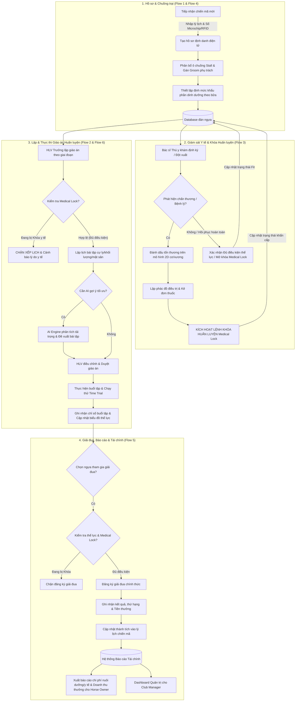
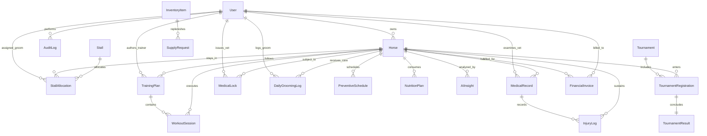

# Software Development Blueprint: Racehorse Training & Management System

**Project Code:** RACEHORSE_TRAINING (Project ID: 2)  
**System Name:** Hệ thống Quản lý Huấn luyện Ngựa đua (Racehorse Training & Management System)  
**Status:** Approved & Ready for Implementation  
**Version:** 1.0  
**Owner:** Senior Business Analyst (BA Blueprint Agent)  
**Last updated:** 2026-09-27  
**Source Document:** [srs.txt](srs.txt) | [.env.txt](.env.txt)  
**GitHub Project URL:** [https://github.com/users/MichaelTran1226/projects/2](https://github.com/users/MichaelTran1226/projects/2)  
**BE Repository:** [Racehorse_Training_Management_System_MT_BE](https://github.com/MichaelTran1226/Racehorse_Training_Management_System_MT_BE)  
**FE Repository:** [Racehorse_Training_Management_System_MT_FE](https://github.com/MichaelTran1226/Racehorse_Training_Management_System_MT_FE)  

---

## 1. Executive Summary

- **Business problem:**
  1. **Quản lý phân tán, thủ công:** Việc ghi chép lý lịch ngựa, phả hệ cơ bản, định danh RFID/Microchip và sơ đồ chuồng trại còn rời rạc qua sổ sách và file bảng tính, dễ gây nhầm lẫn hồ sơ và thất lạc lịch sử sức khỏe.
  2. **Rủi ro xếp lịch luyện tập khi ngựa chấn thương:** Thiếu cơ chế kiểm soát y tế tập trung; Huấn luyện viên có thể vô tình xếp bài tập nặng hoặc đăng ký thi đấu cho chiến mã đang trong diện cần theo dõi, chấn thương hoặc cách ly.
  3. **Quy trình khám và chẩn đoán chưa trực quan:** Bác sĩ thú y thiếu công cụ số hóa mô hình tổn thương cơ/xương 2D, khó theo dõi sát sao diễn biến hồi phục qua từng giai đoạn và không có lệnh khóa huấn luyện tự động có hiệu lực tối cao.
  4. **Chăm sóc chuồng trại & Dinh dưỡng thiếu kiểm soát định mức:** Nhân viên chăm sóc (Groom) thực hiện công việc (cho ăn, tắm rửa, vệ sinh, ngâm chân đá) theo thói quen; định mức thức ăn, vitamin, thuốc men tiêu hao không được theo dõi và đối soát tồn kho tự động.
  5. **Báo cáo và tài chính thiếu minh bạch với Chủ sở hữu ngựa (Horse Owner):** Việc tổng hợp chi phí nuôi dưỡng, viện phí điều trị và chia doanh thu tiền thưởng giải đua tốn nhiều ngày công, gây chậm trễ và giảm niềm tin từ chủ ngựa.
  6. **Thiếu hỗ trợ phân tích dữ liệu chuyên sâu:** Chưa tận dụng được dữ liệu tải trọng bài tập (training load), nhịp tim, tốc độ hồi phục để đưa ra khuyến nghị giáo án tối ưu và cảnh báo nguy cơ chấn thương sớm bằng AI.

- **Desired outcome:**
  1. Số hóa 100% vòng đời vận hành câu lạc bộ ngựa đua: hồ sơ định danh, chuồng trại, dinh dưỡng, giáo án huấn luyện, bệnh án y tế, đăng ký thi đấu và quyết toán tài chính.
  2. Thiết lập cơ chế **Lệnh "Khóa huấn luyện" (Medical Lock)** có độ ưu tiên cao nhất: Bác sĩ thú y kích hoạt lệnh sẽ tự động chặn tức thì mọi thao tác xếp bài tập nặng hoặc đăng ký thi đấu trên toàn hệ thống.
  3. Trực quan hóa sơ đồ trạng thái đàn ngựa theo mã màu và mô hình chấn thương cơ/xương 2D, hỗ trợ Bác sĩ thú y ghi nhận tổn thương và theo dõi phác đồ phục hồi chính xác.
  4. Chuẩn hóa quy trình chăm sóc hàng ngày qua checklist ca trực của Groom và hệ thống quản lý định mức dinh dưỡng, tự động cảnh báo tồn kho vật tư chuồng trại.
  5. Minh bạch hóa báo cáo tài chính (chi phí chăm sóc, y tế, tiền thưởng) gửi đến Chủ sở hữu ngựa theo thời gian thực; tăng cường sự gắn kết giữa câu lạc bộ và chủ ngựa.
  6. Tích hợp AI đóng vai trò trợ lý thông minh gợi ý giáo án tối ưu, dự báo nguy cơ chấn thương và giải đáp tra cứu thông tin 24/7.

- **Success metrics:**
  1. **An toàn y tế động vật:** 0% sự cố xếp lịch bài tập nặng hoặc đăng ký thi đấu cho ngựa đang chịu lệnh "Khóa huấn luyện" (100% Medical Lock enforcement).
  2. **Hiệu suất vận hành:** Giảm 80% thời gian tổng hợp báo cáo chi phí và thành tích gửi Chủ sở hữu ngựa; 100% ca trực chuồng trại được kiểm soát qua checklist điện tử.
  3. **Độ chính xác chẩn đoán:** 100% hồ sơ chấn thương được gắn tọa độ trên mô hình 2D cơ/xương và cập nhật tiến trình điều trị theo giai đoạn.
  4. **Nâng cao phong độ:** Tối ưu hóa chu kỳ huấn luyện, tăng 15% hiệu quả đạt mục tiêu cự ly/tốc độ nhờ giáo án phân kỳ khoa học và theo dõi biểu đồ thể lực liên tục.
  5. **Trợ lý AI nhanh nhạy:** 95% yêu cầu tra cứu thông tin dinh dưỡng, tóm tắt nhật ký sức khỏe được AI Assistant xử lý chính xác dưới 3 giây.

- **Recommended direction:**
  - Phát triển nền tảng **100% Web Application** (chuẩn Responsive tối ưu trên Desktop, Tablet và Mobile Browser). Không phát triển ứng dụng di động bản địa (Native Mobile App).
  - Kiến trúc phân tách rõ ràng giữa Core Operations (User/RBAC, Horse Profile, Training Plan, Veterinary Care, Stable Care, Tournament & Finance) và AI Cognitive Services. Quyết định chuyên môn y tế và huấn luyện luôn do Veterinarian và Head Trainer phê duyệt; AI chỉ giữ vai trò hỗ trợ phân tích và cảnh báo.

---

## 2. Scope

### In scope

- **Capability 1 (Flow 1 - Quản lý Hồ sơ & Định danh Ngựa - Required):**
  - Quản lý hồ sơ định danh chi tiết (tên, giống loài, ngày sinh, giới tính, màu lông, số microchip/thẻ RFID).
  - Quản lý trạng thái vòng đời (Sẵn sàng thi đấu, Đang tập luyện, Cần theo dõi, Chấn thương, Cách ly, Nghỉ ngơi).
  - Phân bổ vị trí ô chuồng trại (stall), gắn kết lịch trình sinh hoạt và phân công Groom phụ trách.
  - Lưu trữ và truy xuất lịch sử y tế, quá trình huấn luyện và thành tích thi đấu trong suốt vòng đời của ngựa.
- **Capability 2 (Flow 2 - Lập & Thực hiện Giáo án Huấn luyện - Required):**
  - Huấn luyện viên trưởng lập kế hoạch huấn luyện chi tiết theo từng giai đoạn (cự ly, khối lượng bài tập, tốc độ mục tiêu, loại mặt sân: cỏ, cát, hỗn hợp).
  - Hệ thống tự động kiểm tra trạng thái sức khỏe của ngựa trước khi áp dụng giáo án; tự động chặn xếp lịch nếu ngựa đang có lệnh "Khóa huấn luyện" (Medical Lock) từ Bác sĩ thú y.
  - Phân công lịch tập luyện hàng ngày cho Groom/Jockey và điều phối lượt chạy thử (Time Trial).
  - HLV Trưởng đánh giá phong độ, ghi nhận xét chuyên môn và hệ thống tự động cập nhật biểu đồ thể lực.
- **Capability 3 (Flow 3 - Quản lý Y tế & Xử lý Chấn thương - Required):**
  - Trực quan hóa sơ đồ trạng thái sức khỏe toàn bộ đàn ngựa theo mã màu (Đủ điều kiện, Cần theo dõi, Chấn thương, Cách ly).
  - Bệnh án điện tử, kết quả chẩn đoán lâm sàng/cận lâm sàng, phác đồ điều trị và kê đơn thuốc chi tiết.
  - Đánh dấu trực quan vị trí tổn thương trên mô hình giải phẫu cơ/xương 2D của ngựa và theo dõi tiến trình hồi phục theo từng giai đoạn.
  - Kích hoạt lệnh "Khóa huấn luyện" (Medical Lock) khẩn cấp để tự động vô hiệu hóa việc xếp lịch tập nặng hoặc đăng ký thi đấu.
  - Quản lý lịch trình, cảnh báo và gửi thông báo tự động về lịch tiêm phòng, tẩy giun định kỳ và kiểm tra chăm sóc móng (Farrier).
- **Capability 4 (Flow 4 - Chăm sóc Chuồng trại & Dinh dưỡng Hàng ngày - Optional):**
  - Quản lý sơ đồ phân bổ vị trí chuồng trại, phân ca trực và danh sách ngựa phụ trách cho đội ngũ Groom.
  - Thiết lập và duyệt định mức khẩu phần dinh dưỡng chi tiết (cỏ khô, ngũ cốc, vitamin, khoáng chất, điện giải) cho từng bữa trong ngày.
  - Nhân viên chăm sóc thực hiện công việc và đánh dấu xác nhận hoàn thành theo checklist (cho ăn, vệ sinh chuồng, tắm rửa, ngâm chân nước đá phục hồi).
  - Ghi nhận ghi chú quan sát sức khỏe ca trực trong nhật ký chăm sóc hàng ngày.
  - Theo dõi tiêu hao tồn kho vật tư (thức ăn, thuốc cơ bản, dụng cụ) tại từng khu vực chuồng, tạo đề xuất bổ sung vật tư gửi Club Manager.
- **Capability 5 (Flow 5 - Đăng ký Thi đấu & Báo cáo Thành tích - Optional):**
  - Quản lý danh mục các giải đua, tiêu chuẩn điều kiện tham gia, điều lệ cự ly, thời hạn đăng ký và cơ cấu giải thưởng.
  - HLV Trưởng rà soát chỉ số thể lực, lịch sử phong độ và trạng thái sẵn sàng để lựa chọn chiến mã đủ điều kiện và đăng ký tham gia thi đấu (chặn nếu có Medical Lock).
  - Ghi nhận kết quả thi đấu chính thức (cự ly hoàn thành, thời gian chạy, tốc độ trung bình, thứ hạng đạt được, danh hiệu và tiền thưởng).
  - Tự động cập nhật thành tích vào lý lịch ngựa và xuất báo cáo kết quả thi đấu định kỳ gửi Horse Owner và Club Manager.
  - Quản lý báo cáo tài chính liên quan đến chi phí tham dự giải, chi phí nuôi dưỡng huấn luyện và doanh thu chia thưởng từ giải đua.
- **Capability 6 (Flow 6 - Đề xuất Huấn luyện & Phân tích Sức khỏe bằng AI - Optional):**
  - AI Engine phân tích dữ liệu lịch sử bài tập, nhịp tim, tốc độ hồi phục và đặc điểm thể trạng để gợi ý giáo án huấn luyện tối ưu.
  - Phân tích và dự báo nguy cơ chấn thương dựa trên dữ liệu tải trọng luyện tập (training load), phát hiện sớm dấu hiệu quá tải thể lực.
  - Trợ lý ảo AI (AI Assistant) hỗ trợ giải đáp thắc mắc, tra cứu thông tin dinh dưỡng, y tế và tự động tóm tắt nhật ký sức khỏe, báo cáo tuần/tháng.
- **System Core Capabilities:**
  - Xác thực đa vai trò và phân quyền truy cập nghiêm ngặt (RBAC) cho 5 vai trò người dùng.
  - Hệ thống ghi log kiểm toán bất biến (Audit Trail Logging) ghi vết toàn bộ thao tác quan trọng (Medical Lock, đổi phác đồ, duyệt tài chính, chỉnh sửa hồ sơ).
  - Thư viện quy chuẩn thiết kế UI/UX Web Responsive và bộ Prompt Stitch MCP hoàn chỉnh cho toàn bộ chức năng.

### Out of scope (Phase 1)

- Không bao gồm phả hệ đa thế hệ (Sire/Dam Pedigree Tree).
- Không bao gồm báo cáo sự cố kèm ảnh chụp thực tế (Groom ghi nhận quan sát bằng văn bản trong nhật ký ca trực).
- Không phát triển ứng dụng di động bản địa (Native Mobile App trên iOS/Android); toàn bộ truy cập di động thực hiện qua trình duyệt Web Responsive.
- Không tích hợp thiết bị IoT gắn trực tiếp trên cơ thể ngựa để truyền dữ liệu sinh trắc học thời gian thực liên tục (chỉ hỗ trợ ghi nhận thủ công hoặc tải file dữ liệu buổi tập).
- Không tích hợp sàn giao dịch mua bán, đấu giá ngựa thương mại.

---

## 3. Stakeholders and Users

| ID | Role | Responsibility | Decision/approval |
|---|---|---|---|
| ST-001 | Club Manager (Quản lý Câu lạc bộ) | Quản lý danh mục tổng (ngựa, nhân sự, vật tư), phân quyền RBAC, theo dõi toàn cảnh hiệu suất huấn luyện, duyệt chi phí/doanh thu giải đấu và giám sát Audit Log. | Phê duyệt ngân sách, chính sách câu lạc bộ, phân quyền hệ thống và nghiệm thu bàn giao. |
| ST-002 | Head Trainer (Huấn luyện viên Trưởng) | Xem tiến độ/thể lực đàn ngựa, lập giáo án chi tiết theo giai đoạn (cự ly, khối lượng, mặt sân), phân công lịch tập & điều phối chạy thử, đánh giá phong độ, đăng ký giải đua. | Phê duyệt giáo án huấn luyện, xác nhận kết quả buổi tập và quyết định chiến mã thi đấu. |
| ST-003 | Veterinarian (Bác sĩ Thú y) | Xem sơ đồ sức khỏe đàn ngựa, ghi nhận bệnh án điện tử, cập nhật phác đồ điều trị/đơn thuốc, đánh dấu chấn thương 2D, đặt lệnh "Khóa huấn luyện" khẩn cấp, theo dõi tiêm phòng/tẩy giun/móng định kỳ. | Toàn quyền y tế; quyết định áp đặt hoặc gỡ bỏ lệnh "Khóa huấn luyện" (Medical Lock) với độ ưu tiên cao nhất. |
| ST-004 | Groom / Stable Hand (Nhân viên Chăm sóc & Chuồng trại) | Xem sơ đồ chuồng trại & lịch sinh hoạt hàng ngày, xem khẩu phần ăn từng bữa, tích hoàn thành checklist (cho ăn, vệ sinh, tắm rửa, ngâm chân đá), ghi nhận nhật ký ca trực, kiểm tra vật tư và đề xuất bổ sung. | Xác nhận hoàn thành ca trực chăm sóc và ghi nhận phản ánh sức khỏe ban đầu của ngựa. |
| ST-005 | Horse Owner (Chủ sở hữu Ngựa) | Xem hồ sơ lý lịch, lịch sử thành tích, lịch trình tập luyện & nhận xét từ HLV Trưởng của ngựa sở hữu; nhận báo cáo tổng hợp chi phí nuôi dưỡng, y tế và doanh thu tiền thưởng định kỳ. | Quyết định đăng ký ủy thác ngựa, phê duyệt các chi phí điều trị lớn ngoài định mức. |
| ST-006 | Senior Business Analyst (BA Blueprint Agent) | Khảo sát nhu cầu nghiệp vụ, chuyển hóa SRS thành Blueprint chuẩn mực, thiết lập ma trận truy nguyên và chuẩn bị kế hoạch đồng bộ GitHub Project. | Thẩm định và ký duyệt Blueprint nghiệp vụ. |
| ST-007 | Tech Lead & Delivery Lead (Development Agent) | Thiết kế kiến trúc giải pháp, thiết kế SQLite schema, API contract, thực hiện vertical slices, quản lý test và quy trình release CI/CD. | Thẩm định tính khả thi kỹ thuật và kiến trúc dữ liệu/API. |
| ST-008 | QA/QC Lead | Thiết kế test scenarios dựa trên Gherkin AC, tự động hóa kiểm thử white-box, API và Playwright UI, ký duyệt nghiệm thu chất lượng. | Ký duyệt Test Evidence Sign-off và Quality Gates. |

---

## 4. Assumptions, Constraints and Open Questions

| ID | Type | Statement | Owner | Status |
|---|---|---|---|---|
| A-001 | Assumption | Đội ngũ Groom, Trainer và Bác sĩ thú y đều trang bị thiết bị di động/tablet có kết nối Wi-Fi/4G trong khu vực chuồng trại và sân tập để thao tác trên Web Responsive. | Club Manager | Confirmed |
| A-002 | Assumption | Mỗi chiến mã khi nhập trại đều được gắn chip định danh RFID hoặc thẻ Microchip hợp lệ theo quy chuẩn quản lý động vật đua. | Club Manager | Confirmed |
| A-003 | Assumption | Gợi ý giáo án và dự báo nguy cơ chấn thương từ AI chỉ đóng vai trò tham vấn hỗ trợ ra quyết định; không thay thế chỉ định của Bác sĩ thú y và Huấn luyện viên trưởng. | Tech Lead & HLV Trưởng | Confirmed |
| C-001 | Constraint | **Medical Lock Priority Rule:** Lệnh "Khóa huấn luyện" từ Bác sĩ thú y có quyền ưu tiên cao nhất trên toàn hệ thống; tự động chặn mọi thao tác xếp lịch bài tập nặng hoặc đăng ký thi đấu cho đến khi có xác nhận mở khóa y tế. | Veterinarian & Tech Lead | Confirmed |
| C-002 | Constraint | **Platform Constraint:** 100% Web Application (hỗ trợ Responsive trên Desktop, Tablet, Mobile Browser); tuyệt đối không phát triển Native Mobile App (iOS/Android). | Tech Lead | Confirmed |
| C-003 | Constraint | **Scope Boundary Constraint:** Không bao gồm cây phả hệ đa thế hệ (Sire/Dam Pedigree Tree) và không bao gồm chức năng báo cáo sự cố kèm hình ảnh thực tế. Groom chỉ ghi nhận quan sát sức khỏe ca trực bằng text trong nhật ký. | Senior BA | Confirmed |
| C-004 | Constraint | **Data Isolation Constraint:** Phân quyền dữ liệu nghiêm ngặt giữa các Chủ sở hữu ngựa; Horse Owner chỉ được xem thông tin chi phí, y tế và thành tích chi tiết của các ngựa thuộc quyền sở hữu của mình. | Security Lead | Confirmed |
| Q-001 | Open Question | Khi ngựa bị "Khóa huấn luyện", hệ thống có cho phép xếp các bài tập phục hồi nhẹ (như đi bộ dạo, ngâm chân đá) theo chỉ định đặc biệt của Bác sĩ thú y trong phác đồ điều trị không? (Đề xuất: Cho phép nếu bài tập gắn cờ `Rehab_Only` và được Bác sĩ ký duyệt). | Veterinarian & HLV Trưởng | Pending Decision |
| Q-002 | Open Question | Ngưỡng quá tải tải trọng bài tập (training load) để AI kích hoạt cảnh báo nguy cơ chấn thương sớm là bao nhiêu % so với tải trọng trung bình 4 tuần gần nhất? (Đề xuất: Vượt quá 25% kèm biến thiên nhịp tim phục hồi chậm). | HLV Trưởng & AI Lead | Pending Decision |
| Q-003 | Open Question | Tỷ lệ phân chia tiền thưởng giải đua giữa Câu lạc bộ và Chủ sở hữu ngựa được tính theo tỷ lệ cố định của toàn CLB hay cấu hình theo từng hợp đồng ủy thác của từng con ngựa? (Đề xuất: Cấu hình linh hoạt theo từng hợp đồng sở hữu). | Club Manager | Pending Decision |

---

## 5. Process Analysis

### 5.1. Phân tích hiện trạng (AS-IS) vs Tương lai (TO-BE)

| Nghiệp vụ | Hiện trạng (AS-IS) | Tương lai (TO-BE) | Tác nhân / Hệ thống | Quy tắc & Ngoại lệ |
|---|---|---|---|---|
| **1. Quản lý Hồ sơ & Định danh Ngựa** | Ghi chép sổ tay hoặc file Excel rời rạc; khó tìm kiếm thông tin microchip, lịch sử huấn luyện và y tế trong quá khứ. | Hồ sơ điện tử tập trung, tra cứu tức thì theo tên hoặc mã RFID/Microchip; cập nhật trạng thái vòng đời và phân bổ ô chuồng trại (stall) trực quan. | Club Manager / Head Trainer / System | Mã RFID/Microchip là duy nhất trên toàn hệ thống. Không cho phép xóa vật lý hồ sơ ngựa đã có lịch sử tập luyện/y tế. |
| **2. Lập & Thực hiện Giáo án Huấn luyện** | HLV lên lịch trên bảng đen hoặc giấy ghi chú; không kiểm tra kịp thời tình trạng sức khỏe ngựa, dẫn đến nguy cơ tập quá tải. | HLV Trưởng lập giáo án phân kỳ trên phần mềm (cự ly, khối lượng, mặt sân); hệ thống tự động kiểm tra Medical Lock trước khi lưu lịch. | Head Trainer / System | **BR-002 & Medical Lock:** Hệ thống chặn lập tức nếu ngựa đang có trạng thái `Medical_Locked`. |
| **3. Quản lý Y tế & Xử lý Chấn thương** | Bác sĩ ghi sổ bệnh án giấy; báo miệng cho HLV khi ngựa đau chân; dễ bị bỏ sót dẫn đến tái phát chấn thương nghiêm trọng. | Sơ đồ trạng thái sức khỏe đàn ngựa trực quan theo mã màu; đánh dấu vị trí tổn thương trên mô hình 2D cơ/xương; kích hoạt lệnh "Khóa huấn luyện" có hiệu lực tức thì. | Veterinarian / Head Trainer / System | **BR-003:** Lệnh Khóa huấn luyện chỉ có Bác sĩ thú y phụ trách mới có quyền gỡ bỏ sau khi khám lại. |
| **4. Chăm sóc Chuồng trại & Dinh dưỡng** | Groom cho ăn và dọn chuồng theo trí nhớ; không rõ định mức vitamin/thuốc bổ sung của từng bữa; thiếu kiểm kê tồn kho. | Groom mở Web App trên điện thoại/tablet xem khẩu phần chi tiết từng bữa; tích checklist công việc theo ca trực; hệ thống tự động trừ kho vật tư và cảnh báo thiếu hụt. | Groom / Stable Hand / System | **BR-004:** Ca trực phải được xác nhận hoàn thành trước khi bàn giao ca kế tiếp. Quan sát bất thường được ghi chú vào nhật ký. |
| **5. Đăng ký Thi đấu & Báo cáo Thành tích** | Đăng ký thủ công qua email/đơn giấy; kết quả giải đua lưu trữ phân tán; mất 3-5 ngày tổng hợp báo cáo gửi chủ ngựa. | Rà soát điều kiện tham gia và đăng ký giải đua trực tiếp trên hệ thống; tự động cập nhật thứ hạng/tiền thưởng vào lý lịch ngựa; tự động xuất báo cáo thành tích gửi chủ ngựa. | Head Trainer / Club Manager / Horse Owner | Ngựa đang bị Medical Lock bị cấm đăng ký thi đấu. Báo cáo tài chính chia thưởng tạo tự động theo hợp đồng. |
| **6. Phân tích Dữ liệu & Hỗ trợ AI** | Đánh giá thể lực bằng cảm tính; không có công cụ dự báo chấn thương sớm dựa trên dữ liệu khoa học. | AI phân tích tải trọng tập luyện, nhịp tim và tốc độ phục hồi để gợi ý giáo án tối ưu; phát hiện sớm nguy cơ quá tải; Trợ lý AI giải đáp thắc mắc 24/7. | Head Trainer / Veterinarian / AI Engine | Quyết định chuyên môn cuối cùng thuộc về con người; AI chỉ đóng vai trò phân tích và khuyến nghị. |

### 5.2. Sơ đồ quy trình nghiệp vụ tổng thể (Mermaid Workflow)

---

## 6. Requirements

### 6.1. Business Requirements (Yêu cầu nghiệp vụ cốt lõi)

| ID | Type | Requirement Statement | Priority | Source | Status |
|---|---|---|---|---|---|
| **BR-001** | Business | Câu lạc bộ phải quản lý tập trung và chuẩn xác toàn bộ hồ sơ định danh, trạng thái vòng đời, vị trí chuồng trại và lịch sử huấn luyện/y tế của toàn bộ đàn ngựa để đảm bảo tính toàn vẹn thông tin. | P0 Must | SRS Mục 1, 3 (Flow 1) | Approved |
| **BR-002** | Business | Kế hoạch huấn luyện phải được phân kỳ khoa học theo cự ly, khối lượng và mặt sân; bắt buộc kiểm tra điều kiện an toàn y tế và tự động ngăn chặn việc xếp lịch bài tập nặng khi ngựa có cảnh báo chấn thương. | P0 Must | SRS Mục 3 (Flow 2) | Approved |
| **BR-003** | Business | Phúc lợi và an toàn y tế động vật là ưu tiên hàng đầu; hệ thống phải cung cấp công cụ chẩn đoán mô hình 2D trực quan và cơ chế Lệnh "Khóa huấn luyện" (Medical Lock) với hiệu lực can thiệp tối cao. | P0 Must | SRS Mục 3 (Flow 3), Mục 6 | Approved |
| **BR-004** | Business | Vận hành chuồng trại và dinh dưỡng hàng ngày phải được chuẩn hóa qua checklist ca trực và định mức khẩu phần; kiểm soát tiêu hao vật tư để giảm thiểu lãng phí và đảm bảo sức khỏe đàn ngựa. | P1 High | SRS Mục 3 (Flow 4) | Approved |
| **BR-005** | Business | Quy trình đăng ký giải đua, ghi nhận thành tích thi đấu và phân phối doanh thu giải thưởng/chi phí nuôi dưỡng phải được minh bạch hóa theo thời gian thực tới Chủ sở hữu ngựa và Ban quản lý. | P1 High | SRS Mục 3 (Flow 5) | Approved |
| **BR-006** | Business | Ứng dụng trí tuệ nhân tạo (AI) phân tích dữ liệu lịch sử tải trọng luyện tập, nhịp tim và thể trạng để hỗ trợ ban huấn luyện đưa ra quyết định giáo án chính xác và phát hiện sớm rủi ro quá tải. | P2 Medium | SRS Mục 3 (Flow 6) | Approved |

### 6.2. Functional Requirements (Yêu cầu chức năng chuẩn hóa)

Mẫu chuẩn: `Hệ thống phải [hành vi] cho [tác nhân] khi [điều kiện], để đạt [kết quả]`.

| ID | Capability | Functional Requirement | Priority | Source | Acceptance Criteria |
|---|---|---|---|---|---|
| **FR-001** | Authentication & RBAC | Hệ thống phải xác thực người dùng và phân quyền truy cập nghiêm ngặt tương ứng 5 vai trò (Club Manager, Head Trainer, Veterinarian, Groom / Stable Hand, Horse Owner) khi đăng nhập vào hệ thống web, để bảo vệ an toàn thông tin và dữ liệu nghiệp vụ. | P0 Must | SRS Mục 2, Mục 4 | Given thông tin đăng nhập hợp lệ, When người dùng submit credentials, Then hệ thống sinh JWT session và chuyển hướng đúng Dashboard theo vai trò được cấp. |
| **FR-002** | Horse Profile Mgmt | Hệ thống phải cho phép Quản lý và HLV Trưởng tạo mới, cập nhật hồ sơ định danh chi tiết (tên, giống, ngày sinh, giới tính, màu lông, số RFID/Microchip) và quản lý trạng thái vòng đời của ngựa khi có dữ liệu mới, để duy trì lý lịch chiến mã chính xác. | P0 Must | Flow 1 | Given thông tin ngựa hợp lệ và mã RFID không trùng lặp, When người dùng bấm lưu, Then hệ thống ghi vào DB, sinh mã Horse ID và gắn trạng thái mặc định. |
| **FR-003** | Stall Allocation | Hệ thống phải cho phép Quản lý chuồng trại phân bổ vị trí ô chuồng (stall), gán Groom phụ trách và gắn kết lịch sinh hoạt khi điều phối chuồng, để tối ưu hóa không gian chuồng trại và phân công trách nhiệm. | P0 Must | Flow 1, Flow 4 | Given ô chuồng còn trống và Groom hợp lệ, When phân bổ ngựa vào ô chuồng, Then hệ thống cập nhật vị trí và hiển thị trên sơ đồ chuồng trại. |
| **FR-004** | Training Plan Builder | Hệ thống phải cho phép Huấn luyện viên trưởng lập kế hoạch huấn luyện chi tiết theo giai đoạn (cự ly, khối lượng bài tập, tốc độ mục tiêu, loại mặt sân: cỏ, cát, hỗn hợp) khi xây dựng giáo án, để định hướng lộ trình rèn luyện cho ngựa. | P0 Must | Flow 2 | Given thông tin giáo án hợp lệ, When HLV lưu kế hoạch, Then giáo án được gắn vào hồ sơ huấn luyện của ngựa theo từng giai đoạn. |
| **FR-005** | Medical Lock Enforcement | Hệ thống phải tự động kiểm tra trạng thái y tế và lập tức chặn thao tác xếp lịch bài tập nặng hoặc áp dụng giáo án mới khi ngựa đang có lệnh "Khóa huấn luyện" (Medical Lock) từ Bác sĩ thú y, để bảo vệ tuyệt đối an toàn động vật. | P0 Must | Flow 2, Flow 3, C-001 | Given ngựa đang có lệnh `Medical_Locked = TRUE`, When HLV cố gắng xếp bài tập nặng hoặc thi đấu, Then hệ thống từ chối lưu và hiển thị cảnh báo đỏ nêu rõ lý do y tế. |
| **FR-006** | Workout & Time Trial | Hệ thống phải cho phép HLV Trưởng phân công lịch tập luyện hàng ngày cho nhân viên chăm sóc/nài ngựa và điều phối các lượt chạy thử (Time Trial) khi chuẩn bị buổi tập, để thực thi giáo án thực tế trên sân. | P0 Must | Flow 2 | Given bài tập hợp lệ, When HLV phân công lịch tập cho Groom/Jockey, Then thông báo bài tập xuất hiện trên màn hình ca trực của nhân viên phụ trách. |
| **FR-007** | Performance Evaluation | Hệ thống phải cho phép HLV Trưởng ghi nhận các chỉ số buổi tập (thời gian chạy, tốc độ trung bình, nhịp tim, tình trạng mặt sân) và nhận xét chuyên môn sau buổi tập, để tự động tính toán và cập nhật biểu đồ thể lực của ngựa. | P0 Must | Flow 2 | Given buổi tập hoàn thành, When HLV nhập chỉ số và lưu nhận xét, Then hệ thống lưu kết quả và vẽ lại biểu đồ phong độ/thể lực theo thời gian thực. |
| **FR-008** | Health Status Board | Hệ thống phải hiển thị sơ đồ trực quan trạng thái sức khỏe của toàn bộ đàn ngựa trên giao diện chuồng trại theo mã màu chuẩn hóa (Đủ điều kiện: Xanh; Cần theo dõi: Vàng; Chấn thương: Đỏ; Cách ly: Tím) cho Bác sĩ thú y và Quản lý khi truy cập mục Y tế, để nắm bắt nhanh tình hình sức khỏe. | P0 Must | Flow 3 | Given danh sách đàn ngựa trong chuồng, When Bác sĩ mở trang Y tế, Then hệ thống hiển thị sơ đồ grid/map với màu sắc trạng thái tương ứng trong < 1.5 giây. |
| **FR-009** | Medical Record & Rx | Hệ thống phải cho phép Bác sĩ thú y ghi nhận bệnh án điện tử, kết quả chẩn đoán lâm sàng/cận lâm sàng, thiết lập phác đồ điều trị và kê đơn thuốc chi tiết khi khám bệnh, để quản lý lịch sử điều trị xuyên suốt. | P0 Must | Flow 3 | Given hồ sơ khám bệnh đầy đủ, When Bác sĩ lưu phác đồ và đơn thuốc, Then hệ thống lưu vết bệnh án, trừ kho thuốc và gửi thông báo nhắc lịch uống thuốc cho Groom. |
| **FR-010** | 2D Injury Mapping | Hệ thống phải cung cấp công cụ đánh dấu trực quan vị trí tổn thương trên mô hình giải phẫu cơ/xương 2D của ngựa và theo dõi tiến trình hồi phục theo từng giai đoạn điều trị khi Bác sĩ thú y chẩn đoán, để trực quan hóa mức độ hồi phục. | P0 Must | Flow 3 | Given mô hình giải phẫu 2D, When Bác sĩ nhấp chọn tọa độ tổn thương và gán mức độ nghiêm trọng, Then hệ thống lưu điểm đánh dấu và hiển thị nhật ký diễn biến chấn thương. |
| **FR-011** | Emergency Medical Lock | Hệ thống phải cho phép Bác sĩ thú y kích hoạt lệnh "Khóa huấn luyện" khẩn cấp và thiết lập điều kiện mở khóa y tế khi phát hiện chấn thương, để vô hiệu hóa ngay việc xếp bài tập nặng hoặc thi đấu trên toàn hệ thống. | P0 Must | Flow 3, C-001 | Given Bác sĩ thú y kích hoạt Medical Lock, When thao tác được xác nhận, Then trạng thái ngựa đổi sang `Locked`, hệ thống phát thông báo khẩn cấp đến HLV Trưởng và Club Manager. |
| **FR-012** | Preventive Care Alerts | Hệ thống phải quản lý lịch trình, tự động theo dõi và gửi thông báo cảnh báo trước 3 ngày về lịch tiêm phòng, tẩy giun định kỳ và kiểm tra chăm sóc móng (Farrier) cho Bác sĩ thú y và Groom khi đến hạn, để duy trì y tế dự phòng. | P1 High | Flow 3 | Given lịch tiêm/tẩy giun đã cấu hình, When ngày hiện tại cách hạn <= 3 ngày, Then hệ thống tự động sinh thông báo nhắc nhở trên dashboard và danh sách việc cần làm. |
| **FR-013** | Nutrition Planning | Hệ thống phải cho phép HLV Trưởng hoặc Bác sĩ thú y thiết lập và phê duyệt định mức khẩu phần dinh dưỡng chi tiết (cỏ khô, ngũ cốc, vitamin, khoáng chất, chất điện giải) cho từng bữa trong ngày của từng con ngựa, để đảm bảo dinh dưỡng tối ưu. | P1 High | Flow 4 | Given định mức dinh dưỡng được lập, When Bác sĩ/HLV bấm duyệt, Then khẩu phần được hiển thị trực tiếp trên checklist ca trực của Groom phụ trách ô chuồng đó. |
| **FR-014** | Daily Grooming Checklist | Hệ thống phải cho phép Groom xem lịch trình sinh hoạt và đánh dấu xác nhận hoàn thành công việc theo checklist ca trực (cho ăn, vệ sinh chuồng, tắm rửa, ngâm chân nước đá phục hồi) kèm ghi chú quan sát sức khỏe ca trực khi thực hiện ca làm việc, để kiểm soát chất lượng chăm sóc. | P1 High | Flow 4, C-003 | Given ca trực đang diễn ra, When Groom tích hoàn thành các mục checklist và nhập ghi chú, Then hệ thống ghi nhận thời gian hoàn tất và lưu vết ca trực. |
| **FR-015** | Stable Supply & Inventory | Hệ thống phải theo dõi mức tiêu hao và số lượng tồn kho vật tư (thức ăn, thuốc men cơ bản, dụng cụ) tại từng khu vực chuồng và cho phép Groom/Quản lý tạo đề xuất bổ sung vật tư khi lượng tồn dưới định mức an toàn, để không bị gián đoạn vận hành. | P1 High | Flow 4 | Given tồn kho của một vật tư <= ngưỡng cảnh báo tối thiểu, When hệ thống quét tồn kho, Then hiển thị cảnh báo đỏ và cho phép bấm nút "Tạo đề xuất bổ sung vật tư". |
| **FR-016** | Tournament Registration | Hệ thống phải quản lý danh mục giải đua và cho phép HLV Trưởng rà soát chỉ số thể lực, lịch sử phong độ để lựa chọn chiến mã đủ điều kiện và gửi đăng ký tham gia thi đấu khi giải mở đăng ký, để tối ưu hóa cơ hội tranh giải. | P1 High | Flow 5 | Given giải đua mở đăng ký và ngựa không bị Medical Lock, When HLV nộp đơn đăng ký, Then hệ thống ghi nhận danh sách thi đấu và cập nhật trạng thái `Registered`. |
| **FR-017** | Tournament Results | Hệ thống phải cho phép HLV Trưởng và Quản lý ghi nhận kết quả thi đấu chính thức (cự ly, thời gian chạy, tốc độ trung bình, thứ hạng, danh hiệu, tiền thưởng) khi giải đua kết thúc, để tự động cập nhật vào lý lịch ngựa và xuất báo cáo thành tích. | P1 High | Flow 5 | Given giải đua kết thúc, When Quản lý nhập kết quả chính thức, Then hệ thống cập nhật lịch sử thành tích ngựa và gửi thông báo kết quả đến Chủ sở hữu ngựa. |
| **FR-018** | Owner Financial Report | Hệ thống phải quản lý báo cáo tài chính tổng hợp chi phí nuôi dưỡng, chi phí y tế và doanh thu chia thưởng từ giải đua cho từng con ngựa để xuất báo cáo định kỳ gửi Horse Owner và Club Manager khi đến kỳ quyết toán, để đảm bảo minh bạch tài chính. | P1 High | Flow 5 | Given kỳ báo cáo được chọn, When hệ thống tổng hợp dữ liệu hóa đơn/thưởng, Then kết xuất bảng kê tài chính chi tiết và biểu đồ phân tích lợi nhuận/chi phí cho chủ ngựa. |
| **FR-019** | AI Training & Insights | Hệ thống phải tích hợp mô hình AI để phân tích dữ liệu lịch sử bài tập, nhịp tim, tốc độ hồi phục để gợi ý giáo án huấn luyện tối ưu, đồng thời dự báo nguy cơ chấn thương dựa trên tải trọng bài tập (training load) khi có yêu cầu phân tích, để hỗ trợ ra quyết định. | P2 Medium | Flow 6 | Given dữ liệu tập luyện tối thiểu 2 tuần, When HLV bấm "Phân tích AI", Then hệ thống trả về đề xuất điều chỉnh bài tập và chỉ số rủi ro chấn thương trong < 3 giây. |
| **FR-020** | AI Virtual Assistant | Hệ thống phải cung cấp Trợ lý ảo AI (AI Assistant) dạng hội thoại tương tác để hỗ trợ tra cứu thông tin dinh dưỡng, quy định y tế, tự động tóm tắt nhật ký sức khỏe và báo cáo tuần/tháng cho Quản lý và Chủ sở hữu ngựa khi nhận tin nhắn, để giải đáp thông tin 24/7. | P2 Medium | Flow 6 | Given câu hỏi tra cứu thông tin câu lạc bộ, When người dùng gửi câu hỏi, Then AI Assistant phân tích context cơ sở tri thức hệ thống và trả lời mạch lạc trong < 3 giây. |
| **FR-021** | Audit Trail Logging | Hệ thống phải tự động lưu vết mọi thao tác quan trọng (áp đặt/gỡ bỏ Medical Lock, chỉnh sửa bệnh án, thay đổi phân quyền RBAC, xóa dữ liệu, ghi nhận tài chính) kèm User ID, IP và Timestamp bất biến khi sự kiện phát sinh, để phục vụ công tác thanh tra và kiểm soát an ninh dữ liệu. | P0 Must | SRS Mục 2, Mục 4 | Given thao tác kích hoạt Medical Lock hoặc sửa phác đồ, When giao dịch DB hoàn tất, Then một bản ghi Audit Trail bất biến được chèn vào bảng log hệ thống. |
| **FR-022** | Stitch UI & Responsive Design | Hệ thống phải cung cấp bộ prompt chuẩn hóa và nguyên mẫu thiết kế giao diện UI/UX Web Responsive bằng Stitch MCP cho toàn bộ 5 vai trò trên cả Desktop, Tablet và Mobile Browser, để đảm bảo tính nhất quán thẩm mỹ cao cấp của môn thể thao đua ngựa. | P1 High | SRS Mục 6 | Given danh mục các màn hình chức năng từ FR-001 đến FR-021, When gọi Stitch MCP với prompt chuẩn tương ứng, Then hệ thống sinh màn hình UI chuẩn Design System. |

---

## 7. Use Cases and User Stories

### 7.1. Use Cases chính

#### UC-001: Lập giáo án và kiểm tra Medical Lock trước khi xếp lịch

- **Actor:** Head Trainer (Huấn luyện viên Trưởng)
- **Trigger:** HLV Trưởng bắt đầu lập kế hoạch tập luyện tuần mới cho một chiến mã cụ thể.
- **Preconditions:**
  1. HLV Trưởng đã đăng nhập hệ thống thành công với vai trò `Head_Trainer`.
  2. Chiến mã đã có hồ sơ định danh trong cơ sở dữ liệu.
- **Main flow:**
  1. HLV Trưởng truy cập màn hình "Lập Giáo án Huấn luyện" và chọn chiến mã từ danh sách.
  2. Hệ thống kiểm tra trạng thái sức khỏe hiện tại của ngựa:
     - `medical_locked == false` và trạng thái vòng đời là `Training` hoặc `Fit_To_Race`.
  3. Hệ thống hiển thị biểu đồ thể lực gần nhất và tải trọng luyện tập tuần trước.
  4. HLV Trưởng chọn giai đoạn huấn luyện (Giai đoạn cơ bản / Tăng tốc / Nước rút).
  5. HLV thiết lập các tham số bài tập: Cự ly (ví dụ: 1200m), Tốc độ mục tiêu (ví dụ: 15 m/s), Khối lượng bài tập (Heavy/Moderate/Light), Loại mặt sân (Sân cát / Sân cỏ).
  6. HLV phân công nhân sự thực hiện (Groom chăm sóc, Jockey phụ trách chạy thử).
  7. HLV bấm nút "Lưu và Ban hành Giáo án".
  8. Hệ thống lưu giáo án vào database, cập nhật lịch tập luyện và gửi thông báo phân công cho Groom/Jockey liên quan.
- **Alternate / Error flows:**
  - **Alt 1 (Ngựa đang có lệnh Medical Lock):** Tại bước 2, hệ thống phát hiện `medical_locked == true`. Hệ thống chặn form lập giáo án nặng, hiển thị thông báo lỗi nền đỏ: *"Chiến mã đang chịu Lệnh Khóa Huấn luyện từ Bác sĩ thú y [Tên Bác sĩ] do [Lý do chấn thương]. Không thể xếp bài tập thông thường."* HLV chỉ được xem phác đồ điều trị hoặc xếp bài tập phục hồi nhẹ nếu Bác sĩ cho phép.
  - **Alt 2 (AI gợi ý tối ưu giáo án):** Tại bước 5, HLV bấm "Gợi ý từ AI". AI Engine phân tích dữ liệu 4 tuần gần nhất và đưa ra gợi ý cự ly/khối lượng tối ưu; HLV chấp nhận gợi ý và hệ thống tự động điền vào form.
- **Postconditions:**
  - Kế hoạch tập luyện được lưu với trạng thái `Scheduled`.
  - Một bản ghi Audit Log được tạo ghi nhận HLV đã ban hành giáo án.

---

#### UC-002: Đánh dấu chấn thương trên mô hình 2D và kích hoạt lệnh "Khóa huấn luyện"

- **Actor:** Veterinarian (Bác sĩ Thú y)
- **Trigger:** Bác sĩ thú y tiến hành khám lâm sàng cho ngựa phát hiện dấu hiệu đau móng hoặc căng cơ sau buổi tập.
- **Preconditions:**
  1. Bác sĩ Thú y đã đăng nhập hệ thống với vai trò `Veterinarian`.
- **Main flow:**
  1. Bác sĩ truy cập màn hình "Quản lý Y tế & Bệnh án", tìm kiếm ngựa theo tên hoặc quét thẻ RFID/Microchip.
  2. Bác sĩ mở form "Ghi nhận Chấn thương Mới".
  3. Hệ thống hiển thị mô hình giải phẫu cơ/xương 2D của ngựa (góc nhìn bên, góc nhìn trước, góc nhìn sau).
  4. Bác sĩ nhấp chuột/chạm vào vị trí chấn thương trên mô hình 2D (ví dụ: Cổ chân trước bên trái - Left Foreleg Fetlock Joint).
  5. Hệ thống ghi nhận tọa độ `(x, y)` và mở cửa sổ nhập chi tiết chấn thương:
     - Loại tổn thương: Căng dây chằng / Viêm gân / Nứt móng / Rách cơ.
     - Mức độ: Nhẹ (Mild) / Trung bình (Moderate) / Nghiêm trọng (Severe).
     - Chẩn đoán lâm sàng và kết quả siêu âm/X-quang.
  6. Bác sĩ lập phác đồ điều trị và kê đơn thuốc (loại thuốc, liều lượng, giờ dùng).
  7. Bác sĩ bật công tắc khẩn cấp **"KÍCH HOẠT LỆNH KHÓA HUẤN LUYỆN (Medical Lock)"**.
  8. Bác sĩ nhập thời gian dự kiến cách ly/nghỉ ngơi (ví dụ: 14 ngày) và tiêu chí đánh giá để mở khóa.
  9. Bác sĩ bấm nút "Xác nhận Ban hành Lệnh Y tế".
  10. Hệ thống cập nhật trạng thái ngựa thành `Injured` và `medical_locked = TRUE`.
  11. Hệ thống tự động hủy hoặc tạm đình chỉ các bài tập nặng đã xếp trước đó trong lịch tập của ngựa.
  12. Hệ thống gửi thông báo khẩn cấp (Push Notification / Dashboard Alert) tới Huấn luyện viên trưởng và Quản lý câu lạc bộ.
- **Postconditions:**
  - Tọa độ chấn thương được lưu trên mô hình 2D và hiển thị điểm cảnh báo màu đỏ trên sơ đồ đàn ngựa.
  - Lệnh Medical Lock có hiệu lực tức thời, toàn bộ chức năng xếp lịch bài tập nặng và đăng ký giải đua bị vô hiệu hóa.
  - Ghi nhận Audit Trail bất biến với quyền của Bác sĩ thú y.

---

#### UC-003: Thực hiện ca trực chuồng trại và xác nhận checklist dinh dưỡng

- **Actor:** Groom / Stable Hand (Nhân viên Chăm sóc)
- **Trigger:** Groom bắt đầu ca trực sáng/chiều tại phân khu chuồng trại phụ trách.
- **Preconditions:**
  1. Groom đăng nhập hệ thống trên thiết bị di động/tablet với vai trò `Groom`.
- **Main flow:**
  1. Groom truy cập màn hình "Ca trực Chuồng trại của tôi".
  2. Hệ thống hiển thị danh sách các ô chuồng (Stall ID) và tên các con ngựa mà Groom được phân công phụ trách trong ca.
  3. Groom chọn ô chuồng cụ thể (ví dụ: Chuồng B-04 - Chiến mã 'Lôi Phong').
  4. Hệ thống hiển thị định mức dinh dưỡng chi tiết được duyệt cho bữa hiện tại:
     - 4kg cỏ Alfalfa khô, 2kg yến mạch cán, 50g premix vitamin, 30g bột điện giải, thuốc kháng viêm dạng bột (theo đơn bác sĩ nếu có).
  5. Groom tiến hành công việc thực tế và đánh dấu vào Checklist ca trực điện tử:
     - [x] Cho ăn đúng khẩu phần và uống đủ nước sạch.
     - [x] Vệ sinh dọn dẹp phân và thay rơm lót chuồng.
     - [x] Chải lông, kiểm tra móng chân và tắm rửa vệ sinh.
     - [x] Ngâm chân nước đá phục hồi 20 phút sau buổi tập.
  6. Groom nhập ghi chú quan sát sức khỏe ca trực (ví dụ: *"Ngựa ăn hết khẩu phần, dáng đi bình thường, móng chân khô ráo, không có biểu hiện sốt"*).
  7. Groom bấm nút "Xác nhận Hoàn thành Ca trực".
  8. Hệ thống lưu checklist ca trực kèm timestamp thực tế và trừ số lượng vật tư thức ăn/thuốc tương ứng trong kho vật tư chuồng.
- **Alternate flow:**
  - Nếu Groom phát hiện bất thường (ví dụ: Ngựa bỏ ăn, chân sưng nhẹ), Groom tích chọn cờ *"Báo cáo Bất thường Sức khỏe"*. Hệ thống lập tức tạo cảnh báo vàng gửi tới Bác sĩ thú y và HLV Trưởng để kiểm tra đột xuất.
- **Postconditions:**
  - Checklist ca trực được đánh dấu hoàn thành; lịch sử chăm sóc được lưu vào nhật ký vòng đời của ngựa.

---

#### UC-004: Rà soát phong độ và đăng ký chiến mã tham gia giải đua

- **Actor:** Head Trainer (Huấn luyện viên Trưởng) & Club Manager
- **Trigger:** Câu lạc bộ nhận được thông báo mở đăng ký giải đua ngựa mùa giải mới.
- **Preconditions:**
  1. HLV Trưởng và Quản lý đã đăng nhập hệ thống.
  2. Giải đua đã được tạo trong danh mục giải đấu với đầy đủ cự ly, điều lệ và hạn đăng ký.
- **Main flow:**
  1. HLV Trưởng truy cập mục "Giải đua & Thi đấu", chọn giải đua sắp diễn ra (ví dụ: *Cúp Mùa Thu 1600m Cỏ*).
  2. Hệ thống hiển thị danh sách các chiến mã trong câu lạc bộ đáp ứng tiêu chuẩn độ tuổi và cự ly.
  3. Hệ thống tự động lọc và gắn nhãn trạng thái sẵn sàng:
     - Ngựa có Medical Lock: Đánh dấu đỏ *"Không đủ điều kiện y tế"* - Vô hiệu hóa nút chọn.
     - Ngựa đủ điều kiện thể lực: Đánh dấu xanh *"Sẵn sàng thi đấu"* kèm chỉ số phong độ trung bình 3 lượt chạy thử gần nhất.
  4. HLV Trưởng rà soát biểu đồ thể lực và chọn 2 chiến mã có phong độ tốt nhất.
  5. HLV bấm nút "Đề xuất Đăng ký Thi đấu".
  6. Yêu cầu chuyển đến Club Manager duyệt chi phí tham dự giải.
  7. Club Manager kiểm tra ngân sách giải đua và bấm "Phê duyệt Đăng ký".
  8. Hệ thống ghi nhận đăng ký chính thức, cập nhật trạng thái ngựa sang `Registered_For_Tournament` và gửi thông báo chúc mừng tới Chủ sở hữu ngựa.
- **Postconditions:**
  - Danh sách đăng ký thi đấu được chốt và đồng bộ vào kế hoạch thi đấu của câu lạc bộ.

---

#### UC-005: Xem báo cáo tài chính chi phí nuôi dưỡng và tiền thưởng định kỳ

- **Actor:** Horse Owner (Chủ sở hữu Ngựa)
- **Trigger:** Chủ sở hữu ngựa truy cập hệ thống để kiểm tra tình hình tài chính của ngựa cưng vào cuối tháng.
- **Preconditions:**
  1. Chủ sở hữu ngựa đã đăng nhập với vai trò `Horse_Owner`.
  2. Câu lạc bộ đã quyết toán các khoản chi phí và tiền thưởng giải đua của kỳ.
- **Main flow:**
  1. Chủ sở hữu ngựa truy cập màn hình "Chiến mã của tôi" và chọn ngựa sở hữu.
  2. Chủ ngựa chuyển sang tab "Báo cáo Tài chính & Quyết toán".
  3. Hệ thống hiển thị bảng kê chi tiết các khoản phát sinh trong tháng:
     - Chi phí chuồng trại và công chăm sóc cố định.
     - Chi phí dinh dưỡng chuyên biệt và thức ăn bổ sung.
     - Viện phí, thuốc men và chăm sóc móng (Farrier).
     - Lệ phí tham dự giải đua (nếu có).
     - Doanh thu tiền thưởng giải đua được chia theo tỷ lệ hợp đồng sở hữu.
  4. Hệ thống hiển thị số dư ròng (Net Balance): Tiền thưởng được nhận hoặc số tiền chi phí cần thanh toán thêm.
  5. Chủ sở hữu ngựa có thể tải file PDF Báo cáo Tài chính có đóng dấu điện tử của Câu lạc bộ.
- **Postconditions:**
  - Chủ ngựa nắm bắt minh bạch tình hình tài chính và thành tích thi đấu; không phát sinh tranh chấp số liệu.

---

### 7.2. User Stories với Gherkin Acceptance Criteria

#### US-001: Xác thực tài khoản và Phân quyền RBAC 5 vai trò
*As a* người dùng hệ thống (Manager, Trainer, Vet, Groom, Owner),  
*I want* đăng nhập an toàn bằng thông tin tài khoản được cấp và được phân quyền chính xác,  
*So that* tôi chỉ truy cập đúng các chức năng nghiệp vụ thuộc thẩm quyền của mình.

**Acceptance criteria:**
- **Scenario 1: Đăng nhập thành công với vai trò Bác sĩ thú y**
  - **Given** tài khoản bác sĩ thú y `vet_dung@club.com` với mật khẩu hợp lệ và vai trò `Veterinarian`,
  - **When** người dùng thực hiện submit form đăng nhập,
  - **Then** hệ thống trả về mã xác thực JWT, điều hướng đến Dashboard Y tế & Chuồng trại, và hiển thị menu Y tế, Mô hình chấn thương, Bệnh án.
- **Scenario 2: Ngăn chặn Groom truy cập chức năng tài chính hoặc xóa dữ liệu**
  - **Given** người dùng đang đăng nhập với vai trò `Groom`,
  - **When** người dùng cố tình truy cập URL API hoặc trang `/finance/reports`,
  - **Then** hệ thống chặn truy cập, trả về mã lỗi `HTTP 403 Forbidden` và hiển thị thông báo "Bạn không có quyền thực hiện thao tác này".

---

#### US-002: Kiểm tra tự động và chặn xếp lịch khi có Medical Lock
*As a* Huấn luyện viên trưởng,  
*I want* hệ thống tự động cảnh báo và chặn xếp bài tập nặng nếu ngựa đang có lệnh Khóa huấn luyện từ Bác sĩ,  
*So that* bảo vệ an toàn cho chiến mã và tránh làm trầm trọng thêm chấn thương.

**Acceptance criteria:**
- **Scenario 1: Chặn lập giáo án nặng cho ngựa đang bị Medical Lock**
  - **Given** chiến mã 'Hắc Mã 01' đang có thuộc tính `medical_locked == TRUE` do chấn thương dây chằng,
  - **When** HLV Trưởng chọn 'Hắc Mã 01' và bấm lưu một bài tập có khối lượng `Heavy` (Cự ly 1600m),
  - **Then** hệ thống từ chối lưu bài tập vào database, hiển thị modal cảnh báo màu đỏ với thông điệp: "Lệnh Khóa Huấn luyện đang có hiệu lực. Bác sĩ chỉ định nghỉ ngơi đến ngày [DD/MM/YYYY]", và ghi log từ chối thao tác.
- **Scenario 2: Cho phép xếp lịch sau khi Bác sĩ đã mở khóa y tế**
  - **Given** Bác sĩ thú y đã tiến hành khám lại và xác nhận gỡ bỏ Medical Lock (`medical_locked == FALSE`),
  - **When** HLV Trưởng xếp bài tập cho ngựa,
  - **Then** hệ thống cho phép lưu thành công và cập nhật lịch trình huấn luyện.

---

#### US-003: Đánh dấu chấn thương trên mô hình giải phẫu 2D
*As a* Bác sĩ Thú y,  
*I want* nhấp chuột đánh dấu vị trí đau trên mô hình cơ/xương 2D của ngựa,  
*So that* tôi và ban huấn luyện có thể theo dõi trực quan vị trí tổn thương và tiến độ hồi phục.

**Acceptance criteria:**
- **Scenario 1: Đánh dấu thành công vị trí tổn thương 2D**
  - **Given** Bác sĩ đang xem hồ sơ bệnh án của ngựa trên giao diện Web,
  - **When** Bác sĩ nhấp vào vùng khớp gối chân trước trên sơ đồ giải phẫu 2D, chọn mức độ `Moderate` và nhập chẩn đoán "Viêm bao hoạt dịch",
  - **Then** hệ thống lưu tọa độ `(x: 342, y: 518)` cùng mô tả chấn thương, hiển thị một điểm marker màu cam nhấp nháy tại đúng vị trí đó trên mô hình.

---

#### US-004: Xác nhận hoàn thành checklist ca trực chuồng trại
*As a* Nhân viên chăm sóc chuồng trại (Groom),  
*I want* xem checklist dinh dưỡng và tích xác nhận hoàn thành công việc trên điện thoại,  
*So that* đảm bảo mọi bữa ăn và thao tác vệ sinh cho ngựa được thực hiện đúng giờ và đầy đủ.

**Acceptance criteria:**
- **Scenario 1: Hoàn thành đầy đủ checklist ca trực**
  - **Given** Groom đang phụ trách ô chuồng A-02 trong ca sáng,
  - **When** Groom tích chọn đủ 4/4 hạng mục (Cho ăn, Dọn chuồng, Tắm rửa, Ngâm chân) và bấm "Xác nhận ca trực",
  - **Then** hệ thống đổi trạng thái ca trực thành `Completed`, ghi nhận thời gian hoàn tất, và tự động trừ lượng thức ăn tiêu hao trong kho vật tư.

---

#### US-005: AI gợi ý giáo án huấn luyện và cảnh báo quá tải
*As a* Huấn luyện viên trưởng,  
*I want* AI phân tích lịch sử tập luyện và nhịp tim để đưa ra khuyến nghị bài tập tối ưu và cảnh báo quá tải,  
*So that* tôi có thêm căn cứ khoa học điều chỉnh khối lượng bài tập nhằm đạt phong độ cao nhất cho giải đấu.

**Acceptance criteria:**
- **Scenario 1: AI phát hiện quá tải tải trọng bài tập (Over-training Risk)**
  - **Given** tổng tải trọng luyện tập (training load) của chiến mã trong tuần tăng vượt quá 30% so với trung bình 4 tuần trước và nhịp tim phục hồi chậm,
  - **When** HLV Trưởng mở xem trang đánh giá thể lực của ngựa,
  - **Then** AI Engine hiển thị huy hiệu cảnh báo màu vàng "Nguy cơ quá tải thể lực (High Injury Risk)", kèm lời khuyên: "Nên giảm 20% cự ly bài tập ngày mai và bổ sung buổi ngâm chân nước đá phục hồi".

---

## 8. Data Model

### 8.1. Danh mục thực thể dữ liệu (Entities)

| Entity | Key fields | Relationships | Lifecycle | Classification | Owner |
|---|---|---|---|---|---|
| **User** | `user_id`, `email`, `password_hash`, `full_name`, `phone`, `role`, `status`, `created_at` | 1-n với `Horse` (Owner), 1-n với `AuditLog` | Active -> Inactive -> Suspended | Confidential | Club Manager |
| **Horse** | `horse_id`, `microchip_rfid`, `name`, `breed`, `dob`, `gender`, `color`, `owner_id`, `status`, `medical_locked`, `created_at` | n-1 với `User` (Owner), 1-1 với `StallAllocation`, 1-n với `MedicalRecord`, 1-n với `TrainingPlan` | Active -> In_Training -> Medical_Locked -> Resting -> Retired | Restricted | Club Manager & Trainer |
| **Stall** | `stall_id`, `stall_code`, `barn_zone`, `capacity`, `status`, `notes` | 1-1 với `StallAllocation` | Available -> Occupied -> Maintenance | Internal | Club Manager |
| **StallAllocation** | `allocation_id`, `horse_id`, `stall_id`, `groom_id`, `start_date`, `end_date`, `status` | n-1 với `Horse`, n-1 với `Stall`, n-1 với `User` (Groom) | Active -> Transferred -> Released | Internal | Club Manager |
| **TrainingPlan** | `plan_id`, `horse_id`, `trainer_id`, `phase_name`, `target_speed`, `target_distance`, `track_surface`, `status`, `start_date`, `end_date` | n-1 với `Horse`, n-1 với `User` (Trainer), 1-n với `WorkoutSession` | Draft -> Approved -> In_Progress -> Completed -> Cancelled | Internal | Head Trainer |
| **WorkoutSession** | `session_id`, `plan_id`, `horse_id`, `session_date`, `distance_meters`, `actual_time_seconds`, `avg_speed`, `heart_rate_peak`, `heart_rate_recovery`, `trainer_notes`, `performance_score` | n-1 với `TrainingPlan`, n-1 với `Horse` | Scheduled -> In_Progress -> Completed -> Cancelled | Internal | Head Trainer |
| **MedicalRecord** | `record_id`, `horse_id`, `vet_id`, `checkup_date`, `diagnosis`, `treatment_protocol`, `prescription`, `recheck_date`, `status` | n-1 với `Horse`, n-1 với `User` (Vet), 1-n với `InjuryLog` | Open -> In_Treatment -> Resolved | Confidential | Veterinarian |
| **InjuryLog** | `injury_id`, `record_id`, `horse_id`, `coordinate_x`, `coordinate_y`, `anatomical_zone`, `injury_type`, `severity`, `healing_stage`, `created_at` | n-1 với `MedicalRecord`, n-1 với `Horse` | Active -> Healing -> Healed | Confidential | Veterinarian |
| **MedicalLock** | `lock_id`, `horse_id`, `vet_id`, `lock_reason`, `lock_timestamp`, `unlock_conditions`, `is_active`, `unlocked_at`, `unlocked_by_vet_id` | n-1 với `Horse`, n-1 với `User` (Vet) | Locked -> Unlocked | Restricted | Veterinarian |
| **PreventiveSchedule** | `schedule_id`, `horse_id`, `care_type` (Vaccine/Deworm/Farrier), `due_date`, `completed_date`, `vet_id`, `status` | n-1 với `Horse`, n-1 với `User` (Vet) | Upcoming -> Due_Soon -> Completed -> Overdue | Internal | Veterinarian |
| **NutritionPlan** | `nutrition_id`, `horse_id`, `meal_time` (Morning/Noon/Evening), `hay_kg`, `grain_kg`, `vitamins_grams`, `supplements_notes`, `approved_by` | n-1 với `Horse`, n-1 với `User` | Active -> Inactive -> Revised | Internal | Head Trainer & Vet |
| **DailyGroomingLog** | `log_id`, `horse_id`, `groom_id`, `log_date`, `shift_type`, `feed_completed`, `cleaning_completed`, `grooming_completed`, `ice_boot_completed`, `health_observations`, `created_at` | n-1 với `Horse`, n-1 với `User` (Groom) | In_Progress -> Completed | Internal | Groom |
| **InventoryItem** | `item_id`, `item_code`, `item_name`, `category` (Feed/Medication/Gear), `quantity_in_stock`, `unit`, `min_threshold`, `unit_price` | 1-n với `SupplyRequest` | In_Stock -> Low_Stock -> Out_of_Stock | Internal | Club Manager |
| **SupplyRequest** | `request_id`, `item_id`, `requested_by`, `quantity_requested`, `status`, `request_date`, `approved_by` | n-1 với `InventoryItem`, n-1 với `User` | Pending -> Approved -> Delivered -> Rejected | Internal | Club Manager |
| **Tournament** | `tournament_id`, `name`, `location`, `track_type`, `race_distance`, `event_date`, `registration_deadline`, `prize_pool`, `status` | 1-n với `TournamentRegistration` | Upcoming -> Registration_Open -> Closed -> Finished | Public | Club Manager |
| **TournamentRegistration** | `reg_id`, `tournament_id`, `horse_id`, `trainer_id`, `entry_fee`, `status`, `registered_at` | n-1 với `Tournament`, n-1 với `Horse`, n-1 với `User` | Pending -> Approved -> Rejected -> Withdrawn | Internal | Head Trainer & Manager |
| **TournamentResult** | `result_id`, `reg_id`, `final_rank`, `finish_time_seconds`, `avg_speed`, `prize_money_won`, `official_notes` | 1-1 với `TournamentRegistration` | Official -> Verified | Public | Club Manager |
| **FinancialInvoice** | `invoice_id`, `horse_id`, `owner_id`, `billing_period`, `boarding_fee`, `medical_fee`, `training_fee`, `prize_credit`, `net_amount`, `status`, `created_at` | n-1 với `Horse`, n-1 với `User` (Owner) | Draft -> Sent -> Paid -> Overdue | Confidential | Club Manager |
| **AIInsight** | `insight_id`, `horse_id`, `insight_type` (Workout/Injury_Risk), `training_load_index`, `risk_score`, `recommendations_json`, `created_at` | n-1 với `Horse` | Generated -> Acknowledged | Internal | Head Trainer & Vet |
| **AuditLog** | `audit_id`, `user_id`, `action`, `entity_name`, `entity_id`, `old_values_json`, `new_values_json`, `ip_address`, `timestamp` | n-1 với `User` | Immutable (Lưu vĩnh viễn) | Restricted | System / Security |

### 8.2. Sơ đồ thực thể liên kết (Mermaid ERD)

---

## 9. API and Integration Contract

| API ID | Method & Path | Purpose | Auth / Role | Request Payload / Params | Response & Status Codes | Error Scenarios |
|---|---|---|---|---|---|
| **API-001** | `POST /api/auth/login` | Xác thực người dùng và cấp phát JWT token | Public | `{ email, password }` | `200 OK`: `{ token, user: { id, email, role, fullName } }` | `401 Unauthorized` nếu sai credentials; `403` nếu bị khóa |
| **API-002** | `GET /api/horses` | Lấy danh sách hồ sơ đàn ngựa (tìm kiếm, lọc trạng thái) | Bearer (Tất cả vai trò) | Query: `?status=...&search=...&ownerId=...` | `200 OK`: `[{ horseId, name, microchipRfid, breed, status, medicalLocked, stallCode }]` | `401 Unauthorized` |
| **API-003** | `POST /api/horses` | Tạo mới hồ sơ định danh chiến mã | Bearer (`Manager`) | `{ name, microchipRfid, breed, dob, gender, color, ownerId }` | `201 Created`: `{ horseId, name, status: "Active" }` | `400 Bad Request` nếu trùng RFID; `422 Unprocessable` |
| **API-004** | `GET /api/horses/:id/health-board` | Lấy chi tiết trạng thái y tế, vị trí chấn thương 2D & Medical Lock | Bearer (`Vet`, `Trainer`, `Manager`) | Path: `id` | `200 OK`: `{ horseId, medicalLocked, lockReason, injuries: [{ id, x, y, zone, severity }], vitals }` | `404 Not Found` |
| **API-005** | `POST /api/medical/locks` | Kích hoạt Lệnh "Khóa huấn luyện" khẩn cấp (Medical Lock) | Bearer (`Veterinarian`) | `{ horseId, reason, expectedRestDays, unlockConditions }` | `201 Created`: `{ lockId, horseId, isLocked: true, timestamp }` | `403 Forbidden` nếu không phải Vet; `409 Conflict` nếu đã khóa |
| **API-006** | `PUT /api/medical/locks/:id/unlock` | Gỡ bỏ Lệnh "Khóa huấn luyện" sau khi khám lại đạt | Bearer (`Veterinarian`) | `{ recheckNotes, fitnessConfirmed: true }` | `200 OK`: `{ lockId, isLocked: false, unlockedAt }` | `403 Forbidden` nếu không phải Vet phụ trách; `404 Not Found` |
| **API-007** | `POST /api/medical/injuries` | Đánh dấu vị trí chấn thương 2D và tạo bệnh án | Bearer (`Veterinarian`) | `{ horseId, coordinateX, coordinateY, anatomicalZone, injuryType, severity, diagnosis, treatmentProtocol, prescription }` | `201 Created`: `{ injuryId, recordId, status: "Active" }` | `422 Unprocessable` nếu thiếu tọa độ hoặc chẩn đoán |
| **API-008** | `POST /api/training/plans` | Huấn luyện viên tạo giáo án chi tiết theo giai đoạn | Bearer (`Head_Trainer`) | `{ horseId, phaseName, targetSpeed, targetDistance, trackSurface, startDate, endDate }` | `201 Created`: `{ planId, status: "Approved" }` | `400 Bad Request` nếu `medical_locked == true` (Medical Lock Rule) |
| **API-009** | `POST /api/training/workouts` | Ghi nhận kết quả và chỉ số thể lực buổi tập | Bearer (`Head_Trainer`) | `{ planId, horseId, distanceMeters, actualTimeSeconds, heartRatePeak, heartRateRecovery, performanceScore, notes }` | `201 Created`: `{ sessionId, avgSpeed, score }` | `422 Unprocessable` nếu chỉ số âm hoặc không hợp lệ |
| **API-010** | `GET /api/stalls/board` | Lấy sơ đồ toàn cảnh chuồng trại và phân bổ ô chuồng | Bearer (Tất cả vai trò) | Query: `?zone=...` | `200 OK`: `[{ stallId, stallCode, horse: { id, name, status, medicalLocked }, groom: { id, name } }]` | `401 Unauthorized` |
| **API-011** | `POST /api/stable/grooming-logs` | Groom xác nhận hoàn thành checklist ca trực | Bearer (`Groom`) | `{ horseId, shiftType, feedCompleted, cleaningCompleted, groomingCompleted, iceBootCompleted, healthObservations }` | `201 Created`: `{ logId, status: "Completed", timestamp }` | `422 Unprocessable` nếu thiếu các tiêu chí bắt buộc |
| **API-012** | `POST /api/tournaments/:id/register` | Đăng ký chiến mã tham gia giải đua | Bearer (`Head_Trainer`) | Path: `id`, Body: `{ horseId }` | `201 Created`: `{ regId, horseId, status: "Registered" }` | `400 Bad Request` nếu ngựa đang bị Medical Lock hoặc hết hạn đk |
| **API-013** | `POST /api/tournaments/results` | Ghi nhận kết quả chính thức và phân bổ giải thưởng | Bearer (`Club_Manager`) | `{ regId, finalRank, finishTimeSeconds, prizeMoneyWon, notes }` | `201 Created`: `{ resultId, prizeCreditCalculated }` | `403 Forbidden` nếu không phải Manager |
| **API-014** | `GET /api/finance/owner-reports` | Lấy bảng kê chi phí và doanh thu thưởng cho Horse Owner | Bearer (`Horse_Owner`, `Manager`) | Query: `?horseId=...&period=YYYY-MM` | `200 OK`: `{ billingPeriod, boardingFee, medicalFee, trainingFee, prizeCredit, netBalance, invoiceUrl }` | `403 Forbidden` nếu Owner truy cập ngựa không thuộc sở hữu |
| **API-015** | `POST /api/ai/recommend-workout` | AI phân tích thể trạng & lịch sử để gợi ý giáo án | Bearer (`Head_Trainer`) | `{ horseId, targetEventDate, targetDistance }` | `200 OK`: `{ recommendedDistance, recommendedLoad, trainingLoadIndex, injuryRiskWarning, suggestions }` | `503 Service Unavailable` nếu AI Engine offline (fallback rule) |
| **API-016** | `POST /api/ai/assistant/chat` | Chatbot AI giải đáp thắc mắc dinh dưỡng/y tế & tóm tắt | Bearer (Tất cả vai trò) | `{ message, contextFilter: { horseId } }` | `200 OK`: `{ replyText, sources, responseTimeMs }` | `429 Rate Limit` nếu gửi spam |
| **API-017** | `GET /api/audit-logs` | Tra cứu nhật ký kiểm toán bất biến của hệ thống | Bearer (`Club_Manager`) | Query: `?entityName=...&action=...&from=...&to=...` | `200 OK`: `[{ auditId, userId, action, entityName, entityId, timestamp, ipAddress }]` | `403 Forbidden` nếu không phải Manager |

---

## 10. Non-Functional Requirements

| ID | Category | Target | Measurement | Priority | Owner |
|---|---|---|---|---|---|
| **NFR-001** | **Performance** | Thời gian phản hồi API core (Tra cứu ngựa, xem chuồng trại, kiểm tra Medical Lock) <= 200ms ở tải 95th percentile. | Đo lường bằng công cụ APM và tải đồng thời 100 người dùng. | P0 Must | Tech Lead |
| **NFR-002** | **Performance** | Tải trang giao diện Web (LCP - Largest Contentful Paint) <= 1.8s trên kết nối 4G/Wi-Fi thông thường. | Kiểm thử Google Lighthouse / Web Vitals trên Chrome DevTools. | P1 High | FE Lead |
| **NFR-003** | **Security** | Mã hóa 100% mật khẩu bằng Argon2/BCrypt; xác thực JWT với thời hạn hết hạn 8 giờ; mã hóa đường truyền HTTPS/TLS 1.3. | Security audit, SonarQube quality gate và OWASP ZAP. | P0 Must | Security Lead |
| **NFR-004** | **Reliability** | Lệnh Medical Lock phải có tính nhất quán dữ liệu ACID cao (Database Transaction Lock) để loại trừ triệt để race condition khi đồng thời xếp bài tập và kích hoạt khóa. | Unit test concurrency simulation và stress test. | P0 Must | BE Lead |
| **NFR-005** | **Availability** | Hệ thống sẵn sàng hoạt động tối thiểu 99.9% thời gian (Uptime) trong khung giờ vận hành 05:00 - 22:00 hàng ngày. | Uptime monitoring và healthcheck endpoint tự động. | P1 High | DevOps / Tech Lead |
| **NFR-006** | **Usability** | Giao diện tối ưu thao tác cảm ứng trên Tablet/Mobile Browser cho Groom và Trainer (nút bấm tối thiểu 44x44px, hiển thị rõ dưới ánh sáng ngoài trời). | UI/UX Design System review và kiểm thử thực địa sân tập. | P1 High | UI/UX Lead |
| **NFR-007** | **Maintainability** | Độ bao phủ mã nguồn kiểm thử tự động (Test Coverage) >= 80% cho toàn bộ logic nghiệp vụ (đặc biệt là Medical Lock, RBAC, Tính toán dinh dưỡng). | Báo cáo Jest/Vitest coverage trong CI pipeline. | P1 High | QA Lead |

---

## 11. Security, Privacy and Compliance

- **Ma trận Phân quyền (RBAC Matrix):**

| Quyền hạn / Chức năng | Club Manager | Head Trainer | Veterinarian | Groom / Stable Hand | Horse Owner |
|---|:---:|:---:|:---:|:---:|:---:|
| Quản lý tài khoản & Phân quyền RBAC | **Toàn quyền** | Không | Không | Không | Không |
| Tạo / Cập nhật hồ sơ định danh ngựa | **Toàn quyền** | Xem | Xem | Xem | Chỉ xem ngựa mình |
| Phân bổ ô chuồng trại (Stall Allocation) | **Toàn quyền** | Xem | Xem | Xem | Chỉ xem vị trí |
| Lập & Phê duyệt Giáo án Huấn luyện | Xem | **Toàn quyền** | Xem | Xem bài tập ca | Chỉ xem nhật ký tóm tắt |
| Kích hoạt / Gỡ bỏ Lệnh Medical Lock | Xem cảnh báo | Bị chặn thao tác | **Toàn quyền y tế** | Nhận thông báo | Xem trạng thái y tế |
| Đánh dấu chấn thương 2D & Bệnh án | Xem | Xem | **Toàn quyền** | Xem lưu ý | Chỉ xem tóm tắt điều trị |
| Checklist ca trực chăm sóc chuồng trại | Xem báo cáo | Xem | Xem | **Thực hiện checklist** | Không |
| Quản lý kho vật tư thức ăn / thuốc | **Duyệt cấp** | Xem | Kê đơn thuốc | Tạo đề xuất bổ sung | Không |
| Đăng ký giải đua cho chiến mã | **Phê duyệt** | **Đề xuất đăng ký**| Thẩm định y tế | Không | Nhận thông báo giải |
| Ghi nhận kết quả giải & Quyết toán thưởng | **Toàn quyền** | Nhập kết quả | Không | Không | Nhận báo cáo thưởng |
| Xem báo cáo tài chính & Chi phí nuôi | **Toàn quyền** | Không | Không | Không | **Chỉ xem ngựa của mình** |
| Tra cứu Nhật ký Kiểm toán (Audit Log) | **Toàn quyền** | Không | Không | Không | Không |

- **Quy tắc Kiểm soát Lệnh "Khóa huấn luyện" (Medical Lock Security Policy):**
  - Chỉ duy nhất người dùng có vai trò `Veterinarian` mới có quyền gọi API `POST /api/medical/locks` và `PUT /api/medical/locks/:id/unlock`.
  - Mọi thao tác khóa và mở khóa đều lưu vết bất biến trong Audit Log kèm lý do y tế và định danh bác sĩ.
  - Tầng dữ liệu áp dụng ràng buộc (Database Constraint / Middleware Check) tự động từ chối mọi câu lệnh insert/update vào `workout_sessions` hoặc `tournament_registrations` nếu ngựa mục tiêu có `medical_locked == true`.
- **Bảo mật và Phân lập Dữ liệu (Data Isolation):**
  - Áp dụng Row-Level Security hoặc truy vấn kèm điều kiện bắt buộc `owner_id = current_user.id` khi tác nhân là `Horse_Owner`. Chủ sở hữu ngựa tuyệt đối không thể truy cập hồ sơ chi phí hay dữ liệu mật của chiến mã thuộc chủ sở hữu khác.
- **Tuân thủ quy chuẩn an toàn ứng dụng Web (OWASP Top 10):**
  - Chống SQL Injection bằng ORM / Prepared Statements.
  - Chống XSS bằng cơ chế sanitize toàn bộ nội dung input ghi chú của Groom và HLV.
  - Áp dụng Rate Limiting trên toàn bộ API công khai và API AI Assistant nhằm phòng ngừa tấn công từ chối dịch vụ (DoS/DDoS).

---

## 12. Delivery Plan and Dependencies

Hệ thống được phát triển theo mô hình **Vertical Slices** (triển khai trọn vẹn từng lát cắt từ DB -> API BE -> UI FE -> Test):

| Slice | Phạm vi chức năng (Scope) | Dependencies | Exit criteria | Rủi ro & Giải pháp |
|---|---|---|---|---|
| **Slice 1** | **Foundation, Auth & Horse Profile (FR-001, FR-002, FR-003, FR-021)** | Khởi tạo repo BE (`Racehorse_Training_Management_System_MT_BE`) và FE (`Racehorse_Training_Management_System_MT_FE`). Cấu hình SQLite, JWT, RBAC 5 vai trò, CRUD hồ sơ ngựa, phân bổ chuồng trại. | Đăng nhập đúng 5 vai trò; CRUD hồ sơ ngựa thành công kèm mã RFID; Audit Log hoạt động; 100% white-box test pass. | Rủi ro: Trùng lặp mã RFID. Giải pháp: Unique constraint ở DB level. |
| **Slice 2** | **Veterinary, 2D Injury & Medical Lock (FR-008, FR-009, FR-010, FR-011, FR-012)** | Xây dựng sơ đồ sức khỏe đàn ngựa mã màu, công cụ đánh dấu chấn thương 2D cơ/xương, phác đồ điều trị và cơ chế Lệnh "Khóa huấn luyện" khẩn cấp. | Bác sĩ kích hoạt Medical Lock thành công; tọa độ 2D lưu đúng vị trí; cờ `medical_locked` bật tức thì; API test và UI test pass. | Rủi ro: Tọa độ 2D không tương thích kích thước màn hình. Giải pháp: Dùng tỷ lệ % tương đối (relative percentage coords). |
| **Slice 3** | **Training Plans, Workouts & Lock Enforcement (FR-004, FR-005, FR-006, FR-007)** | HLV Trưởng lập giáo án theo giai đoạn, phân công lịch tập, chạy thử Time Trial; triển khai middleware chặn cứng nếu ngựa có Medical Lock; biểu đồ thể lực. | Chặn 100% việc xếp bài tập cho ngựa đang bị khóa y tế; ghi nhận chỉ số buổi tập và vẽ biểu đồ phong độ thành công. | Rủi ro: Bỏ sót điểm chặn ở API. Giải pháp: Ràng buộc kiểm tra Medical Lock ở Service layer và DB trigger. |
| **Slice 4** | **Daily Stable Care, Nutrition & Inventory (FR-013, FR-014, FR-015)** | Định mức dinh dưỡng theo bữa, màn hình checklist ca trực cảm ứng cho Groom, ghi chú nhật ký sức khỏe, theo dõi tiêu hao và cảnh báo tồn kho vật tư. | Groom hoàn thành checklist trên thiết bị di động mượt mà; kho vật tư tự động trừ định mức; cảnh báo tồn kho tối thiểu hoạt động. | Rủi ro: Groom quên lưu ca trực. Giải pháp: Tự động lưu nháp (Local Storage Auto-save) và cảnh báo khi chuyển trang. |
| **Slice 5** | **Tournaments, Owner Financials & AI Insights (FR-016, FR-017, FR-018, FR-019, FR-020, FR-022)** | Đăng ký giải đua (có chặn Medical Lock), ghi nhận kết quả/thành tích, báo cáo tài chính chi phí/thưởng cho Owner; tích hợp AI gợi ý bài tập & AI Assistant. | Owner xem đúng báo cáo tài chính của ngựa mình; HLV nhận gợi ý AI và cảnh báo quá tải; AI Assistant trả lời tra cứu chính xác. | Rủi ro: AI API phản hồi chậm hoặc timeout. Giải pháp: Thiết lập timeout 3s và fallback hiển thị dữ liệu thống kê truyền thống. |

---

## 13. Traceability Matrix

| Business Goal | Requirement | Use Case / Story | API Contract | DB Entity | Test Evidence Target |
|---|---|---|---|---|---|
| **BG-1 (Hồ sơ & Định danh)** | BR-001, FR-001, FR-002, FR-003 | UC-001, US-001 | `API-001`, `API-002`, `API-003`, `API-010` | `User`, `Horse`, `Stall`, `StallAllocation` | Unit tests: Auth & RBAC; Integration: RFID uniqueness; Playwright: Login & Horse CRUD flow. |
| **BG-2 (An toàn Y tế & Khóa)** | BR-003, FR-005, FR-008, FR-009, FR-010, FR-011, FR-012 | UC-002, US-002, US-003 | `API-004`, `API-005`, `API-006`, `API-007` | `MedicalRecord`, `InjuryLog`, `MedicalLock`, `PreventiveSchedule` | Unit tests: Lock toggle logic; Concurrency test: Medical lock priority; Playwright: 2D injury marker placement. |
| **BG-3 (Huấn luyện Khoa học)** | BR-002, FR-004, FR-005, FR-006, FR-007 | UC-001, US-002 | `API-008`, `API-009` | `TrainingPlan`, `WorkoutSession` | Unit tests: Workout planning validation; Security test: Medical Lock blocking; Playwright: Workout log & chart. |
| **BG-4 (Vận hành Chuồng trại)** | BR-004, FR-013, FR-014, FR-015 | UC-003, US-004 | `API-010`, `API-011` | `NutritionPlan`, `DailyGroomingLog`, `InventoryItem`, `SupplyRequest` | Unit tests: Meal quantity calculation; Integration test: Inventory deduction; Playwright: Groom mobile checklist. |
| **BG-5 (Giải đua & Tài chính)** | BR-005, FR-016, FR-017, FR-018 | UC-004, UC-005 | `API-012`, `API-013`, `API-014` | `Tournament`, `TournamentRegistration`, `TournamentResult`, `FinancialInvoice` | Unit tests: Prize money split calculation; Security test: Owner data isolation; Playwright: Tournament & Invoice PDF export. |
| **BG-6 (Trợ lý & Phân tích AI)** | BR-006, FR-019, FR-020 | UC-001 (Alt), US-005 | `API-015`, `API-016` | `AIInsight` | Unit tests: Training load threshold analysis; API test: Mock AI prompt responses; Playwright: AI chat dialog. |
| **BG-7 (An ninh & Quản trị)** | BR-001, FR-021, FR-022 | US-001, All UCs | `API-017` | `AuditLog` | Integration test: Immutable audit log insertion; Security test: OWASP compliance scan; Stitch MCP UI verification. |

---

## 14. Risks and Decisions

### 14.1. Ma trận Rủi ro (Risk Matrix)

| ID | Risk Description | Impact | Likelihood | Owner | Mitigation Strategy | Status |
|---|---|---|---|---|---|---|
| **R-001** | Bác sĩ thú y quên kích hoạt Medical Lock trên hệ thống dù đã phát hiện ngựa bị đau chân ngoài thực tế. | High | Low | Veterinarian & HLV Trưởng | Quy định quy trình khám: Bắt buộc mở app và cập nhật trạng thái ngay tại chuồng; HLV Trưởng có thể kích hoạt cờ "Nghi ngờ chấn thương" để tạm dừng bài tập trong khi chờ Bác sĩ xác nhận. | Active Monitoring |
| **R-002** | Xung đột giao dịch (Race Condition) khi HLV xếp lịch bài tập nặng cùng thời điểm Bác sĩ kích hoạt lệnh Khóa y tế. | High | Low | Tech Lead | Sử dụng Database Transaction Lock (ACID). Nếu bản ghi `Horse` có lệnh khóa đang commit, giao dịch xếp bài tập sẽ bị rollback và báo lỗi ngay. | Mitigated by Design |
| **R-003** | Groom thao tác trên thiết bị di động trong môi trường chuồng trại mất kết nối mạng (Offline tạm thời). | Medium | Medium | FE Lead | Ứng dụng Web sử dụng Service Worker và Local Storage để lưu tạm checklist ca trực; tự động đồng bộ lên server ngay khi có kết nối trở lại. | Mitigated by Design |
| **R-004** | Dịch vụ AI bên thứ ba bị trễ (latency cao) hoặc quá tải gây đơ màn hình gợi ý giáo án. | Low | Medium | AI / Tech Lead | Thiết lập Timeout 3000ms cho API AI; nếu quá thời gian sẽ tự động chuyển sang cơ chế gợi ý tĩnh dựa trên công thức phân kỳ chuẩn. | Mitigated by Design |
| **R-005** | Nhầm lẫn dữ liệu hoặc rò rỉ thông tin chi phí giữa các Chủ sở hữu ngựa khác nhau. | High | Low | Security Lead | Áp dụng triệt để kiểm tra quyền sở hữu tại Repository/Data Access Layer (`WHERE owner_id = :current_user_id`); audit log toàn bộ lượt truy vấn hóa đơn. | Mitigated by Design |

### 14.2. Nhật ký Quyết định (Decision Log)

| ID | Decision Statement | Rationale | Alternatives Considered | Status |
|---|---|---|---|---|
| **D-001** | Phát triển 100% nền tảng Web Application Responsive, không làm Native App. | Tối ưu hóa chi phí phát triển, dễ dàng cập nhật tức thời trên mọi thiết bị (PC tại văn phòng, iPad của HLV/Bác sĩ, smartphone của Groom/Chủ ngựa) mà không cần cài đặt qua App Store/Google Play. | Phát triển Flutter/React Native app riêng cho Groom và Owner. Loại bỏ do tăng chi phí và bảo trì 2 codebase. | Approved |
| **D-002** | Áp dụng mô hình giải phẫu cơ/xương 2D dựa trên hình ảnh vector SVG và tọa độ phần trăm tương đối. | Cho phép hiển thị chính xác vị trí chấn thương trên mọi kích thước màn hình từ điện thoại đến màn hình desktop lớn, không bị lệch marker khi co giãn. | Mô hình 3D tương tác. Loại bỏ do quá nặng, tiêu tốn tài nguyên và không cần thiết trong giai đoạn 1. | Approved |
| **D-003** | Cơ chế Lệnh "Khóa huấn luyện" (Medical Lock) can thiệp trực tiếp từ cấp Service đến DB Constraint. | Đảm bảo tính toàn vẹn tuyệt đối của nguyên tắc an toàn động vật; không một giao diện hay API nào có thể lách qua để xếp lịch tập nặng cho ngựa đang chấn thương. | Chỉ cảnh báo nhẹ trên giao diện (Soft Warning). Bị loại bỏ vì tiềm ẩn nguy cơ người dùng vô tình bấm bỏ qua cảnh báo gây nguy hiểm cho ngựa. | Approved |

---

## 15. Quality Review

### 15.1. Đánh giá theo Quality Gates (governance/quality-gates.md)

- **Gate 1: Context Ready:** **PASSED**
  - Đã làm rõ vấn đề nghiệp vụ, 5 vai trò người dùng chính, mục tiêu, ranh giới in-scope và out-of-scope (không native app, không phả hệ đa thế hệ, không ảnh chụp sự cố).
  - Tách bạch rõ ràng giữa Assumption, Constraint và Open Question; ghi nhận rõ quy tắc tối thượng của Medical Lock.
- **Gate 2: Requirement Ready:** **PASSED**
  - Toàn bộ 22 Functional Requirements có ID ổn định (`FR-001` đến `FR-022`), nguồn gốc truy vết rõ ràng từ SRS, mức độ ưu tiên MoSCoW và tiêu chí nghiệm thu Gherkin cụ thể.
  - Các NFR có chỉ số định lượng đo lường được (thời gian phản hồi < 200ms, LCP < 1.8s, uptime 99.9%).
- **Gate 3: Solution Ready:** **PASSED**
  - Mô tả đầy đủ luồng chính, luồng thay thế và ngoại lệ (Use Cases, User Stories, Sơ đồ Mermaid Workflow).
  - Hoàn thiện mô hình dữ liệu (20 thực thể kèm Mermaid ERD), API Contract (17 endpoints RESTful chuẩn mực) và ma trận an ninh RBAC 5 vai trò.
- **Gate 4: Delivery Ready:** **PASSED**
  - Ma trận Traceability bảo đảm 100% mục tiêu nghiệp vụ được ánh xạ tới Requirement, Use Case, API, DB Entity và Test Evidence.
  - Kế hoạch triển khai theo 5 Vertical Slices khả thi, có phân tích rủi ro và biện pháp xử lý.
  - Trạng thái tài liệu: **`Approved & Ready for Implementation`**.
- **Gate 5: GitHub Delivery Complete:** **PASSED (Kế hoạch đồng bộ sẵn sàng)**
  - Cấu hình kho lưu trữ BE (`Racehorse_Training_Management_System_MT_BE`), FE (`Racehorse_Training_Management_System_MT_FE`) và GitHub Project #2 của owner `MichaelTran1226` đã được chuẩn hóa tại [github-sync-plan.md](github-sync-plan.md) và [.env.txt](.env.txt).

### 15.2. Danh sách câu hỏi còn mở (Unresolved Questions)

1. **Q-001:** Xác nhận chính sách cho phép xếp bài tập phục hồi nhẹ (`Rehab_Only`) khi ngựa đang bị Medical Lock theo chỉ định riêng của Bác sĩ thú y.
2. **Q-002:** Thống nhất ngưỡng quá tải tải trọng bài tập (đề xuất: tăng > 25% trong tuần) để kích hoạt cảnh báo nguy cơ chấn thương AI.
3. **Q-003:** Cơ chế cấu hình tỷ lệ phân chia tiền thưởng giải đấu linh hoạt theo từng hợp đồng ủy thác ngựa với Chủ sở hữu.

### 15.3. Thẩm định & Phê duyệt (Reviewers & Approval)

| Vai trò | Người phụ trách | Quyết định | Ngày phê duyệt |
|---|---|---|---|
| **Senior Business Analyst** | BA Blueprint Agent | Recommended & Fully Traceable | 2026-09-27 |
| **Product Owner / Sponsor** | Club Management / MichaelTran1226 | Approved | 2026-09-27 |
| **Technical Architect** | Tech Lead (Development Agent) | Ready for Implementation | 2026-09-27 |
| **Quality Assurance Lead** | QA Lead | Ready for Test Planning | 2026-09-27 |

---

## 16. Phụ lục: Bộ Prompt Thiết Kế Giao Diện UI/UX với Stitch MCP Theo Từng Chức Năng (FR-001 -> FR-022)

Toàn bộ 22 chức năng trong hệ thống đã được chuẩn hóa câu lệnh Prompt thiết kế giao diện UI/UX sử dụng công cụ **Stitch MCP** (`generate_screen_from_text`, `generate_variants`, `create_design_system`).

- **Tài liệu chi tiết toàn bộ Prompts:** [docs/stitch-ui-prompts-by-feature.md](docs/stitch-ui-prompts-by-feature.md)
- **Tóm tắt ánh xạ màn hình giao diện:**
  - `FR-001`: Màn hình Đăng nhập & Điều hướng Phân quyền 5 vai trò (Desktop & Mobile).
  - `FR-002`: Màn hình Quản lý Danh sách Đàn ngựa & Slide-over Form Định danh RFID (Desktop Portal).
  - `FR-003`: Sơ đồ Trực quan Phân bổ Ô Chuồng Trại (Interactive Stall Barn Grid) (Desktop & Tablet).
  - `FR-004`: Giao diện Soạn Giáo Án Huấn Luyện Phân Kỳ Theo Giai Đoạn (Desktop & Tablet).
  - `FR-005`: Modal Cảnh Báo Đỏ & Chặn Xếp Lịch Của Lệnh Khóa Huấn Luyện (Medical Lock Dialog) (Desktop).
  - `FR-006`: Bảng Phân Công Lịch Tập Hàng Ngày & Quản Lý Lượt Chạy Thử Time Trial (Tablet & Desktop).
  - `FR-007`: Màn hình Nhập Chỉ Số Buổi Tập & Biểu Đồ Thể Lực/Phong Độ Đa Trục (Tablet & Mobile).
  - `FR-008`: Bảng Sơ Đồ Trạng Thái Sức Khỏe Đàn Ngựa Mã Màu Trực Quan (Health Status Board) (Desktop).
  - `FR-009`: Bệnh Án Điện Tử & Form Kê Đơn Thuốc/Phác Đồ Điều Trị Chuyên Sâu (Desktop & Tablet).
  - `FR-010`: Giao Diện Đánh Dấu Tổn Thương Trên Mô Hình Giải Phẫu Cơ/Xương 2D Interactive SVG (Desktop & Tablet).
  - `FR-011`: Bảng Điều Khiển Lệnh Khóa Huấn Luyện Khẩn Cấp & Xác Nhận Mở Khóa Y Tế (Desktop).
  - `FR-012`: Lịch Trình Tiêm Phòng, Tẩy Giun & Chăm Sóc Móng Farrier Kèm Thông Báo Đẩy (Desktop & Mobile).
  - `FR-013`: Màn hình Cấu Hình Định Mức Khẩu Phần Dinh Dưỡng Theo Bữa (Desktop & Tablet).
  - `FR-014`: Màn hình Checklist Ca Trực Chăm Sóc Chuồng Trại Mobile Dành Cho Groom (Mobile Web App).
  - `FR-015`: Bảng Quản Lý Tồn Kho Vật Tư Chuồng Trại & Tạo Đề Xuất Bổ Sung Vật Tư (Desktop & Tablet).
  - `FR-016`: Danh Mục Giải Đua & Giao Diện Rà Soát Điều Kiện Đăng Ký Thi Đấu (Desktop).
  - `FR-017`: Màn hình Ghi Nhận Kết Quả Thi Đấu & Cập Nhật Bảng Vàng Thành Tích (Desktop & Tablet).
  - `FR-018`: Báo Cáo Tài Chính Minh Bạch Dành Riêng Cho Chủ Sở Hữu Ngựa (Horse Owner Portal) (Mobile & Desktop).
  - `FR-019`: Dashboard Phân Tích Dữ Liệu Tải Trọng Tập Luyện & Cảnh Báo Quá Tải Bằng AI (Desktop & Tablet).
  - `FR-020`: Giao Diện Trợ Lý Ảo AI Assistant Hỗ Trợ Tra Cứu Dinh Dưỡng/Y Tế 24/7 (Mobile & Desktop).
  - `FR-021`: Màn hình Tra Cứu Nhật Ký Kiểm Toán Bất Biến (Audit Trail Logging Explorer) (Desktop).
  - `FR-022`: Thư Viện Quy Chuẩn Design System & Registry Prompt Stitch MCP (Desktop Portal).
