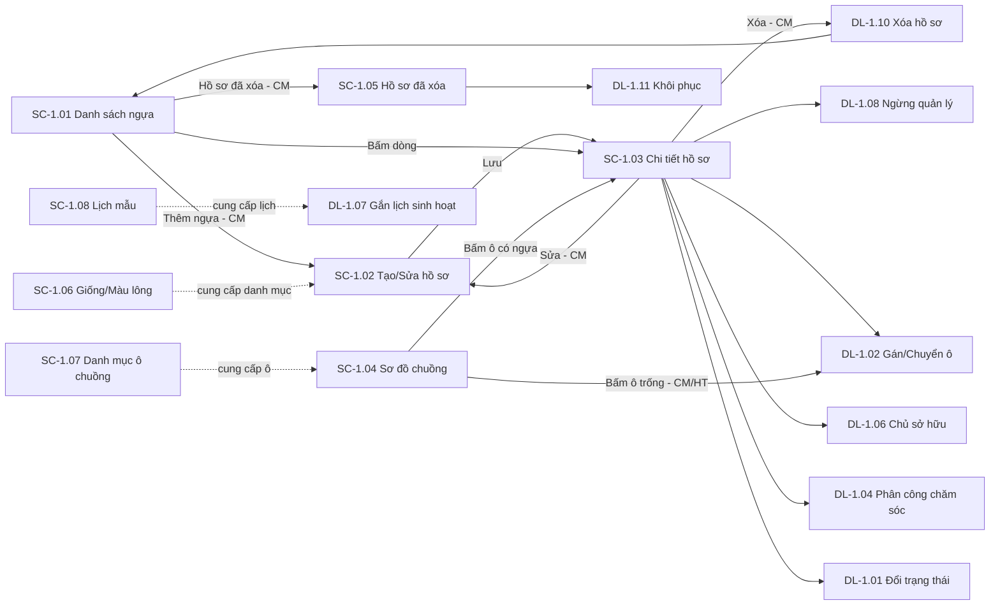
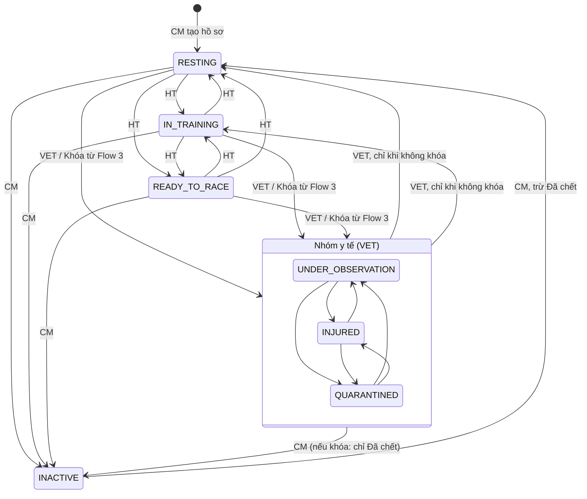

# ĐẶC TẢ LUỒNG & MÀN HÌNH – FLOW 1: QUẢN LÝ HỒ SƠ & ĐỊNH DANH NGỰA

**Dự án:** RACEHORSE_TRAINING · **Bản:** Demo 1.0

**Quy ước mã:** `SC-1.xx` = màn hình, `DL-1.xx` = dialog, `BTN-1.xx` = nút, `FR-1.xx` = chức năng, `Q-1.xx` = câu hỏi mở (ở Mục 9).
**Vai trò:** CM = Club Manager · HT = Head Trainer · VET = Veterinarian · GROOM = Groom / Stable Hand · OWNER = Horse Owner.

---

## 1. Mục tiêu và phạm vi

**Mục tiêu:** Mỗi con ngựa có một hồ sơ gốc duy nhất gồm danh tính, trạng thái vòng đời, ô chuồng, người chăm sóc và lịch sử toàn vòng đời. Flow 2 → 6 đều dùng hồ sơ này.

| Làm (In scope) | Nguồn |
|---|---|
| Tạo, cập nhật hồ sơ định danh: Tên ngựa, Giống, Ngày sinh, Giới tính, Màu lông, Số microchip, Mã thẻ RFID | Tài liệu gốc |
| Quản lý trạng thái vòng đời: Sẵn sàng thi đấu, Đang tập luyện, Cần theo dõi, Chấn thương, Cách ly, Nghỉ ngơi | Tài liệu gốc |
| Phân bổ ô chuồng (gán, chuyển, trả ô) | Tài liệu gốc |
| Gắn lịch sinh hoạt hằng ngày cho ngựa | Tài liệu gốc |
| Phân công nhân viên chăm sóc phụ trách | Tài liệu gốc |
| Xem lịch sử y tế, huấn luyện, thi đấu trong suốt vòng đời (Dòng thời gian) | Tài liệu gốc |
| Hiển thị và tuân thủ Khóa huấn luyện (Medical Lock) | Mục 6 tài liệu gốc |
| Trạng thái "Ngừng quản lý" | [BỔ SUNG] – ngựa bán/chết/giải nghệ cần rời hệ thống mà vẫn giữ lịch sử |
| Quản lý chủ sở hữu của ngựa | [BỔ SUNG] – bắt buộc để Horse Owner chỉ thấy ngựa của mình |
| Xóa mềm, khôi phục hồ sơ | [BỔ SUNG] – sửa lỗi nhập nhầm |
| Lịch sử trạng thái, lịch sử ô chuồng | [BỔ SUNG] – phục vụ truy xuất vòng đời |
| Danh mục Giống, Màu lông, Khu chuồng/Ô chuồng, Lịch sinh hoạt mẫu | [BỔ SUNG] – dữ liệu nền cho form |

| Không làm (Out of scope) | Thuộc về |
|---|---|
| Đăng nhập, đăng ký, gán vai trò | Hệ thống nền (đã có) |
| Phả hệ Sire/Dam | Loại trừ theo tài liệu gốc |
| Upload ảnh ngựa, báo cáo sự cố kèm ảnh | Loại trừ theo tài liệu gốc |
| Tạo/gỡ Khóa huấn luyện, bệnh án | Flow 3 (Flow 1 chỉ hiển thị và bị chặn theo khóa) |
| Checklist chăm sóc, khẩu phần, tồn kho | Flow 4 |
| Giáo án, buổi tập, giải đua, tài chính, AI | Flow 2, 5, 6 |
| Import/Export hàng loạt | Không có trong tài liệu gốc |

---

## 2. Vai trò và quyền

**Phạm vi dữ liệu:** *Tất cả* = mọi ngựa chưa bị xóa · *Được giao* = ngựa GROOM đang được phân công · *Sở hữu* = ngựa OWNER đang sở hữu. Ngựa ngoài phạm vi: không hiện trong danh sách; mở bằng URL thì hiện trang "Không tìm thấy".

| Chức năng | CM | HT | VET | GROOM | OWNER |
|---|---|---|---|---|---|
| Xem danh sách ngựa | Tất cả | Tất cả | Tất cả | Được giao | Sở hữu |
| Xem chi tiết hồ sơ | Tất cả | Tất cả | Tất cả | Được giao | Sở hữu |
| Tạo hồ sơ ngựa | Có | — | — | — | — |
| Sửa thông tin định danh | Có | — | — | — | — |
| Đổi trạng thái vận hành (Nghỉ ngơi / Đang tập luyện / Sẵn sàng thi đấu) | — | Có | — | — | — |
| Đổi trạng thái y tế (Cần theo dõi / Chấn thương / Cách ly và đưa ra khỏi nhóm y tế) | — | — | Có | — | — |
| Ngừng quản lý / Kích hoạt lại | Có | — | — | — | — |
| Xóa hồ sơ / Xem hồ sơ đã xóa / Khôi phục | Có | — | — | — | — |
| Gán, chuyển, trả ô chuồng | Có | Có | — | — | — |
| Xem sơ đồ chuồng trại | Có | Có | Có | Có (chỉ mở được ngựa Được giao) | — |
| Phân công / kết thúc phân công chăm sóc | Có | Có | Xem | Xem (ngựa Được giao) | — |
| Gắn lịch sinh hoạt cho ngựa | Có | Có | Xem | Xem | Xem |
| Quản lý chủ sở hữu | Có | Xem | — | — | Xem (chỉ dòng của mình) |
| Xem lịch sử trạng thái, lịch sử ô chuồng, dòng thời gian | Tất cả | Tất cả | Tất cả | Được giao | Sở hữu |
| Danh mục Giống, Màu lông | Xem/Thêm/Sửa/Ngừng dùng | Xem | Xem | Xem | Xem |
| Danh mục Khu chuồng, Ô chuồng | Xem/Thêm/Sửa/Ngừng dùng | Xem | Xem | Xem | — |
| Danh mục Lịch sinh hoạt mẫu | Xem/Thêm/Sửa/Ngừng dùng | Xem/Thêm/Sửa/Ngừng dùng | Xem | Xem | — |
| Xem đầy đủ Số microchip | Có | Có | Có | Chỉ 4 số cuối | Có |

---

## 3. Sơ đồ luồng tổng thể

### 3.1 Danh sách màn hình

| Mã | Tên màn hình | URL |
|---|---|---|
| SC-1.01 | Danh sách ngựa | `/horses` |
| SC-1.02 | Tạo / Sửa hồ sơ ngựa | `/horses/new`, `/horses/:id/edit` |
| SC-1.03 | Chi tiết hồ sơ ngựa (6 tab) | `/horses/:id?tab=...` |
| SC-1.04 | Sơ đồ chuồng trại | `/stables/map` |
| SC-1.05 | Hồ sơ ngựa đã xóa [BỔ SUNG] | `/horses/deleted` |
| SC-1.06 | Danh mục Giống & Màu lông [BỔ SUNG] | `/catalogs/breeds`, `/catalogs/coat-colors` |
| SC-1.07 | Danh mục Khu chuồng & Ô chuồng [BỔ SUNG] | `/catalogs/stalls` |
| SC-1.08 | Danh mục Lịch sinh hoạt mẫu [BỔ SUNG] | `/catalogs/routines` |

Vào URL không có quyền → trang "Bạn không có quyền truy cập chức năng này" + nút **Về trang chủ**. Menu chỉ hiện mục vai trò được vào.

### 3.2 Các luồng chính

**L1 – Tạo và đưa ngựa vào vận hành (CM, HT)**
1. CM mở SC-1.01 → bấm **Thêm ngựa** → SC-1.02.
2. Nhập thông tin định danh → **Lưu** → sang SC-1.03 của ngựa mới, trạng thái mặc định **Nghỉ ngơi**.
3. Tại tab "Chuồng & Chăm sóc": CM/HT bấm **Gán ô chuồng** (DL-1.02), **Phân công chăm sóc** (DL-1.04), **Gắn lịch sinh hoạt** (DL-1.07).
4. Tại tab "Chủ sở hữu": CM bấm **Cập nhật chủ sở hữu** (DL-1.06).

**L2 – Đổi trạng thái vận hành (HT)**
1. HT mở SC-1.03 → **Đổi trạng thái** (DL-1.01) → chọn Đang tập luyện / Sẵn sàng thi đấu / Nghỉ ngơi → **Xác nhận**.
2. Nếu ngựa đang Khóa huấn luyện → nút bị vô hiệu hóa, hiện lý do.

**L3 – Đổi trạng thái y tế (VET)**
1. VET mở SC-1.03 → **Đổi trạng thái** → chọn Cần theo dõi / Chấn thương / Cách ly, nhập lý do bắt buộc.
2. Khi ngựa hồi phục: chọn Nghỉ ngơi hoặc Đang tập luyện (chỉ được khi đã gỡ Khóa huấn luyện ở Flow 3).

**L4 – Nhận Khóa huấn luyện từ Flow 3 (tự động)**
1. VET đặt khóa ở Flow 3 → hồ sơ ngựa tự chuyển sang trạng thái y tế VET chọn, hiện banner đỏ "Đang Khóa huấn luyện" ở SC-1.01, SC-1.03, SC-1.04.
2. Mọi nút đưa ngựa về trạng thái vận hành, nút Xóa hồ sơ bị vô hiệu hóa đến khi Flow 3 gỡ khóa.

**L5 – Chuyển / trả ô chuồng (CM, HT)**: SC-1.03 hoặc SC-1.04 → **Chuyển ô** (DL-1.02) hoặc **Trả ô** (DL-1.03).

**L6 – Kết thúc vòng đời (CM)**: SC-1.03 → **Ngừng quản lý** (DL-1.08) → ô chuồng và phân công chăm sóc tự kết thúc. Muốn dùng lại: **Kích hoạt lại** (DL-1.09).

**L7 – Xóa nhầm và khôi phục (CM)**: SC-1.03 → **Xóa hồ sơ** (DL-1.10) → SC-1.01. Khôi phục tại SC-1.05 → **Khôi phục** (DL-1.11).

**L8 – Tra cứu lịch sử (mọi vai trò trong phạm vi)**: SC-1.03 → tab "Lịch sử trạng thái", "Lịch sử ô chuồng", "Dòng thời gian".

---

## 4. Vòng đời trạng thái

### 4.1 Trạng thái và màu hiển thị

| Mã trạng thái | Nhãn | Nhóm | Màu badge |
|---|---|---|---|
| RESTING | Nghỉ ngơi | Vận hành | Xám |
| IN_TRAINING | Đang tập luyện | Vận hành | Xanh dương |
| READY_TO_RACE | Sẵn sàng thi đấu | Vận hành | Xanh lá |
| UNDER_OBSERVATION | Cần theo dõi | Y tế | Vàng |
| INJURED | Chấn thương | Y tế | Đỏ |
| QUARANTINED | Cách ly | Y tế | Tím |
| INACTIVE | Ngừng quản lý [BỔ SUNG] | Kết thúc | Xám đậm, chữ gạch ngang |

**Khóa huấn luyện** không phải trạng thái mà là cờ đi kèm: badge đỏ có icon ổ khóa "Khóa huấn luyện", hiện cạnh badge trạng thái.

### 4.2 Bảng chuyển trạng thái

| Từ | Đến | Ai | Lý do | Bị chặn khi |
|---|---|---|---|---|
| (Tạo mới) | Nghỉ ngơi | CM (tự động khi tạo) | Không | — |
| Nghỉ ngơi | Đang tập luyện, Sẵn sàng thi đấu | HT | Tùy chọn | Đang Khóa huấn luyện |
| Đang tập luyện | Sẵn sàng thi đấu | HT | Tùy chọn | Đang Khóa huấn luyện |
| Đang tập luyện | Nghỉ ngơi | HT | Tùy chọn | Đang Khóa huấn luyện |
| Sẵn sàng thi đấu | Đang tập luyện, Nghỉ ngơi | HT | Tùy chọn | Đang Khóa huấn luyện |
| Nghỉ ngơi / Đang tập luyện / Sẵn sàng thi đấu | Cần theo dõi, Chấn thương, Cách ly | VET | Bắt buộc 10–500 ký tự | — |
| Cần theo dõi / Chấn thương / Cách ly | Một trạng thái y tế khác trong nhóm | VET | Bắt buộc 10–500 ký tự | — |
| Cần theo dõi / Chấn thương / Cách ly | Nghỉ ngơi, Đang tập luyện | VET | Bắt buộc 10–500 ký tự | Đang Khóa huấn luyện |
| Bất kỳ (trừ Ngừng quản lý) | Trạng thái y tế do VET chọn ở Flow 3 | Tự động khi Flow 3 đặt khóa | Lấy từ lệnh khóa | — |
| Bất kỳ (trừ Ngừng quản lý) | Ngừng quản lý | CM | Chọn lý do + ghi chú 10–500 ký tự | Đang Khóa huấn luyện, trừ lý do "Đã chết" |
| Ngừng quản lý | Nghỉ ngơi | CM | Bắt buộc 10–500 ký tự | Lý do ngừng là "Đã chết" |

**Quy tắc Medical Lock (ưu tiên cao nhất):** Khi ngựa đang Khóa huấn luyện, mọi vai trò (kể cả CM) đều không thể: đưa ngựa về Nghỉ ngơi / Đang tập luyện / Sẵn sàng thi đấu, xóa hồ sơ, ngừng quản lý (trừ lý do Đã chết). Vẫn được: xem, sửa định danh, đổi giữa các trạng thái y tế, chuyển ô chuồng, phân công chăm sóc, cập nhật chủ sở hữu. Chỉ gỡ khóa ở Flow 3.

---

## 5. Đặc tả màn hình

**Quy ước chung cho mọi màn hình**
- Ngày hiển thị `dd/MM/yyyy`, ngày giờ `dd/MM/yyyy HH:mm` (giờ Việt Nam).
- Breakpoint: Mobile < 768px · Tablet 768–1199px · Desktop ≥ 1200px.
- Đang tải: skeleton. Lỗi tải: khung "Không tải được dữ liệu" + nút **Thử lại**. Mất mạng: toast đỏ "Mất kết nối mạng. Vui lòng thử lại."
- Dữ liệu bị người khác sửa trong lúc mình sửa: toast "Dữ liệu đã được người khác cập nhật. Vui lòng tải lại trước khi lưu." + nút **Tải lại**, giữ nguyên dialog/form.
- Nút không có quyền: **ẩn**. Nút có quyền nhưng bị chặn do trạng thái: **hiện, vô hiệu hóa**, di chuột/nhấn giữ hiện tooltip lý do.

### 5.1 SC-1.01 – Danh sách ngựa

**Mục đích:** Tìm, lọc, xem nhanh toàn bộ ngựa trong phạm vi. **Vai trò:** tất cả 5 vai trò (dữ liệu theo phạm vi Mục 2).

**Bố cục:** Header (tiêu đề + nút) → Thanh lọc → Bảng → Phân trang. Tablet: bộ lọc gập vào nút **Bộ lọc**. Mobile: bảng thành danh sách thẻ (Tên, Mã, badge trạng thái, badge khóa, Ô chuồng).

**Nút**

| Mã | Nút | Vai trò thấy | Hành vi |
|---|---|---|---|
| BTN-1.01 | Thêm ngựa | CM | Mở SC-1.02 chế độ tạo |
| BTN-1.02 | Hồ sơ đã xóa | CM | Mở SC-1.05 |
| BTN-1.03 | Xóa bộ lọc | Tất cả | Đưa bộ lọc về mặc định |
| BTN-1.04 | Xem (mỗi dòng) / bấm vào dòng | Tất cả | Mở SC-1.03 |

**Bộ lọc**

| Nhãn | Loại | Mặc định | Ghi chú |
|---|---|---|---|
| Tìm kiếm | Ô text, placeholder "Tên ngựa, mã ngựa, microchip, RFID" | Rỗng | Tìm sau khi ngừng gõ 400ms, tối thiểu 2 ký tự, không phân biệt dấu |
| Trạng thái | Chọn nhiều (7 trạng thái) | Tất cả trừ Ngừng quản lý | |
| Khóa huấn luyện | Chọn một: Tất cả / Đang khóa / Không khóa | Tất cả | |
| Giống | Dropdown | Tất cả | |
| Giới tính | Dropdown: Tất cả / Ngựa đực / Ngựa cái / Ngựa đực thiến | Tất cả | |
| Khu chuồng | Dropdown | Tất cả | Ẩn với OWNER |
| Chưa có ô chuồng | Checkbox | Bỏ chọn | Chỉ CM, HT |

**Bảng**

| Cột | Hiển thị | Sắp xếp |
|---|---|---|
| Mã ngựa | `HR-000123` | Có |
| Tên ngựa | Text | Có (mặc định A→Z) |
| Giống | Tên giống | Có |
| Giới tính | Nhãn tiếng Việt | Không |
| Tuổi | Số năm tính từ Ngày sinh, ví dụ "4 tuổi" | Có |
| Trạng thái | Badge màu Mục 4.1 + badge Khóa huấn luyện nếu có | Có |
| Ô chuồng | Mã ô, ví dụ `A-07`; "—" nếu chưa có. Ẩn với OWNER | Có |
| Người chăm sóc chính | Họ tên; "—" nếu chưa có. Ẩn với OWNER | Không |
| Cập nhật lần cuối | `dd/MM/yyyy HH:mm` | Có |

Phân trang: 20 dòng/trang, chọn 20/50/100. Bộ lọc, sắp xếp, trang giữ trên URL để chia sẻ link và nút Back hoạt động.

**Trạng thái giao diện**
- Rỗng, chưa có ngựa nào: "Chưa có hồ sơ ngựa nào." + nút **Thêm ngựa** (CM).
- Rỗng theo bộ lọc: "Không có ngựa phù hợp bộ lọc." + nút **Xóa bộ lọc**.
- GROOM chưa được giao ngựa: "Bạn chưa được phân công chăm sóc ngựa nào."
- OWNER chưa sở hữu ngựa: "Chưa có ngựa nào thuộc sở hữu của bạn."

### 5.2 SC-1.02 – Tạo / Sửa hồ sơ ngựa

**Mục đích:** Nhập và cập nhật thông tin định danh. **Vai trò:** CM. Vai trò khác vào URL → trang không có quyền.

**Bố cục:** Desktop: form 2 cột. Tablet, Mobile: 1 cột. Thanh nút cố định cuối màn hình trên Mobile.

**Ô nhập**

| Nhãn | Loại | Bắt buộc | Quy tắc | Thông báo lỗi |
|---|---|---|---|---|
| Mã ngựa | Chỉ đọc | — | Hệ thống tự sinh `HR-` + 6 số; ở chế độ tạo hiện "Tự động sinh khi lưu" | — |
| Tên ngựa | Text, placeholder "Nhập tên ngựa" | Có | 2–100 ký tự; chỉ chữ, số, khoảng trắng, `' - .`; không trùng ngựa khác | "Tên ngựa là bắt buộc." / "Tên ngựa phải từ 2 đến 100 ký tự." / "Tên ngựa chỉ được chứa chữ cái, chữ số, khoảng trắng và các ký tự ' - ." / "Tên ngựa đã tồn tại trong hệ thống." |
| Giống | Dropdown có tìm kiếm (danh mục SC-1.06, chỉ mục đang dùng) | Có | | "Vui lòng chọn giống ngựa." / "Giống ngựa không tồn tại hoặc đã ngừng sử dụng." |
| Ngày sinh | Date picker `dd/MM/yyyy` | Có | Không sau hôm nay, không sớm hơn 40 năm | "Ngày sinh là bắt buộc." / "Ngày sinh không được sau ngày hiện tại." / "Ngày sinh không được sớm hơn 40 năm tính đến ngày hiện tại." |
| Giới tính | Radio: Ngựa đực / Ngựa cái / Ngựa đực thiến | Có | | "Vui lòng chọn giới tính." |
| Màu lông | Dropdown có tìm kiếm (danh mục SC-1.06) | Có | | "Vui lòng chọn màu lông." / "Màu lông không tồn tại hoặc đã ngừng sử dụng." |
| Số microchip | Text, chỉ nhận số, placeholder "15 chữ số" | Có | Đúng 15 chữ số; không trùng | "Số microchip là bắt buộc." / "Số microchip phải gồm đúng 15 chữ số." / "Số microchip đã được gán cho ngựa khác." |
| Mã thẻ RFID | Text, tự chuyển chữ in hoa | Không | 4–32 ký tự, chỉ A–Z, 0–9, `-`; không trùng | "Mã thẻ RFID phải từ 4 đến 32 ký tự, chỉ gồm chữ in hoa A–Z, chữ số và dấu gạch ngang." / "Mã thẻ RFID đã được gán cho ngựa khác." |

Kiểm tra định dạng khi rời ô và khi bấm Lưu; lỗi trùng hiện sau khi server trả về, gắn vào đúng ô. Khi sửa: nếu Giống/Màu lông đang lưu đã ngừng dùng, dropdown vẫn hiện giá trị đó kèm chữ "(Ngừng sử dụng)".

**Nút**

| Mã | Nút | Hành vi |
|---|---|---|
| BTN-1.05 | Lưu | Kiểm tra form → lưu → toast "Đã tạo hồ sơ ngựa {Tên}." hoặc "Đã cập nhật hồ sơ ngựa." → chuyển SC-1.03. Vô hiệu hóa và hiện vòng quay khi đang gửi (chống bấm 2 lần) |
| BTN-1.06 | Lưu và thêm ngựa khác | Chỉ ở chế độ tạo. Lưu → toast → xóa trắng form, con trỏ về ô Tên ngựa |
| BTN-1.07 | Hủy | Quay lại màn hình trước. Nếu form đã thay đổi → DL-1.12 |

**Trạng thái giao diện:** Sửa ngựa Ngừng quản lý → không vào được form, hiện thông báo "Ngựa đã ngừng quản lý. Vui lòng kích hoạt lại trước khi thao tác." + nút **Về hồ sơ**. Hồ sơ không tồn tại → trang "Không tìm thấy hồ sơ ngựa hoặc bạn không có quyền xem."

### 5.3 SC-1.03 – Chi tiết hồ sơ ngựa

**Mục đích:** Điểm trung tâm xem và thao tác mọi thứ về một con ngựa. **Vai trò:** tất cả 5 vai trò trong phạm vi dữ liệu.

**Bố cục**
- **Header:** Tên ngựa, Mã ngựa, badge Trạng thái, badge Khóa huấn luyện, thanh nút thao tác. Mobile: nút phụ gom vào menu "⋯".
- **Banner Khóa huấn luyện** (khi đang khóa): nền đỏ, nội dung "Ngựa đang bị Khóa huấn luyện y tế từ {ngày giờ} bởi BS. {Họ tên}. Không thể xếp lịch tập nặng, đăng ký thi đấu hoặc đưa về trạng thái vận hành cho đến khi Bác sĩ thú y mở khóa."
- **Banner Ngừng quản lý** (khi INACTIVE): nền xám, "Ngựa đã ngừng quản lý từ {ngày} – Lý do: {lý do}."
- **Thân:** 6 tab. Desktop: tab ngang. Mobile: dropdown chọn tab.

**Nút trên header**

| Mã | Nút | Vai trò thấy | Vô hiệu hóa khi (tooltip lý do) | Hành vi |
|---|---|---|---|---|
| BTN-1.08 | Sửa hồ sơ | CM | Ngừng quản lý ("Ngựa đã ngừng quản lý.") | Mở SC-1.02 chế độ sửa |
| BTN-1.09 | Đổi trạng thái | HT, VET | Ngừng quản lý; với HT: đang khóa ("Ngựa đang bị Khóa huấn luyện y tế.") | Mở DL-1.01 |
| BTN-1.10 | Ngừng quản lý | CM | Đã Ngừng quản lý (nút ẩn, thay bằng BTN-1.11) | Mở DL-1.08 |
| BTN-1.11 | Kích hoạt lại | CM, chỉ khi Ngừng quản lý | Lý do là Đã chết ("Không thể kích hoạt lại hồ sơ ngựa đã chết.") | Mở DL-1.09 |
| BTN-1.12 | Xóa hồ sơ | CM | Đang khóa; ngựa đã phát sinh dữ liệu ở Flow 2–5 ("Ngựa đã có dữ liệu huấn luyện, y tế, chăm sóc hoặc thi đấu. Vui lòng dùng Ngừng quản lý.") | Mở DL-1.10 |

**Tab 1 – Thông tin chung** (mặc định)

Hiển thị dạng nhãn–giá trị: Mã ngựa, Tên ngựa, Giống, Ngày sinh, Tuổi, Giới tính, Màu lông, Số microchip (GROOM thấy `***********9012`), Mã thẻ RFID ("—" nếu trống), Trạng thái, Thời điểm đổi trạng thái gần nhất, Lý do đổi gần nhất, Người tạo, Ngày tạo, Người cập nhật, Ngày cập nhật. Không có nút riêng.

**Tab 2 – Chuồng & Chăm sóc** (tên tab với OWNER: "Lịch sinh hoạt"; OWNER chỉ thấy khối C)

*Khối A – Ô chuồng hiện tại* (ẩn với OWNER): Mã ô, Khu chuồng, Ngày vào ô, Người gán.

| Mã | Nút | Vai trò | Điều kiện hiện | Vô hiệu hóa khi | Hành vi |
|---|---|---|---|---|---|
| BTN-1.13 | Gán ô chuồng | CM, HT | Ngựa chưa có ô | Ngừng quản lý | DL-1.02 chế độ gán |
| BTN-1.14 | Chuyển ô | CM, HT | Ngựa đang có ô | Ngừng quản lý | DL-1.02 chế độ chuyển |
| BTN-1.15 | Trả ô | CM, HT | Ngựa đang có ô | Ngừng quản lý | DL-1.03 |

*Khối B – Nhân viên chăm sóc* (ẩn với OWNER). Bảng: Họ tên · Vai trò phụ trách (badge "Chính" xanh / "Phụ" xám) · Từ ngày · Người phân công · Ghi chú · Hành động.

| Mã | Nút | Vai trò | Vô hiệu hóa khi | Hành vi |
|---|---|---|---|---|
| BTN-1.16 | Phân công chăm sóc | CM, HT | Ngừng quản lý; đã đủ 1 chính + 2 phụ ("Ngựa đã đủ 1 người chính và 2 người phụ.") | DL-1.04 |
| BTN-1.17 | Kết thúc phân công (mỗi dòng) | CM, HT | — | DL-1.05 |

Rỗng: "Chưa phân công nhân viên chăm sóc." Nếu chưa có người chính: cảnh báo vàng "Ngựa chưa có nhân viên phụ trách chính."

*Khối C – Lịch sinh hoạt hằng ngày:* Tên lịch mẫu + bảng: Giờ (`HH:mm`) · Hoạt động (Cho ăn / Vệ sinh chuồng / Tắm rửa / Ngâm chân nước đá / Tập luyện / Nghỉ ngơi) · Thời lượng (phút) · Ghi chú.

| Mã | Nút | Vai trò | Vô hiệu hóa khi | Hành vi |
|---|---|---|---|---|
| BTN-1.18 | Gắn / Đổi lịch sinh hoạt | CM, HT | Ngừng quản lý | DL-1.07 |

Rỗng: "Chưa gắn lịch sinh hoạt."

**Tab 3 – Chủ sở hữu** (CM, HT, OWNER; ẩn với VET, GROOM)

Bảng: Chủ sở hữu (họ tên) · Tỷ lệ sở hữu (%, 2 số thập phân) · Hiệu lực từ · Hiệu lực đến ("Hiện tại" nếu còn hiệu lực). Dòng tổng: "Tổng: {x}%". Checkbox **Hiện cả bản ghi đã kết thúc** (mặc định bỏ chọn). OWNER chỉ thấy dòng của chính mình, không thấy dòng tổng.

| Mã | Nút | Vai trò | Hành vi |
|---|---|---|---|
| BTN-1.19 | Cập nhật chủ sở hữu | CM | DL-1.06 |

Rỗng: "Chưa có thông tin chủ sở hữu."

**Tab 4 – Lịch sử trạng thái** [BỔ SUNG]

Bảng (mới nhất trước): Thời điểm · Từ trạng thái (badge) · Sang trạng thái (badge) · Nguồn (Thủ công / Khóa huấn luyện / Hệ thống) · Lý do · Người thực hiện (họ tên + vai trò). Lọc: Khoảng ngày. Phân trang 20 dòng.

**Tab 5 – Lịch sử ô chuồng** [BỔ SUNG] (ẩn với OWNER, Q-1.12)

Bảng (mới nhất trước): Ô chuồng · Khu · Vào lúc · Ra lúc ("Đang ở" nếu chưa ra) · Lý do ra (Chuyển ô / Trả ô / Ngừng quản lý / Xóa hồ sơ) · Người gán · Người trả · Ghi chú. Phân trang 20 dòng.

**Tab 6 – Dòng thời gian**

Danh sách sự kiện theo thời gian (mới nhất trên cùng), mỗi mục: icon nhóm, ngày giờ, câu mô tả, người thực hiện.
Bộ lọc: **Nhóm** (chọn nhiều): Hồ sơ, Trạng thái, Ô chuồng, Chăm sóc, Chủ sở hữu (chỉ CM), Y tế, Huấn luyện, Thi đấu · **Khoảng ngày**.
Nút **Tải thêm** (mỗi lần 30 mục). Mục thuộc Flow 2/3/5 có link **Xem chi tiết** sang màn hình của flow đó (hiện khi flow đó đã có màn hình).
Rỗng: "Chưa có sự kiện nào."

**Khác biệt theo vai trò – tóm tắt**

| Thành phần | CM | HT | VET | GROOM | OWNER |
|---|---|---|---|---|---|
| BTN-1.08, 10, 11, 12, 19 | Hiện | Ẩn | Ẩn | Ẩn | Ẩn |
| BTN-1.09 | Ẩn | Hiện (chỉ trạng thái vận hành) | Hiện (chỉ trạng thái y tế + thoát y tế) | Ẩn | Ẩn |
| BTN-1.13 → 18 | Hiện | Hiện | Ẩn | Ẩn | Ẩn |
| Tab 3 Chủ sở hữu | Hiện | Hiện | Ẩn | Ẩn | Chỉ dòng của mình |
| Tab 5 Lịch sử ô chuồng | Hiện | Hiện | Hiện | Hiện | Ẩn |
| Khối A, B của Tab 2 | Hiện | Hiện | Hiện | Hiện | Ẩn |

---

### 5.4 SC-1.04 – Sơ đồ chuồng trại

**Mục đích:** Xem trực quan vị trí từng con ngựa trong các khu chuồng, thao tác gán/chuyển/trả ô nhanh. **Vai trò:** CM, HT, VET, GROOM. OWNER không vào được.

**Bố cục**
- **Header:** tiêu đề, ô chọn Khu chuồng, ô tìm ngựa trên sơ đồ.
- **Thanh thống kê** của khu đang chọn: Tổng ô · Đang có ngựa · Trống · Bảo trì.
- **Chú thích màu** (legend) theo Mục 4.1.
- **Lưới sơ đồ:** số hàng × số cột theo cấu hình khu (SC-1.07). Mỗi ô là một thẻ vuông.
- **Panel chi tiết ô:** Desktop hiện panel bên phải; Tablet, Mobile hiện bottom sheet trượt từ dưới lên.
- Mobile: lưới cuộn ngang trong khung riêng, không làm cuộn ngang cả trang; có nút chuyển sang **Dạng danh sách** (danh sách ô theo thứ tự mã ô).

**Hiển thị một ô trên lưới**

| Loại ô | Hiển thị |
|---|---|
| Có ngựa | Mã ô, Tên ngựa, nền theo màu trạng thái ngựa, icon ổ khóa đỏ nếu đang Khóa huấn luyện |
| Trống | Mã ô, viền nét đứt, chữ "Trống" |
| Bảo trì | Mã ô, nền sọc xám, chữ "Bảo trì" |
| Ngừng sử dụng | Không hiển thị trên sơ đồ |
| Vị trí lưới chưa khai báo ô | Ô trống mờ, không bấm được |

GROOM: ô có ngựa được giao có viền đậm màu xanh và chữ "Của tôi"; ô có ngựa không được giao vẫn hiện tên và màu trạng thái nhưng không mở được hồ sơ.

**Ô nhập và bộ lọc**

| Nhãn | Loại | Mặc định | Hành vi |
|---|---|---|---|
| Khu chuồng | Dropdown (khu đang sử dụng) | Khu đầu tiên theo thứ tự | Đổi khu → tải lại lưới |
| Tìm ngựa trên sơ đồ | Ô text, placeholder "Nhập tên hoặc mã ngựa" | Rỗng | Tìm trên mọi khu; kết quả là danh sách gợi ý, chọn một ngựa → chuyển sang khu của ngựa đó và nhấp nháy ô 3 giây. Không tìm thấy: "Không tìm thấy ngựa trên sơ đồ." |
| Chỉ hiện ngựa của tôi | Checkbox | Bỏ chọn | Chỉ GROOM thấy; làm mờ các ô không được giao |

**Nút**

| Mã | Nút | Vị trí | Vai trò thấy | Vô hiệu hóa khi | Hành vi |
|---|---|---|---|---|---|
| BTN-1.20 | Xem hồ sơ ngựa | Panel ô có ngựa | CM, HT, VET; GROOM chỉ với ngựa được giao | — | Mở SC-1.03 |
| BTN-1.21 | Chuyển ô | Panel ô có ngựa | CM, HT | — | Mở DL-1.02 chế độ chuyển, đã điền sẵn ngựa |
| BTN-1.22 | Trả ô | Panel ô có ngựa | CM, HT | — | Mở DL-1.03 |
| BTN-1.23 | Gán ngựa vào ô | Panel ô trống | CM, HT | — | Mở DL-1.02 chế độ "gán vào ô", đã điền sẵn ô |
| BTN-1.44 | Dạng danh sách / Dạng sơ đồ | Header | Tất cả vai trò được vào | — | Đổi cách hiển thị |

**Panel chi tiết ô**
- Ô có ngựa: Mã ô, Khu, Tên ngựa, Mã ngựa, badge Trạng thái, badge Khóa huấn luyện, Người chăm sóc chính, Ngày vào ô.
- Ô trống: Mã ô, Khu, Ghi chú ô, Ngày trống từ (ngày ngựa trước rời ô, "—" nếu chưa từng có ngựa).
- Ô bảo trì: Mã ô, Khu, Ghi chú ô; không có nút.

**Trạng thái giao diện**
- Chưa có khu chuồng nào: "Chưa khai báo khu chuồng." CM thấy thêm nút **Đi tới danh mục ô chuồng** (mở SC-1.07).
- Khu chưa có ô: "Khu này chưa có ô chuồng."
- Đang tải: skeleton lưới. Lỗi tải: khung lỗi + **Thử lại**.
- Dữ liệu sơ đồ tự làm mới mỗi 60 giây khi tab trình duyệt đang mở; hiện dòng "Cập nhật lúc HH:mm".

### 5.5 SC-1.05 – Hồ sơ ngựa đã xóa [BỔ SUNG]

**Mục đích:** Xem và khôi phục hồ sơ bị xóa nhầm. **Vai trò:** chỉ CM.

**Bố cục:** Header (tiêu đề + nút Quay lại) → ô tìm kiếm → bảng → phân trang 20 dòng. Mobile: danh sách thẻ.

**Bộ lọc:** Tìm kiếm (Ô text, placeholder "Tên ngựa, mã ngựa, microchip"); Khoảng ngày xóa (Từ ngày – Đến ngày).

**Bảng**

| Cột | Hiển thị | Sắp xếp |
|---|---|---|
| Mã ngựa | `HR-000123` | Có |
| Tên ngựa | Text | Có |
| Số microchip | 15 chữ số | Không |
| Trạng thái lúc xóa | Badge màu | Không |
| Ngày xóa | `dd/MM/yyyy HH:mm` | Có (mặc định mới nhất trước) |
| Người xóa | Họ tên | Không |
| Lý do xóa | Text, cắt ở 80 ký tự, di chuột xem đủ | Không |
| Hành động | Nút Khôi phục | — |

**Nút**

| Mã | Nút | Hành vi |
|---|---|---|
| BTN-1.24 | Khôi phục (mỗi dòng) | Mở DL-1.11 |
| BTN-1.25 | Quay lại danh sách ngựa | Mở SC-1.01 |

**Trạng thái giao diện:** Rỗng: "Không có hồ sơ ngựa nào đã bị xóa." Vai trò khác CM vào URL → trang không có quyền.

### 5.6 SC-1.06 – Danh mục Giống & Màu lông [BỔ SUNG]

**Mục đích:** Quản lý danh sách lựa chọn cho ô Giống và Màu lông ở SC-1.02. **Vai trò:** CM toàn quyền; HT, VET, GROOM, OWNER chỉ xem.

**Bố cục:** 2 tab: **Giống ngựa** và **Màu lông**. Mỗi tab: thanh công cụ (tìm kiếm, lọc, nút Thêm) → bảng. Mobile: danh sách thẻ.

**Bộ lọc:** Tìm kiếm (placeholder "Mã hoặc tên"); Trạng thái: Tất cả / Đang dùng / Ngừng dùng (mặc định Đang dùng).

**Bảng (giống nhau ở 2 tab)**

| Cột | Hiển thị | Sắp xếp |
|---|---|---|
| Mã | Chữ in hoa, ví dụ `THOROUGHBRED` | Có |
| Tên | Text | Có |
| Mô tả | Cắt ở 80 ký tự | Không |
| Thứ tự hiển thị | Số | Có (mặc định tăng dần) |
| Số ngựa đang dùng | Số ngựa chưa xóa đang gán giá trị này | Có |
| Trạng thái | Badge "Đang dùng" xanh / "Ngừng dùng" xám | Có |
| Hành động | Sửa, Ngừng dùng hoặc Dùng lại | — |

**Nút**

| Mã | Nút | Vai trò | Hành vi |
|---|---|---|---|
| BTN-1.26 | Thêm mới | CM | Mở DL-1.13 chế độ thêm |
| BTN-1.27 | Sửa (mỗi dòng) | CM | Mở DL-1.13 chế độ sửa |
| BTN-1.28 | Ngừng dùng (mỗi dòng, khi Đang dùng) | CM | Hộp xác nhận: "Ngừng dùng '{Tên}'? Các ngựa đang dùng giá trị này vẫn giữ nguyên, nhưng không chọn được giá trị này khi tạo hoặc sửa ngựa." → Xác nhận → toast "Đã ngừng dùng '{Tên}'." |
| BTN-1.29 | Dùng lại (mỗi dòng, khi Ngừng dùng) | CM | Chuyển ngay về Đang dùng → toast "Đã dùng lại '{Tên}'." |

Không có nút xóa cứng (Q-1.19).

**Trạng thái giao diện:** Rỗng: "Chưa có dữ liệu. Bấm Thêm mới để tạo." (CM) hoặc "Chưa có dữ liệu." (vai trò khác).

### 5.7 SC-1.07 – Danh mục Khu chuồng & Ô chuồng [BỔ SUNG]

**Mục đích:** Khai báo khu chuồng, kích thước lưới sơ đồ và từng ô chuồng. **Vai trò:** CM toàn quyền; HT, VET, GROOM chỉ xem. OWNER không vào được.

**Bố cục:** Desktop: cột trái danh sách khu (30%), cột phải bảng ô của khu đang chọn (70%). Tablet, Mobile: chọn khu bằng dropdown ở trên, bảng ô ở dưới.

**Danh sách khu:** mỗi dòng hiện Mã khu, Tên khu, Kích thước lưới (ví dụ "4 × 6"), Số ô, badge Đang dùng / Ngừng dùng.

**Bảng ô chuồng**

| Cột | Hiển thị | Sắp xếp |
|---|---|---|
| Mã ô | `A-07` | Có (mặc định) |
| Vị trí | "Hàng 2 – Cột 3" | Có |
| Trạng thái ô | Badge: Hoạt động (xanh) / Bảo trì (cam) / Ngừng dùng (xám) | Có |
| Ngựa đang ở | Tên ngựa hoặc "Trống" | Không |
| Ghi chú | Cắt ở 80 ký tự | Không |
| Hành động | Sửa, Đổi trạng thái ô | — |

Lọc bảng ô: Trạng thái ô (Tất cả / Hoạt động / Bảo trì / Ngừng dùng); Tình trạng (Tất cả / Có ngựa / Trống).

**Nút**

| Mã | Nút | Vai trò | Vô hiệu hóa khi (lý do) | Hành vi |
|---|---|---|---|---|
| BTN-1.30 | Thêm khu | CM | — | Mở DL-1.14 chế độ thêm |
| BTN-1.31 | Sửa khu | CM | — | Mở DL-1.14 chế độ sửa |
| BTN-1.32 | Ngừng dùng khu / Dùng lại khu | CM | Khu còn ô đang có ngựa ("Khu còn {n} ngựa. Vui lòng chuyển hết ngựa trước.") | Hộp xác nhận → cập nhật |
| BTN-1.33 | Thêm ô | CM | Khu đang ngừng dùng | Mở DL-1.15 chế độ thêm |
| BTN-1.34 | Sửa ô (mỗi dòng) | CM | — | Mở DL-1.15 chế độ sửa |
| BTN-1.35 | Đổi trạng thái ô (mỗi dòng) | CM | Ô đang có ngựa khi chọn Bảo trì hoặc Ngừng dùng ("Ô chuồng đang có ngựa {Tên}. Vui lòng chuyển ngựa trước.") | Menu chọn Hoạt động / Bảo trì / Ngừng dùng → hộp xác nhận → toast "Đã cập nhật trạng thái ô {Mã ô}." |

**Trạng thái giao diện:** Chưa có khu: "Chưa có khu chuồng. Bấm Thêm khu để bắt đầu." Khu chưa có ô: "Khu này chưa có ô chuồng."

### 5.8 SC-1.08 – Danh mục Lịch sinh hoạt mẫu [BỔ SUNG]

**Mục đích:** Tạo các mẫu lịch sinh hoạt hằng ngày để gắn cho ngựa (DL-1.07). **Vai trò:** CM, HT toàn quyền; VET, GROOM chỉ xem. OWNER không vào được (OWNER xem lịch của ngựa mình trong SC-1.03).

**Bố cục:** Màn hình danh sách → bấm một mẫu mở trang chỉnh sửa `/catalogs/routines/:id` (hoặc `/catalogs/routines/new`).

**Bảng danh sách mẫu**

| Cột | Hiển thị | Sắp xếp |
|---|---|---|
| Mã | `TRAINING_DAY` | Có |
| Tên lịch mẫu | Text | Có (mặc định) |
| Số mục | Số hoạt động trong ngày | Không |
| Số ngựa đang dùng | Số | Có |
| Trạng thái | Đang dùng / Ngừng dùng | Có |
| Hành động | Sửa, Nhân bản, Ngừng dùng hoặc Dùng lại | — |

Bộ lọc: Tìm kiếm (Mã hoặc tên); Trạng thái (mặc định Đang dùng).

**Trang chỉnh sửa – Ô nhập**

| Nhãn | Loại | Bắt buộc | Quy tắc | Thông báo lỗi |
|---|---|---|---|---|
| Mã | Text, tự in hoa; chỉ đọc khi sửa | Có | 2–30 ký tự, chỉ A–Z, 0–9, `_`; không trùng | "Mã là bắt buộc." / "Mã chỉ gồm chữ in hoa, chữ số và dấu gạch dưới, từ 2 đến 30 ký tự." / "Mã đã tồn tại." |
| Tên lịch mẫu | Text | Có | 2–100 ký tự; không trùng | "Tên là bắt buộc." / "Tên phải từ 2 đến 100 ký tự." / "Tên đã tồn tại." |
| Mô tả | Textarea | Không | ≤ 500 ký tự | "Mô tả tối đa 500 ký tự." |

**Bảng hoạt động trong ngày (sửa trực tiếp trên dòng)**

| Cột | Loại | Bắt buộc | Quy tắc | Thông báo lỗi |
|---|---|---|---|---|
| Giờ bắt đầu | Time picker `HH:mm`, bước 5 phút | Có | Không trùng giờ với dòng khác | "Giờ bắt đầu là bắt buộc." / "Giờ bắt đầu bị trùng với dòng khác." |
| Hoạt động | Dropdown: Cho ăn, Vệ sinh chuồng, Tắm rửa, Ngâm chân nước đá, Tập luyện, Nghỉ ngơi | Có | | "Vui lòng chọn hoạt động." |
| Thời lượng (phút) | Số nguyên | Có, mặc định 30 | 5–240 | "Thời lượng phải từ 5 đến 240 phút." |
| Ghi chú | Text | Không | ≤ 200 ký tự | "Ghi chú tối đa 200 ký tự." |
| (Xóa dòng) | Nút icon | — | — | — |

Khi lưu, các dòng tự sắp xếp theo giờ tăng dần. Tối thiểu 1 dòng: "Lịch mẫu phải có ít nhất 1 hoạt động."

**Nút**

| Mã | Nút | Vai trò | Hành vi |
|---|---|---|---|
| BTN-1.36 | Thêm lịch mẫu | CM, HT | Mở trang chỉnh sửa trống |
| BTN-1.37 | Sửa (mỗi dòng) | CM, HT | Mở trang chỉnh sửa |
| BTN-1.38 | Nhân bản (mỗi dòng) | CM, HT | Mở trang tạo mới, điền sẵn dữ liệu của mẫu gốc; Mã và Tên để trống |
| BTN-1.39 | Ngừng dùng / Dùng lại (mỗi dòng) | CM, HT | Ngừng dùng: hộp xác nhận "Các ngựa đang dùng mẫu này vẫn giữ lịch, nhưng không chọn được mẫu này để gắn mới." |
| BTN-1.40 | Thêm hoạt động | CM, HT | Thêm 1 dòng trống vào bảng |
| BTN-1.41 | Xóa dòng | CM, HT | Xóa dòng khỏi bảng (chưa lưu) |
| BTN-1.42 | Lưu | CM, HT | Nếu mẫu đang có ngựa dùng → hộp xác nhận "Thay đổi sẽ áp dụng cho {n} ngựa đang dùng lịch này từ ngày mai. Tiếp tục?" → Lưu → toast "Đã lưu lịch mẫu." → về danh sách |
| BTN-1.43 | Hủy | CM, HT | Về danh sách; nếu có thay đổi chưa lưu → DL-1.12 |

---

### 5.9 Dialog dùng chung

Quy ước chung cho mọi dialog: Desktop hiện giữa màn hình, rộng 560px; Mobile chiếm toàn màn hình. Nút chính nằm bên phải, nút Hủy bên trái. Nút chính vô hiệu hóa khi form chưa hợp lệ hoặc đang gửi. Bấm Hủy hoặc Esc khi đã nhập dữ liệu → hỏi "Bỏ các thay đổi đã nhập?" (Bỏ / Tiếp tục nhập). Lỗi từ server hiện ở dòng đỏ đầu dialog, dialog giữ nguyên dữ liệu đã nhập.

#### DL-1.01 – Đổi trạng thái

Mở từ BTN-1.09 (SC-1.03). Vai trò: HT, VET.

| Thành phần | Loại | Bắt buộc | Mô tả |
|---|---|---|---|
| Trạng thái hiện tại | Chỉ đọc, badge | — | |
| Trạng thái mới | Radio, mỗi lựa chọn là badge màu | Có | Chỉ hiện trạng thái vai trò được chuyển tới theo Mục 4.2. Lựa chọn bị chặn bởi Khóa huấn luyện vẫn hiện nhưng mờ, ghi chú "Bị chặn do Khóa huấn luyện" |
| Lý do | Textarea, bộ đếm "x/500" | Theo Mục 4.2 | Nhãn đổi thành "Lý do (bắt buộc)" khi bắt buộc |
| Gợi ý (chỉ VET, khi chọn trạng thái y tế) | Khung thông tin | — | "Nếu cần chặn lịch tập nặng và đăng ký thi đấu, hãy đặt Khóa huấn luyện trong Hồ sơ y tế." + link sang Hồ sơ y tế (Flow 3) |

Nút: **Hủy** · **Xác nhận** (BTN-1.45).
Kiểm tra: "Vui lòng chọn trạng thái mới." / "Vui lòng nhập lý do." / "Lý do phải từ 10 đến 500 ký tự." / "Lý do tối đa 500 ký tự."
Lỗi server: "Ngựa đang bị Khóa huấn luyện y tế. Không thể thực hiện thao tác này cho đến khi Bác sĩ thú y mở khóa." / "Không thể chuyển trạng thái từ {Từ} sang {Đến}." / "Ngựa đang ở trạng thái {Đến}."
Thành công: đóng dialog, toast "Đã chuyển trạng thái sang {Nhãn}.", badge và Tab Lịch sử trạng thái cập nhật.

#### DL-1.02 – Gán / Chuyển ô chuồng

Mở từ BTN-1.13, BTN-1.14 (SC-1.03), BTN-1.21, BTN-1.23 (SC-1.04). Vai trò: CM, HT.

| Chế độ | Tiêu đề | Trường được điền sẵn |
|---|---|---|
| Gán | "Gán ô chuồng cho {Tên ngựa}" | Ngựa |
| Chuyển | "Chuyển ô chuồng cho {Tên ngựa}" | Ngựa, Ô hiện tại |
| Gán vào ô (từ sơ đồ) | "Gán ngựa vào ô {Mã ô}" | Ô đích |

| Thành phần | Loại | Bắt buộc | Quy tắc | Thông báo lỗi |
|---|---|---|---|---|
| Ngựa | Dropdown có tìm kiếm; chỉ ở chế độ "Gán vào ô" | Có | Chỉ ngựa chưa có ô và không Ngừng quản lý | "Vui lòng chọn ngựa." |
| Ô hiện tại | Chỉ đọc; chỉ ở chế độ Chuyển | — | | |
| Khu chuồng | Dropdown | Có | Khu đang dùng | "Vui lòng chọn khu chuồng." |
| Ô chuồng | Dropdown có tìm kiếm, mỗi mục hiện "Mã ô – Hàng x, Cột y" | Có | Chỉ ô Hoạt động và đang trống; khác ô hiện tại | "Vui lòng chọn ô chuồng." |
| Ghi chú | Textarea | Không | ≤ 500 ký tự | "Ghi chú tối đa 500 ký tự." |

Khu không còn ô trống: dropdown Ô chuồng hiện "Khu này không còn ô trống."
Nút: **Hủy** · **Gán ô** hoặc **Chuyển ô** (BTN-1.46).
Lỗi server: "Ô chuồng {Mã ô} đang có ngựa {Tên ngựa}." (khi người khác vừa gán trước; dropdown tự tải lại) / "Ô chuồng {Mã ô} đang bảo trì hoặc ngừng sử dụng." / "Ngựa đang ở ô chuồng {Mã ô}. Vui lòng dùng chức năng Chuyển ô chuồng."
Thành công: toast "Đã gán {Tên ngựa} vào ô {Mã ô}." hoặc "Đã chuyển {Tên ngựa} từ ô {Ô cũ} sang ô {Ô mới}."

#### DL-1.03 – Trả ô chuồng

Mở từ BTN-1.15, BTN-1.22. Vai trò: CM, HT.
Nội dung: "Trả ô {Mã ô} của ngựa {Tên ngựa}? Ngựa sẽ không còn vị trí trên sơ đồ chuồng cho đến khi được gán ô mới."

| Thành phần | Loại | Bắt buộc | Quy tắc |
|---|---|---|---|
| Ghi chú | Textarea | Không | ≤ 500 ký tự |

Nút: **Hủy** · **Trả ô** (BTN-1.47, màu cam).
Thành công: toast "Đã trả ô {Mã ô}."

#### DL-1.04 – Phân công chăm sóc

Mở từ BTN-1.16. Vai trò: CM, HT.

| Thành phần | Loại | Bắt buộc | Quy tắc | Thông báo lỗi |
|---|---|---|---|---|
| Nhân viên chăm sóc | Dropdown có tìm kiếm; mỗi mục hiện Họ tên + "đang phụ trách {n} ngựa" | Có | Chỉ người có vai trò Groom đang hoạt động; không trùng người đang được phân công cho ngựa này | "Vui lòng chọn nhân viên chăm sóc." / "Nhân viên này đang được phân công cho ngựa." |
| Vai trò phụ trách | Radio: Chính / Phụ | Có, mặc định Chính nếu ngựa chưa có người chính, ngược lại Phụ | Tối đa 1 Chính, 2 Phụ | "Mỗi ngựa có tối đa 2 nhân viên phụ trách phụ." |
| Thay thế người phụ trách chính | Checkbox; chỉ hiện khi chọn Chính và ngựa đã có người chính | Có (phải tích) | | "Ngựa đã có nhân viên phụ trách chính là {Họ tên}. Chọn 'Thay thế người phụ trách chính' để đổi." |
| Ghi chú | Textarea | Không | ≤ 500 ký tự | "Ghi chú tối đa 500 ký tự." |

Nút: **Hủy** · **Phân công** (BTN-1.48).
Thành công: toast "Đã phân công {Họ tên} chăm sóc {Tên ngựa}." Người được phân công nhận thông báo trong ứng dụng.

#### DL-1.05 – Kết thúc phân công

Mở từ BTN-1.17. Vai trò: CM, HT.
Nội dung: "Kết thúc phân công {Họ tên} ({Chính/Phụ}) chăm sóc {Tên ngựa}? Nhân viên sẽ không còn thấy ngựa này." Nếu là người Chính: thêm cảnh báo vàng "Ngựa sẽ không còn nhân viên phụ trách chính."

| Thành phần | Loại | Bắt buộc | Quy tắc |
|---|---|---|---|
| Ghi chú | Textarea | Không | ≤ 500 ký tự |

Nút: **Hủy** · **Kết thúc phân công** (BTN-1.49, màu cam).
Thành công: toast "Đã kết thúc phân công."

#### DL-1.06 – Cập nhật chủ sở hữu [BỔ SUNG]

Mở từ BTN-1.19. Vai trò: CM.

Bảng sửa trực tiếp, mỗi dòng là một chủ sở hữu đang có hiệu lực:

| Cột | Loại | Bắt buộc | Quy tắc | Thông báo lỗi |
|---|---|---|---|---|
| Chủ sở hữu | Dropdown có tìm kiếm (người có vai trò Horse Owner đang hoạt động) | Có | Không trùng trong bảng | "Vui lòng chọn chủ sở hữu." / "Chủ sở hữu bị trùng trong danh sách." |
| Tỷ lệ sở hữu (%) | Số thập phân | Có | 0,01–100,00; tối đa 2 chữ số thập phân | "Tỷ lệ sở hữu phải từ 0,01 đến 100,00 và có tối đa 2 chữ số thập phân." |
| (Xóa dòng) | Nút icon | — | — | — |

| Thành phần khác | Loại | Bắt buộc | Quy tắc | Thông báo lỗi |
|---|---|---|---|---|
| Ngày hiệu lực | Date picker, mặc định hôm nay | Có | Không trước ngày hiệu lực gần nhất của ngựa; không sau hôm nay | "Ngày hiệu lực không được trước ngày {dd/MM/yyyy}." / "Ngày hiệu lực không được sau ngày hiện tại." |
| Dòng tổng | Chỉ đọc, "Tổng: {x}%"; chữ đỏ khi > 100 | — | Tổng ≤ 100,00 | "Tổng tỷ lệ sở hữu là {x}%, vượt quá 100%." |

Nút: **Thêm chủ sở hữu** (BTN-1.50, tối đa 10 dòng: "Mỗi ngựa có tối đa 10 chủ sở hữu.") · **Hủy** · **Lưu** (BTN-1.51).
Hành vi lưu: dòng bị xóa hoặc đổi tỷ lệ → bản ghi cũ kết thúc hiệu lực, bản ghi mới bắt đầu từ Ngày hiệu lực; lịch sử cũ vẫn xem được bằng checkbox "Hiện cả bản ghi đã kết thúc" ở Tab 3. Tổng < 100% được phép, hiện cảnh báo vàng "Tổng tỷ lệ sở hữu chưa đủ 100%. Phần còn lại được hiểu là thuộc câu lạc bộ." (Q-1.07).
Thành công: toast "Đã cập nhật chủ sở hữu." Chủ sở hữu được thêm/bị bỏ nhận thông báo trong ứng dụng.

#### DL-1.07 – Gắn / Đổi lịch sinh hoạt

Mở từ BTN-1.18. Vai trò: CM, HT.

| Thành phần | Loại | Bắt buộc | Mô tả |
|---|---|---|---|
| Lịch mẫu | Dropdown có tìm kiếm (mẫu Đang dùng) + lựa chọn "Không gắn lịch" | Có | |
| Xem trước | Bảng chỉ đọc: Giờ · Hoạt động · Thời lượng · Ghi chú | — | Cập nhật khi đổi lựa chọn |

Nút: **Hủy** · **Lưu** (BTN-1.52).
Thành công: toast "Đã gắn lịch '{Tên mẫu}' cho {Tên ngựa}." hoặc "Đã bỏ lịch sinh hoạt." Lịch mới có hiệu lực từ ngày hôm sau (Flow 4 sinh công việc theo ngày).
Lỗi server: "Lịch sinh hoạt mẫu không tồn tại hoặc đã ngừng sử dụng."

#### DL-1.08 – Ngừng quản lý [BỔ SUNG]

Mở từ BTN-1.10. Vai trò: CM.

| Thành phần | Loại | Bắt buộc | Quy tắc | Thông báo lỗi |
|---|---|---|---|---|
| Lý do ngừng | Dropdown: Giải nghệ / Đã bán / Đã chết / Chuyển câu lạc bộ khác | Có | Khi ngựa đang Khóa huấn luyện: chỉ chọn được "Đã chết", các lựa chọn khác mờ | "Vui lòng chọn lý do ngừng quản lý." |
| Ghi chú | Textarea | Có | 10–500 ký tự | "Vui lòng nhập lý do." / "Lý do phải từ 10 đến 500 ký tự." |
| Tác động | Khung liệt kê chỉ đọc | — | "• Trả ô chuồng {Mã ô}" · "• Kết thúc phân công {n} nhân viên chăm sóc" · "• Kết thúc sở hữu của {n} chủ sở hữu" (chỉ khi Đã bán hoặc Chuyển câu lạc bộ khác) · "• Hủy các buổi tập và đăng ký thi đấu chưa diễn ra" (Flow 2, 5) | |
| Xác nhận | Checkbox "Tôi hiểu các tác động trên" | Có | | Nút chính mờ khi chưa tích |

Nút: **Hủy** · **Ngừng quản lý** (BTN-1.53, màu đỏ).
Thành công: toast "Đã ngừng quản lý ngựa {Tên ngựa}." Banner Ngừng quản lý hiện ở SC-1.03.

#### DL-1.09 – Kích hoạt lại [BỔ SUNG]

Mở từ BTN-1.11. Vai trò: CM.
Nội dung: "Kích hoạt lại {Tên ngựa}? Ngựa sẽ về trạng thái Nghỉ ngơi, chưa có ô chuồng và chưa có nhân viên chăm sóc."

| Thành phần | Loại | Bắt buộc | Quy tắc |
|---|---|---|---|
| Lý do | Textarea | Có | 10–500 ký tự |

Nút: **Hủy** · **Kích hoạt lại** (BTN-1.54).
Thành công: toast "Đã kích hoạt lại ngựa {Tên ngựa}."

#### DL-1.10 – Xóa hồ sơ [BỔ SUNG]

Mở từ BTN-1.12. Vai trò: CM.
Nội dung: cảnh báo đỏ "Chỉ dùng khi hồ sơ được tạo nhầm. Hồ sơ đã xóa không hiện trong danh sách nhưng có thể khôi phục trong mục Hồ sơ đã xóa."

| Thành phần | Loại | Bắt buộc | Quy tắc | Thông báo lỗi |
|---|---|---|---|---|
| Lý do xóa | Textarea | Có | 10–500 ký tự | "Vui lòng nhập lý do." / "Lý do phải từ 10 đến 500 ký tự." |
| Nhập tên ngựa để xác nhận | Text | Có | Trùng khớp tên ngựa (không phân biệt hoa thường) | "Tên nhập vào không khớp." |

Nút: **Hủy** · **Xóa hồ sơ** (BTN-1.55, màu đỏ).
Lỗi server: "Ngựa đã phát sinh dữ liệu huấn luyện, y tế, chăm sóc hoặc thi đấu nên không thể xóa. Vui lòng dùng chức năng Ngừng quản lý."
Thành công: về SC-1.01, toast "Đã xóa hồ sơ ngựa {Tên ngựa}." kèm nút **Hoàn tác** trong 10 giây (bấm = khôi phục ngay, không cần nhập lý do; lý do ghi tự động "Hoàn tác thao tác xóa").

#### DL-1.11 – Khôi phục hồ sơ [BỔ SUNG]

Mở từ BTN-1.24. Vai trò: CM.
Nội dung: "Khôi phục hồ sơ {Tên ngựa} ({Mã ngựa})? Ngựa trở về trạng thái lúc bị xóa, chưa có ô chuồng và chưa có nhân viên chăm sóc."

| Thành phần | Loại | Bắt buộc | Quy tắc |
|---|---|---|---|
| Lý do | Textarea | Có | 10–500 ký tự |

Nút: **Hủy** · **Khôi phục** (BTN-1.56).
Lỗi server: "Không thể khôi phục vì {Tên ngựa / Số microchip / Mã thẻ RFID} đã được dùng cho ngựa khác." Hướng dẫn kèm theo: "Hãy sửa hồ sơ đang dùng giá trị trùng rồi thử lại."
Thành công: dòng biến khỏi bảng SC-1.05, toast "Đã khôi phục hồ sơ ngựa {Tên ngựa}." kèm link **Xem hồ sơ**.

#### DL-1.12 – Cảnh báo rời trang chưa lưu [BỔ SUNG]

Hiện khi rời SC-1.02 hoặc trang chỉnh sửa SC-1.08 mà form đã thay đổi (bấm Hủy, bấm menu, nút Back trình duyệt). Đóng tab/tải lại trang: dùng cảnh báo mặc định của trình duyệt.
Nội dung: "Bạn có thay đổi chưa lưu. Rời trang sẽ mất các thay đổi này."
Nút: **Ở lại** (mặc định) · **Rời trang** (BTN-1.57).

#### DL-1.13 – Thêm / Sửa mục danh mục (Giống, Màu lông) [BỔ SUNG]

Mở từ BTN-1.26, BTN-1.27. Vai trò: CM.

| Thành phần | Loại | Bắt buộc | Quy tắc | Thông báo lỗi |
|---|---|---|---|---|
| Mã | Text, tự in hoa; chỉ đọc khi sửa | Có | 2–30 ký tự, chỉ A–Z, 0–9, `_`; không trùng | "Mã là bắt buộc." / "Mã chỉ gồm chữ in hoa, chữ số và dấu gạch dưới, từ 2 đến 30 ký tự." / "Mã đã tồn tại." |
| Tên | Text | Có | 2–100 ký tự; không trùng (không phân biệt hoa thường) | "Tên là bắt buộc." / "Tên phải từ 2 đến 100 ký tự." / "Tên đã tồn tại." |
| Mô tả | Textarea | Không | ≤ 500 ký tự | "Mô tả tối đa 500 ký tự." |
| Thứ tự hiển thị | Số nguyên | Có, mặc định 0 | 0–9999 | "Thứ tự hiển thị phải từ 0 đến 9999." |

Nút: **Hủy** · **Lưu** (BTN-1.58). Thành công: toast "Đã lưu."

#### DL-1.14 – Thêm / Sửa khu chuồng [BỔ SUNG]

Mở từ BTN-1.30, BTN-1.31. Vai trò: CM.

| Thành phần | Loại | Bắt buộc | Quy tắc | Thông báo lỗi |
|---|---|---|---|---|
| Mã khu | Text, tự in hoa; chỉ đọc khi sửa | Có | 1–20 ký tự, A–Z, 0–9, `-`; không trùng | "Mã khu là bắt buộc." / "Mã khu chỉ gồm chữ in hoa, chữ số và dấu gạch ngang, tối đa 20 ký tự." / "Mã khu đã tồn tại." |
| Tên khu | Text | Có | 2–100 ký tự; không trùng | "Tên khu là bắt buộc." / "Tên khu phải từ 2 đến 100 ký tự." / "Tên khu đã tồn tại." |
| Số hàng | Số nguyên | Có, mặc định 1 | 1–30; khi sửa không nhỏ hơn hàng lớn nhất đang có ô | "Số hàng phải từ 1 đến 30." / "Số hàng không được nhỏ hơn {n} vì đã có ô chuồng ở hàng {n}." |
| Số cột | Số nguyên | Có, mặc định 1 | 1–30; khi sửa không nhỏ hơn cột lớn nhất đang có ô | "Số cột phải từ 1 đến 30." / "Số cột không được nhỏ hơn {n} vì đã có ô chuồng ở cột {n}." |
| Tự tạo ô cho toàn bộ lưới | Checkbox, chỉ khi thêm mới | Không, mặc định bỏ chọn | Tích → tạo sẵn Số hàng × Số cột ô, mã ô theo dạng `{Mã khu}-{số thứ tự 2 chữ số}` | |
| Mô tả | Textarea | Không | ≤ 500 ký tự | "Mô tả tối đa 500 ký tự." |
| Thứ tự hiển thị | Số nguyên | Có, mặc định 0 | 0–9999 | "Thứ tự hiển thị phải từ 0 đến 9999." |

Nút: **Hủy** · **Lưu** (BTN-1.59).

#### DL-1.15 – Thêm / Sửa ô chuồng [BỔ SUNG]

Mở từ BTN-1.33, BTN-1.34. Vai trò: CM.

| Thành phần | Loại | Bắt buộc | Quy tắc | Thông báo lỗi |
|---|---|---|---|---|
| Khu chuồng | Chỉ đọc (khu đang chọn) | — | | |
| Mã ô | Text, tự in hoa | Có | 2–20 ký tự, A–Z, 0–9, `-`; không trùng toàn hệ thống | "Mã ô là bắt buộc." / "Mã ô chỉ gồm chữ in hoa, chữ số và dấu gạch ngang, từ 2 đến 20 ký tự." / "Mã ô đã tồn tại." |
| Hàng | Số nguyên | Có | 1 đến Số hàng của khu | "Hàng phải từ 1 đến {Số hàng}." |
| Cột | Số nguyên | Có | 1 đến Số cột của khu; cặp (Hàng, Cột) chưa có ô khác | "Cột phải từ 1 đến {Số cột}." / "Vị trí Hàng {h} – Cột {c} đã có ô {Mã ô}." |
| Trạng thái ô | Dropdown: Hoạt động / Bảo trì / Ngừng dùng | Có, mặc định Hoạt động | Ô có ngựa chỉ được Hoạt động | "Ô chuồng đang có ngựa {Tên}. Vui lòng chuyển ngựa trước." |
| Ghi chú | Textarea | Không | ≤ 500 ký tự | "Ghi chú tối đa 500 ký tự." |

Nút: **Hủy** · **Lưu** (BTN-1.60).

---

## 6. Danh sách chức năng (FR) và bảng kiểm tra độ phủ

### 6.1 Danh sách FR

Nguồn: G1 → G4 là 4 gạch đầu dòng của Flow 1 trong tài liệu gốc; RB = mục 6 Ràng buộc; VT = mô tả vai trò mục 2.

| Mã | Hệ thống phải… | Nguồn |
|---|---|---|
| FR-1.01 | Cho CM tạo hồ sơ ngựa với Tên, Giống, Ngày sinh, Giới tính, Màu lông, Số microchip, Mã thẻ RFID; tự sinh Mã ngựa; trạng thái ban đầu Nghỉ ngơi | G1 |
| FR-1.02 | Cho CM cập nhật thông tin định danh, kiểm tra trùng Tên, Số microchip, Mã thẻ RFID | G1 |
| FR-1.03 | Hiển thị danh sách ngựa theo phạm vi dữ liệu của vai trò, có tìm kiếm, lọc, sắp xếp, phân trang | G1, VT |
| FR-1.04 | Hiển thị chi tiết hồ sơ ngựa, che Số microchip với GROOM | G1, G4 |
| FR-1.05 | Cho HT chuyển giữa Nghỉ ngơi, Đang tập luyện, Sẵn sàng thi đấu | G2 |
| FR-1.06 | Cho VET đưa ngựa vào/ra nhóm trạng thái y tế (Cần theo dõi, Chấn thương, Cách ly) với lý do bắt buộc | G2 |
| FR-1.07 | Nhận Khóa huấn luyện từ Flow 3, hiển thị banner/badge và chặn các thao tác theo quy tắc Mục 4.2 | RB |
| FR-1.08 | Cho CM ngừng quản lý và kích hoạt lại ngựa | [BỔ SUNG] |
| FR-1.09 | Cho CM, HT gán ô chuồng cho ngựa chưa có ô | G3 |
| FR-1.10 | Cho CM, HT chuyển ngựa sang ô chuồng khác | G3 |
| FR-1.11 | Cho CM, HT trả ô chuồng | G3 |
| FR-1.12 | Hiển thị sơ đồ chuồng trại với màu trạng thái ngựa | G3, VT (Groom xem sơ đồ phân bổ) |
| FR-1.13 | Cho CM, HT gắn/đổi/bỏ lịch sinh hoạt hằng ngày cho ngựa; mọi vai trò trong phạm vi xem được lịch | G3, VT (Groom xem lịch sinh hoạt) |
| FR-1.14 | Cho CM, HT phân công nhân viên chăm sóc chính/phụ | G3 |
| FR-1.15 | Cho CM, HT kết thúc phân công nhân viên chăm sóc | G3 |
| FR-1.16 | Cho CM quản lý chủ sở hữu và tỷ lệ sở hữu; OWNER xem dòng của mình | [BỔ SUNG] |
| FR-1.17 | Hiển thị lịch sử trạng thái của ngựa | [BỔ SUNG] (phục vụ G4) |
| FR-1.18 | Hiển thị lịch sử ô chuồng của ngựa | [BỔ SUNG] (phục vụ G4) |
| FR-1.19 | Hiển thị dòng thời gian vòng đời tổng hợp y tế, huấn luyện, thi đấu, hồ sơ, ô chuồng, chăm sóc | G4 |
| FR-1.20 | Cho CM xóa mềm hồ sơ chưa phát sinh dữ liệu ở Flow 2–5 | [BỔ SUNG] |
| FR-1.21 | Cho CM xem hồ sơ đã xóa và khôi phục | [BỔ SUNG] |
| FR-1.22 | Cho CM quản lý danh mục Giống ngựa | [BỔ SUNG] |
| FR-1.23 | Cho CM quản lý danh mục Màu lông | [BỔ SUNG] |
| FR-1.24 | Cho CM quản lý khu chuồng và ô chuồng | [BỔ SUNG] |
| FR-1.25 | Cho CM, HT quản lý lịch sinh hoạt mẫu | [BỔ SUNG] |
| FR-1.26 | Cảnh báo khi rời form có thay đổi chưa lưu | [BỔ SUNG] |

### 6.2 Bảng FR – Màn hình – Nút/Ô nhập

| FR | Màn hình / Dialog | Nút / Ô nhập / Thành phần |
|---|---|---|
| FR-1.01 | SC-1.01, SC-1.02 | BTN-1.01, BTN-1.05, BTN-1.06, BTN-1.07; 8 ô nhập của SC-1.02 |
| FR-1.02 | SC-1.03, SC-1.02 | BTN-1.08, BTN-1.05, BTN-1.07 |
| FR-1.03 | SC-1.01 | 7 bộ lọc, BTN-1.03, bảng, phân trang |
| FR-1.04 | SC-1.01, SC-1.03 | BTN-1.04; Header, Tab 1 |
| FR-1.05 | SC-1.03, DL-1.01 | BTN-1.09, BTN-1.45; ô Trạng thái mới, Lý do |
| FR-1.06 | SC-1.03, DL-1.01 | BTN-1.09, BTN-1.45; ô Trạng thái mới, Lý do, khung Gợi ý |
| FR-1.07 | SC-1.01, SC-1.03, SC-1.04, DL-1.01, DL-1.08 | Badge Khóa huấn luyện, Banner Khóa huấn luyện, bộ lọc Khóa huấn luyện, trạng thái vô hiệu hóa của BTN-1.09, BTN-1.12 và lựa chọn trong DL-1.01, DL-1.08 |
| FR-1.08 | SC-1.03, DL-1.08, DL-1.09 | BTN-1.10, BTN-1.11, BTN-1.53, BTN-1.54; Banner Ngừng quản lý |
| FR-1.09 | SC-1.03, SC-1.04, DL-1.02 | BTN-1.13, BTN-1.23, BTN-1.46 |
| FR-1.10 | SC-1.03, SC-1.04, DL-1.02 | BTN-1.14, BTN-1.21, BTN-1.46 |
| FR-1.11 | SC-1.03, SC-1.04, DL-1.03 | BTN-1.15, BTN-1.22, BTN-1.47 |
| FR-1.12 | SC-1.04 | Lưới sơ đồ, Khu chuồng, Tìm ngựa trên sơ đồ, Chỉ hiện ngựa của tôi, BTN-1.20, BTN-1.44 |
| FR-1.13 | SC-1.03 (Tab 2 Khối C), DL-1.07 | BTN-1.18, BTN-1.52 |
| FR-1.14 | SC-1.03 (Tab 2 Khối B), DL-1.04 | BTN-1.16, BTN-1.48 |
| FR-1.15 | SC-1.03 (Tab 2 Khối B), DL-1.05 | BTN-1.17, BTN-1.49 |
| FR-1.16 | SC-1.03 (Tab 3), DL-1.06 | BTN-1.19, BTN-1.50, BTN-1.51 |
| FR-1.17 | SC-1.03 (Tab 4) | Bảng lịch sử trạng thái, lọc khoảng ngày |
| FR-1.18 | SC-1.03 (Tab 5) | Bảng lịch sử ô chuồng |
| FR-1.19 | SC-1.03 (Tab 6) | Bộ lọc Nhóm, Khoảng ngày, nút Tải thêm, link Xem chi tiết |
| FR-1.20 | SC-1.03, DL-1.10 | BTN-1.12, BTN-1.55 |
| FR-1.21 | SC-1.01, SC-1.05, DL-1.11 | BTN-1.02, BTN-1.24, BTN-1.25, BTN-1.56 |
| FR-1.22 | SC-1.06 (tab Giống ngựa), DL-1.13 | BTN-1.26 → BTN-1.29, BTN-1.58 |
| FR-1.23 | SC-1.06 (tab Màu lông), DL-1.13 | BTN-1.26 → BTN-1.29, BTN-1.58 |
| FR-1.24 | SC-1.07, DL-1.14, DL-1.15 | BTN-1.30 → BTN-1.35, BTN-1.59, BTN-1.60 |
| FR-1.25 | SC-1.08 | BTN-1.36 → BTN-1.43 |
| FR-1.26 | SC-1.02, SC-1.08, DL-1.12 | BTN-1.07, BTN-1.43, BTN-1.57 |

### 6.3 Kiểm tra ngược: mọi nút đều thuộc một FR

| Nút | FR | Nút | FR | Nút | FR |
|---|---|---|---|---|---|
| BTN-1.01 | FR-1.01 | BTN-1.21 | FR-1.10 | BTN-1.41 | FR-1.25 |
| BTN-1.02 | FR-1.21 | BTN-1.22 | FR-1.11 | BTN-1.42 | FR-1.25 |
| BTN-1.03 | FR-1.03 | BTN-1.23 | FR-1.09 | BTN-1.43 | FR-1.25, FR-1.26 |
| BTN-1.04 | FR-1.04 | BTN-1.24 | FR-1.21 | BTN-1.44 | FR-1.12 |
| BTN-1.05 | FR-1.01, FR-1.02 | BTN-1.25 | FR-1.21 | BTN-1.45 | FR-1.05, FR-1.06 |
| BTN-1.06 | FR-1.01 | BTN-1.26 | FR-1.22, FR-1.23 | BTN-1.46 | FR-1.09, FR-1.10 |
| BTN-1.07 | FR-1.01, FR-1.02, FR-1.26 | BTN-1.27 | FR-1.22, FR-1.23 | BTN-1.47 | FR-1.11 |
| BTN-1.08 | FR-1.02 | BTN-1.28 | FR-1.22, FR-1.23 | BTN-1.48 | FR-1.14 |
| BTN-1.09 | FR-1.05, FR-1.06 | BTN-1.29 | FR-1.22, FR-1.23 | BTN-1.49 | FR-1.15 |
| BTN-1.10 | FR-1.08 | BTN-1.30 | FR-1.24 | BTN-1.50 | FR-1.16 |
| BTN-1.11 | FR-1.08 | BTN-1.31 | FR-1.24 | BTN-1.51 | FR-1.16 |
| BTN-1.12 | FR-1.20 | BTN-1.32 | FR-1.24 | BTN-1.52 | FR-1.13 |
| BTN-1.13 | FR-1.09 | BTN-1.33 | FR-1.24 | BTN-1.53 | FR-1.08 |
| BTN-1.14 | FR-1.10 | BTN-1.34 | FR-1.24 | BTN-1.54 | FR-1.08 |
| BTN-1.15 | FR-1.11 | BTN-1.35 | FR-1.24 | BTN-1.55 | FR-1.20 |
| BTN-1.16 | FR-1.14 | BTN-1.36 | FR-1.25 | BTN-1.56 | FR-1.21 |
| BTN-1.17 | FR-1.15 | BTN-1.37 | FR-1.25 | BTN-1.57 | FR-1.26 |
| BTN-1.18 | FR-1.13 | BTN-1.38 | FR-1.25 | BTN-1.58 | FR-1.22, FR-1.23 |
| BTN-1.19 | FR-1.16 | BTN-1.39 | FR-1.25 | BTN-1.59 | FR-1.24 |
| BTN-1.20 | FR-1.12 | BTN-1.40 | FR-1.25 | BTN-1.60 | FR-1.24 |

Kết quả: 26 FR đều có màn hình; 60 nút đều thuộc ít nhất 1 FR.

---

## 7. Liên kết với các flow khác

**Flow 1 cung cấp**

| Flow nhận | Dữ liệu cung cấp | Dùng để |
|---|---|---|
| Flow 2 – Giáo án | Danh sách ngựa, Trạng thái, cờ Khóa huấn luyện, nhân viên chăm sóc phụ trách | Chọn ngựa lập giáo án; chặn lịch tập nặng; phân công buổi tập |
| Flow 3 – Y tế | Danh sách ngựa, Trạng thái, sơ đồ chuồng | Sơ đồ sức khỏe theo màu; VET mở hồ sơ y tế từ hồ sơ ngựa |
| Flow 4 – Chuồng trại | Khu chuồng, ô chuồng, nhân viên chăm sóc phụ trách, lịch sinh hoạt đã gắn | Phân ca, sinh checklist công việc hằng ngày, tồn kho theo khu |
| Flow 5 – Thi đấu | Trạng thái Sẵn sàng thi đấu, cờ Khóa huấn luyện, Ngày sinh, Giới tính, chủ sở hữu + tỷ lệ | Xét điều kiện đăng ký giải; chia tiền thưởng và chi phí theo chủ sở hữu |
| Flow 6 – AI | Hồ sơ, lịch sử trạng thái, dòng thời gian | Dữ liệu đầu vào phân tích |

**Flow 1 nhận vào**

| Flow gửi | Dữ liệu nhận | Hiển thị/tác động trong Flow 1 |
|---|---|---|
| Flow 3 | Đặt Khóa huấn luyện (kèm trạng thái y tế đích) | Ngựa chuyển trạng thái, bật badge/banner khóa, chặn thao tác theo Mục 4.2 |
| Flow 3 | Gỡ Khóa huấn luyện | Tắt badge/banner; VET chuyển trạng thái thủ công qua DL-1.01 |
| Flow 3 | Bệnh án, chấn thương, tiêm phòng, tẩy giun, kiểm tra móng | Mục nhóm Y tế trong Dòng thời gian |
| Flow 2 | Giáo án được kích hoạt, buổi tập hoàn thành và đánh giá | Mục nhóm Huấn luyện trong Dòng thời gian |
| Flow 4 | Checklist hoàn thành, ghi chú quan sát của nhân viên chăm sóc | Mục nhóm Chăm sóc trong Dòng thời gian |
| Flow 5 | Đăng ký giải, kết quả thi đấu | Mục nhóm Thi đấu trong Dòng thời gian |

**Thông báo trong ứng dụng do Flow 1 phát ra**

| Sự kiện | Người nhận |
|---|---|
| Ngựa chuyển sang Cần theo dõi / Chấn thương / Cách ly | HT, nhân viên chăm sóc đang phụ trách, chủ sở hữu |
| Ngựa ra khỏi nhóm y tế | HT, nhân viên chăm sóc đang phụ trách, chủ sở hữu |
| Ngựa chuyển sang Sẵn sàng thi đấu | CM, chủ sở hữu |
| Được phân công / kết thúc phân công chăm sóc | Nhân viên chăm sóc liên quan |
| Được thêm / bỏ khỏi danh sách chủ sở hữu | Chủ sở hữu liên quan |
| Ngựa ngừng quản lý | HT, VET, nhân viên chăm sóc đang phụ trách, chủ sở hữu |

---

## 8. Kiểm tra sót chức năng

| Chức năng | Đã có? | Ở đâu | Ghi chú |
|---|---|---|---|
| Quản lý danh mục Giống, Màu lông | Có [BỔ SUNG] | SC-1.06 | Dropdown ở SC-1.02 cần nguồn dữ liệu |
| Quản lý khu chuồng, ô chuồng | Có [BỔ SUNG] | SC-1.07 | Không có ô thì không phân bổ chuồng được |
| Quản lý lịch sinh hoạt mẫu | Có [BỔ SUNG] | SC-1.08 | Tài liệu gốc yêu cầu "gắn kết lịch trình sinh hoạt" nhưng không nói lịch lấy từ đâu |
| Trả ô, chuyển ô | Có | DL-1.02, DL-1.03 | Phân bổ chuồng cần cả chiều ra |
| Chủ sở hữu và tỷ lệ | Có [BỔ SUNG] | Tab 3, DL-1.06 | Không có liên kết thì OWNER không có dữ liệu để xem; Flow 5 cần tỷ lệ để chia thưởng |
| Ngừng quản lý / Kích hoạt lại | Có [BỔ SUNG] | DL-1.08, DL-1.09 | Ngựa bán/chết cần rời hệ thống mà giữ lịch sử |
| Xóa mềm, khôi phục | Có [BỔ SUNG] | DL-1.10, SC-1.05, DL-1.11 | Sửa hồ sơ tạo nhầm |
| Lịch sử trạng thái, lịch sử ô chuồng | Có [BỔ SUNG] | Tab 4, Tab 5 | Phục vụ "truy xuất toàn bộ lịch sử vòng đời" |
| Tìm kiếm, lọc, sắp xếp, phân trang | Có | SC-1.01, SC-1.05, SC-1.06, SC-1.07, SC-1.08 | |
| Cảnh báo rời trang chưa lưu | Có [BỔ SUNG] | DL-1.12 | Tránh mất dữ liệu |
| Hoàn tác xóa trong 10 giây | Có [BỔ SUNG] | DL-1.10 | Giảm thao tác khi bấm nhầm |
| Tự làm mới sơ đồ chuồng | Có [BỔ SUNG] | SC-1.04 | Nhiều người thao tác ô chuồng cùng lúc |
| Xuất danh sách ngựa ra Excel/PDF | Không | — | Tài liệu gốc không yêu cầu; đề xuất cân nhắc ở Q-1.20 |
| Ảnh đại diện ngựa | Không | — | Tài liệu gốc loại trừ báo cáo kèm ảnh; hồ sơ không yêu cầu ảnh |
| Phả hệ Sire/Dam | Không | — | Ngoài phạm vi theo tài liệu gốc |
| Nhật ký thao tác (Audit Log) | Không làm màn hình ở Flow 1 | Màn hình Audit Log chung (đặt ở Flow 5) | Mọi thao tác ghi của Flow 1 đều được ghi nhật ký |

---

## 9. Câu hỏi mở và giả định

| Mã | Câu hỏi | Giả định tạm dùng | Màn hình bị ảnh hưởng nếu sai |
|---|---|---|---|
| Q-1.01 | Số microchip theo chuẩn nào? | Chuẩn ISO 11784/11785: đúng 15 chữ số, bắt buộc | SC-1.02, SC-1.01 (tìm kiếm), SC-1.05 |
| Q-1.02 | Ai được tạo và sửa hồ sơ ngựa? | Chỉ CM (quản lý danh mục tổng theo mục 2 tài liệu gốc) | SC-1.01 (BTN-1.01), SC-1.02, SC-1.03 (BTN-1.08) |
| Q-1.03 | Ngựa bán/chết/giải nghệ xử lý thế nào? | Thêm trạng thái Ngừng quản lý (INACTIVE) | SC-1.03, DL-1.08, DL-1.09, SC-1.01 (bộ lọc) |
| Q-1.04 | HT có được đưa ngựa vào trạng thái y tế không? | Không, chỉ VET | DL-1.01 |
| Q-1.05 | Ai đưa ngựa ra khỏi trạng thái y tế? | VET, chỉ khi không còn Khóa huấn luyện; chỉ về Nghỉ ngơi hoặc Đang tập luyện | DL-1.01, Mục 4.2 |
| Q-1.06 | Mỗi ngựa có bao nhiêu nhân viên chăm sóc? | 1 chính + tối đa 2 phụ | Tab 2 Khối B, DL-1.04 |
| Q-1.07 | Một ngựa có nhiều chủ sở hữu không? Tổng tỷ lệ phải bằng 100%? | Tối đa 10 chủ sở hữu, tổng ≤ 100%, phần thiếu thuộc câu lạc bộ | Tab 3, DL-1.06 |
| Q-1.08 | GROOM có được xem đầy đủ số microchip không? | Không, chỉ 4 số cuối | Tab 1 SC-1.03 |
| Q-1.09 | Sơ đồ sức khỏe Flow 3 có 4 nhóm; 3 trạng thái vận hành xếp vào nhóm nào? | Nghỉ ngơi, Đang tập luyện, Sẵn sàng thi đấu đều là "Đủ điều kiện" | SC-1.04 (chú thích màu), Flow 3 |
| Q-1.10 | Lịch sinh hoạt riêng từng ngựa hay theo mẫu? | Theo mẫu dùng chung, mỗi ngựa gắn 1 mẫu | SC-1.08, DL-1.07, Tab 2 Khối C |
| Q-1.11 | Tên ngựa có phải duy nhất không? | Có, không phân biệt hoa thường và khoảng trắng thừa | SC-1.02 |
| Q-1.12 | OWNER có được xem lịch sử ô chuồng không? | Không; OWNER chỉ xem lịch sinh hoạt, không xem vị trí chuồng | SC-1.03 (Tab 2, Tab 5) |
| Q-1.13 | Khi nào được xóa hồ sơ? | Chỉ khi chưa phát sinh dữ liệu ở Flow 2–5 và không bị khóa | SC-1.03 (BTN-1.12), DL-1.10 |
| Q-1.14 | Giới hạn tuổi ngựa? | Ngày sinh không sớm hơn 40 năm | SC-1.02 |
| Q-1.15 | Thông báo gửi qua kênh nào? | Chỉ trong ứng dụng (chuông thông báo), không email/SMS | Mục 7 |
| Q-1.16 | Sơ đồ chuồng có hình dạng thực tế không? | Dạng lưới hàng × cột, tối đa 30 × 30 mỗi khu | SC-1.04, SC-1.07 |
| Q-1.17 | Ngựa đã bán thì chủ sở hữu cũ còn xem được không? | Không; sở hữu kết thúc thì mất quyền xem | Tab 3, SC-1.01 (phạm vi OWNER) |
| Q-1.18 | Múi giờ và định dạng ngày? | Giờ Việt Nam (UTC+7), `dd/MM/yyyy` | Mọi màn hình |
| Q-1.19 | Có cho xóa hẳn mục danh mục không? | Không, chỉ Ngừng dùng để giữ dữ liệu cũ | SC-1.06, SC-1.07, SC-1.08 |
| Q-1.20 | Có cần xuất danh sách ngựa ra Excel/PDF? | Không làm | SC-1.01 |
| Q-1.21 | Mỗi người dùng có thể có nhiều vai trò không? | Mỗi người đúng 1 vai trò | Mọi màn hình (hiển thị nút theo vai trò) |
| Q-1.22 | Ai được chỉnh lịch sinh hoạt mẫu? | CM và HT | SC-1.08 |
