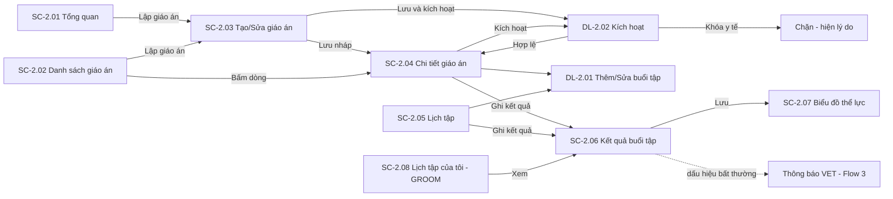
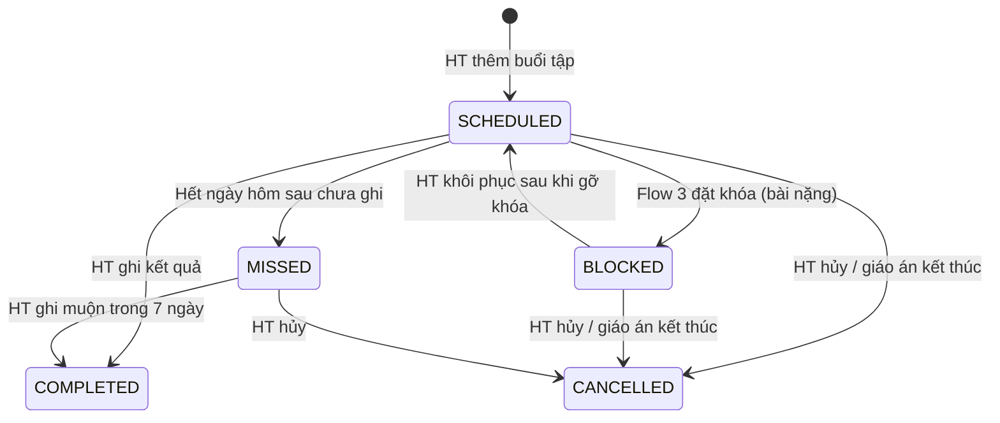

# ĐẶC TẢ LUỒNG & MÀN HÌNH – FLOW 2: LẬP & THỰC HIỆN GIÁO ÁN HUẤN LUYỆN

**Dự án:** RACEHORSE_TRAINING · **Bản:** 1.0

**Quy ước mã:** `SC-2.xx` = màn hình, `DL-2.xx` = dialog, `BTN-2.xx` = nút, `FR-2.xx` = chức năng, `Q-2.xx` = câu hỏi mở (Mục 9). Mã của Flow 1 (`SC-1.xx`, `DL-1.xx`) được dẫn chiếu khi cần.
**Vai trò:** CM = Club Manager · HT = Head Trainer · VET = Veterinarian · GROOM = Groom / Stable Hand · OWNER = Horse Owner.
**Quy ước hiển thị chung:** ngày `dd/MM/yyyy`, giờ `HH:mm`, giờ Việt Nam (UTC+7); cự ly theo mét (m), tốc độ km/h, nhịp tim nhịp/phút (bpm), thời gian chạy `mm:ss.s`. Breakpoint: Mobile < 768px · Tablet 768–1199px · Desktop ≥ 1200px.

---

## 1. Mục tiêu và phạm vi

**Mục tiêu:** HT lập giáo án khoa học theo giai đoạn cho từng con ngựa, xếp lịch tập hằng ngày, giám sát và đánh giá từng buổi tập; hệ thống tự kiểm tra sức khỏe và tuyệt đối không cho xếp bài tập nặng khi ngựa đang Khóa huấn luyện.

| Làm (In scope) | Nguồn |
|---|---|
| Lập giáo án theo giai đoạn: cự ly, khối lượng bài tập, tốc độ mục tiêu, mặt sân (Cỏ / Cát / Hỗn hợp) | Tài liệu gốc – gạch 1 |
| Kiểm tra trạng thái sức khỏe trước khi áp dụng giáo án; chặn xếp lịch khi có Khóa huấn luyện | Tài liệu gốc – gạch 2 |
| Phân công lịch tập hằng ngày cho nhân viên chăm sóc, nài ngựa; điều phối lượt chạy thử | Tài liệu gốc – gạch 3 |
| Đánh giá phong độ, ghi chỉ số và nhận xét sau buổi tập; tự cập nhật biểu đồ thể lực | Tài liệu gốc – gạch 4 |
| Bảng tiến độ và biểu đồ thể lực tổng quan toàn câu lạc bộ | Mục 2 – vai trò HT |
| OWNER xem lịch trình tập và nhận xét của HT | Mục 2 – vai trò OWNER |
| Báo dấu hiệu bất thường sau buổi tập tới VET | [BỔ SUNG] – nối Flow 2 với Flow 3 để phát hiện chấn thương sớm |
| Nhân bản giáo án | [BỔ SUNG] – giảm thao tác khi nhiều ngựa dùng giáo án giống nhau |
| Tự đánh dấu buổi tập "Bỏ lỡ" | [BỔ SUNG] – giữ lịch tập đúng thực tế |

| Không làm (Out of scope) | Thuộc về |
|---|---|
| Đặt / gỡ Khóa huấn luyện | Flow 3 |
| Đổi trạng thái vòng đời ngựa (ngoài lối tắt khi kích hoạt giáo án) | Flow 1 |
| Đăng ký giải đua | Flow 5 (Flow 2 chỉ cho chọn "giải mục tiêu" để tham khảo) |
| Gợi ý giáo án bằng AI, dự báo chấn thương | Flow 6 |
| Kết nối thiết bị đo nhịp tim / GPS tự động | Không có trong tài liệu gốc; chỉ số nhập tay (Q-2.05) |
| Tài khoản nài ngựa | Nài ngựa không nằm trong 5 vai trò; chỉ lưu tên dạng text (Q-2.03) |

---

## 2. Vai trò và quyền

**Phạm vi dữ liệu:** *Tất cả* = mọi ngựa chưa xóa · *Được giao* = buổi tập GROOM được phân công hoặc ngựa GROOM đang chăm sóc (Flow 1) · *Sở hữu* = ngựa OWNER đang sở hữu.

| Chức năng | CM | HT | VET | GROOM | OWNER |
|---|---|---|---|---|---|
| Xem Tổng quan huấn luyện | Xem | Xem | Xem | — | — |
| Xem danh sách, chi tiết giáo án | Tất cả | Tất cả | Tất cả | — | Sở hữu |
| Tạo, sửa, kích hoạt, hoàn thành, hủy, nhân bản giáo án | — | Có | — | — | — |
| Thêm, sửa, hủy, khôi phục buổi tập | — | Có | — | — | — |
| Xem lịch tập (ngày/tuần), lượt chạy thử | Tất cả | Tất cả | Tất cả | — | — |
| Xem "Lịch tập của tôi" | — | — | — | Được giao | — |
| Ghi / sửa kết quả và nhận xét buổi tập | — | Có | — | — | — |
| Xem kết quả và nhận xét buổi tập | Tất cả | Tất cả | Tất cả | Được giao (không xem điểm phong độ) | Sở hữu |
| Xem biểu đồ thể lực | Tất cả | Tất cả | Tất cả | — | Sở hữu |
| Nhận cảnh báo dấu hiệu bất thường | — | Có | Có | — | — |

---

## 3. Sơ đồ luồng tổng thể

### 3.1 Danh sách màn hình

| Mã | Tên màn hình | URL | Vai trò |
|---|---|---|---|
| SC-2.01 | Tổng quan huấn luyện | `/training` | CM, HT, VET |
| SC-2.02 | Danh sách giáo án | `/training/plans` | CM, HT, VET, OWNER |
| SC-2.03 | Tạo / Sửa giáo án | `/training/plans/new`, `/training/plans/:id/edit` | HT |
| SC-2.04 | Chi tiết giáo án | `/training/plans/:id` | CM, HT, VET, OWNER |
| SC-2.05 | Lịch tập | `/training/schedule` | CM, HT, VET |
| SC-2.06 | Kết quả buổi tập | `/training/sessions/:id/result` | CM, HT, VET (xem); HT (ghi); OWNER (xem, ngựa sở hữu); GROOM (xem, được giao) |
| SC-2.07 | Biểu đồ thể lực ngựa | `/horses/:id/fitness` | CM, HT, VET, OWNER |
| SC-2.08 | Lịch tập của tôi | `/my/training` | GROOM |

Vào URL không có quyền → trang "Bạn không có quyền truy cập chức năng này" + nút **Về trang chủ**. Mở giáo án/buổi tập ngoài phạm vi → "Không tìm thấy dữ liệu hoặc bạn không có quyền xem."

### 3.2 Các luồng chính

**L1 – Lập và áp dụng giáo án (HT)**
1. HT mở SC-2.01 hoặc SC-2.02 → **Lập giáo án** → SC-2.03.
2. Chọn ngựa, nhập thông tin chung, thêm các giai đoạn → **Lưu nháp** → SC-2.04 (trạng thái Nháp).
3. Tab "Buổi tập" → **Thêm buổi tập** (DL-2.01) cho từng giai đoạn; có thể lặp lại hằng tuần.
4. **Kích hoạt** (DL-2.02) → hệ thống kiểm tra sức khỏe: đang Khóa huấn luyện → chặn; ngựa ở trạng thái y tế → cảnh báo; hợp lệ → giáo án chuyển Đang áp dụng.

**L2 – Xếp lịch và phân công hằng ngày (HT)**
1. HT mở SC-2.05 (Lịch tập, chế độ Ngày) → thấy mọi buổi tập của ngày theo khung giờ.
2. Thêm/sửa buổi tập, chọn nhân viên chăm sóc và nài ngựa; tab "Lượt chạy thử" để điều phối các lượt chạy thử theo mặt sân.
3. GROOM mở SC-2.08 trên điện thoại để xem buổi tập mình phụ trách.

**L3 – Ghi kết quả và đánh giá (HT)**
1. Sau buổi tập, HT bấm **Ghi kết quả** tại SC-2.04 hoặc SC-2.05 → SC-2.06.
2. Nhập chỉ số, điểm phong độ, nhận xét; tích dấu hiệu bất thường nếu có → **Lưu kết quả**.
3. Biểu đồ thể lực (SC-2.07) tự cập nhật; nếu có dấu hiệu bất thường → VET nhận thông báo.

**L4 – Khi VET đặt Khóa huấn luyện (tự động)**
1. Flow 3 đặt khóa → mọi buổi tập nặng chưa diễn ra của ngựa chuyển "Bị chặn – Khóa y tế"; banner đỏ hiện ở SC-2.04.
2. Sau khi Flow 3 gỡ khóa → HT bấm **Khôi phục lịch** (DL-2.07) cho từng buổi bị chặn hoặc hủy chúng.

**L5 – Kết thúc giáo án (HT)**: SC-2.04 → **Hoàn thành** (DL-2.04) hoặc **Hủy giáo án** (DL-2.03).

**L6 – Chủ sở hữu theo dõi (OWNER)**: SC-2.02 (ngựa của mình) → SC-2.04 → xem buổi tập và nhận xét → SC-2.07 xem biểu đồ.

---

## 4. Vòng đời trạng thái

### 4.1 Trạng thái giáo án

| Mã | Nhãn | Màu badge | Ý nghĩa |
|---|---|---|---|
| DRAFT | Nháp | Xám | Đang soạn, chưa áp dụng |
| ACTIVE | Đang áp dụng | Xanh dương | Đang thực hiện |
| COMPLETED | Hoàn thành | Xanh lá | Kết thúc đúng kế hoạch |
| CANCELLED | Đã hủy | Xám đậm | Dừng giữa chừng |

| Từ | Đến | Ai | Điều kiện | Bị chặn khi | Tác dụng phụ |
|---|---|---|---|---|---|
| (Tạo mới) | Nháp | HT | Có ít nhất 1 giai đoạn | Ngựa Ngừng quản lý | — |
| Nháp | Đang áp dụng | HT | Có ít nhất 1 buổi tập; Ngày kết thúc ≥ hôm nay; ngựa chưa có giáo án Đang áp dụng khác | Ngựa đang Khóa huấn luyện; ngựa Ngừng quản lý | Nếu ngựa đang Nghỉ ngơi: tùy chọn chuyển ngựa sang Đang tập luyện (Flow 1) |
| Đang áp dụng | Hoàn thành | HT | — | — | Buổi tập chưa diễn ra chuyển Đã hủy |
| Nháp, Đang áp dụng | Đã hủy | HT | Lý do 10–500 ký tự | — | Buổi tập chưa diễn ra chuyển Đã hủy |
| Đang áp dụng | Hoàn thành | Hệ thống | Qua ngày kết thúc 1 ngày | — | Thông báo HT |
| Đang áp dụng | Đã hủy | Hệ thống | Ngựa bị Ngừng quản lý (Flow 1) | — | Buổi tập chưa diễn ra chuyển Đã hủy |

### 4.2 Trạng thái buổi tập

| Mã | Nhãn | Màu badge |
|---|---|---|
| SCHEDULED | Đã lên lịch | Xanh dương |
| COMPLETED | Hoàn thành | Xanh lá |
| BLOCKED | Bị chặn – Khóa y tế | Đỏ, icon ổ khóa |
| MISSED | Bỏ lỡ | Cam |
| CANCELLED | Đã hủy | Xám |

| Từ | Đến | Ai | Điều kiện / Tác dụng |
|---|---|---|---|
| (Tạo mới) | Đã lên lịch | HT | Qua mọi kiểm tra ở DL-2.01 |
| Đã lên lịch | Hoàn thành | HT | Ghi kết quả (SC-2.06); chỉ khi thời điểm bắt đầu ≤ hiện tại |
| Đã lên lịch | Bị chặn – Khóa y tế | Hệ thống | Flow 3 đặt khóa và buổi tập là **bài tập nặng** |
| Bị chặn – Khóa y tế | Đã lên lịch | HT | Khóa đã gỡ; ngày buổi tập ≥ hôm nay (có thể đổi ngày giờ trong DL-2.07) |
| Đã lên lịch | Bỏ lỡ | Hệ thống | Hết ngày hôm sau của ngày tập mà chưa ghi kết quả |
| Bỏ lỡ | Hoàn thành | HT | Ghi kết quả muộn trong 7 ngày kể từ ngày tập |
| Đã lên lịch, Bị chặn, Bỏ lỡ | Đã hủy | HT hoặc Hệ thống | HT hủy (DL-2.05) hoặc giáo án bị Hoàn thành/Hủy |

**Định nghĩa bài tập nặng:** buổi tập có Cường độ = Nặng, hoặc Loại bài tập là Chạy tốc độ hoặc Chạy thử (2 loại này luôn là Nặng).

**Quy tắc Medical Lock (ưu tiên cao nhất):** Khi ngựa đang Khóa huấn luyện:
- Không kích hoạt được giáo án.
- Không tạo, sửa, khôi phục được buổi tập nặng; lựa chọn Cường độ "Nặng" và các loại Chạy tốc độ, Chạy thử bị vô hiệu hóa trong DL-2.01.
- Buổi tập nhẹ và trung bình vẫn tạo được (ví dụ Đi bộ, Bơi phục hồi) (Q-2.01).
- Không vai trò nào vượt qua được, kể cả khi dữ liệu gửi từ nhiều tab trình duyệt cùng lúc; nếu HT đang mở DL-2.01 lúc khóa được đặt, bấm Lưu sẽ nhận lỗi "Ngựa đang bị Khóa huấn luyện y tế. Không thể xếp bài tập nặng."

---

## 5. Đặc tả màn hình

**Quy ước chung:** Đang tải: skeleton. Lỗi tải: khung "Không tải được dữ liệu" + **Thử lại**. Mất mạng: toast đỏ "Mất kết nối mạng. Vui lòng thử lại." Dữ liệu bị người khác sửa cùng lúc: toast "Dữ liệu đã được người khác cập nhật. Vui lòng tải lại trước khi lưu." + **Tải lại**. Nút không có quyền: ẩn. Nút bị chặn do trạng thái: hiện, vô hiệu hóa, tooltip ghi lý do.

### 5.1 SC-2.01 – Tổng quan huấn luyện

**Mục đích:** Bảng tiến độ và thể lực tổng quan toàn bộ chiến mã. **Vai trò:** CM, HT, VET.

**Bố cục:** Hàng thẻ chỉ số (4 thẻ) → Bảng ngựa. Tablet: thẻ 2 × 2. Mobile: thẻ xếp dọc, bảng thành danh sách thẻ.

**Thẻ chỉ số**

| Thẻ | Nội dung | Bấm vào |
|---|---|---|
| Giáo án đang áp dụng | Số giáo án Đang áp dụng / tổng số ngựa đang quản lý | SC-2.02 lọc Đang áp dụng |
| Buổi tập hôm nay | "{đã hoàn thành}/{tổng}" | SC-2.05 chế độ Ngày, hôm nay |
| Bị chặn do Khóa y tế | Số buổi Bị chặn trong 7 ngày tới | SC-2.05 lọc Bị chặn |
| Tăng tải đột ngột | Số ngựa có tải tập 7 ngày gần nhất > 130% trung bình tuần của 4 tuần trước | Bảng bên dưới lọc theo cờ này |

**Bộ lọc bảng:** Tìm ngựa (tên/mã) · Trạng thái ngựa (chọn nhiều) · Trạng thái giáo án (Có giáo án đang áp dụng / Chưa có) · Chỉ ngựa tăng tải đột ngột (checkbox).

**Bảng ngựa**

| Cột | Hiển thị | Sắp xếp |
|---|---|---|
| Ngựa | Tên + Mã; badge trạng thái Flow 1; icon ổ khóa nếu đang khóa | Có |
| Giáo án hiện tại | Tên giáo án hoặc "Chưa có" | Không |
| Giai đoạn hiện tại | Tên giai đoạn, "Tuần {x}/{y}" | Không |
| Tiến độ | Thanh %: số buổi Hoàn thành / số buổi đã đến hạn | Có |
| Phong độ gần nhất | Điểm 1–10 của buổi gần nhất; mũi tên ▲▼ so với trung bình 3 buổi trước | Có |
| Tải 7 ngày | Điểm tải; chữ cam + nhãn "Tăng đột ngột" khi vượt 130% | Có |
| Buổi tiếp theo | `dd/MM HH:mm` – Loại bài tập | Có |
| Hành động | Xem giáo án · Xem biểu đồ | — |

**Điểm tải** của một buổi = Cự ly (km) × Số hiệp × Hệ số cường độ (Nhẹ = 1, Trung bình = 2, Nặng = 3). Tải 7 ngày = tổng điểm tải các buổi Hoàn thành trong 7 ngày gần nhất.

**Nút**

| Mã | Nút | Vai trò | Hành vi |
|---|---|---|---|
| BTN-2.01 | Lập giáo án | HT | Mở SC-2.03 |
| BTN-2.02 | Xem lịch tập hôm nay | CM, HT, VET | Mở SC-2.05 chế độ Ngày |
| BTN-2.03 | Xem biểu đồ (mỗi dòng) | CM, HT, VET | Mở SC-2.07 của ngựa |
| BTN-2.04 | Xem giáo án (mỗi dòng) | CM, HT, VET | Mở SC-2.04; vô hiệu hóa khi "Chưa có" |

**Trạng thái giao diện:** Chưa có ngựa: "Chưa có ngựa nào để theo dõi." Rỗng theo bộ lọc: "Không có ngựa phù hợp bộ lọc."

### 5.2 SC-2.02 – Danh sách giáo án

**Mục đích:** Tìm và mở giáo án. **Vai trò:** CM, HT, VET (tất cả); OWNER (ngựa sở hữu).

**Bộ lọc**

| Nhãn | Loại | Mặc định |
|---|---|---|
| Tìm kiếm | Ô text, placeholder "Tên giáo án, mã giáo án, tên ngựa" | Rỗng |
| Trạng thái giáo án | Chọn nhiều: Nháp, Đang áp dụng, Hoàn thành, Đã hủy | Nháp + Đang áp dụng |
| Ngựa | Dropdown có tìm kiếm | Tất cả |
| Khoảng thời gian | Từ ngày – Đến ngày (giáo án giao với khoảng này) | Trống |

**Bảng**

| Cột | Hiển thị | Sắp xếp |
|---|---|---|
| Mã giáo án | `GA-000045` | Có |
| Tên giáo án | Text | Có |
| Ngựa | Tên + badge Khóa huấn luyện nếu có | Có |
| Thời gian | `dd/MM/yyyy – dd/MM/yyyy` | Có (mặc định Ngày bắt đầu mới nhất) |
| Số giai đoạn | Số | Không |
| Tiến độ | Thanh %, như SC-2.01 | Có |
| Trạng thái | Badge Mục 4.1 | Có |
| Người lập | Họ tên HT | Không |
| Hành động | Xem · Nhân bản (HT) | — |

Phân trang 20 dòng/trang (20/50/100). Mobile: danh sách thẻ.

**Nút**

| Mã | Nút | Vai trò | Hành vi |
|---|---|---|---|
| BTN-2.05 | Lập giáo án | HT | Mở SC-2.03 |
| BTN-2.06 | Xóa bộ lọc | Tất cả | Bộ lọc về mặc định |
| BTN-2.07 | Xem (mỗi dòng) / bấm dòng | Tất cả | Mở SC-2.04 |
| BTN-2.08 | Nhân bản (mỗi dòng) | HT | Mở DL-2.08 |

**Trạng thái giao diện:** Rỗng: "Chưa có giáo án nào." (HT thấy thêm nút Lập giáo án). OWNER không có ngựa: "Chưa có ngựa nào thuộc sở hữu của bạn."

### 5.3 SC-2.03 – Tạo / Sửa giáo án

**Mục đích:** Nhập thông tin chung và các giai đoạn của giáo án. **Vai trò:** HT. Chỉ sửa được giáo án Nháp hoặc Đang áp dụng.

**Bố cục:** Khối "Thông tin chung" → Khối "Giai đoạn" (danh sách thẻ, mỗi thẻ một giai đoạn) → thanh nút cố định cuối màn hình. Desktop: form 2 cột; Tablet, Mobile: 1 cột.

**Khối Thông tin chung**

| Nhãn | Loại | Bắt buộc | Quy tắc | Thông báo lỗi |
|---|---|---|---|---|
| Mã giáo án | Chỉ đọc | — | Tự sinh `GA-` + 6 số khi lưu | — |
| Ngựa | Dropdown có tìm kiếm; mỗi mục hiện tên + badge trạng thái + icon khóa | Có; chỉ đọc khi sửa | Ngựa không Ngừng quản lý | "Vui lòng chọn ngựa." / "Ngựa đã ngừng quản lý." |
| Tên giáo án | Text | Có | 3–150 ký tự | "Tên giáo án là bắt buộc." / "Tên giáo án phải từ 3 đến 150 ký tự." |
| Mục tiêu | Textarea | Có | 10–1000 ký tự | "Vui lòng nhập mục tiêu." / "Mục tiêu phải từ 10 đến 1000 ký tự." |
| Giải mục tiêu | Dropdown giải đua còn hạn đăng ký (Flow 5) | Không | Chỉ để tham khảo, không tự đăng ký | — |
| Ngày bắt đầu | Date picker | Có | Khi tạo: ≥ hôm nay trừ 7 ngày | "Ngày bắt đầu là bắt buộc." / "Ngày bắt đầu không được sớm hơn 7 ngày trước." |
| Ngày kết thúc | Date picker | Có | ≥ Ngày bắt đầu; thời lượng tối đa 52 tuần | "Ngày kết thúc phải sau hoặc bằng ngày bắt đầu." / "Giáo án tối đa 52 tuần." |
| Ghi chú | Textarea | Không | ≤ 1000 ký tự | "Ghi chú tối đa 1000 ký tự." |

Khi chọn ngựa đang Khóa huấn luyện: khung đỏ "Ngựa đang bị Khóa huấn luyện. Bạn có thể soạn giáo án ở trạng thái Nháp nhưng chưa kích hoạt được." Khi ngựa ở trạng thái y tế không khóa: khung vàng "Ngựa đang ở trạng thái {Nhãn}."

**Khối Giai đoạn** (mỗi thẻ)

| Nhãn | Loại | Bắt buộc | Quy tắc | Thông báo lỗi |
|---|---|---|---|---|
| Tên giai đoạn | Text | Có | 2–100 ký tự | "Tên giai đoạn là bắt buộc." / "Tên giai đoạn phải từ 2 đến 100 ký tự." |
| Loại giai đoạn | Dropdown: Nền tảng thể lực / Tăng cường / Tốc độ / Duy trì trước thi đấu / Phục hồi | Có | | "Vui lòng chọn loại giai đoạn." |
| Từ ngày – Đến ngày | 2 date picker | Có | Nằm trong thời gian giáo án; không chồng lên giai đoạn khác; Đến ngày ≥ Từ ngày | "Giai đoạn phải nằm trong thời gian của giáo án." / "Giai đoạn bị trùng thời gian với giai đoạn {Tên}." |
| Mục tiêu giai đoạn | Textarea | Không | ≤ 500 ký tự | "Mục tiêu tối đa 500 ký tự." |
| Số buổi mỗi tuần (định mức) | Số nguyên | Có | 1–14 | "Số buổi mỗi tuần phải từ 1 đến 14." |
| Cự ly tối đa mỗi tuần (m) | Số nguyên | Có | 500–60 000 | "Cự ly tối đa mỗi tuần phải từ 500 đến 60 000 m." |
| Mặt sân chính | Dropdown: Cỏ / Cát / Hỗn hợp | Có | | "Vui lòng chọn mặt sân." |
| Tốc độ mục tiêu (km/h) | Số, 1 chữ số thập phân | Không | 10,0–70,0 | "Tốc độ mục tiêu phải từ 10 đến 70 km/h." |

Giai đoạn tự sắp xếp theo Từ ngày. Tối thiểu 1 giai đoạn: "Giáo án phải có ít nhất 1 giai đoạn." Tối đa 12 giai đoạn. Khi sửa giáo án Đang áp dụng: giai đoạn đã có buổi tập Hoàn thành không xóa được và không đổi được Từ ngày ("Giai đoạn đã có buổi tập hoàn thành.").

**Nút**

| Mã | Nút | Hành vi |
|---|---|---|
| BTN-2.09 | Thêm giai đoạn | Thêm thẻ giai đoạn mới; Từ ngày gợi ý = Đến ngày của giai đoạn trước + 1. Vô hiệu hóa khi đủ 12 giai đoạn |
| BTN-2.10 | Xóa giai đoạn (mỗi thẻ) | Giai đoạn đã có buổi tập: hộp xác nhận "Xóa giai đoạn sẽ xóa {n} buổi tập chưa diễn ra trong giai đoạn. Tiếp tục?" |
| BTN-2.11 | Lưu nháp / Lưu | Lưu → toast "Đã lưu giáo án." → SC-2.04. Nhãn là "Lưu" khi sửa giáo án Đang áp dụng |
| BTN-2.12 | Lưu và kích hoạt | Chỉ khi tạo mới hoặc sửa giáo án Nháp. Lưu → mở DL-2.02 |
| BTN-2.13 | Hủy | Quay lại; có thay đổi chưa lưu → DL-2.09 |

### 5.4 SC-2.04 – Chi tiết giáo án

**Mục đích:** Xem, quản lý giai đoạn, buổi tập và nhận xét của một giáo án. **Vai trò:** CM, HT, VET, OWNER (ngựa sở hữu).

**Bố cục**
- **Header:** Tên giáo án, Mã, badge trạng thái giáo án, Ngựa (link sang SC-1.03), thời gian, thanh tiến độ, thanh nút. Mobile: nút phụ gom vào menu "⋯".
- **Banner Khóa huấn luyện** (khi ngựa đang khóa): nền đỏ "Ngựa đang bị Khóa huấn luyện y tế từ {ngày giờ}. Các buổi tập nặng đã bị chặn và không thể xếp thêm cho đến khi Bác sĩ thú y mở khóa."
- **Banner trạng thái y tế** (ngựa ở Cần theo dõi / Chấn thương / Cách ly nhưng không khóa): nền vàng "Ngựa đang ở trạng thái {Nhãn}. Hãy cân nhắc trước khi xếp bài tập nặng."
- **3 tab:** Giai đoạn · Buổi tập · Nhật ký nhận xét.

**Nút trên header**

| Mã | Nút | Vai trò | Hiện khi | Vô hiệu hóa khi (lý do) | Hành vi |
|---|---|---|---|---|---|
| BTN-2.14 | Sửa giáo án | HT | Nháp, Đang áp dụng | — | Mở SC-2.03 |
| BTN-2.15 | Kích hoạt | HT | Nháp | Ngựa đang khóa ("Ngựa đang bị Khóa huấn luyện y tế."); chưa có buổi tập ("Giáo án chưa có buổi tập nào.") | Mở DL-2.02 |
| BTN-2.16 | Hoàn thành | HT | Đang áp dụng | — | Mở DL-2.04 |
| BTN-2.17 | Hủy giáo án | HT | Nháp, Đang áp dụng | — | Mở DL-2.03 |
| BTN-2.18 | Nhân bản | HT | Mọi trạng thái | — | Mở DL-2.08 |
| BTN-2.25 | Xem biểu đồ thể lực | CM, HT, VET, OWNER | Mọi trạng thái | — | Mở SC-2.07 |

**Tab Giai đoạn:** dòng thời gian ngang (Desktop) hoặc danh sách dọc (Mobile); mỗi giai đoạn hiện: Tên, Loại, Từ – Đến, Mục tiêu, Định mức (số buổi/tuần, cự ly tối đa/tuần, mặt sân, tốc độ mục tiêu), Thực tế (số buổi hoàn thành, tổng cự ly đã chạy). Giai đoạn đang diễn ra có viền đậm và nhãn "Hiện tại". Tuần có cự ly thực tế vượt định mức hiện nhãn cam "Vượt định mức".

**Tab Buổi tập**

Bộ lọc: Giai đoạn · Trạng thái buổi tập (chọn nhiều) · Khoảng ngày · Loại bài tập.

| Cột | Hiển thị | Sắp xếp |
|---|---|---|
| Ngày giờ | `dd/MM/yyyy HH:mm` | Có (mặc định tăng dần) |
| Giai đoạn | Tên | Không |
| Loại bài tập | Nhãn + badge "Nặng" đỏ nhạt nếu là bài tập nặng | Có |
| Cường độ | Nhẹ / Trung bình / Nặng | Có |
| Cự ly × Số hiệp | "1 200 m × 2" | Không |
| Tốc độ mục tiêu | "45,0 km/h" hoặc "—" | Không |
| Mặt sân | Cỏ / Cát / Hỗn hợp / Không áp dụng | Không |
| Nài ngựa | Text hoặc "—" | Không |
| Nhân viên chăm sóc | Họ tên | Không |
| Trạng thái | Badge Mục 4.2 | Có |
| Kết quả | Điểm phong độ và tốc độ TB nếu Hoàn thành | Không |
| Hành động | Theo bảng dưới | — |

Phân trang 30 dòng. Mobile: danh sách thẻ nhóm theo ngày.

| Mã | Nút | Vai trò | Hiện khi | Vô hiệu hóa khi (lý do) | Hành vi |
|---|---|---|---|---|---|
| BTN-2.19 | Thêm buổi tập | HT | Giáo án Nháp, Đang áp dụng | — | Mở DL-2.01 |
| BTN-2.20 | Sửa (mỗi dòng) | HT | Đã lên lịch và thời điểm bắt đầu > hiện tại | — | Mở DL-2.01 chế độ sửa |
| BTN-2.21 | Hủy buổi (mỗi dòng) | HT | Đã lên lịch, Bị chặn, Bỏ lỡ | — | Mở DL-2.05 |
| BTN-2.22 | Ghi kết quả (mỗi dòng) | HT | Đã lên lịch và thời điểm bắt đầu ≤ hiện tại; Bỏ lỡ trong 7 ngày | — | Mở SC-2.06 chế độ ghi |
| BTN-2.23 | Xem kết quả (mỗi dòng) | Mọi vai trò được vào | Hoàn thành | — | Mở SC-2.06 chế độ xem |
| BTN-2.24 | Khôi phục lịch (mỗi dòng) | HT | Bị chặn | Ngựa vẫn đang khóa ("Ngựa vẫn đang bị Khóa huấn luyện y tế.") | Mở DL-2.07 |

Rỗng: "Chưa có buổi tập nào." (HT thấy thêm nút Thêm buổi tập).

**Tab Nhật ký nhận xét:** danh sách nhận xét của các buổi tập Hoàn thành, mới nhất trên cùng. Mỗi mục: ngày giờ, loại bài tập, điểm phong độ (ẩn với GROOM), nhận xét chuyên môn, người ghi, nhãn đỏ "Có dấu hiệu bất thường" nếu có. Nút **Tải thêm** (mỗi lần 20 mục). Rỗng: "Chưa có nhận xét nào."

**Khác biệt theo vai trò:** CM, VET, OWNER chỉ xem: ẩn BTN-2.14 → BTN-2.22, BTN-2.24.

### 5.5 SC-2.05 – Lịch tập

**Mục đích:** Xem và điều phối toàn bộ buổi tập trong ngày/tuần; phân công nhân viên chăm sóc, nài ngựa; điều phối lượt chạy thử. **Vai trò:** CM, HT, VET (HT thao tác, CM và VET chỉ xem).

**Bố cục:** Thanh công cụ (điều hướng ngày, chế độ xem, bộ lọc) → 2 tab: **Lịch tập** và **Lượt chạy thử**.

**Thanh công cụ**

| Mã | Thành phần | Loại | Mặc định | Hành vi |
|---|---|---|---|---|
| BTN-2.26 | Hôm nay | Nút | — | Về ngày/tuần hiện tại |
| BTN-2.27 | Kỳ trước | Nút mũi tên | — | Lùi 1 ngày hoặc 1 tuần |
| BTN-2.28 | Kỳ sau | Nút mũi tên | — | Tiến 1 ngày hoặc 1 tuần |
| BTN-2.29 | Ngày / Tuần | Nút chuyển chế độ | Ngày (Mobile chỉ có Ngày) | Đổi cách hiển thị |
| — | Chọn ngày | Date picker | Hôm nay | Nhảy tới ngày |
| — | Bộ lọc | Ngựa (chọn nhiều), Nhân viên chăm sóc, Mặt sân, Loại bài tập, Trạng thái buổi tập | Tất cả | Lọc lưới lịch |
| BTN-2.30 | Thêm buổi tập | Nút | — | HT; mở DL-2.01 có ô chọn Ngựa, ngày giờ điền sẵn theo ô lịch đang chọn |

**Tab Lịch tập**
- Chế độ Ngày (Desktop, Tablet): trục dọc là giờ từ 04:00 đến 20:00 (bước 30 phút), trục ngang là mặt sân (Cỏ, Cát, Hỗn hợp, Không áp dụng). Mỗi buổi tập là một khối màu theo trạng thái, hiện: Tên ngựa, Loại bài tập, Cự ly, Nhân viên chăm sóc, icon nặng.
- Chế độ Tuần: 7 cột ngày, mỗi ô ngày liệt kê buổi tập theo giờ.
- Mobile: danh sách buổi tập của ngày, nhóm theo giờ.
- Bấm một buổi tập → panel chi tiết (Desktop bên phải, Mobile bottom sheet): đủ thông tin buổi + các nút BTN-2.20, BTN-2.21, BTN-2.22, BTN-2.23, BTN-2.24 theo cùng điều kiện ở SC-2.04, và link **Mở giáo án** (SC-2.04).
- Cảnh báo trên lưới: nhân viên chăm sóc có 2 buổi trùng giờ → cả 2 khối có viền cam và icon cảnh báo "Nhân viên {Họ tên} có 2 buổi tập trùng giờ."

**Tab Lượt chạy thử**
Danh sách buổi tập loại Chạy thử của ngày đang chọn, nhóm theo mặt sân, sắp theo giờ.

| Cột | Hiển thị |
|---|---|
| Giờ | `HH:mm – HH:mm` (khung 15 phút) |
| Mặt sân | Cỏ / Cát / Hỗn hợp |
| Ngựa | Tên + badge trạng thái |
| Cự ly | m |
| Tốc độ mục tiêu | km/h |
| Nài ngựa | Text |
| Trạng thái | Badge |
| Hành động | Sửa (BTN-2.20), Hủy (BTN-2.21), Ghi kết quả (BTN-2.22) |

Quy tắc điều phối: mỗi mặt sân chỉ có 1 lượt chạy thử trong cùng khung 15 phút (Q-2.04). Rỗng: "Không có lượt chạy thử nào trong ngày."

**Trạng thái giao diện:** Ngày không có buổi tập: "Không có buổi tập nào trong ngày {dd/MM/yyyy}."

### 5.6 SC-2.06 – Kết quả buổi tập

**Mục đích:** Ghi chỉ số, đánh giá phong độ, nhận xét chuyên môn; xem lại kết quả. **Vai trò:** HT ghi/sửa; CM, VET xem; OWNER xem (ngựa sở hữu); GROOM xem (buổi được giao, không thấy điểm phong độ).

**Bố cục:** Khối "Thông tin buổi tập" (chỉ đọc: ngựa, ngày giờ, loại, cường độ, cự ly × số hiệp, tốc độ mục tiêu, mặt sân, nài ngựa, nhân viên chăm sóc) → Khối "Chỉ số thực tế" → Khối "Đánh giá" → thanh nút. Mobile: 1 cột, bàn phím số cho ô số.

**Khối Chỉ số thực tế**

| Nhãn | Loại | Bắt buộc | Quy tắc | Thông báo lỗi |
|---|---|---|---|---|
| Cự ly thực tế (m) | Số nguyên, mặc định = cự ly kế hoạch × số hiệp | Có | 50–10 000 | "Cự ly thực tế phải từ 50 đến 10 000 m." |
| Thời gian chạy | Ô `mm:ss.s` | Có, trừ loại Đi bộ, Bơi phục hồi, Máy đi bộ | 00:05.0 – 59:59.9 | "Thời gian chạy là bắt buộc." / "Thời gian chạy không hợp lệ (định dạng mm:ss.s)." |
| Tốc độ trung bình (km/h) | Chỉ đọc, tự tính = Cự ly ÷ Thời gian | — | Hiện cảnh báo vàng nếu > 75 km/h: "Tốc độ tính ra bất thường, vui lòng kiểm tra lại cự ly và thời gian." | — |
| Mặt sân thực tế | Dropdown, mặc định theo kế hoạch | Có | | "Vui lòng chọn mặt sân." |
| Tình trạng mặt sân | Dropdown: Tốt / Mềm / Nặng / Cứng | Không | | — |
| Nhịp tim tối đa (bpm) | Số nguyên | Không | 20–260 | "Nhịp tim tối đa phải từ 20 đến 260 bpm." |
| Nhịp tim sau 10 phút nghỉ (bpm) | Số nguyên | Không | 20–200; ≤ Nhịp tim tối đa | "Nhịp tim sau 10 phút phải từ 20 đến 200 bpm." / "Nhịp tim sau 10 phút không được lớn hơn nhịp tim tối đa." |

**Khối Đánh giá**

| Nhãn | Loại | Bắt buộc | Quy tắc | Thông báo lỗi |
|---|---|---|---|---|
| Điểm phong độ | Thanh chọn 1–10 | Có | Số nguyên | "Vui lòng chấm điểm phong độ." |
| Mức hoàn thành | Radio: Đạt / Đạt một phần / Không đạt | Có | | "Vui lòng chọn mức hoàn thành." |
| Nhận xét chuyên môn | Textarea, bộ đếm | Có | 10–2000 ký tự | "Vui lòng nhập nhận xét." / "Nhận xét phải từ 10 đến 2000 ký tự." |
| Dấu hiệu bất thường | Checkbox nhiều: Đi khập khiễng · Thở gấp kéo dài · Chảy máu mũi · Sưng/nóng chân · Bỏ ăn sau tập · Khác | Không | | — |
| Mô tả dấu hiệu | Textarea; hiện khi có ít nhất 1 dấu hiệu | Có khi hiện | 10–500 ký tự | "Vui lòng mô tả dấu hiệu bất thường." |

Khi tích dấu hiệu bất thường: khung vàng "VET và HT sẽ nhận thông báo ngay khi lưu. Việc khóa huấn luyện do Bác sĩ thú y quyết định."

**Nút**

| Mã | Nút | Vai trò | Hiện khi | Hành vi |
|---|---|---|---|---|
| BTN-2.31 | Lưu kết quả | HT | Chế độ ghi hoặc sửa | Lưu → buổi tập chuyển Hoàn thành → toast "Đã lưu kết quả buổi tập." → quay lại màn hình trước; biểu đồ SC-2.07 cập nhật |
| BTN-2.32 | Hủy | HT | Chế độ ghi hoặc sửa | Quay lại; có thay đổi chưa lưu → DL-2.09 |
| BTN-2.33 | Sửa kết quả | HT | Chế độ xem, trong 48 giờ kể từ lần lưu đầu | Chuyển sang chế độ sửa. Quá 48 giờ: nút vô hiệu hóa, tooltip "Chỉ sửa được kết quả trong 48 giờ sau khi ghi." |

Chế độ xem hiện thêm: Người ghi, Thời điểm ghi, Người sửa cuối, Thời điểm sửa cuối.
**Lỗi server:** "Buổi tập chưa đến giờ bắt đầu." / "Buổi tập đã bị hủy." / "Đã quá 7 ngày, không thể ghi kết quả cho buổi tập bỏ lỡ."

### 5.7 SC-2.07 – Biểu đồ thể lực ngựa

**Mục đích:** Theo dõi diễn biến thể lực và phong độ theo thời gian; tự cập nhật khi có kết quả mới. **Vai trò:** CM, HT, VET, OWNER (ngựa sở hữu).

**Bố cục:** Header (tên ngựa, badge trạng thái, badge khóa) → thanh chọn khoảng thời gian và chỉ số → 4 thẻ số liệu → biểu đồ → bảng dữ liệu bên dưới biểu đồ. Mobile: biểu đồ cao 240px, mỗi lần 1 chỉ số.

**Điều khiển**

| Mã | Thành phần | Loại | Mặc định |
|---|---|---|---|
| BTN-2.34 | Khoảng thời gian | Nhóm nút: 4 tuần / 12 tuần / 26 tuần | 12 tuần |
| BTN-2.35 | Chỉ số hiển thị | Nhóm nút chọn nhiều: Tốc độ TB · Điểm phong độ · Nhịp tim tối đa · Nhịp tim sau 10 phút · Tải tập tuần | Tốc độ TB + Điểm phong độ |

**Thẻ số liệu:** Tốc độ TB tốt nhất (km/h, ngày đạt) · Điểm phong độ TB 4 buổi gần nhất · Nhịp tim sau 10 phút TB 4 buổi gần nhất · Tải tập 7 ngày (so sánh % với TB 4 tuần trước).

**Biểu đồ:** trục ngang là ngày; Tốc độ TB chỉ tính các buổi Chạy nước đại nhẹ, Chạy tốc độ, Chạy thử; Tải tập tuần hiển thị dạng cột theo tuần. Dải nền đỏ nhạt đánh dấu các khoảng thời gian ngựa bị Khóa huấn luyện; dải nền vàng nhạt đánh dấu trạng thái y tế. Di chuột/chạm vào điểm → tooltip: ngày, loại bài, giá trị, link xem kết quả (SC-2.06).

**Bảng dữ liệu:** Ngày · Loại bài · Cự ly · Thời gian · Tốc độ TB · Nhịp tim tối đa · Nhịp tim sau 10 phút · Điểm phong độ · Điểm tải. Sắp xếp theo ngày giảm dần; phân trang 20 dòng.

**Trạng thái giao diện:** Chưa có buổi tập hoàn thành: "Chưa có dữ liệu buổi tập để vẽ biểu đồ." Có ít hơn 3 buổi: hiện biểu đồ kèm ghi chú "Cần ít nhất 3 buổi tập để xem xu hướng."

### 5.8 SC-2.08 – Lịch tập của tôi (GROOM)

**Mục đích:** Nhân viên chăm sóc xem buổi tập được phân công trên điện thoại. **Vai trò:** GROOM.

**Bố cục (ưu tiên Mobile):** 3 tab ngang **Hôm nay** · **Ngày mai** · **7 ngày tới** (BTN-2.36) → danh sách thẻ theo giờ.

Mỗi thẻ: Giờ bắt đầu · Tên ngựa · Ô chuồng (Flow 1) · Loại bài tập + badge "Nặng" · Cự ly × Số hiệp · Mặt sân · Nài ngựa · Ghi chú chỉ dẫn của HT · badge trạng thái. Thẻ Bị chặn: nền đỏ nhạt, chữ "Buổi tập bị chặn do Khóa huấn luyện y tế – không dắt ngựa ra sân." Thẻ Đã hủy: gạch ngang.

| Mã | Nút | Hành vi |
|---|---|---|
| BTN-2.36 | Hôm nay / Ngày mai / 7 ngày tới | Đổi danh sách |
| BTN-2.37 | Xem chi tiết (mỗi thẻ) | Mở panel chi tiết buổi tập; buổi Hoàn thành có link xem kết quả (SC-2.06, không có điểm phong độ) |

**Trạng thái giao diện:** "Hôm nay bạn không có buổi tập nào được phân công." Dữ liệu tự làm mới mỗi 5 phút và khi kéo xuống (pull-to-refresh).

---

### 5.9 Dialog dùng chung

Quy ước: Desktop giữa màn hình rộng 640px; Mobile toàn màn hình. Nút chính bên phải. Nút chính vô hiệu hóa khi form chưa hợp lệ hoặc đang gửi. Bấm Hủy khi đã nhập → hỏi "Bỏ các thay đổi đã nhập?". Lỗi server hiện đầu dialog, giữ dữ liệu đã nhập.

#### DL-2.01 – Thêm / Sửa buổi tập

Mở từ BTN-2.19, BTN-2.20 (SC-2.04), BTN-2.30 (SC-2.05). Vai trò: HT.

| Nhãn | Loại | Bắt buộc | Quy tắc | Thông báo lỗi |
|---|---|---|---|---|
| Ngựa | Dropdown; chỉ hiện khi mở từ SC-2.05; chỉ ngựa có giáo án Nháp/Đang áp dụng | Có | | "Vui lòng chọn ngựa." / "Ngựa chưa có giáo án đang soạn hoặc đang áp dụng." |
| Giai đoạn | Dropdown các giai đoạn của giáo án | Có | Ngày tập phải nằm trong giai đoạn | "Vui lòng chọn giai đoạn." / "Ngày tập phải nằm trong giai đoạn {Tên} ({Từ} – {Đến})." |
| Ngày tập | Date picker | Có | ≥ hôm nay khi tạo | "Ngày tập là bắt buộc." / "Không thể xếp buổi tập vào ngày đã qua." |
| Giờ bắt đầu | Time picker bước 15 phút | Có | 04:00–20:00 | "Giờ bắt đầu phải từ 04:00 đến 20:00." |
| Loại bài tập | Dropdown: Đi bộ · Chạy nước kiệu · Chạy nước đại nhẹ · Chạy tốc độ · Chạy thử · Bơi phục hồi · Máy đi bộ | Có | Chạy tốc độ, Chạy thử bị vô hiệu hóa khi ngựa đang khóa | "Vui lòng chọn loại bài tập." |
| Cường độ | Radio: Nhẹ / Trung bình / Nặng | Có | Tự đặt Nặng và khóa lại khi chọn Chạy tốc độ, Chạy thử; "Nặng" vô hiệu hóa khi ngựa đang khóa | "Vui lòng chọn cường độ." |
| Cự ly mỗi hiệp (m) | Số nguyên | Có | 100–5000 | "Cự ly phải từ 100 đến 5000 m." |
| Số hiệp | Số nguyên | Có, mặc định 1 | 1–10 | "Số hiệp phải từ 1 đến 10." |
| Tốc độ mục tiêu (km/h) | Số 1 chữ số thập phân | Có với Chạy tốc độ, Chạy thử; không bắt buộc với loại khác | 10,0–70,0 | "Tốc độ mục tiêu là bắt buộc với bài chạy tốc độ và chạy thử." / "Tốc độ mục tiêu phải từ 10 đến 70 km/h." |
| Mặt sân | Dropdown: Cỏ / Cát / Hỗn hợp; tự đặt "Không áp dụng" và khóa với Bơi phục hồi, Máy đi bộ | Có | | "Vui lòng chọn mặt sân." |
| Nài ngựa | Text, gợi ý từ các tên đã nhập trước | Có với Chạy tốc độ, Chạy thử | 2–100 ký tự | "Vui lòng nhập tên nài ngựa." |
| Nhân viên chăm sóc | Dropdown: người đang chăm sóc ngựa (Flow 1) xếp trước, sau đó các GROOM khác | Có | GROOM đang hoạt động | "Vui lòng chọn nhân viên chăm sóc." |
| Ghi chú chỉ dẫn | Textarea | Không | ≤ 500 ký tự | "Ghi chú tối đa 500 ký tự." |
| Lặp lại hằng tuần | Checkbox; chỉ khi thêm mới | Không | | — |
| Các thứ trong tuần | Nhóm checkbox T2 → CN; hiện khi tích Lặp lại | Có khi hiện | Ít nhất 1 thứ | "Vui lòng chọn ít nhất 1 thứ trong tuần." |
| Lặp đến ngày | Date picker, mặc định = ngày kết thúc giai đoạn | Có khi hiện | ≤ ngày kết thúc giai đoạn; tối đa 60 buổi mỗi lần | "Lặp đến ngày không được sau ngày kết thúc giai đoạn." / "Mỗi lần chỉ tạo tối đa 60 buổi tập." |

**Kiểm tra tự động khi bấm Lưu (theo thứ tự ưu tiên)**
1. Ngựa đang Khóa huấn luyện và là bài tập nặng → chặn: "Ngựa đang bị Khóa huấn luyện y tế. Không thể xếp bài tập nặng."
2. Ngựa Ngừng quản lý → chặn: "Ngựa đã ngừng quản lý."
3. Lượt chạy thử trùng mặt sân trong cùng khung 15 phút → chặn: "Mặt sân {Tên} đã có lượt chạy thử của {Ngựa} lúc {HH:mm}."
4. Ngựa đã có 3 buổi trong ngày → chặn: "Mỗi ngựa tối đa 3 buổi tập mỗi ngày."
5. Ngựa ở trạng thái y tế (không khóa) và là bài tập nặng → mở DL-2.06.
6. Cảnh báo (không chặn, hiện khung vàng, bấm Lưu lần 2 để xác nhận): cự ly tuần vượt định mức giai đoạn ("Tổng cự ly tuần {x} m vượt định mức {y} m."); 2 bài tập nặng cách nhau < 48 giờ ("Ngựa có bài tập nặng khác lúc {dd/MM HH:mm}, cách chưa đủ 48 giờ."); nhân viên chăm sóc có buổi trùng giờ ("Nhân viên {Họ tên} đã có buổi tập lúc {HH:mm}.").

Khi Lặp lại: các ngày bị chặn (1–4) được bỏ qua; kết quả báo "Đã tạo {n} buổi tập. Bỏ qua {m} ngày: {danh sách ngày và lý do}."

Nút: **Hủy** · **Lưu buổi tập** (BTN-2.38).
Thành công: toast "Đã thêm buổi tập." / "Đã cập nhật buổi tập." Nhân viên chăm sóc được phân công nhận thông báo trong ứng dụng.

#### DL-2.02 – Kích hoạt giáo án

Mở từ BTN-2.12, BTN-2.15. Vai trò: HT.

Nội dung là danh sách kiểm tra, mỗi dòng có icon ✔ / ✖ / ⚠:

| Kiểm tra | Kết quả không đạt |
|---|---|
| Ngựa không bị Khóa huấn luyện | ✖ "Ngựa đang bị Khóa huấn luyện y tế từ {ngày}." – chặn |
| Ngựa không Ngừng quản lý | ✖ chặn |
| Ngựa chưa có giáo án Đang áp dụng khác | ✖ "Ngựa đang áp dụng giáo án {Mã} – {Tên}. Hãy hoàn thành hoặc hủy giáo án đó trước." – chặn |
| Giáo án có ít nhất 1 buổi tập | ✖ chặn |
| Ngày kết thúc ≥ hôm nay | ✖ chặn |
| Ngựa không ở trạng thái y tế | ⚠ "Ngựa đang ở trạng thái {Nhãn}." – cần tích "Tôi đã trao đổi với Bác sĩ thú y" |

| Thành phần | Loại | Hiện khi |
|---|---|---|
| Đồng thời chuyển trạng thái ngựa sang Đang tập luyện | Checkbox, mặc định tích | Ngựa đang Nghỉ ngơi |
| Tôi đã trao đổi với Bác sĩ thú y | Checkbox bắt buộc | Có cảnh báo ⚠ |

Nút: **Hủy** · **Kích hoạt** (BTN-2.39) – vô hiệu hóa khi có dòng ✖.
Thành công: toast "Đã kích hoạt giáo án." Chủ sở hữu và nhân viên chăm sóc phụ trách nhận thông báo.

#### DL-2.03 – Hủy giáo án

Mở từ BTN-2.17. Vai trò: HT.
Nội dung: "Hủy giáo án {Tên}? {n} buổi tập chưa diễn ra sẽ bị hủy. Kết quả các buổi đã hoàn thành được giữ lại."

| Thành phần | Loại | Bắt buộc | Quy tắc |
|---|---|---|---|
| Lý do hủy | Textarea | Có | 10–500 ký tự ("Lý do phải từ 10 đến 500 ký tự.") |

Nút: **Đóng** · **Hủy giáo án** (BTN-2.40, màu đỏ). Thành công: toast "Đã hủy giáo án."

#### DL-2.04 – Hoàn thành giáo án

Mở từ BTN-2.16. Vai trò: HT.
Nội dung: tóm tắt Số buổi hoàn thành / tổng · Tổng cự ly · Điểm phong độ TB · Số buổi bỏ lỡ. Nếu còn buổi chưa diễn ra: "{n} buổi tập chưa diễn ra sẽ bị hủy."

| Thành phần | Loại | Bắt buộc | Quy tắc |
|---|---|---|---|
| Nhận xét tổng kết | Textarea | Có | 10–2000 ký tự ("Nhận xét phải từ 10 đến 2000 ký tự.") |

Nút: **Hủy** · **Hoàn thành** (BTN-2.41). Thành công: toast "Đã hoàn thành giáo án." Nhận xét tổng kết hiện đầu Tab Nhật ký nhận xét.

#### DL-2.05 – Hủy buổi tập

Mở từ BTN-2.21. Vai trò: HT.
Nội dung: "Hủy buổi tập {Loại bài} lúc {dd/MM/yyyy HH:mm} của {Ngựa}?"

| Thành phần | Loại | Bắt buộc | Quy tắc |
|---|---|---|---|
| Lý do | Dropdown: Thời tiết / Mặt sân không đảm bảo / Sức khỏe ngựa / Thay đổi kế hoạch / Khác | Có | "Vui lòng chọn lý do." |
| Ghi chú | Textarea | Có khi chọn Khác | 10–500 ký tự |

Nút: **Đóng** · **Hủy buổi tập** (BTN-2.42, màu cam). Thành công: toast "Đã hủy buổi tập." Nhân viên chăm sóc được phân công nhận thông báo.

#### DL-2.06 – Xác nhận xếp bài tập nặng khi ngựa ở trạng thái y tế

Mở tự động từ DL-2.01 (kiểm tra số 5). Vai trò: HT.
Nội dung: khung vàng "Ngựa đang ở trạng thái {Nhãn} (không có Khóa huấn luyện). Bài tập nặng có thể ảnh hưởng tới hồi phục."

| Thành phần | Loại | Bắt buộc |
|---|---|---|
| Tôi đã trao đổi với Bác sĩ thú y và chịu trách nhiệm về buổi tập này | Checkbox | Có |

Nút: **Quay lại sửa** · **Vẫn xếp lịch** (BTN-2.43). Buổi tập được đánh dấu "Xếp khi ngựa ở trạng thái y tế" và VET nhận thông báo.

#### DL-2.07 – Khôi phục buổi tập bị chặn

Mở từ BTN-2.24. Vai trò: HT. Chỉ mở được khi ngựa đã gỡ Khóa huấn luyện.

| Thành phần | Loại | Bắt buộc | Quy tắc | Thông báo lỗi |
|---|---|---|---|---|
| Ngày tập | Date picker, mặc định = ngày cũ nếu ≥ hôm nay, ngược lại = hôm nay | Có | ≥ hôm nay; trong giai đoạn | "Không thể xếp buổi tập vào ngày đã qua." / "Ngày tập phải nằm trong giai đoạn {Tên}." |
| Giờ bắt đầu | Time picker | Có | 04:00–20:00 | "Giờ bắt đầu phải từ 04:00 đến 20:00." |

Áp dụng lại toàn bộ kiểm tra của DL-2.01. Nút: **Hủy** · **Khôi phục** (BTN-2.44). Thành công: toast "Đã khôi phục buổi tập."

#### DL-2.08 – Nhân bản giáo án [BỔ SUNG]

Mở từ BTN-2.08, BTN-2.18. Vai trò: HT.

| Thành phần | Loại | Bắt buộc | Quy tắc | Thông báo lỗi |
|---|---|---|---|---|
| Ngựa áp dụng | Dropdown có tìm kiếm | Có | Ngựa không Ngừng quản lý | "Vui lòng chọn ngựa." |
| Tên giáo án mới | Text, mặc định "{Tên cũ} (bản sao)" | Có | 3–150 ký tự | "Tên giáo án phải từ 3 đến 150 ký tự." |
| Ngày bắt đầu mới | Date picker | Có | ≥ hôm nay | "Ngày bắt đầu không được trước ngày hiện tại." |
| Sao chép buổi tập | Checkbox, mặc định tích | Không | Buổi tập được dời ngày theo độ lệch ngày bắt đầu; không sao chép kết quả | — |

Nút: **Hủy** · **Nhân bản** (BTN-2.45). Giáo án mới luôn ở trạng thái Nháp. Thành công: mở SC-2.04 của giáo án mới, toast "Đã tạo bản sao giáo án."

#### DL-2.09 – Cảnh báo rời trang chưa lưu

Hiện khi rời SC-2.03 hoặc SC-2.06 (chế độ ghi/sửa) mà có thay đổi chưa lưu. Nội dung: "Bạn có thay đổi chưa lưu. Rời trang sẽ mất các thay đổi này." Nút: **Ở lại** · **Rời trang** (BTN-2.46).

---

## 6. Danh sách chức năng (FR) và bảng kiểm tra độ phủ

### 6.1 Danh sách FR

Nguồn: G1 → G4 là 4 gạch đầu dòng Flow 2 trong tài liệu gốc; VT = mô tả vai trò mục 2; RB = mục 6 Ràng buộc.

| Mã | Hệ thống phải… | Nguồn |
|---|---|---|
| FR-2.01 | Hiển thị bảng tiến độ và thể lực tổng quan toàn bộ ngựa | VT (HT) |
| FR-2.02 | Hiển thị danh sách giáo án có tìm kiếm, lọc, phân trang theo phạm vi vai trò | G1 |
| FR-2.03 | Cho HT lập giáo án gồm các giai đoạn (thời gian, loại, định mức cự ly, số buổi, mặt sân, tốc độ mục tiêu) | G1 |
| FR-2.04 | Cho HT sửa giáo án Nháp và Đang áp dụng | G1 |
| FR-2.05 | Cho HT thêm/sửa buổi tập với cự ly, số hiệp, cường độ, tốc độ mục tiêu, mặt sân; hỗ trợ lặp lại hằng tuần | G1, G3 |
| FR-2.06 | Tự kiểm tra sức khỏe khi kích hoạt giáo án; chặn khi có Khóa huấn luyện; cảnh báo khi ngựa ở trạng thái y tế | G2, RB |
| FR-2.07 | Chặn tạo/sửa/khôi phục bài tập nặng khi có Khóa huấn luyện; tự chuyển buổi tập nặng đã lên lịch sang Bị chặn khi khóa được đặt | G2, RB |
| FR-2.08 | Cho HT kích hoạt giáo án, tùy chọn chuyển ngựa sang Đang tập luyện | G2 |
| FR-2.09 | Cho HT phân công nhân viên chăm sóc và nài ngựa cho từng buổi tập; cảnh báo trùng giờ | G3 |
| FR-2.10 | Hiển thị lịch tập theo ngày/tuần theo mặt sân | G3 |
| FR-2.11 | Điều phối lượt chạy thử: danh sách theo mặt sân, chặn trùng khung 15 phút | G3 |
| FR-2.12 | Cho GROOM xem các buổi tập được phân công | G3, VT (Groom) |
| FR-2.13 | Cho HT ghi chỉ số thực tế, điểm phong độ, nhận xét chuyên môn; sửa trong 48 giờ | G4 |
| FR-2.14 | Thông báo VET, HT khi buổi tập ghi nhận dấu hiệu bất thường | [BỔ SUNG] |
| FR-2.15 | Tự cập nhật biểu đồ thể lực của ngựa sau mỗi kết quả | G4 |
| FR-2.16 | Cho OWNER xem lịch trình tập, kết quả và nhật ký nhận xét của ngựa sở hữu | VT (Owner) |
| FR-2.17 | Cho HT hủy buổi tập và khôi phục buổi tập bị chặn sau khi gỡ khóa | G3 |
| FR-2.18 | Cho HT hoàn thành hoặc hủy giáo án; hệ thống tự hoàn thành khi quá hạn và tự hủy khi ngựa ngừng quản lý | G1 |
| FR-2.19 | Cho HT nhân bản giáo án sang ngựa khác | [BỔ SUNG] |
| FR-2.20 | Tự đánh dấu Bỏ lỡ và cho ghi kết quả muộn trong 7 ngày | [BỔ SUNG] |
| FR-2.21 | Cảnh báo rời form có thay đổi chưa lưu | [BỔ SUNG] |

### 6.2 Bảng FR – Màn hình – Nút/Ô nhập

| FR | Màn hình / Dialog | Nút / Ô nhập / Thành phần |
|---|---|---|
| FR-2.01 | SC-2.01 | 4 thẻ chỉ số, bảng ngựa, bộ lọc, BTN-2.02, BTN-2.03, BTN-2.04 |
| FR-2.02 | SC-2.02 | Bộ lọc, bảng, BTN-2.06, BTN-2.07 |
| FR-2.03 | SC-2.01, SC-2.02, SC-2.03 | BTN-2.01, BTN-2.05, BTN-2.09, BTN-2.10, BTN-2.11; ô nhập khối Thông tin chung và Giai đoạn |
| FR-2.04 | SC-2.04, SC-2.03 | BTN-2.14, BTN-2.11, BTN-2.13 |
| FR-2.05 | SC-2.04, SC-2.05, DL-2.01 | BTN-2.19, BTN-2.20, BTN-2.30, BTN-2.38; ô nhập DL-2.01 |
| FR-2.06 | SC-2.03, SC-2.04, DL-2.02, DL-2.06 | BTN-2.12, BTN-2.15, BTN-2.39, BTN-2.43; banner khóa, banner trạng thái y tế |
| FR-2.07 | SC-2.04, SC-2.05, SC-2.08, DL-2.01 | Badge Bị chặn, lựa chọn bị vô hiệu hóa trong DL-2.01, trạng thái vô hiệu hóa của BTN-2.24 |
| FR-2.08 | DL-2.02 | BTN-2.39, checkbox chuyển trạng thái ngựa |
| FR-2.09 | DL-2.01, SC-2.05 | Ô Nhân viên chăm sóc, Nài ngựa; cảnh báo trùng giờ trên lưới |
| FR-2.10 | SC-2.05 | BTN-2.26, BTN-2.27, BTN-2.28, BTN-2.29, bộ lọc, lưới lịch |
| FR-2.11 | SC-2.05 (tab Lượt chạy thử), DL-2.01 | Bảng lượt chạy thử; kiểm tra số 3 của DL-2.01 |
| FR-2.12 | SC-2.08 | BTN-2.36, BTN-2.37 |
| FR-2.13 | SC-2.04, SC-2.05, SC-2.06 | BTN-2.22, BTN-2.23, BTN-2.31, BTN-2.32, BTN-2.33; ô nhập Chỉ số và Đánh giá |
| FR-2.14 | SC-2.06 | Checkbox Dấu hiệu bất thường, ô Mô tả dấu hiệu |
| FR-2.15 | SC-2.07, SC-2.04 | BTN-2.25, BTN-2.34, BTN-2.35, biểu đồ, thẻ số liệu, bảng dữ liệu |
| FR-2.16 | SC-2.02, SC-2.04, SC-2.06, SC-2.07 | BTN-2.07, BTN-2.23, BTN-2.25; Tab Nhật ký nhận xét |
| FR-2.17 | SC-2.04, SC-2.05, DL-2.05, DL-2.07 | BTN-2.21, BTN-2.24, BTN-2.42, BTN-2.44 |
| FR-2.18 | SC-2.04, DL-2.03, DL-2.04 | BTN-2.16, BTN-2.17, BTN-2.40, BTN-2.41 |
| FR-2.19 | SC-2.02, SC-2.04, DL-2.08 | BTN-2.08, BTN-2.18, BTN-2.45 |
| FR-2.20 | SC-2.04, SC-2.06 | Badge Bỏ lỡ; điều kiện hiện BTN-2.22 |
| FR-2.21 | SC-2.03, SC-2.06, DL-2.09 | BTN-2.13, BTN-2.32, BTN-2.46 |

### 6.3 Kiểm tra ngược: mọi nút đều thuộc một FR

| Nút | FR | Nút | FR | Nút | FR |
|---|---|---|---|---|---|
| BTN-2.01 | FR-2.03 | BTN-2.17 | FR-2.18 | BTN-2.33 | FR-2.13 |
| BTN-2.02 | FR-2.01 | BTN-2.18 | FR-2.19 | BTN-2.34 | FR-2.15 |
| BTN-2.03 | FR-2.01 | BTN-2.19 | FR-2.05 | BTN-2.35 | FR-2.15 |
| BTN-2.04 | FR-2.01 | BTN-2.20 | FR-2.05 | BTN-2.36 | FR-2.12 |
| BTN-2.05 | FR-2.03 | BTN-2.21 | FR-2.17 | BTN-2.37 | FR-2.12 |
| BTN-2.06 | FR-2.02 | BTN-2.22 | FR-2.13 | BTN-2.38 | FR-2.05 |
| BTN-2.07 | FR-2.02, FR-2.16 | BTN-2.23 | FR-2.13, FR-2.16 | BTN-2.39 | FR-2.06, FR-2.08 |
| BTN-2.08 | FR-2.19 | BTN-2.24 | FR-2.17 | BTN-2.40 | FR-2.18 |
| BTN-2.09 | FR-2.03 | BTN-2.25 | FR-2.15, FR-2.16 | BTN-2.41 | FR-2.18 |
| BTN-2.10 | FR-2.03 | BTN-2.26 | FR-2.10 | BTN-2.42 | FR-2.17 |
| BTN-2.11 | FR-2.03, FR-2.04 | BTN-2.27 | FR-2.10 | BTN-2.43 | FR-2.06 |
| BTN-2.12 | FR-2.06 | BTN-2.28 | FR-2.10 | BTN-2.44 | FR-2.17 |
| BTN-2.13 | FR-2.04, FR-2.21 | BTN-2.29 | FR-2.10 | BTN-2.45 | FR-2.19 |
| BTN-2.14 | FR-2.04 | BTN-2.30 | FR-2.05 | BTN-2.46 | FR-2.21 |
| BTN-2.15 | FR-2.06 | BTN-2.31 | FR-2.13 | | |
| BTN-2.16 | FR-2.18 | BTN-2.32 | FR-2.13, FR-2.21 | | |

Kết quả: 21 FR đều có màn hình; 46 nút đều thuộc ít nhất 1 FR.

---

## 7. Liên kết với các flow khác

**Flow 2 nhận vào**

| Từ flow | Dữ liệu | Dùng để |
|---|---|---|
| Flow 1 | Danh sách ngựa, trạng thái, cờ Khóa huấn luyện, nhân viên chăm sóc phụ trách, ô chuồng | Chọn ngựa, kiểm tra sức khỏe, gợi ý nhân viên chăm sóc, hiển thị ô chuồng trong SC-2.08 |
| Flow 3 | Sự kiện đặt / gỡ Khóa huấn luyện | Chuyển buổi tập nặng sang Bị chặn; cho phép khôi phục sau khi gỡ |
| Flow 5 | Danh sách giải đua còn hạn | Ô "Giải mục tiêu" ở SC-2.03 |
| Flow 6 | Giáo án gợi ý do HT chấp nhận | Tạo giáo án Nháp để HT chỉnh sửa (SC-2.03) |

**Flow 2 cung cấp**

| Cho flow | Dữ liệu | Dùng để |
|---|---|---|
| Flow 1 | Sự kiện kích hoạt/kết thúc giáo án, buổi tập hoàn thành | Dòng thời gian nhóm Huấn luyện; điều kiện không cho xóa hồ sơ ngựa |
| Flow 1 | Yêu cầu chuyển ngựa sang Đang tập luyện (DL-2.02) | Đổi trạng thái ngựa |
| Flow 3 | Dấu hiệu bất thường sau buổi tập, buổi tập nặng xếp khi ngựa ở trạng thái y tế | Thông báo VET, hiện trong hồ sơ y tế |
| Flow 4 | Buổi tập trong ngày của từng ngựa và nhân viên chăm sóc | Checklist công việc hằng ngày (dắt ngựa đi tập, chăm sóc sau tập) |
| Flow 5 | Chỉ số thể lực, điểm phong độ, lịch sử buổi tập | HT rà soát khi chọn ngựa đăng ký giải; chi phí huấn luyện |
| Flow 6 | Lịch sử buổi tập, nhịp tim, tải tập | Gợi ý giáo án, dự báo nguy cơ chấn thương |

**Thông báo trong ứng dụng do Flow 2 phát ra**

| Sự kiện | Người nhận |
|---|---|
| Được phân công buổi tập mới / buổi tập bị đổi giờ hoặc hủy | GROOM được phân công |
| Buổi tập chuyển Bị chặn do Khóa y tế | HT, GROOM được phân công |
| Kết quả có dấu hiệu bất thường | VET, HT |
| Buổi tập nặng được xếp khi ngựa ở trạng thái y tế | VET |
| Giáo án được kích hoạt / hoàn thành / hủy | OWNER của ngựa, GROOM phụ trách |
| Giáo án tự hoàn thành khi quá hạn | HT |

---

## 8. Kiểm tra sót chức năng

| Chức năng | Đã có? | Ở đâu | Ghi chú |
|---|---|---|---|
| Danh mục loại bài tập, mặt sân, cường độ | Dùng danh sách cố định | DL-2.01 | Không làm màn hình danh mục; nếu cần sửa được → Q-2.06 |
| Khôi phục buổi tập bị chặn | Có | DL-2.07 | Cần sau khi gỡ khóa |
| Ghi kết quả muộn, tự đánh dấu Bỏ lỡ | Có [BỔ SUNG] | Mục 4.2, SC-2.06 | Lịch phản ánh đúng thực tế |
| Lặp buổi tập hằng tuần | Có [BỔ SUNG] | DL-2.01 | Giảm thao tác nhập từng buổi |
| Nhân bản giáo án | Có [BỔ SUNG] | DL-2.08 | Dùng lại giáo án mẫu |
| Báo dấu hiệu bất thường tới VET | Có [BỔ SUNG] | SC-2.06 | Phát hiện chấn thương sớm |
| Cảnh báo vượt định mức, tập nặng liên tiếp < 48 giờ, trùng giờ nhân viên | Có [BỔ SUNG] | DL-2.01 | Chỉ cảnh báo, không chặn |
| Cảnh báo rời trang chưa lưu | Có [BỔ SUNG] | DL-2.09 | |
| Tìm kiếm, lọc giáo án và lịch | Có | SC-2.01, SC-2.02, SC-2.04, SC-2.05 | |
| Xem lịch sử sửa kết quả | Một phần | SC-2.06 hiện người/giờ sửa cuối | Chi tiết giá trị cũ/mới nằm ở Nhật ký thao tác chung |
| Mẫu giáo án dùng chung (template thư viện) | Không | — | Tài liệu gốc không yêu cầu; nhân bản đã đáp ứng phần lớn nhu cầu |
| In / xuất giáo án ra PDF | Không | — | Không có trong tài liệu gốc (Q-2.08) |
| Tài khoản nài ngựa | Không | — | Nài ngựa không thuộc 5 vai trò (Q-2.03) |

---

## 9. Câu hỏi mở và giả định

| Mã | Câu hỏi | Giả định tạm dùng | Màn hình bị ảnh hưởng nếu sai |
|---|---|---|---|
| Q-2.01 | Khóa huấn luyện chặn mọi buổi tập hay chỉ bài tập nặng? | Chỉ chặn bài tập nặng (Cường độ Nặng, Chạy tốc độ, Chạy thử); bài nhẹ/trung bình vẫn xếp được để phục hồi | DL-2.01, SC-2.04, SC-2.05, Mục 4.2 |
| Q-2.02 | Ngựa ở trạng thái y tế nhưng không khóa có bị chặn không? | Không chặn; cảnh báo và yêu cầu HT xác nhận, VET được thông báo | DL-2.02, DL-2.06 |
| Q-2.03 | Nài ngựa có tài khoản trong hệ thống không? | Không; chỉ lưu tên dạng text | DL-2.01, SC-2.05, SC-2.08 |
| Q-2.04 | Quy tắc điều phối lượt chạy thử? | Mỗi mặt sân tối đa 1 lượt chạy thử trong khung 15 phút | SC-2.05 (tab Lượt chạy thử), DL-2.01 |
| Q-2.05 | Chỉ số nhịp tim, tốc độ lấy từ thiết bị hay nhập tay? | Nhập tay | SC-2.06, SC-2.07 |
| Q-2.06 | Danh sách loại bài tập, mặt sân có cần cấu hình được không? | Cố định: 7 loại bài tập, 3 mặt sân + "Không áp dụng" | DL-2.01, SC-2.05 |
| Q-2.07 | Một ngựa có thể có nhiều giáo án cùng lúc không? | Tối đa 1 giáo án Đang áp dụng; nhiều giáo án Nháp | DL-2.02, SC-2.03 |
| Q-2.08 | Có cần in/xuất giáo án không? | Không làm | SC-2.04 |
| Q-2.09 | GROOM có được xem điểm phong độ không? | Không; chỉ xem nhận xét | SC-2.06, SC-2.08, Tab Nhật ký nhận xét |
| Q-2.10 | Công thức điểm tải và ngưỡng "tăng tải đột ngột"? | Cự ly (km) × Số hiệp × Hệ số (1/2/3); ngưỡng 130% TB 4 tuần | SC-2.01, SC-2.07 |
| Q-2.11 | Thời gian cho phép sửa kết quả? | 48 giờ sau lần lưu đầu | SC-2.06 |
| Q-2.12 | Khung giờ tập trong ngày? | 04:00 – 20:00 | DL-2.01, SC-2.05 |
| Q-2.13 | Số buổi tối đa mỗi ngày của 1 ngựa? | 3 buổi | DL-2.01 |
| Q-2.14 | CM có được sửa giáo án không? | Không, chỉ xem | SC-2.02, SC-2.04 |
| Q-2.15 | OWNER có được bình luận/đặt câu hỏi vào nhận xét của HT không? | Không, chỉ xem | SC-2.04 |
