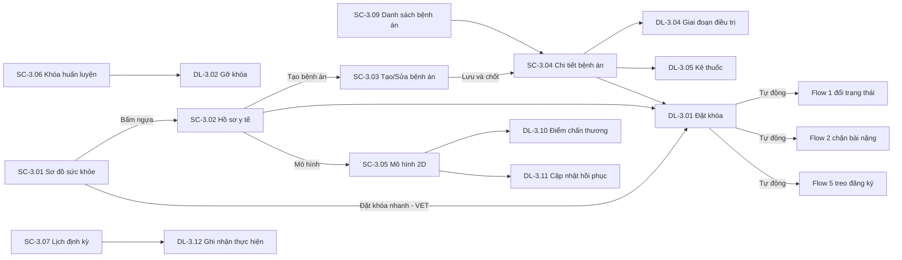
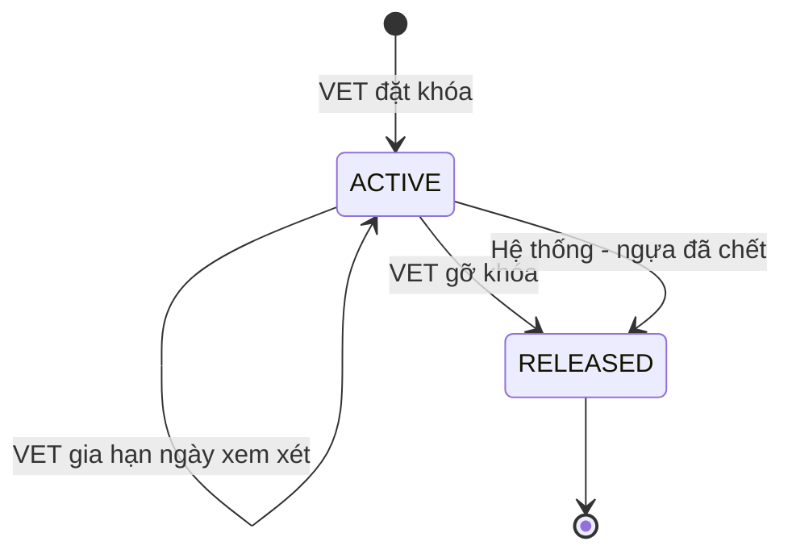

# ĐẶC TẢ LUỒNG & MÀN HÌNH – FLOW 3: QUẢN LÝ Y TẾ & XỬ LÝ CHẤN THƯƠNG

**Dự án:** RACEHORSE_TRAINING · **Bản:** 1.0

**Quy ước mã:** `SC-3.xx` = màn hình, `DL-3.xx` = dialog, `BTN-3.xx` = nút, `FR-3.xx` = chức năng, `Q-3.xx` = câu hỏi mở (Mục 9). Mã Flow 1, 2 (`SC-1.xx`, `DL-1.xx`, `SC-2.xx`) được dẫn chiếu khi cần.
**Vai trò:** CM = Club Manager · HT = Head Trainer · VET = Veterinarian · GROOM = Groom / Stable Hand · OWNER = Horse Owner.
**Quy ước hiển thị chung:** ngày `dd/MM/yyyy`, giờ `HH:mm`, giờ Việt Nam (UTC+7); nhiệt độ °C (1 chữ số thập phân), nhịp tim bpm, nhịp thở lần/phút, cân nặng kg. Breakpoint: Mobile < 768px · Tablet 768–1199px · Desktop ≥ 1200px.

---

## 1. Mục tiêu và phạm vi

**Mục tiêu:** VET theo dõi sức khỏe toàn đàn trực quan, quản lý bệnh án điện tử, đánh dấu chấn thương trên mô hình 2D, và đặt **Khóa huấn luyện** – lệnh có ưu tiên cao nhất toàn hệ thống – để bảo vệ ngựa chấn thương.

| Làm (In scope) | Nguồn |
|---|---|
| Sơ đồ trạng thái sức khỏe toàn đàn theo mã màu: Đủ điều kiện, Cần theo dõi, Chấn thương, Cách ly | Tài liệu gốc – gạch 1 |
| Bệnh án điện tử: khám, chẩn đoán lâm sàng / cận lâm sàng, phác đồ điều trị, đơn thuốc | Tài liệu gốc – gạch 2 |
| Đánh dấu vị trí tổn thương trên mô hình cơ/xương 2D, theo dõi hồi phục theo giai đoạn | Tài liệu gốc – gạch 3 |
| Đặt / gỡ Khóa huấn luyện; tự vô hiệu hóa xếp lịch tập nặng và đăng ký thi đấu | Tài liệu gốc – gạch 4, mục 6 |
| Lịch, cảnh báo, thông báo tự động tiêm phòng, tẩy giun, kiểm tra móng (Farrier) | Tài liệu gốc – gạch 5 |
| Xem ghi chú quan sát sức khỏe của nhân viên chăm sóc | Mục 6 tài liệu gốc (Groom ghi nhật ký ca trực) |
| Ngày xem xét lại Khóa huấn luyện và nhắc hạn | [BỔ SUNG] – tránh ngựa bị khóa quá lâu mà không ai xem lại |
| Danh mục loại chăm sóc định kỳ (tên, chu kỳ, số ngày nhắc trước) | [BỔ SUNG] – cần để tính ngày đến hạn |
| Thời gian ngưng thuốc trước thi đấu | [BỔ SUNG] – Flow 5 cần để cảnh báo đăng ký giải |

| Không làm (Out of scope) | Thuộc về |
|---|---|
| Ảnh chụp chấn thương, ảnh X-quang, báo cáo sự cố kèm ảnh | Loại trừ theo tài liệu gốc; kết quả cận lâm sàng nhập dạng chữ |
| Danh mục thuốc, tồn kho thuốc | Flow 4 (Danh mục vật tư); Flow 3 chỉ chọn thuốc từ danh mục |
| Chi phí khám, điều trị | Flow 5 (báo cáo tài chính) |
| Dự báo nguy cơ chấn thương | Flow 6 |
| Tài khoản thợ móng (Farrier) | Không thuộc 5 vai trò; chỉ lưu tên người thực hiện (Q-3.04) |

---

## 2. Vai trò và quyền

**Phạm vi dữ liệu:** *Tất cả* = mọi ngựa chưa xóa · *Được giao* = ngựa GROOM đang chăm sóc · *Sở hữu* = ngựa OWNER đang sở hữu.

| Chức năng | CM | HT | VET | GROOM | OWNER |
|---|---|---|---|---|---|
| Xem sơ đồ sức khỏe toàn đàn | Xem | Xem | Xem | — | — |
| Xem hồ sơ y tế – tab Tổng quan | Tất cả | Tất cả | Tất cả | Được giao | Sở hữu |
| Xem bệnh án, phác đồ, đơn thuốc chi tiết | Tất cả | Tất cả | Tất cả | — | Chỉ chẩn đoán và kết luận (Q-3.06) |
| Tạo, sửa, chốt, kết thúc bệnh án | — | — | Có | — | — |
| Phác đồ điều trị, đơn thuốc, tái khám | — | — | Có | Xem hướng dẫn chăm sóc (Được giao) | — |
| Đánh dấu / cập nhật chấn thương trên mô hình 2D | — | — | Có | — | — |
| Xem mô hình chấn thương 2D | Tất cả | Tất cả | Tất cả | Được giao | Sở hữu |
| Đặt, gỡ, gia hạn Khóa huấn luyện | — | — | Có | — | — |
| Xem danh sách Khóa huấn luyện | Tất cả | Tất cả | Tất cả | — | — |
| Xem lịch định kỳ (tiêm phòng, tẩy giun, móng) | Tất cả | Tất cả | Tất cả | Được giao | Sở hữu |
| Ghi nhận thực hiện định kỳ, thiết lập lịch cho ngựa | — | — | Có | — | — |
| Danh mục loại chăm sóc định kỳ | Xem | Xem | Xem/Thêm/Sửa/Ngừng dùng | — | — |
| Xem ghi chú quan sát của nhân viên chăm sóc | Tất cả | Tất cả | Tất cả | Được giao (của mình) | — |

---

## 3. Sơ đồ luồng tổng thể

### 3.1 Danh sách màn hình

| Mã | Tên màn hình | URL | Vai trò |
|---|---|---|---|
| SC-3.01 | Sơ đồ sức khỏe đàn ngựa | `/medical` | CM, HT, VET |
| SC-3.02 | Hồ sơ y tế ngựa (6 tab) | `/medical/horses/:id?tab=...` | CM, HT, VET, GROOM, OWNER (tab theo quyền) |
| SC-3.03 | Tạo / Sửa bệnh án | `/medical/records/new?horseId=`, `/medical/records/:id/edit` | VET |
| SC-3.04 | Chi tiết bệnh án | `/medical/records/:id` | CM, HT, VET; OWNER (giới hạn) |
| SC-3.05 | Mô hình chấn thương 2D | `/medical/horses/:id/injuries` | CM, HT, VET, GROOM, OWNER |
| SC-3.06 | Quản lý Khóa huấn luyện | `/medical/locks` | CM, HT, VET |
| SC-3.07 | Lịch chăm sóc định kỳ | `/medical/preventive` | CM, HT, VET |
| SC-3.08 | Danh mục loại chăm sóc định kỳ [BỔ SUNG] | `/catalogs/preventive-types` | CM, HT, VET |
| SC-3.09 | Danh sách bệnh án | `/medical/records` | CM, HT, VET |

Không có quyền → trang "Bạn không có quyền truy cập chức năng này". Ngoài phạm vi dữ liệu → "Không tìm thấy dữ liệu hoặc bạn không có quyền xem."

### 3.2 Các luồng chính

**L1 – Theo dõi toàn đàn (VET, HT, CM)**: SC-3.01 → xem màu từng ngựa → bấm ngựa → SC-3.02.

**L2 – Khám và điều trị (VET)**
1. SC-3.02 → **Tạo bệnh án** → SC-3.03 → nhập khám, chỉ số, cận lâm sàng, chẩn đoán → **Lưu và chốt** (DL-3.08).
2. SC-3.04 → thêm giai đoạn điều trị (DL-3.04), kê thuốc (DL-3.05), ghi tái khám (DL-3.07).
3. Nếu cần: đổi trạng thái ngựa (Flow 1, DL-1.01) hoặc đặt Khóa huấn luyện (DL-3.01).
4. Khỏi bệnh → **Kết thúc điều trị** (DL-3.09).

**L3 – Chấn thương (VET)**
1. SC-3.02 → **Mở mô hình chấn thương** → SC-3.05 → bật chế độ đánh dấu → bấm lên vị trí → DL-3.10.
2. Các lần tái khám → **Cập nhật hồi phục** (DL-3.11): Cấp tính → Bán cấp → Hồi phục → Đã lành.

**L4 – Khóa huấn luyện khẩn cấp (VET)**
1. Từ SC-3.01, SC-3.02, SC-3.04 hoặc SC-3.06 → **Đặt Khóa huấn luyện** (DL-3.01) → chọn trạng thái y tế, lý do, ngày xem xét lại.
2. Hệ thống ngay lập tức: chuyển trạng thái ngựa (Flow 1); chặn buổi tập nặng (Flow 2); treo đăng ký thi đấu (Flow 5); gửi thông báo.
3. Đến ngày xem xét lại → VET nhận nhắc → **Gỡ khóa** (DL-3.02) hoặc **Gia hạn** (DL-3.03).

**L5 – Chăm sóc định kỳ (VET)**
1. Hệ thống tính ngày đến hạn, gửi thông báo trước N ngày, vào ngày đến hạn và mỗi ngày khi quá hạn.
2. VET mở SC-3.07 → **Ghi nhận thực hiện** (DL-3.12) → ngày đến hạn tiếp theo tự tính lại.

---

## 4. Vòng đời trạng thái

### 4.1 Nhóm sức khỏe trên sơ đồ

| Nhóm | Màu | Gồm trạng thái ngựa (Flow 1) |
|---|---|---|
| Đủ điều kiện | Xanh lá | Nghỉ ngơi, Đang tập luyện, Sẵn sàng thi đấu |
| Cần theo dõi | Vàng | Cần theo dõi |
| Chấn thương | Đỏ | Chấn thương |
| Cách ly | Tím | Cách ly |

Ngựa Ngừng quản lý không hiện trên sơ đồ. Ngựa đang Khóa huấn luyện có thêm icon ổ khóa đỏ và viền đỏ đậm, bất kể nhóm.

### 4.2 Khóa huấn luyện

| Mã | Nhãn | Màu |
|---|---|---|
| ACTIVE | Đang khóa | Đỏ |
| RELEASED | Đã gỡ | Xám |

| Từ | Đến | Ai | Điều kiện | Tác dụng phụ |
|---|---|---|---|---|
| (Tạo) | Đang khóa | VET | Ngựa chưa có khóa đang hiệu lực; ngựa không Ngừng quản lý | Ngựa chuyển sang trạng thái y tế VET chọn (Flow 1); buổi tập nặng chưa diễn ra → Bị chặn (Flow 2); đăng ký giải chưa diễn ra → Tạm treo (Flow 5); thông báo HT, CM, GROOM phụ trách, OWNER |
| Đang khóa | Đang khóa (gia hạn) | VET | Ngày xem xét mới > ngày cũ | Thông báo HT |
| Đang khóa | Đã gỡ | VET | Lý do 10–500 ký tự | Tùy chọn chuyển ngựa sang Nghỉ ngơi / Đang tập luyện hoặc giữ trạng thái y tế; buổi tập Bị chặn chờ HT khôi phục; đăng ký Tạm treo trở lại Đã đăng ký nếu giải chưa diễn ra; thông báo như trên |
| Đang khóa | Đã gỡ | Hệ thống | Ngựa bị Ngừng quản lý với lý do Đã chết (Flow 1) | Ghi lý do "Ngựa đã chết" |

**Quy tắc ưu tiên:** Khóa huấn luyện chỉ VET gỡ được. Không vai trò nào (kể cả CM) có nút hay đường tắt để bỏ qua khóa. Mọi màn hình xếp lịch tập (Flow 2) và đăng ký thi đấu (Flow 5) đều kiểm tra khóa tại thời điểm bấm Lưu, không chỉ lúc mở form.

### 4.3 Bệnh án

| Mã | Nhãn | Màu | Được sửa gì |
|---|---|---|---|
| DRAFT | Nháp | Xám | Mọi trường; được xóa |
| OPEN | Đang điều trị | Xanh dương | Không sửa phần khám và chẩn đoán; được thêm/sửa phác đồ, thuốc, tái khám |
| CLOSED | Đã kết thúc | Xanh lá | Chỉ xem |

| Từ | Đến | Ai | Điều kiện |
|---|---|---|---|
| (Tạo) | Nháp | VET | — |
| Nháp | Đang điều trị | VET | Đủ trường bắt buộc phần khám và chẩn đoán |
| Nháp | (Xóa) | VET | Chỉ người tạo |
| Đang điều trị | Đã kết thúc | VET | Kết luận 10–2000 ký tự; mọi thuốc đang dùng tự chuyển Đã dừng |
| Đã kết thúc | Đang điều trị | VET | Trong 7 ngày kể từ khi kết thúc; lý do bắt buộc (mở lại) |

### 4.4 Giai đoạn hồi phục chấn thương

| Mã | Nhãn | Màu điểm trên mô hình |
|---|---|---|
| ACUTE | Cấp tính | Đỏ |
| SUBACUTE | Bán cấp | Cam |
| RECOVERING | Hồi phục | Vàng |
| HEALED | Đã lành | Xanh lá (ẩn mặc định) |

Chỉ chuyển tiến (Cấp tính → Bán cấp → Hồi phục → Đã lành) hoặc lùi 1 bậc khi tái phát (có lý do). Mỗi lần chuyển lưu ngày, mức độ, ghi chú, người cập nhật.

### 4.5 Trạng thái lịch định kỳ (theo từng ngựa × loại)

| Nhãn | Điều kiện | Màu |
|---|---|---|
| Còn hạn | Ngày đến hạn > hôm nay + số ngày nhắc trước | Xanh lá |
| Sắp đến hạn | Hôm nay ≤ ngày đến hạn ≤ hôm nay + số ngày nhắc trước | Vàng |
| Quá hạn | Ngày đến hạn < hôm nay | Đỏ |
| Chưa có dữ liệu | Chưa ghi nhận lần nào và chưa đặt ngày đến hạn đầu | Xám |

---

## 5. Đặc tả màn hình

**Quy ước chung:** Đang tải: skeleton. Lỗi tải: "Không tải được dữ liệu" + **Thử lại**. Mất mạng: toast đỏ "Mất kết nối mạng. Vui lòng thử lại." Dữ liệu bị sửa cùng lúc: toast "Dữ liệu đã được người khác cập nhật. Vui lòng tải lại trước khi lưu." + **Tải lại**. Nút không có quyền: ẩn. Nút bị chặn do trạng thái: hiện, vô hiệu hóa, tooltip lý do.

### 5.1 SC-3.01 – Sơ đồ sức khỏe đàn ngựa

**Mục đích:** Nhìn toàn đàn theo mã màu sức khỏe trong 1 màn hình. **Vai trò:** CM, HT, VET.

**Bố cục**
- **Hàng thẻ đếm:** Đủ điều kiện · Cần theo dõi · Chấn thương · Cách ly · Đang Khóa huấn luyện · Định kỳ quá hạn. Bấm thẻ = lọc nhanh.
- **Thanh công cụ:** chế độ xem, bộ lọc.
- **Vùng chính:** chế độ **Theo chuồng** (lưới ô chuồng giống SC-1.04, mỗi ô tô màu nhóm sức khỏe) hoặc **Dạng thẻ** (lưới thẻ ngựa nhóm theo 4 nhóm sức khỏe).
- **Panel chi tiết** khi bấm 1 ngựa: Desktop bên phải; Mobile bottom sheet.
- Mobile: mặc định Dạng thẻ; thẻ đếm cuộn ngang.

**Bộ lọc**

| Nhãn | Loại | Mặc định |
|---|---|---|
| Tìm ngựa | Ô text (tên, mã) | Rỗng |
| Nhóm sức khỏe | Chọn nhiều 4 nhóm | Tất cả |
| Khóa huấn luyện | Tất cả / Đang khóa / Không khóa | Tất cả |
| Khu chuồng | Dropdown (chế độ Theo chuồng bắt buộc chọn 1 khu) | Khu đầu tiên |
| Có định kỳ quá hạn | Checkbox | Bỏ chọn |

**Thẻ ngựa (Dạng thẻ):** Tên, Mã, Ô chuồng, badge nhóm sức khỏe, icon khóa, số chấn thương chưa lành, ngày khám gần nhất, icon chuông đỏ nếu có định kỳ quá hạn.

**Panel chi tiết ngựa:** Trạng thái, Khóa huấn luyện (ngày đặt, ngày xem xét lại, người đặt), Bệnh án đang điều trị (mã, chẩn đoán), Chấn thương chưa lành (vùng, giai đoạn), Định kỳ sắp/quá hạn, Ghi chú quan sát mới nhất của nhân viên chăm sóc (24 giờ gần nhất).

**Nút**

| Mã | Nút | Vai trò | Vô hiệu hóa khi | Hành vi |
|---|---|---|---|---|
| BTN-3.01 | Theo chuồng / Dạng thẻ | Tất cả | — | Đổi chế độ xem |
| BTN-3.02 | Xem hồ sơ y tế | Tất cả (panel) | — | Mở SC-3.02 |
| BTN-3.03 | Đặt Khóa huấn luyện | VET (panel) | Ngựa đã đang khóa (nút ẩn, thay bằng nhãn "Đang khóa") | Mở DL-3.01 điền sẵn ngựa |
| BTN-3.04 | Xóa bộ lọc | Tất cả | — | Bộ lọc về mặc định |

**Trạng thái giao diện:** Không có ngựa: "Chưa có ngựa nào." Không khớp lọc: "Không có ngựa phù hợp bộ lọc." Dữ liệu tự làm mới mỗi 60 giây; hiện "Cập nhật lúc HH:mm".

### 5.2 SC-3.02 – Hồ sơ y tế ngựa

**Mục đích:** Nơi tập trung toàn bộ thông tin y tế của một con ngựa. **Vai trò:** CM, HT, VET (đủ tab); GROOM (ngựa được giao: Tổng quan, Chấn thương, Lịch định kỳ, Ghi chú quan sát); OWNER (ngựa sở hữu: Tổng quan, Bệnh án ở dạng giới hạn, Chấn thương, Lịch định kỳ).

**Bố cục**
- **Header:** Tên, Mã, Ô chuồng, badge trạng thái, badge nhóm sức khỏe, thanh nút; link **Xem hồ sơ ngựa** (BTN-3.15 → SC-1.03).
- **Banner Khóa huấn luyện** (khi đang khóa): nền đỏ, "Đang Khóa huấn luyện từ {ngày giờ} – BS. {Họ tên}. Lý do: {lý do}. Ngày xem xét lại: {dd/MM/yyyy}." Quá ngày xem xét: thêm nhãn "Đã quá ngày xem xét lại {n} ngày".
- **6 tab:** Tổng quan · Bệnh án · Chấn thương · Khóa huấn luyện · Lịch định kỳ · Ghi chú quan sát. Mobile: dropdown chọn tab.

**Nút trên header**

| Mã | Nút | Vai trò | Hiện khi | Hành vi |
|---|---|---|---|---|
| BTN-3.07 | Tạo bệnh án | VET | Ngựa không Ngừng quản lý | Mở SC-3.03 điền sẵn ngựa |
| BTN-3.08 | Đặt Khóa huấn luyện | VET | Không có khóa đang hiệu lực | Mở DL-3.01 |
| BTN-3.09 | Gỡ Khóa huấn luyện | VET | Đang khóa | Mở DL-3.02 |
| BTN-3.10 | Gia hạn xem xét | VET | Đang khóa | Mở DL-3.03 |
| BTN-3.11 | Đổi trạng thái sức khỏe | VET | Ngựa không Ngừng quản lý | Mở DL-1.01 của Flow 1 |
| BTN-3.15 | Xem hồ sơ ngựa | Tất cả | — | Mở SC-1.03 |

**Tab Tổng quan**
- Khối "Tình trạng hiện tại": trạng thái, nhóm sức khỏe, khóa (nếu có), mức vận động cho phép hiện hành (lấy từ giai đoạn điều trị đang hiệu lực: Nghỉ hoàn toàn / Đi bộ nhẹ / Tập nhẹ / Tập bình thường).
- Khối "Hướng dẫn chăm sóc đang áp dụng": danh sách hướng dẫn từ giai đoạn điều trị đang hiệu lực (GROOM đọc để làm theo).
- Khối "Thuốc đang dùng": Tên thuốc · Liều · Đường dùng · Tần suất · Đến ngày · Hết thời gian ngưng thuốc ngày.
- Khối "Chỉ số sinh tồn gần nhất": nhiệt độ, nhịp tim, nhịp thở, cân nặng, ngày đo; biểu đồ đường nhỏ 5 lần đo gần nhất.
- Khối "Định kỳ sắp đến hạn / quá hạn".
- OWNER, GROOM không thấy khối "Thuốc đang dùng" (Q-3.06).

**Tab Bệnh án:** bảng Mã · Ngày khám · Loại khám · Chẩn đoán · Mức độ · Trạng thái bệnh án · VET phụ trách. Bấm dòng → SC-3.04. OWNER chỉ thấy Ngày khám, Chẩn đoán, Trạng thái; không mở chi tiết đơn thuốc. Rỗng: "Chưa có bệnh án nào."

**Tab Chấn thương:** hình thu nhỏ mô hình 2D (chỉ đọc) + bảng Vùng · Loại tổn thương · Mức độ · Giai đoạn · Ngày phát hiện · Ngày cập nhật gần nhất. Nút **Mở mô hình chấn thương** (BTN-3.12 → SC-3.05). Rỗng: "Chưa ghi nhận chấn thương nào."

**Tab Khóa huấn luyện:** bảng lịch sử: Mã khóa · Trạng thái y tế áp dụng · Đặt lúc · Người đặt · Lý do · Ngày xem xét lại · Gỡ lúc · Người gỡ · Lý do gỡ · Thời gian khóa (số ngày). Rỗng: "Ngựa chưa từng bị Khóa huấn luyện."

**Tab Lịch định kỳ:** bảng Loại · Nhóm (Tiêm phòng / Tẩy giun / Kiểm tra móng) · Lần gần nhất · Người thực hiện · Ngày đến hạn · Trạng thái (Mục 4.5).

| Mã | Nút | Vai trò | Hành vi |
|---|---|---|---|
| BTN-3.13 | Ghi nhận thực hiện (mỗi dòng) | VET | Mở DL-3.12 điền sẵn ngựa và loại |
| BTN-3.14 | Thiết lập lịch định kỳ | VET | Mở DL-3.13 |

**Tab Ghi chú quan sát:** danh sách ghi chú sức khỏe do nhân viên chăm sóc nhập ở Flow 4 (ngày giờ, ca trực, người ghi, nội dung, mức lưu ý: Bình thường / Cần chú ý / Khẩn). Lọc khoảng ngày, mức lưu ý. Ghi chú "Khẩn" hiện nền đỏ nhạt. Chỉ xem. Rỗng: "Chưa có ghi chú quan sát."

### 5.3 SC-3.03 – Tạo / Sửa bệnh án

**Mục đích:** Ghi lần khám, chỉ số, cận lâm sàng và chẩn đoán. **Vai trò:** VET. Chỉ sửa được bệnh án Nháp.

**Bố cục:** 4 khối theo thứ tự: Thông tin khám → Chỉ số sinh tồn → Cận lâm sàng → Chẩn đoán. Desktop 2 cột; Tablet, Mobile 1 cột; thanh nút cố định cuối trang.

**Khối Thông tin khám**

| Nhãn | Loại | Bắt buộc | Quy tắc | Thông báo lỗi |
|---|---|---|---|---|
| Mã bệnh án | Chỉ đọc | — | Tự sinh `BA-` + 6 số | — |
| Ngựa | Dropdown có tìm kiếm; chỉ đọc khi mở từ hồ sơ ngựa | Có | Ngựa không Ngừng quản lý | "Vui lòng chọn ngựa." |
| Ngày giờ khám | Date-time picker, mặc định hiện tại | Có | Không sau hiện tại; không sớm hơn 30 ngày | "Ngày giờ khám không được sau thời điểm hiện tại." / "Ngày giờ khám không được sớm hơn 30 ngày." |
| Loại khám | Dropdown: Khám bệnh · Khám chấn thương · Khám định kỳ · Tái khám · Khám trước thi đấu | Có | | "Vui lòng chọn loại khám." |
| Lý do khám | Textarea | Có | 5–500 ký tự | "Vui lòng nhập lý do khám." / "Lý do khám phải từ 5 đến 500 ký tự." |
| Triệu chứng | Textarea | Không | ≤ 2000 ký tự | "Triệu chứng tối đa 2000 ký tự." |
| Nguồn phát hiện | Dropdown: VET tự phát hiện · Ghi chú quan sát của nhân viên chăm sóc · Dấu hiệu bất thường sau buổi tập · Khám định kỳ | Không | Khi chọn 2 nguồn giữa: hiện ô chọn ghi chú / buổi tập liên quan | — |

**Khối Chỉ số sinh tồn**

| Nhãn | Loại | Bắt buộc | Quy tắc | Thông báo lỗi |
|---|---|---|---|---|
| Nhiệt độ (°C) | Số 1 chữ số thập phân | Có | 35,0–43,0; tô đỏ ngoài 37,2–38,6 | "Nhiệt độ phải từ 35,0 đến 43,0 °C." |
| Nhịp tim lúc nghỉ (bpm) | Số nguyên | Có | 20–120; tô đỏ ngoài 28–44 | "Nhịp tim phải từ 20 đến 120 bpm." |
| Nhịp thở (lần/phút) | Số nguyên | Có | 4–60; tô đỏ ngoài 8–16 | "Nhịp thở phải từ 4 đến 60 lần/phút." |
| Cân nặng (kg) | Số nguyên | Không | 200–800 | "Cân nặng phải từ 200 đến 800 kg." |
| Khám lâm sàng | Textarea | Có | 10–4000 ký tự | "Vui lòng nhập kết quả khám lâm sàng." / "Kết quả khám lâm sàng phải từ 10 đến 4000 ký tự." |

Ngưỡng tô đỏ là ngưỡng tham khảo cho ngựa trưởng thành (Q-3.08); chỉ cảnh báo, không chặn lưu.

**Khối Cận lâm sàng** (bảng, 0–20 dòng)

| Cột | Loại | Bắt buộc | Quy tắc | Thông báo lỗi |
|---|---|---|---|---|
| Loại xét nghiệm | Dropdown: Xét nghiệm máu · Nước tiểu · X-quang · Siêu âm · Nội soi · Khác | Có | | "Vui lòng chọn loại xét nghiệm." |
| Ngày thực hiện | Date picker | Có | Không sau hôm nay | "Ngày thực hiện không được sau ngày hiện tại." |
| Kết quả | Textarea | Có | 5–2000 ký tự (chỉ chữ, không đính kèm ảnh) | "Vui lòng nhập kết quả." |
| (Xóa dòng) | Nút icon | — | — | — |

**Khối Chẩn đoán**

| Nhãn | Loại | Bắt buộc | Quy tắc | Thông báo lỗi |
|---|---|---|---|---|
| Chẩn đoán | Textarea | Có | 5–1000 ký tự | "Vui lòng nhập chẩn đoán." / "Chẩn đoán phải từ 5 đến 1000 ký tự." |
| Mức độ | Radio: Nhẹ / Trung bình / Nặng / Nguy kịch | Có | | "Vui lòng chọn mức độ." |
| Đề xuất trạng thái ngựa | Dropdown: Giữ nguyên · Cần theo dõi · Chấn thương · Cách ly | Có, mặc định Giữ nguyên | Chỉ là đề xuất; áp dụng thật khi chốt (DL-3.08) | — |
| Đề xuất Khóa huấn luyện | Checkbox | Không | Khi tích, DL-3.08 mở thêm bước đặt khóa | — |

**Nút**

| Mã | Nút | Hành vi |
|---|---|---|
| BTN-3.16 | Thêm xét nghiệm | Thêm 1 dòng; vô hiệu hóa khi đủ 20 dòng |
| BTN-3.17 | Xóa xét nghiệm (mỗi dòng) | Xóa dòng chưa lưu |
| BTN-3.18 | Lưu nháp | Lưu (chỉ cần Ngựa, Ngày giờ khám, Loại khám) → toast "Đã lưu nháp bệnh án." → SC-3.04 |
| BTN-3.19 | Lưu và chốt | Kiểm tra đủ trường bắt buộc → lưu → mở DL-3.08 |
| BTN-3.20 | Hủy | Quay lại; có thay đổi → DL-3.15 |

### 5.4 SC-3.04 – Chi tiết bệnh án

**Mục đích:** Xem bệnh án và quản lý điều trị. **Vai trò:** VET (thao tác); CM, HT xem đầy đủ; OWNER xem giới hạn (Thông tin khám, Chẩn đoán, Mức độ, Kết luận; ẩn tab Đơn thuốc).

**Bố cục:** Header (Mã, Ngựa – link SC-3.02, badge trạng thái bệnh án, VET phụ trách, ngày khám, thanh nút) → 4 tab: **Khám & chẩn đoán** · **Phác đồ điều trị** · **Đơn thuốc** · **Tái khám**.

**Nút trên header**

| Mã | Nút | Vai trò | Hiện khi | Vô hiệu hóa khi (lý do) | Hành vi |
|---|---|---|---|---|---|
| BTN-3.21 | Sửa | VET | Nháp | — | Mở SC-3.03 |
| BTN-3.22 | Chốt bệnh án | VET | Nháp | Thiếu trường bắt buộc ("Còn thiếu: {danh sách trường}.") | Mở DL-3.08 |
| BTN-3.23 | Xóa bản nháp | VET | Nháp, người tạo | — | Hộp xác nhận "Xóa bản nháp bệnh án {Mã}? Không thể hoàn tác." → xóa → về SC-3.02, toast "Đã xóa bản nháp." |
| BTN-3.24 | Kết thúc điều trị / Mở lại | VET | Đang điều trị (Kết thúc); Đã kết thúc trong 7 ngày (Mở lại) | — | Mở DL-3.09 |
| BTN-3.31 | Đặt Khóa huấn luyện | VET | Đang điều trị và ngựa chưa bị khóa | — | Mở DL-3.01, điền sẵn ngựa và bệnh án |

**Tab Khám & chẩn đoán:** hiển thị chỉ đọc toàn bộ dữ liệu SC-3.03; chỉ số ngoài ngưỡng tô đỏ. Khi Đã kết thúc: hiện thêm khối Kết luận.

**Tab Phác đồ điều trị:** danh sách giai đoạn điều trị theo thời gian.

| Cột | Hiển thị |
|---|---|
| Giai đoạn | Tên |
| Thời gian | `dd/MM/yyyy – dd/MM/yyyy`; nhãn "Đang áp dụng" nếu chứa hôm nay |
| Mục tiêu | Text |
| Mức vận động cho phép | Nghỉ hoàn toàn / Đi bộ nhẹ / Tập nhẹ / Tập bình thường |
| Hướng dẫn chăm sóc | Danh sách: hoạt động + tần suất (ví dụ "Ngâm chân nước đá – 2 lần/ngày") |
| Hành động | Sửa |

| Mã | Nút | Vai trò | Hiện khi | Hành vi |
|---|---|---|---|---|
| BTN-3.25 | Thêm giai đoạn điều trị | VET | Đang điều trị | Mở DL-3.04 |
| BTN-3.26 | Sửa (mỗi dòng) | VET | Đang điều trị; giai đoạn chưa kết thúc | Mở DL-3.04 chế độ sửa |

Rỗng: "Chưa có phác đồ điều trị."

**Tab Đơn thuốc**

| Cột | Hiển thị |
|---|---|
| Thuốc | Tên (từ danh mục vật tư – Flow 4) |
| Liều | "{số} {đơn vị}" |
| Đường dùng | Uống / Tiêm bắp / Tiêm tĩnh mạch / Tiêm dưới da / Bôi ngoài da / Nhỏ mắt / Khác |
| Tần suất | "{n} lần/ngày" |
| Thời gian | Từ ngày – Đến ngày |
| Tổng lượng | Tự tính = Liều × Tần suất × Số ngày |
| Ngưng thuốc trước thi đấu | "{n} ngày – đến {dd/MM/yyyy}" hoặc "—" |
| Trạng thái | Đang dùng (xanh dương) / Đã dừng (xám) / Đã hoàn tất (xanh lá) |
| Hành động | Sửa · Dừng thuốc |

| Mã | Nút | Vai trò | Hiện khi | Hành vi |
|---|---|---|---|---|
| BTN-3.27 | Thêm thuốc | VET | Đang điều trị | Mở DL-3.05 |
| BTN-3.28 | Sửa (mỗi dòng) | VET | Thuốc Đang dùng và Từ ngày > hôm nay | Mở DL-3.05 chế độ sửa. Thuốc đã bắt đầu: nút vô hiệu hóa, tooltip "Thuốc đã bắt đầu dùng. Hãy dừng thuốc và kê đơn mới." |
| BTN-3.29 | Dừng thuốc (mỗi dòng) | VET | Đang dùng | Mở DL-3.06 |

Rỗng: "Chưa kê thuốc."

**Tab Tái khám:** danh sách lần tái khám: Ngày giờ · Chỉ số sinh tồn · Diễn biến · Điều chỉnh · Người khám.

| Mã | Nút | Vai trò | Hiện khi | Hành vi |
|---|---|---|---|---|
| BTN-3.30 | Thêm tái khám | VET | Đang điều trị | Mở DL-3.07 |

Rỗng: "Chưa có lần tái khám nào."

### 5.5 SC-3.05 – Mô hình chấn thương 2D

**Mục đích:** Đánh dấu trực quan vị trí tổn thương trên mô hình cơ/xương và theo dõi hồi phục. **Vai trò:** VET (thao tác); CM, HT, GROOM (được giao), OWNER (sở hữu) chỉ xem.

**Bố cục**
- Desktop: bên trái mô hình 2D (65% chiều rộng), bên phải danh sách chấn thương và panel chi tiết (35%).
- Tablet: mô hình trên, danh sách dưới.
- Mobile: mô hình chiếm toàn chiều rộng, có phóng to/thu nhỏ bằng 2 ngón; danh sách chấn thương mở bằng nút **Danh sách** thành bottom sheet.

**Mô hình 2D:** hình vẽ ngựa đứng nghiêng, 2 góc nhìn (Bên trái / Bên phải), 2 lớp (Cơ / Xương). Mô hình chia sẵn thành các vùng giải phẫu; di chuột lên vùng hiện tên vùng. Mỗi điểm chấn thương là một chấm tròn đường kính 16px, màu theo giai đoạn (Mục 4.4), số thứ tự bên trong. Nhiều điểm gần nhau (< 16px) gom thành 1 cụm có số lượng; bấm cụm để phóng to.

**Danh sách vùng giải phẫu** (dùng chung cho mô hình và dropdown): Đầu · Cổ · Vai · Vai u (Withers) · Lưng · Thắt lưng · Hông · Mông · Ngực · Bụng · và với mỗi chân (Trước trái, Trước phải, Sau trái, Sau phải): Cẳng trên · Khớp gối/khuỷu · Cẳng dưới · Gân gấp · Khớp cổ chân (Fetlock) · Cổ móng (Pastern) · Móng.

**Điều khiển và nút**

| Mã | Nút | Vai trò | Hành vi |
|---|---|---|---|
| BTN-3.32 | Bên trái / Bên phải | Tất cả | Đổi góc nhìn |
| BTN-3.33 | Lớp Cơ / Lớp Xương | Tất cả | Đổi lớp hiển thị |
| BTN-3.34 | Chế độ đánh dấu | VET | Bật: con trỏ thành dấu +, bấm lên mô hình → mở DL-3.10 với vị trí và vùng tự điền; bấm lại để tắt. Ngựa Ngừng quản lý: vô hiệu hóa |
| BTN-3.35 | Sửa điểm (panel) | VET | Mở DL-3.10 chế độ sửa |
| BTN-3.36 | Cập nhật hồi phục (panel) | VET | Mở DL-3.11; ẩn khi Đã lành |
| BTN-3.37 | Xóa điểm (panel) | VET | Chỉ khi điểm tạo trong 24 giờ và chưa cập nhật hồi phục; hộp xác nhận "Xóa điểm chấn thương này? Chỉ dùng khi đánh dấu nhầm." |
| BTN-3.38 | Hiện chấn thương đã lành | Tất cả | Checkbox, mặc định bỏ chọn |
| BTN-3.39 | Thanh thời gian | Tất cả | Kéo chọn một ngày trong quá khứ → mô hình hiển thị các điểm và giai đoạn tại ngày đó; nút "Hôm nay" để trở về |

**Danh sách chấn thương:** mỗi mục: số thứ tự, Vùng, Loại tổn thương, Mức độ, badge giai đoạn, Ngày phát hiện, Bệnh án liên quan. Bấm mục → điểm trên mô hình nhấp nháy và mở panel chi tiết.

**Panel chi tiết điểm:** Vùng, Góc nhìn, Lớp, Loại tổn thương, Mức độ (1 Nhẹ – 4 Rất nặng), Ngày phát hiện, Mô tả, Bệnh án liên quan (link SC-3.04), dòng thời gian hồi phục (mỗi mốc: ngày, giai đoạn, mức độ, ghi chú, người cập nhật).

**Trạng thái giao diện:** Chưa có điểm: "Chưa ghi nhận chấn thương nào." (VET thấy thêm "Bật Chế độ đánh dấu và bấm lên mô hình để thêm.")

### 5.6 SC-3.06 – Quản lý Khóa huấn luyện

**Mục đích:** Xem toàn bộ khóa đang hiệu lực và lịch sử; xử lý khóa đến ngày xem xét. **Vai trò:** CM, HT xem; VET thao tác.

**Bố cục:** 2 tab **Đang khóa** · **Lịch sử**. Mobile: danh sách thẻ.

**Bộ lọc:** Tìm ngựa · Trạng thái y tế áp dụng · VET đặt khóa · Khoảng ngày đặt · Chỉ khóa quá ngày xem xét (checkbox, tab Đang khóa).

**Bảng**

| Cột | Hiển thị | Sắp xếp |
|---|---|---|
| Mã khóa | `KH-000012` | Có |
| Ngựa | Tên + Ô chuồng | Có |
| Trạng thái y tế | Badge | Có |
| Đặt lúc | `dd/MM/yyyy HH:mm` | Có |
| Người đặt | Họ tên VET | Không |
| Lý do | Cắt 80 ký tự | Không |
| Ngày xem xét lại | `dd/MM/yyyy`; đỏ đậm + "Quá {n} ngày" khi quá hạn | Có (mặc định tăng dần ở tab Đang khóa) |
| Số ngày khóa | Số | Có |
| Gỡ lúc / Người gỡ / Lý do gỡ | Chỉ ở tab Lịch sử | Có |
| Hành động | Theo bảng dưới | — |

| Mã | Nút | Vai trò | Hành vi |
|---|---|---|---|
| BTN-3.40 | Đặt khóa mới | VET | Mở DL-3.01 có ô chọn ngựa |
| BTN-3.41 | Gỡ khóa (mỗi dòng) | VET | Mở DL-3.02 |
| BTN-3.42 | Gia hạn (mỗi dòng) | VET | Mở DL-3.03 |
| BTN-3.43 | Xem hồ sơ y tế (mỗi dòng) | Tất cả | Mở SC-3.02 |

**Trạng thái giao diện:** "Hiện không có ngựa nào bị Khóa huấn luyện."

### 5.7 SC-3.07 – Lịch chăm sóc định kỳ

**Mục đích:** Theo dõi tiêm phòng, tẩy giun, kiểm tra móng của toàn đàn; ghi nhận thực hiện. **Vai trò:** CM, HT xem; VET thao tác.

**Bố cục:** Hàng thẻ đếm (Quá hạn · Sắp đến hạn trong 7 ngày · Sắp đến hạn trong 30 ngày) → thanh công cụ → **Danh sách** hoặc **Lịch tháng**. Mobile: chỉ Danh sách.

**Bộ lọc:** Nhóm (Tiêm phòng / Tẩy giun / Kiểm tra móng) · Loại cụ thể · Trạng thái (Quá hạn / Sắp đến hạn / Còn hạn / Chưa có dữ liệu; mặc định Quá hạn + Sắp đến hạn) · Khu chuồng · Tìm ngựa.

**Bảng (Danh sách)**

| Cột | Hiển thị | Sắp xếp |
|---|---|---|
| (Chọn) | Checkbox | — |
| Ngựa | Tên + Ô chuồng | Có |
| Loại | Tên loại + nhóm | Có |
| Lần gần nhất | `dd/MM/yyyy` hoặc "—" | Có |
| Ngày đến hạn | `dd/MM/yyyy` | Có (mặc định tăng dần) |
| Trạng thái | Badge Mục 4.5 | Có |
| Hành động | Ghi nhận thực hiện | — |

**Lịch tháng:** mỗi ngày hiện số mục đến hạn theo nhóm (chấm màu); bấm ngày → danh sách mục của ngày đó.

| Mã | Nút | Vai trò | Vô hiệu hóa khi | Hành vi |
|---|---|---|---|---|
| BTN-3.44 | Danh sách / Lịch tháng | Tất cả | — | Đổi chế độ |
| BTN-3.45 | Ghi nhận thực hiện (mỗi dòng) | VET | — | Mở DL-3.12 cho 1 dòng |
| BTN-3.46 | Ghi nhận hàng loạt | VET | Chưa chọn dòng; các dòng chọn khác loại ("Chỉ ghi nhận hàng loạt các dòng cùng loại.") | Mở DL-3.12 cho nhiều ngựa [BỔ SUNG] |
| BTN-3.47 | Xóa bộ lọc | Tất cả | — | Bộ lọc về mặc định |

**Thông báo tự động (chạy 06:00 mỗi ngày):** gửi VET một thông báo tổng hợp: "{n} mục quá hạn, {m} mục đến hạn hôm nay, {k} mục đến hạn trong {x} ngày tới." Riêng từng mục: thông báo khi vào mốc "nhắc trước", vào ngày đến hạn. Kiểm tra móng gửi thêm cho nhân viên chăm sóc chính của ngựa.

**Trạng thái giao diện:** "Không có mục nào quá hạn hoặc sắp đến hạn."

### 5.8 SC-3.08 – Danh mục loại chăm sóc định kỳ [BỔ SUNG]

**Mục đích:** Khai báo các loại tiêm phòng, tẩy giun, kiểm tra móng và chu kỳ. **Vai trò:** VET toàn quyền; CM, HT xem.

**Bảng:** Mã · Tên loại · Nhóm · Chu kỳ (ngày) · Nhắc trước (ngày) · Áp dụng mặc định cho ngựa mới (Có/Không) · Số ngựa đang theo dõi · Trạng thái (Đang dùng / Ngừng dùng) · Hành động.

| Mã | Nút | Vai trò | Hành vi |
|---|---|---|---|
| BTN-3.48 | Thêm loại | VET | Mở DL-3.14 |
| BTN-3.49 | Sửa (mỗi dòng) | VET | Mở DL-3.14 chế độ sửa |
| BTN-3.50 | Ngừng dùng / Dùng lại (mỗi dòng) | VET | Ngừng dùng: hộp xác nhận "Ngừng theo dõi loại '{Tên}' cho toàn bộ ngựa? Lịch sử đã ghi nhận vẫn giữ nguyên." |

**Trạng thái giao diện:** "Chưa có loại chăm sóc định kỳ nào."

### 5.9 SC-3.09 – Danh sách bệnh án

**Mục đích:** Tra cứu bệnh án toàn CLB. **Vai trò:** CM, HT, VET.

**Bộ lọc:** Tìm (mã bệnh án, tên ngựa, chẩn đoán) · Trạng thái bệnh án (mặc định Nháp + Đang điều trị) · Loại khám · Mức độ · VET phụ trách · Khoảng ngày khám.

**Bảng:** Mã · Ngựa · Ngày khám · Loại khám · Chẩn đoán (cắt 80 ký tự) · Mức độ (badge: Nhẹ xanh, Trung bình vàng, Nặng cam, Nguy kịch đỏ) · Trạng thái bệnh án · VET · Số ngày điều trị. Sắp xếp theo mọi cột trừ Chẩn đoán; mặc định Ngày khám mới nhất. Phân trang 20 dòng.

| Mã | Nút | Vai trò | Hành vi |
|---|---|---|---|
| BTN-3.05 | Tạo bệnh án | VET | Mở SC-3.03 |
| BTN-3.06 | Xem (mỗi dòng) | Tất cả | Mở SC-3.04 |

**Trạng thái giao diện:** "Chưa có bệnh án nào." / "Không có bệnh án phù hợp bộ lọc."

---

### 5.10 Dialog dùng chung

Quy ước: Desktop giữa màn hình rộng 640px; Mobile toàn màn hình. Nút chính bên phải, vô hiệu hóa khi form chưa hợp lệ hoặc đang gửi. Hủy khi đã nhập → hỏi "Bỏ các thay đổi đã nhập?". Lỗi server hiện đầu dialog, giữ dữ liệu.

#### DL-3.01 – Đặt Khóa huấn luyện

Mở từ BTN-3.03, BTN-3.08, BTN-3.31, BTN-3.40, và từ DL-3.08. Vai trò: VET. Tiêu đề nền đỏ: "Đặt Khóa huấn luyện – {Tên ngựa}".

| Nhãn | Loại | Bắt buộc | Quy tắc | Thông báo lỗi |
|---|---|---|---|---|
| Ngựa | Dropdown; chỉ khi mở từ SC-3.06 | Có | Ngựa chưa bị khóa, không Ngừng quản lý | "Vui lòng chọn ngựa." / "Ngựa đang bị Khóa huấn luyện." |
| Trạng thái y tế áp dụng | Radio: Cần theo dõi / Chấn thương / Cách ly; mặc định = trạng thái y tế hiện tại nếu có | Có | | "Vui lòng chọn trạng thái y tế." |
| Bệnh án liên quan | Dropdown các bệnh án Đang điều trị của ngựa | Không | | — |
| Lý do khóa | Textarea | Có | 10–500 ký tự | "Vui lòng nhập lý do." / "Lý do phải từ 10 đến 500 ký tự." |
| Ngày xem xét lại | Date picker, mặc định hôm nay + 7 ngày | Có | Từ ngày mai đến hôm nay + 180 ngày | "Ngày xem xét lại phải từ ngày mai đến tối đa 180 ngày." |

**Khung tác động** (chỉ đọc, tính ngay khi mở): "• Trạng thái ngựa: {hiện tại} → {mới}" · "• {n} buổi tập nặng sắp tới sẽ bị chặn" · "• {m} đăng ký thi đấu sẽ bị tạm treo" · "• Thông báo tới: HLV Trưởng, Quản lý CLB, {k} nhân viên chăm sóc, {j} chủ sở hữu".

Nút: **Hủy** · **Đặt khóa** (BTN-3.51, màu đỏ).
Lỗi server: "Ngựa đã được Bác sĩ thú y khác khóa lúc {HH:mm}." (khi 2 VET cùng khóa).
Thành công: toast đỏ "Đã đặt Khóa huấn luyện cho {Tên ngựa}." Banner khóa hiện ngay ở mọi màn hình đang mở của ngựa này khi dữ liệu được làm mới.

#### DL-3.02 – Gỡ Khóa huấn luyện

Mở từ BTN-3.09, BTN-3.41. Vai trò: VET.

| Nhãn | Loại | Bắt buộc | Quy tắc | Thông báo lỗi |
|---|---|---|---|---|
| Thông tin khóa | Chỉ đọc: đặt lúc, người đặt, lý do, số ngày khóa | — | | |
| Lý do gỡ / kết luận | Textarea | Có | 10–500 ký tự | "Vui lòng nhập lý do gỡ khóa." / "Lý do phải từ 10 đến 500 ký tự." |
| Trạng thái ngựa sau khi gỡ | Radio: Giữ {trạng thái y tế hiện tại} / Nghỉ ngơi / Đang tập luyện | Có, mặc định Giữ nguyên | | "Vui lòng chọn trạng thái sau khi gỡ." |

Cảnh báo vàng (không chặn): ngựa còn chấn thương ở giai đoạn Cấp tính ("Ngựa còn {n} chấn thương ở giai đoạn Cấp tính."); còn thuốc đang dùng có thời gian ngưng thuốc ("Ngựa đang dùng thuốc có thời gian ngưng trước thi đấu đến {dd/MM/yyyy}.").

Nút: **Hủy** · **Gỡ khóa** (BTN-3.52).
Thành công: toast "Đã gỡ Khóa huấn luyện cho {Tên ngựa}." Nếu có buổi tập bị chặn: thông báo HT "Có {n} buổi tập bị chặn có thể khôi phục."

#### DL-3.03 – Gia hạn ngày xem xét lại

Mở từ BTN-3.10, BTN-3.42. Vai trò: VET.

| Nhãn | Loại | Bắt buộc | Quy tắc | Thông báo lỗi |
|---|---|---|---|---|
| Ngày xem xét hiện tại | Chỉ đọc | — | | |
| Ngày xem xét mới | Date picker | Có | Sau ngày hiện tại và sau ngày xem xét cũ; ≤ hôm nay + 180 ngày | "Ngày xem xét mới phải sau ngày {dd/MM/yyyy}." / "Tối đa 180 ngày kể từ hôm nay." |
| Lý do gia hạn | Textarea | Có | 10–500 ký tự | "Lý do phải từ 10 đến 500 ký tự." |

Nút: **Hủy** · **Gia hạn** (BTN-3.53). Thành công: toast "Đã gia hạn đến {dd/MM/yyyy}."

#### DL-3.04 – Thêm / Sửa giai đoạn điều trị

Mở từ BTN-3.25, BTN-3.26. Vai trò: VET.

| Nhãn | Loại | Bắt buộc | Quy tắc | Thông báo lỗi |
|---|---|---|---|---|
| Tên giai đoạn | Text | Có | 2–100 ký tự | "Tên giai đoạn phải từ 2 đến 100 ký tự." |
| Từ ngày – Đến ngày | 2 date picker | Có | Từ ngày ≥ ngày khám; Đến ngày ≥ Từ ngày; tối đa 180 ngày; không chồng giai đoạn khác | "Đến ngày phải sau hoặc bằng Từ ngày." / "Giai đoạn bị trùng thời gian với giai đoạn {Tên}." |
| Mục tiêu | Textarea | Có | 10–500 ký tự | "Mục tiêu phải từ 10 đến 500 ký tự." |
| Mức vận động cho phép | Radio: Nghỉ hoàn toàn / Đi bộ nhẹ / Tập nhẹ / Tập bình thường | Có | | "Vui lòng chọn mức vận động." |
| Hướng dẫn chăm sóc | Bảng 0–10 dòng: Hoạt động (Dropdown: Ngâm chân nước đá · Chườm nóng · Băng bó · Thay băng · Vệ sinh vết thương · Đi bộ dắt tay · Khác) · Số lần mỗi ngày (1–6) · Thời lượng mỗi lần (phút, 5–120) · Ghi chú (≤ 200) | Không | | "Số lần mỗi ngày phải từ 1 đến 6." / "Thời lượng phải từ 5 đến 120 phút." |

Mức vận động "Nghỉ hoàn toàn" hoặc "Đi bộ nhẹ" hiện gợi ý: "Mức vận động này không ngăn xếp lịch tập. Để chặn bài tập nặng, hãy đặt Khóa huấn luyện." (Q-3.02).
Nút: **Hủy** · **Lưu giai đoạn** (BTN-3.54). Hướng dẫn chăm sóc được chuyển thành công việc trong checklist của nhân viên chăm sóc (Flow 4) từ ngày hôm sau.

#### DL-3.05 – Thêm / Sửa thuốc trong đơn

Mở từ BTN-3.27, BTN-3.28. Vai trò: VET.

| Nhãn | Loại | Bắt buộc | Quy tắc | Thông báo lỗi |
|---|---|---|---|---|
| Thuốc | Dropdown có tìm kiếm (danh mục vật tư nhóm Thuốc, đang dùng) | Có | | "Vui lòng chọn thuốc." |
| Liều mỗi lần | Số, tối đa 3 chữ số thập phân | Có | > 0 và ≤ 10 000 | "Liều phải lớn hơn 0 và không quá 10 000." |
| Đơn vị | Chỉ đọc theo danh mục thuốc (ml, mg, g, viên, gói) | — | | |
| Đường dùng | Dropdown (Mục 5.4) | Có | | "Vui lòng chọn đường dùng." |
| Số lần mỗi ngày | Số nguyên | Có | 1–6 | "Số lần mỗi ngày phải từ 1 đến 6." |
| Từ ngày | Date picker, mặc định hôm nay | Có | ≥ ngày khám | "Từ ngày không được trước ngày khám." |
| Số ngày dùng | Số nguyên | Có | 1–90 | "Số ngày dùng phải từ 1 đến 90." |
| Thời gian ngưng thuốc trước thi đấu (ngày) | Số nguyên, mặc định theo danh mục thuốc | Không | 0–365 | "Thời gian ngưng thuốc phải từ 0 đến 365 ngày." |
| Ghi chú / hướng dẫn | Textarea | Không | ≤ 500 ký tự | "Ghi chú tối đa 500 ký tự." |

Hiện tự tính: Đến ngày, Tổng lượng, Ngày hết ngưng thuốc. Cảnh báo vàng nếu thuốc cùng loại đang được kê trong bệnh án khác của ngựa: "Ngựa đang dùng {Tên thuốc} trong bệnh án {Mã}."
Nút: **Hủy** · **Lưu thuốc** (BTN-3.55). Nhân viên chăm sóc chính nhận thông báo lịch cho thuốc (Flow 4).

#### DL-3.06 – Dừng thuốc

Mở từ BTN-3.29. Vai trò: VET. Nội dung: "Dừng {Tên thuốc} từ hôm nay?"

| Nhãn | Loại | Bắt buộc | Quy tắc |
|---|---|---|---|
| Lý do dừng | Dropdown: Đã khỏi · Tác dụng phụ · Đổi thuốc · Khác | Có | "Vui lòng chọn lý do." |
| Ghi chú | Textarea | Có khi Tác dụng phụ hoặc Khác | 10–500 ký tự |

Ngày hết ngưng thuốc tính lại từ ngày dừng. Nút: **Hủy** · **Dừng thuốc** (BTN-3.56, màu cam).

#### DL-3.07 – Thêm tái khám

Mở từ BTN-3.30. Vai trò: VET.

| Nhãn | Loại | Bắt buộc | Quy tắc | Thông báo lỗi |
|---|---|---|---|---|
| Ngày giờ tái khám | Date-time, mặc định hiện tại | Có | Sau ngày khám; không sau hiện tại | "Ngày giờ tái khám phải sau ngày khám và không sau thời điểm hiện tại." |
| Nhiệt độ, Nhịp tim, Nhịp thở, Cân nặng | Như SC-3.03 | Nhiệt độ, Nhịp tim, Nhịp thở bắt buộc | Như SC-3.03 | Như SC-3.03 |
| Diễn biến | Radio: Cải thiện / Không đổi / Xấu đi | Có | | "Vui lòng chọn diễn biến." |
| Nhận xét | Textarea | Có | 10–2000 ký tự | "Nhận xét phải từ 10 đến 2000 ký tự." |
| Điều chỉnh điều trị | Textarea | Không | ≤ 1000 ký tự | — |

Chọn "Xấu đi" → gợi ý "Cân nhắc đổi trạng thái hoặc đặt Khóa huấn luyện." kèm 2 link BTN-3.11 và DL-3.01.
Nút: **Hủy** · **Lưu tái khám** (BTN-3.57).

#### DL-3.08 – Chốt bệnh án

Mở từ BTN-3.19, BTN-3.22. Vai trò: VET.
Nội dung: "Sau khi chốt, phần khám và chẩn đoán không sửa được nữa."

| Thành phần | Loại | Hiện khi |
|---|---|---|
| Áp dụng trạng thái đề xuất: {trạng thái} | Checkbox, mặc định tích | Đề xuất khác "Giữ nguyên" |
| Đặt Khóa huấn luyện ngay | Checkbox, mặc định tích | Đã tích "Đề xuất Khóa huấn luyện" |

Nút: **Hủy** · **Chốt bệnh án** (BTN-3.58). Nếu tích đặt khóa → tiếp tục mở DL-3.01 điền sẵn. Thành công: toast "Đã chốt bệnh án {Mã}."

#### DL-3.09 – Kết thúc điều trị / Mở lại bệnh án

Mở từ BTN-3.24. Vai trò: VET.

| Chế độ | Nhãn | Loại | Bắt buộc | Quy tắc | Thông báo lỗi |
|---|---|---|---|---|---|
| Kết thúc | Kết luận | Textarea | Có | 10–2000 ký tự | "Kết luận phải từ 10 đến 2000 ký tự." |
| Kết thúc | Kết quả điều trị | Radio: Khỏi hoàn toàn / Đỡ, tiếp tục theo dõi / Không khỏi / Chuyển điều trị nơi khác | Có | | "Vui lòng chọn kết quả điều trị." |
| Mở lại | Lý do mở lại | Textarea | Có | 10–500 ký tự | "Lý do phải từ 10 đến 500 ký tự." |

Cảnh báo khi kết thúc: khóa gắn với bệnh án vẫn hiệu lực ("Khóa huấn luyện {Mã} gắn với bệnh án này vẫn đang hiệu lực."); chấn thương gắn với bệnh án chưa Đã lành. Không chặn.
Nút: **Hủy** · **Kết thúc điều trị** hoặc **Mở lại** (BTN-3.59).

#### DL-3.10 – Thêm / Sửa điểm chấn thương

Mở từ BTN-3.34 (bấm lên mô hình), BTN-3.35. Vai trò: VET.

| Nhãn | Loại | Bắt buộc | Quy tắc | Thông báo lỗi |
|---|---|---|---|---|
| Góc nhìn / Lớp / Vị trí | Chỉ đọc (lấy từ điểm bấm); chế độ sửa có nút "Chọn lại vị trí" | Có | | |
| Vùng giải phẫu | Dropdown, tự điền theo vùng bấm | Có | | "Vui lòng chọn vùng giải phẫu." |
| Loại tổn thương | Dropdown: Viêm gân · Rách dây chằng · Bong gân · Căng cơ · Rách cơ · Nứt xương · Gãy xương · Viêm khớp · Vết thương hở · Bầm tím · Áp xe móng · Khác | Có | | "Vui lòng chọn loại tổn thương." |
| Mức độ | Radio 1 Nhẹ / 2 Trung bình / 3 Nặng / 4 Rất nặng | Có | | "Vui lòng chọn mức độ." |
| Ngày phát hiện | Date picker, mặc định hôm nay | Có | Không sau hôm nay; không sớm hơn 30 ngày | "Ngày phát hiện không được sau ngày hiện tại." |
| Giai đoạn ban đầu | Radio, mặc định Cấp tính | Có | | |
| Bệnh án liên quan | Dropdown bệnh án Nháp/Đang điều trị của ngựa | Không | | — |
| Mô tả | Textarea | Có | 10–1000 ký tự | "Mô tả phải từ 10 đến 1000 ký tự." |

Mức độ 3 hoặc 4 và ngựa chưa bị khóa → gợi ý đỏ "Chấn thương nặng. Cân nhắc đặt Khóa huấn luyện." + link DL-3.01.
Nút: **Hủy** · **Lưu điểm chấn thương** (BTN-3.60).

#### DL-3.11 – Cập nhật tiến trình hồi phục

Mở từ BTN-3.36. Vai trò: VET.

| Nhãn | Loại | Bắt buộc | Quy tắc | Thông báo lỗi |
|---|---|---|---|---|
| Giai đoạn mới | Radio: chỉ giai đoạn kế tiếp, hoặc lùi 1 bậc (tái phát) | Có | | "Vui lòng chọn giai đoạn." |
| Ngày đánh giá | Date picker, mặc định hôm nay | Có | ≥ ngày cập nhật trước; không sau hôm nay | "Ngày đánh giá phải sau lần cập nhật trước và không sau hôm nay." |
| Mức độ hiện tại | Radio 1–4 | Có | | "Vui lòng chọn mức độ." |
| Ghi chú | Textarea | Có | 10–1000 ký tự; khi lùi bậc phải ghi lý do tái phát | "Ghi chú phải từ 10 đến 1000 ký tự." |

Nút: **Hủy** · **Lưu tiến trình** (BTN-3.61). Đã lành → điểm ẩn khỏi mô hình mặc định, toast "Chấn thương đã được đánh dấu Đã lành."

#### DL-3.12 – Ghi nhận thực hiện chăm sóc định kỳ

Mở từ BTN-3.13, BTN-3.45, BTN-3.46. Vai trò: VET.

| Nhãn | Loại | Bắt buộc | Quy tắc | Thông báo lỗi |
|---|---|---|---|---|
| Ngựa | Chỉ đọc (1 ngựa) hoặc danh sách ngựa đã chọn (hàng loạt) | — | | |
| Loại | Chỉ đọc | — | | |
| Ngày thực hiện | Date picker, mặc định hôm nay | Có | Không sau hôm nay; không sớm hơn 90 ngày | "Ngày thực hiện không được sau ngày hiện tại." / "Ngày thực hiện không được sớm hơn 90 ngày." |
| Người thực hiện | Radio: Tôi (VET đang đăng nhập) / Người ngoài | Có | | |
| Tên người thực hiện | Text; hiện khi chọn Người ngoài (ví dụ thợ móng) | Có khi hiện | 2–100 ký tự | "Vui lòng nhập tên người thực hiện." |
| Sản phẩm / Vaccine / Thuốc tẩy giun | Dropdown danh mục vật tư; ẩn với nhóm Kiểm tra móng | Có với Tiêm phòng, Tẩy giun | | "Vui lòng chọn sản phẩm." |
| Số lô | Text | Không | ≤ 50 ký tự | — |
| Ghi chú | Textarea | Không | ≤ 500 ký tự | — |
| Ngày đến hạn tiếp theo | Chỉ đọc, tự tính = Ngày thực hiện + Chu kỳ; có nút "Chỉnh tay" mở ô date picker | — | Ngày chỉnh tay phải sau ngày thực hiện | "Ngày đến hạn tiếp theo phải sau ngày thực hiện." |

Nút: **Hủy** · **Lưu ghi nhận** (BTN-3.62). Thành công: toast "Đã ghi nhận {Loại} cho {n} ngựa."

#### DL-3.13 – Thiết lập lịch định kỳ cho ngựa

Mở từ BTN-3.14. Vai trò: VET.
Bảng các loại định kỳ đang dùng: Loại · Theo dõi (công tắc bật/tắt) · Ngày đến hạn đầu tiên (date picker; bắt buộc khi bật mà ngựa chưa có lần ghi nhận nào).
Lỗi: "Vui lòng nhập ngày đến hạn đầu tiên cho {Loại}."
Nút: **Hủy** · **Lưu thiết lập** (BTN-3.63). Ngựa mới tạo ở Flow 1 tự bật các loại có "Áp dụng mặc định cho ngựa mới" với ngày đến hạn đầu = ngày tạo hồ sơ + 7 ngày.

#### DL-3.14 – Thêm / Sửa loại chăm sóc định kỳ [BỔ SUNG]

Mở từ BTN-3.48, BTN-3.49. Vai trò: VET.

| Nhãn | Loại | Bắt buộc | Quy tắc | Thông báo lỗi |
|---|---|---|---|---|
| Mã | Text in hoa; chỉ đọc khi sửa | Có | 2–30 ký tự A–Z, 0–9, `_`; không trùng | "Mã chỉ gồm chữ in hoa, chữ số và dấu gạch dưới, từ 2 đến 30 ký tự." / "Mã đã tồn tại." |
| Tên loại | Text | Có | 2–100 ký tự; không trùng | "Tên loại phải từ 2 đến 100 ký tự." / "Tên loại đã tồn tại." |
| Nhóm | Radio: Tiêm phòng / Tẩy giun / Kiểm tra móng | Có; chỉ đọc khi sửa | | "Vui lòng chọn nhóm." |
| Chu kỳ (ngày) | Số nguyên | Có | 7–730 | "Chu kỳ phải từ 7 đến 730 ngày." |
| Nhắc trước (ngày) | Số nguyên, mặc định 7 | Có | 1–60 và < Chu kỳ | "Số ngày nhắc trước phải từ 1 đến 60 và nhỏ hơn chu kỳ." |
| Áp dụng mặc định cho ngựa mới | Checkbox | Không | | |
| Mô tả | Textarea | Không | ≤ 500 ký tự | |

Sửa Chu kỳ: hộp xác nhận "Chu kỳ mới chỉ áp dụng cho các lần ghi nhận từ nay. Ngày đến hạn hiện tại của các ngựa giữ nguyên." Nút: **Hủy** · **Lưu loại** (BTN-3.64).

#### DL-3.15 – Cảnh báo rời trang chưa lưu

Hiện khi rời SC-3.03 có thay đổi chưa lưu. Nội dung: "Bạn có thay đổi chưa lưu. Rời trang sẽ mất các thay đổi này." Nút: **Ở lại** · **Rời trang** (BTN-3.65).

---

## 6. Danh sách chức năng (FR) và bảng kiểm tra độ phủ

### 6.1 Danh sách FR

Nguồn: G1 → G5 là 5 gạch đầu dòng Flow 3 trong tài liệu gốc; VT = mô tả vai trò mục 2; RB = mục 6 Ràng buộc.

| Mã | Hệ thống phải… | Nguồn |
|---|---|---|
| FR-3.01 | Hiển thị sơ đồ sức khỏe toàn đàn theo 4 mã màu, theo chuồng hoặc dạng thẻ | G1 |
| FR-3.02 | Hiển thị hồ sơ y tế tổng hợp của từng ngựa | G2 |
| FR-3.03 | Hiển thị danh sách bệnh án có tìm kiếm, lọc | G2 |
| FR-3.04 | Cho VET tạo/sửa bệnh án: thông tin khám, chỉ số sinh tồn, lâm sàng, cận lâm sàng, chẩn đoán | G2 |
| FR-3.05 | Cho VET chốt, kết thúc, mở lại bệnh án và ghi tái khám | G2 |
| FR-3.06 | Cho VET thiết lập phác đồ điều trị theo giai đoạn với mức vận động và hướng dẫn chăm sóc | G2 |
| FR-3.07 | Cho VET kê đơn thuốc chi tiết, dừng thuốc; tính thời gian ngưng thuốc trước thi đấu | G2 |
| FR-3.08 | Cho VET đánh dấu vị trí tổn thương trên mô hình cơ/xương 2D | G3 |
| FR-3.09 | Theo dõi tiến trình hồi phục chấn thương theo giai đoạn, xem lại theo mốc thời gian | G3 |
| FR-3.10 | Cho VET đặt Khóa huấn luyện; tự đổi trạng thái ngựa, chặn bài tập nặng, treo đăng ký thi đấu | G4, RB |
| FR-3.11 | Cho VET gỡ khóa và gia hạn ngày xem xét lại; nhắc khi đến ngày xem xét | G4 |
| FR-3.12 | Hiển thị danh sách khóa đang hiệu lực và lịch sử | G4 |
| FR-3.13 | Quản lý lịch tiêm phòng, tẩy giun, kiểm tra móng cho từng ngựa | G5 |
| FR-3.14 | Cho VET ghi nhận thực hiện (đơn lẻ và hàng loạt), tự tính ngày đến hạn tiếp theo | G5 |
| FR-3.15 | Gửi thông báo tự động khi sắp đến hạn, đến hạn và quá hạn | G5 |
| FR-3.16 | Cho VET quản lý danh mục loại chăm sóc định kỳ | [BỔ SUNG] |
| FR-3.17 | Hiển thị ghi chú quan sát sức khỏe của nhân viên chăm sóc | RB |
| FR-3.18 | Cho OWNER, GROOM xem thông tin sức khỏe trong phạm vi được phép | VT |
| FR-3.19 | Thông báo HT, CM, GROOM, OWNER khi đặt/gỡ khóa | G4 |
| FR-3.20 | Cảnh báo rời form có thay đổi chưa lưu | [BỔ SUNG] |

### 6.2 Bảng FR – Màn hình – Nút/Ô nhập

| FR | Màn hình / Dialog | Nút / Ô nhập / Thành phần |
|---|---|---|
| FR-3.01 | SC-3.01 | Thẻ đếm, bộ lọc, lưới/ thẻ ngựa, panel, BTN-3.01, BTN-3.02, BTN-3.04 |
| FR-3.02 | SC-3.02 | 6 tab, BTN-3.15, BTN-3.11 |
| FR-3.03 | SC-3.09 | Bộ lọc, bảng, BTN-3.06 |
| FR-3.04 | SC-3.02, SC-3.09, SC-3.03, SC-3.04 | BTN-3.05, BTN-3.07, BTN-3.16 → BTN-3.20, BTN-3.21, BTN-3.23; ô nhập 4 khối SC-3.03 |
| FR-3.05 | SC-3.04, DL-3.07, DL-3.08, DL-3.09 | BTN-3.22, BTN-3.24, BTN-3.30, BTN-3.57, BTN-3.58, BTN-3.59 |
| FR-3.06 | SC-3.04, DL-3.04 | BTN-3.25, BTN-3.26, BTN-3.54 |
| FR-3.07 | SC-3.04, DL-3.05, DL-3.06 | BTN-3.27, BTN-3.28, BTN-3.29, BTN-3.55, BTN-3.56 |
| FR-3.08 | SC-3.02, SC-3.05, DL-3.10 | BTN-3.12, BTN-3.32, BTN-3.33, BTN-3.34, BTN-3.35, BTN-3.37, BTN-3.60 |
| FR-3.09 | SC-3.05, DL-3.11 | BTN-3.36, BTN-3.38, BTN-3.39, BTN-3.61 |
| FR-3.10 | SC-3.01, SC-3.02, SC-3.04, SC-3.06, DL-3.01, DL-3.08 | BTN-3.03, BTN-3.08, BTN-3.31, BTN-3.40, BTN-3.51; banner khóa |
| FR-3.11 | SC-3.02, SC-3.06, DL-3.02, DL-3.03 | BTN-3.09, BTN-3.10, BTN-3.41, BTN-3.42, BTN-3.52, BTN-3.53 |
| FR-3.12 | SC-3.06, SC-3.02 (tab Khóa huấn luyện) | Tab Đang khóa, tab Lịch sử, bộ lọc, BTN-3.43 |
| FR-3.13 | SC-3.02 (tab Lịch định kỳ), SC-3.07, DL-3.13 | BTN-3.14, BTN-3.44, BTN-3.47, BTN-3.63 |
| FR-3.14 | SC-3.02, SC-3.07, DL-3.12 | BTN-3.13, BTN-3.45, BTN-3.46, BTN-3.62 |
| FR-3.15 | SC-3.07, chuông thông báo | Thẻ đếm, thông báo 06:00 |
| FR-3.16 | SC-3.08, DL-3.14 | BTN-3.48, BTN-3.49, BTN-3.50, BTN-3.64 |
| FR-3.17 | SC-3.02 (tab Ghi chú quan sát), SC-3.01 (panel) | Danh sách ghi chú, bộ lọc |
| FR-3.18 | SC-3.02, SC-3.04, SC-3.05 | Tab và khối hiển thị theo vai trò (Mục 2) |
| FR-3.19 | DL-3.01, DL-3.02 | Khung tác động; thông báo trong ứng dụng |
| FR-3.20 | SC-3.03, DL-3.15 | BTN-3.20, BTN-3.65 |

### 6.3 Kiểm tra ngược: mọi nút đều thuộc một FR

| Nút | FR | Nút | FR | Nút | FR |
|---|---|---|---|---|---|
| BTN-3.01 | FR-3.01 | BTN-3.23 | FR-3.04 | BTN-3.45 | FR-3.14 |
| BTN-3.02 | FR-3.01 | BTN-3.24 | FR-3.05 | BTN-3.46 | FR-3.14 |
| BTN-3.03 | FR-3.10 | BTN-3.25 | FR-3.06 | BTN-3.47 | FR-3.13 |
| BTN-3.04 | FR-3.01 | BTN-3.26 | FR-3.06 | BTN-3.48 | FR-3.16 |
| BTN-3.05 | FR-3.04 | BTN-3.27 | FR-3.07 | BTN-3.49 | FR-3.16 |
| BTN-3.06 | FR-3.03 | BTN-3.28 | FR-3.07 | BTN-3.50 | FR-3.16 |
| BTN-3.07 | FR-3.04 | BTN-3.29 | FR-3.07 | BTN-3.51 | FR-3.10 |
| BTN-3.08 | FR-3.10 | BTN-3.30 | FR-3.05 | BTN-3.52 | FR-3.11 |
| BTN-3.09 | FR-3.11 | BTN-3.31 | FR-3.10 | BTN-3.53 | FR-3.11 |
| BTN-3.10 | FR-3.11 | BTN-3.32 | FR-3.08 | BTN-3.54 | FR-3.06 |
| BTN-3.11 | FR-3.02 | BTN-3.33 | FR-3.08 | BTN-3.55 | FR-3.07 |
| BTN-3.12 | FR-3.08 | BTN-3.34 | FR-3.08 | BTN-3.56 | FR-3.07 |
| BTN-3.13 | FR-3.14 | BTN-3.35 | FR-3.08 | BTN-3.57 | FR-3.05 |
| BTN-3.14 | FR-3.13 | BTN-3.36 | FR-3.09 | BTN-3.58 | FR-3.05 |
| BTN-3.15 | FR-3.02 | BTN-3.37 | FR-3.08 | BTN-3.59 | FR-3.05 |
| BTN-3.16 | FR-3.04 | BTN-3.38 | FR-3.09 | BTN-3.60 | FR-3.08 |
| BTN-3.17 | FR-3.04 | BTN-3.39 | FR-3.09 | BTN-3.61 | FR-3.09 |
| BTN-3.18 | FR-3.04 | BTN-3.40 | FR-3.10 | BTN-3.62 | FR-3.14 |
| BTN-3.19 | FR-3.04 | BTN-3.41 | FR-3.11 | BTN-3.63 | FR-3.13 |
| BTN-3.20 | FR-3.04, FR-3.20 | BTN-3.42 | FR-3.11 | BTN-3.64 | FR-3.16 |
| BTN-3.21 | FR-3.04 | BTN-3.43 | FR-3.12 | BTN-3.65 | FR-3.20 |
| BTN-3.22 | FR-3.05 | BTN-3.44 | FR-3.13 | | |

Kết quả: 20 FR đều có màn hình; 65 nút đều thuộc ít nhất 1 FR.

---

## 7. Liên kết với các flow khác

**Flow 3 nhận vào**

| Từ flow | Dữ liệu | Dùng để |
|---|---|---|
| Flow 1 | Danh sách ngựa, trạng thái, ô chuồng, khu chuồng, nhân viên chăm sóc, chủ sở hữu | Sơ đồ sức khỏe, người nhận thông báo |
| Flow 1 | Ngựa mới tạo; ngựa ngừng quản lý (Đã chết) | Tự bật lịch định kỳ mặc định; tự gỡ khóa |
| Flow 2 | Dấu hiệu bất thường sau buổi tập; buổi tập nặng xếp khi ngựa ở trạng thái y tế | Thông báo VET; nguồn phát hiện khi tạo bệnh án |
| Flow 4 | Ghi chú quan sát sức khỏe của nhân viên chăm sóc; danh mục thuốc, vaccine (vật tư) | Tab Ghi chú quan sát; dropdown thuốc/sản phẩm |
| Flow 6 | Cảnh báo nguy cơ chấn thương | VET nhận thông báo, cân nhắc khám (không tự đặt khóa) |

**Flow 3 cung cấp**

| Cho flow | Dữ liệu | Dùng để |
|---|---|---|
| Flow 1 | Đặt/gỡ khóa kèm trạng thái y tế | Đổi trạng thái ngựa, badge khóa, dòng thời gian nhóm Y tế |
| Flow 2 | Sự kiện đặt/gỡ khóa; mức vận động cho phép | Chặn/khôi phục bài tập nặng; hiển thị mức vận động cho HT |
| Flow 4 | Hướng dẫn chăm sóc, đơn thuốc | Sinh công việc checklist (ngâm chân nước đá, cho uống thuốc); nhu cầu vật tư |
| Flow 5 | Sự kiện đặt/gỡ khóa; ngày hết ngưng thuốc | Treo/khôi phục đăng ký; cảnh báo đăng ký giải trước ngày hết ngưng thuốc; chi phí y tế |
| Flow 6 | Bệnh án, chấn thương, chỉ số sinh tồn | Dữ liệu phân tích nguy cơ, tóm tắt sức khỏe |

**Thông báo trong ứng dụng do Flow 3 phát ra**

| Sự kiện | Người nhận |
|---|---|
| Đặt / gỡ / gia hạn Khóa huấn luyện | HT, CM, GROOM phụ trách, OWNER (gia hạn: chỉ HT) |
| Đến ngày xem xét lại khóa; quá ngày xem xét (mỗi ngày) | VET đã đặt khóa; nếu người đó không còn hoạt động thì mọi VET |
| Định kỳ sắp đến hạn / đến hạn / quá hạn | VET; riêng kiểm tra móng thêm GROOM chính |
| Kê thuốc mới, giai đoạn điều trị mới có hướng dẫn chăm sóc | GROOM chính của ngựa |
| Ghi chú quan sát mức Khẩn (từ Flow 4) | Mọi VET |

---

## 8. Kiểm tra sót chức năng

| Chức năng | Đã có? | Ở đâu | Ghi chú |
|---|---|---|---|
| Danh mục loại định kỳ và chu kỳ | Có [BỔ SUNG] | SC-3.08, DL-3.14 | Không có thì không tính được ngày đến hạn |
| Ngày xem xét lại khóa + nhắc | Có [BỔ SUNG] | DL-3.01, DL-3.03, SC-3.06 | Tránh khóa bị bỏ quên |
| Ghi nhận định kỳ hàng loạt | Có [BỔ SUNG] | BTN-3.46 | Tiêm phòng thường làm cho cả đàn cùng ngày |
| Thời gian ngưng thuốc trước thi đấu | Có [BỔ SUNG] | DL-3.05 | Flow 5 cần để cảnh báo |
| Xem mô hình theo mốc thời gian | Có [BỔ SUNG] | BTN-3.39 | Theo dõi diễn biến phục hồi |
| Mở lại bệnh án trong 7 ngày | Có [BỔ SUNG] | DL-3.09 | Xử lý tái phát ngay sau kết thúc |
| Xóa bản nháp bệnh án, xóa điểm chấn thương nhầm | Có | BTN-3.23, BTN-3.37 | Giới hạn chặt để giữ tính pháp lý hồ sơ |
| Tìm kiếm, lọc | Có | SC-3.01, SC-3.06, SC-3.07, SC-3.09 | |
| Cảnh báo rời trang chưa lưu | Có [BỔ SUNG] | DL-3.15 | |
| Danh mục thuốc, vaccine | Dùng danh mục vật tư của Flow 4 | — | Không lặp danh mục |
| In đơn thuốc / bệnh án | Không | — | Không có trong tài liệu gốc (Q-3.09) |
| Đính kèm ảnh X-quang, siêu âm | Không | — | Loại trừ theo tài liệu gốc (báo cáo kèm ảnh) |
| Mẫu phác đồ điều trị dùng lại | Không | — | Không có trong tài liệu gốc |

---

## 9. Câu hỏi mở và giả định

| Mã | Câu hỏi | Giả định tạm dùng | Màn hình bị ảnh hưởng nếu sai |
|---|---|---|---|
| Q-3.01 | Khóa huấn luyện có bắt buộc gắn bệnh án không? | Không bắt buộc (tình huống khẩn cấp đặt khóa trước, khám sau) | DL-3.01 |
| Q-3.02 | "Mức vận động cho phép" trong phác đồ có tự chặn xếp lịch không? | Không; chỉ Khóa huấn luyện mới chặn; mức vận động là thông tin cho HT và GROOM | DL-3.04, Flow 2 DL-2.01 |
| Q-3.03 | Khi gỡ khóa, trạng thái ngựa đổi thế nào? | VET chọn trong DL-3.02: giữ trạng thái y tế, về Nghỉ ngơi, hoặc về Đang tập luyện | DL-3.02 |
| Q-3.04 | Thợ móng (Farrier) có tài khoản không? | Không; VET ghi nhận hộ, nhập tên thợ | DL-3.12 |
| Q-3.05 | Ai được gỡ khóa: chỉ VET đặt khóa hay mọi VET? | Mọi VET | DL-3.02, SC-3.06 |
| Q-3.06 | OWNER được xem chi tiết bệnh án, đơn thuốc không? | Chỉ xem ngày khám, chẩn đoán, mức độ, kết luận, chấn thương, lịch định kỳ; không xem đơn thuốc | SC-3.02, SC-3.04 |
| Q-3.07 | Mô hình 2D gồm những góc nhìn nào? | 2 góc (trái, phải) × 2 lớp (cơ, xương) | SC-3.05 |
| Q-3.08 | Ngưỡng chỉ số sinh tồn bình thường? | Nhiệt độ 37,2–38,6 °C; nhịp tim nghỉ 28–44 bpm; nhịp thở 8–16 lần/phút (ngựa trưởng thành) | SC-3.03, DL-3.07 |
| Q-3.09 | Có cần in đơn thuốc, bệnh án? | Không làm | SC-3.04 |
| Q-3.10 | Thời điểm gửi thông báo định kỳ trong ngày? | 06:00 mỗi ngày | SC-3.07 |
| Q-3.11 | Đăng ký thi đấu xử lý thế nào khi đặt khóa? | Chuyển Tạm treo; nếu đến giờ đua vẫn khóa thì tự Rút (Flow 5) | DL-3.01, Flow 5 |
| Q-3.12 | Thời gian tối đa của một khóa trước khi phải xem xét lại? | 180 ngày; gia hạn không giới hạn số lần | DL-3.01, DL-3.03 |
| Q-3.13 | GROOM có được xem mô hình chấn thương không? | Có, chỉ xem, với ngựa được giao | SC-3.05 |
| Q-3.14 | Đơn thuốc có tự trừ tồn kho không? | Không tự trừ; nhân viên chăm sóc ghi tiêu hao ở Flow 4 | DL-3.05, Flow 4 |
| Q-3.15 | CM có quyền đặt khóa trong trường hợp khẩn cấp khi không có VET? | Không; chỉ VET | Mọi màn hình khóa |
