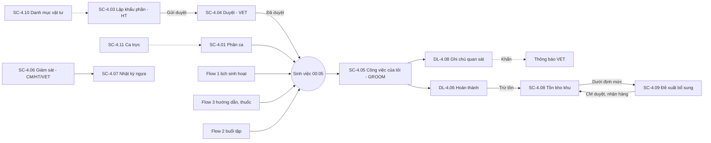
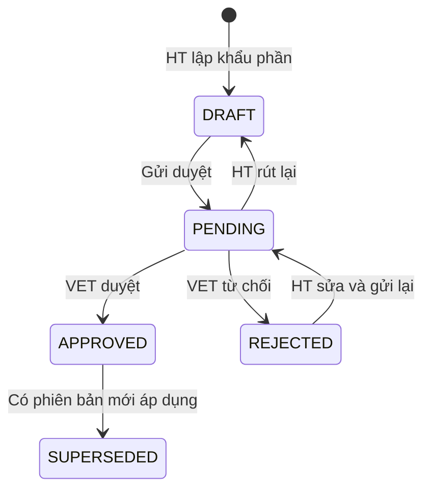

# ĐẶC TẢ LUỒNG & MÀN HÌNH – FLOW 4: CHĂM SÓC CHUỒNG TRẠI & DINH DƯỠNG HẰNG NGÀY

**Dự án:** RACEHORSE_TRAINING · **Bản:** 1.0 · **Loại flow:** Tùy chọn (optional)

**Quy ước mã:** `SC-4.xx` = màn hình, `DL-4.xx` = dialog, `BTN-4.xx` = nút, `FR-4.xx` = chức năng, `Q-4.xx` = câu hỏi mở (Mục 9). Mã các flow khác (`SC-1.xx`, `DL-3.xx`) được dẫn chiếu khi cần.
**Vai trò:** CM = Club Manager · HT = Head Trainer · VET = Veterinarian · GROOM = Groom / Stable Hand · OWNER = Horse Owner.
**Quy ước hiển thị chung:** ngày `dd/MM/yyyy`, giờ `HH:mm`, giờ Việt Nam (UTC+7); khối lượng kg hoặc g, thể tích lít hoặc ml, số lượng theo đơn vị của vật tư; số thập phân dùng dấu phẩy. Breakpoint: Mobile < 768px · Tablet 768–1199px · Desktop ≥ 1200px. Các màn hình của GROOM ưu tiên Mobile (nút tối thiểu 44 × 44px, thao tác được bằng một tay).

---

## 1. Mục tiêu và phạm vi

**Mục tiêu:** Số hóa công việc chăm sóc hằng ngày: phân ca, khẩu phần dinh dưỡng được duyệt, checklist công việc có xác nhận, theo dõi tồn kho vật tư theo khu và đề xuất bổ sung.

| Làm (In scope) | Nguồn |
|---|---|
| Sơ đồ phân bổ chuồng, phân chia ca trực, danh sách ngựa phụ trách cho nhân viên chăm sóc | Tài liệu gốc – gạch 1 |
| Thiết lập và duyệt khẩu phần (cỏ khô, ngũ cốc, vitamin, khoáng chất, chất điện giải) cho từng bữa | Tài liệu gốc – gạch 2 |
| Checklist công việc (cho ăn, vệ sinh chuồng, tắm rửa, ngâm chân nước đá) và xác nhận hoàn thành | Tài liệu gốc – gạch 3 |
| Theo dõi tiêu hao và tồn kho vật tư theo khu; tạo đề xuất bổ sung gửi CM | Tài liệu gốc – gạch 4 |
| Ghi chú quan sát sức khỏe trong ca trực | Mục 6 tài liệu gốc |
| Danh mục vật tư (thức ăn, thuốc, dụng cụ) | Mục 2 – vai trò CM ("Danh mục vật tư y tế & thức ăn") |
| Danh mục ca trực | [BỔ SUNG] – cần giờ bắt đầu/kết thúc ca để phân ca và chia việc |
| Sao chép phân ca tuần, giao lại công việc | [BỔ SUNG] – giảm thao tác, xử lý khi nhân viên vắng |
| Công việc sinh từ chỉ định y tế (Flow 3) và buổi tập (Flow 2) | [BỔ SUNG] – để checklist phản ánh đủ việc thực tế |

| Không làm (Out of scope) | Thuộc về |
|---|---|
| Khai báo khu chuồng, ô chuồng, gán ngựa vào ô, phân công người chăm sóc chính/phụ | Flow 1 (Flow 4 dùng lại) |
| Lịch sinh hoạt mẫu | Flow 1 |
| Kê đơn thuốc, hướng dẫn chăm sóc y tế | Flow 3 |
| Mua hàng, nhà cung cấp, hóa đơn mua | Không có trong tài liệu gốc (Q-4.09) |
| Chi phí vật tư theo ngựa | Flow 5 (dùng dữ liệu tiêu hao × đơn giá) |
| Báo cáo sự cố kèm ảnh | Loại trừ theo tài liệu gốc |

---

## 2. Vai trò và quyền

**Phạm vi dữ liệu:** *Tất cả* = mọi khu/ngựa · *Khu của tôi* = khu chuồng GROOM có ca trực trong ngày hoặc có ngựa được giao · *Được giao* = ngựa GROOM đang chăm sóc (Flow 1) hoặc có công việc giao cho GROOM trong ngày.

| Chức năng | CM | HT | VET | GROOM | OWNER |
|---|---|---|---|---|---|
| Xem sơ đồ chuồng (SC-1.04) | Xem | Xem | Xem | Xem | — |
| Phân ca trực, sao chép phân ca | Tạo/Sửa | Xem | Xem | Xem ca của mình | — |
| Lập, sửa, gửi duyệt khẩu phần | — | Có | — | — | — |
| Duyệt / từ chối khẩu phần | — | — | Có | — | — |
| Xem khẩu phần | Tất cả | Tất cả | Tất cả | Được giao (chỉ bản Đã duyệt) | — (Q-4.08) |
| Xem và xác nhận checklist công việc | Xem | Xem | Xem | Xác nhận việc của mình | — |
| Giao lại công việc | Có | Có | — | — | — |
| Ghi chú quan sát sức khỏe | Xem | Xem | Xem | Tạo (ngựa được giao hoặc ngựa trong khu đang trực) | — |
| Nhật ký chăm sóc theo ngựa | Tất cả | Tất cả | Tất cả | Được giao | — |
| Xem tồn kho khu | Tất cả | Tất cả | Tất cả | Khu của tôi | — |
| Ghi tiêu hao thủ công | Có | — | — | Khu của tôi | — |
| Kiểm kê điều chỉnh, đặt định mức tối thiểu | Có | — | — | — | — |
| Tạo đề xuất bổ sung vật tư | Có | — | Có (thuốc, vaccine) | Khu của tôi | — |
| Duyệt / từ chối đề xuất | Có | — | — | — | — |
| Xác nhận nhận hàng | Có | — | — | Khu của tôi | — |
| Danh mục vật tư | Xem/Thêm/Sửa/Ngừng dùng | Xem | Xem | Xem | — |
| Danh mục ca trực | Xem/Thêm/Sửa/Ngừng dùng | Xem | Xem | Xem | — |

---

## 3. Sơ đồ luồng tổng thể

### 3.1 Danh sách màn hình

| Mã | Tên màn hình | URL | Vai trò |
|---|---|---|---|
| SC-4.01 | Phân ca trực | `/stable/shifts` | CM, HT, VET, GROOM |
| SC-4.02 | Danh sách khẩu phần | `/nutrition/rations` | CM, HT, VET, GROOM |
| SC-4.03 | Lập / Sửa khẩu phần | `/nutrition/rations/new`, `/nutrition/rations/:id/edit` | HT |
| SC-4.04 | Chi tiết khẩu phần & duyệt | `/nutrition/rations/:id` | CM, HT, VET, GROOM |
| SC-4.05 | Công việc của tôi | `/my/tasks` | GROOM |
| SC-4.06 | Giám sát chăm sóc | `/stable/tasks` | CM, HT, VET |
| SC-4.07 | Nhật ký chăm sóc ngựa | `/stable/horses/:id/care-log` | CM, HT, VET, GROOM |
| SC-4.08 | Tồn kho khu vực | `/inventory/stock` | CM, HT, VET, GROOM |
| SC-4.09 | Đề xuất bổ sung vật tư | `/inventory/requests` | CM, VET, GROOM |
| SC-4.10 | Danh mục vật tư | `/catalogs/supplies` | CM, HT, VET, GROOM |
| SC-4.11 | Danh mục ca trực [BỔ SUNG] | `/catalogs/shifts` | CM, HT, VET, GROOM |

Sơ đồ phân bổ chuồng dùng lại **SC-1.04** (Flow 1); SC-4.01 có link sang.

### 3.2 Các luồng chính

**L1 – Chuẩn bị (CM, HT, VET)**
1. CM khai báo vật tư (SC-4.10), ca trực (SC-4.11).
2. CM phân ca tuần (SC-4.01): mỗi ô (ngày × ca × khu) chọn nhân viên trực.
3. HT lập khẩu phần cho ngựa (SC-4.03) → gửi duyệt → VET duyệt (SC-4.04). Khẩu phần có hiệu lực từ ngày chọn.

**L2 – Sinh công việc hằng ngày (Hệ thống, 00:05 mỗi ngày)**
Hệ thống tạo công việc ngày hôm đó cho từng ngựa đang quản lý:

| Nguồn | Công việc tạo ra |
|---|---|
| Khẩu phần Đã duyệt đang hiệu lực | Mỗi bữa 1 việc "Cho ăn – Bữa {n}" kèm danh sách thành phần |
| Lịch sinh hoạt (Flow 1) | Mỗi mục Vệ sinh chuồng, Tắm rửa, Ngâm chân nước đá 1 việc. Mục Cho ăn chỉ dùng khi ngựa chưa có khẩu phần Đã duyệt. Mục Tập luyện, Nghỉ ngơi chỉ hiển thị, không tạo việc |
| Hướng dẫn chăm sóc của giai đoạn điều trị (Flow 3) | Mỗi lần/ngày 1 việc, giờ chia đều trong khung 06:00–20:00 |
| Đơn thuốc đang dùng (Flow 3) | Mỗi lần dùng 1 việc "Cho dùng thuốc" |
| Buổi tập Đã lên lịch (Flow 2) | 1 việc "Chuẩn bị ngựa đi tập" trước giờ tập 30 phút, giao cho GROOM được phân công ở buổi tập |

**Người nhận việc:** theo thứ tự: (1) GROOM phụ trách chính nếu đang có ca trực chứa giờ của việc; (2) GROOM phụ trách phụ đang có ca; (3) nếu không ai: việc vào "Việc chung của khu", mọi GROOM đang trực khu đó thấy và bấm **Nhận việc**.

**L3 – Làm việc trong ca (GROOM, điện thoại)**
1. Mở SC-4.05 → danh sách việc ca hiện tại theo giờ hoặc theo ngựa.
2. Làm xong → **Hoàn thành** (việc cho ăn, cho thuốc mở DL-4.06 để ghi mức ăn/đã cho thuốc).
3. Không làm được → **Không thực hiện được** (DL-4.07, lý do).
4. Thấy dấu hiệu lạ → **Ghi chú quan sát** (DL-4.08); mức Khẩn → VET nhận thông báo ngay.

**L4 – Giám sát (CM, HT, VET)**: SC-4.06 → xem tỷ lệ hoàn thành theo khu/ngựa/nhân viên; việc quá giờ tô đỏ; **Giao lại** việc khi nhân viên vắng.

**L5 – Vật tư (GROOM, CM)**
1. Cho ăn hoàn thành → tồn kho khu tự trừ theo định lượng. Thuốc, dụng cụ → GROOM ghi tiêu hao thủ công (DL-4.09).
2. Tồn dưới định mức tối thiểu → cảnh báo; GROOM **Tạo đề xuất bổ sung** (DL-4.12).
3. CM **Duyệt** (DL-4.13) → khi hàng về, CM hoặc GROOM **Xác nhận nhận hàng** (DL-4.14) → tồn kho tăng.

---

## 4. Vòng đời trạng thái

### 4.1 Khẩu phần

| Mã | Nhãn | Màu |
|---|---|---|
| DRAFT | Nháp | Xám |
| PENDING | Chờ duyệt | Vàng |
| APPROVED | Đã duyệt | Xanh lá (thêm nhãn "Đang áp dụng" khi đang hiệu lực, "Sắp áp dụng" khi ngày hiệu lực > hôm nay) |
| REJECTED | Bị từ chối | Đỏ |
| SUPERSEDED | Hết hiệu lực | Xám đậm |

| Từ | Đến | Ai | Điều kiện | Tác dụng phụ |
|---|---|---|---|---|
| (Tạo) | Nháp | HT | Ngựa không Ngừng quản lý | — |
| Nháp, Bị từ chối | Chờ duyệt | HT | Có ít nhất 1 bữa, mỗi bữa ít nhất 1 thành phần; ngày hiệu lực ≥ hôm nay | Thông báo mọi VET |
| Chờ duyệt | Nháp | HT (rút lại) | — | — |
| Chờ duyệt | Đã duyệt | VET | Ngày hiệu lực ≥ hôm nay | Khẩu phần Đã duyệt trước đó của ngựa chuyển Hết hiệu lực từ ngày hiệu lực mới; thông báo HT, GROOM phụ trách |
| Chờ duyệt | Bị từ chối | VET | Lý do 10–500 ký tự | Thông báo HT |
| Đã duyệt | Hết hiệu lực | Hệ thống | Có khẩu phần mới được duyệt và đến ngày hiệu lực; hoặc ngựa Ngừng quản lý | — |

Mỗi ngựa tại một ngày chỉ có tối đa 1 khẩu phần Đang áp dụng. Khẩu phần Đã duyệt không sửa được; muốn đổi thì **Tạo phiên bản mới**.

### 4.2 Công việc hằng ngày

| Mã | Nhãn | Màu |
|---|---|---|
| PENDING | Chưa làm | Xám |
| OVERDUE | Quá giờ | Đỏ |
| DONE | Hoàn thành | Xanh lá |
| NOT_DONE | Không thực hiện được | Cam |
| CANCELLED | Đã hủy | Xám nhạt, gạch ngang |

| Từ | Đến | Ai | Điều kiện |
|---|---|---|---|
| (Sinh) | Chưa làm | Hệ thống | 00:05 mỗi ngày, hoặc ngay khi có nguồn mới trong ngày (thuốc mới, buổi tập mới) |
| Chưa làm | Quá giờ | Hệ thống | Quá giờ dự kiến 120 phút |
| Chưa làm, Quá giờ | Hoàn thành | GROOM nhận việc | Trong ngày của việc hoặc trước 12:00 ngày hôm sau |
| Chưa làm, Quá giờ | Không thực hiện được | GROOM nhận việc | Lý do bắt buộc |
| Hoàn thành, Không thực hiện được | Chưa làm (hoàn tác) | Người vừa xác nhận | Trong 15 phút sau khi xác nhận |
| Chưa làm, Quá giờ | Đã hủy | Hệ thống | Nguồn bị hủy (buổi tập bị hủy hoặc Bị chặn – Khóa y tế, thuốc dừng, ngựa Ngừng quản lý) |

**Liên quan Medical Lock:** buổi tập chuyển "Bị chặn – Khóa y tế" (Flow 2) → việc "Chuẩn bị ngựa đi tập" tự Đã hủy, thẻ việc ghi "Đã hủy do Khóa huấn luyện y tế". Ngựa đang khóa hiện icon ổ khóa đỏ trên mọi thẻ việc.

### 4.3 Đề xuất bổ sung vật tư

| Mã | Nhãn | Màu |
|---|---|---|
| PENDING | Chờ duyệt | Vàng |
| APPROVED | Đã duyệt | Xanh dương |
| PARTIALLY_RECEIVED | Nhận một phần | Xanh dương nhạt |
| RECEIVED | Đã nhận đủ | Xanh lá |
| REJECTED | Bị từ chối | Đỏ |
| CANCELLED | Đã hủy | Xám |

| Từ | Đến | Ai | Điều kiện / Tác dụng |
|---|---|---|---|
| (Tạo) | Chờ duyệt | GROOM, VET, CM | Thông báo CM |
| Chờ duyệt | Đã hủy | Người tạo | — |
| Chờ duyệt | Đã duyệt | CM | CM được sửa số lượng duyệt (≤ số lượng đề xuất × 2); thông báo người tạo |
| Chờ duyệt | Bị từ chối | CM | Lý do 10–500 ký tự; thông báo người tạo |
| Đã duyệt, Nhận một phần | Nhận một phần / Đã nhận đủ | CM, GROOM của khu | Ghi số lượng nhận; tồn kho khu tăng tương ứng |
| Đã duyệt, Nhận một phần | Đã nhận đủ (đóng) | CM | "Đóng đề xuất" khi không nhận thêm; lý do bắt buộc |

---

## 5. Đặc tả màn hình

**Quy ước chung:** Đang tải: skeleton. Lỗi tải: "Không tải được dữ liệu" + **Thử lại**. Mất mạng: toast đỏ "Mất kết nối mạng. Vui lòng thử lại." Dữ liệu bị sửa cùng lúc: toast "Dữ liệu đã được người khác cập nhật. Vui lòng tải lại trước khi lưu." + **Tải lại**. Nút không có quyền: ẩn. Nút bị chặn do trạng thái: hiện, vô hiệu hóa, tooltip lý do.

### 5.1 SC-4.01 – Phân ca trực

**Mục đích:** Chia ca trực cho nhân viên chăm sóc theo khu chuồng và xem ai đang phụ trách ngựa nào. **Vai trò:** CM (sửa); HT, VET (xem); GROOM (xem, mặc định lọc ca của mình).

**Bố cục**
- **Thanh công cụ:** điều hướng tuần, bộ lọc Khu chuồng, link **Xem sơ đồ chuồng** (mở SC-1.04).
- **Lưới tuần (Desktop, Tablet):** hàng = Khu chuồng × Ca (ví dụ "Khu A – Ca sáng"), cột = 7 ngày. Mỗi ô liệt kê tên nhân viên trực; ô trống có nền đỏ nhạt và chữ "Chưa có người trực".
- **Mobile:** chọn 1 ngày, danh sách thẻ theo Khu → Ca → nhân viên.
- **Panel "Ngựa phụ trách trong ca"** khi bấm tên nhân viên: danh sách ngựa của khu đó mà nhân viên là người chính/phụ (Flow 1) + số ngựa không có người chính/phụ trực ca (sẽ vào Việc chung).

**Nút**

| Mã | Nút | Vai trò | Hành vi |
|---|---|---|---|
| BTN-4.01 | Tuần trước | Tất cả | Lùi 1 tuần |
| BTN-4.02 | Tuần sau | Tất cả | Tiến 1 tuần |
| BTN-4.03 | Tuần này | Tất cả | Về tuần hiện tại |
| BTN-4.04 | Sửa ô phân ca (bấm ô) | CM | Mở DL-4.01. Ô của ngày đã qua: chỉ xem |
| BTN-4.05 | Sao chép từ tuần trước | CM | Mở DL-4.02 |
| BTN-4.06 | Chỉ ca của tôi | GROOM | Công tắc, mặc định bật |

**Cảnh báo trên lưới:** nhân viên có 2 ca liền nhau vượt 16 giờ → icon cam "Nhân viên {Họ tên} trực liên tục {n} giờ." Nhân viên trực 2 khu cùng ca → icon cam.
**Trạng thái giao diện:** Chưa có ca trực trong danh mục: "Chưa khai báo ca trực." + link SC-4.11 (CM). Chưa có khu chuồng: "Chưa khai báo khu chuồng." + link SC-1.07 (CM).

### 5.2 SC-4.02 – Danh sách khẩu phần

**Mục đích:** Tra cứu khẩu phần theo ngựa và trạng thái. **Vai trò:** CM, HT, VET (tất cả); GROOM (ngựa được giao, chỉ bản Đã duyệt).

**Bộ lọc:** Tìm ngựa · Trạng thái (mặc định Chờ duyệt + Đã duyệt) · Chỉ đang áp dụng (checkbox) · Khu chuồng.

**Thẻ nhanh (HT, VET):** "Chờ duyệt: {n}" · "Ngựa chưa có khẩu phần đã duyệt: {m}". Bấm = lọc.

**Bảng**

| Cột | Hiển thị | Sắp xếp |
|---|---|---|
| Mã khẩu phần | `KP-000031` | Có |
| Ngựa | Tên + badge trạng thái ngựa + icon khóa | Có |
| Phiên bản | "v3" | Không |
| Số bữa/ngày | Số | Không |
| Tổng năng lượng tham khảo | "{n} kg thức ăn/ngày" (tổng khối lượng thức ăn) | Có |
| Hiệu lực từ | `dd/MM/yyyy` | Có |
| Trạng thái | Badge Mục 4.1 | Có |
| Người lập / Người duyệt | Họ tên | Không |
| Hành động | Xem | — |

| Mã | Nút | Vai trò | Hành vi |
|---|---|---|---|
| BTN-4.07 | Lập khẩu phần | HT | Mở SC-4.03 |
| BTN-4.08 | Xem (mỗi dòng) / bấm dòng | Tất cả | Mở SC-4.04 |
| BTN-4.09 | Xóa bộ lọc | Tất cả | Bộ lọc về mặc định |

**Trạng thái giao diện:** "Chưa có khẩu phần nào." GROOM: "Các ngựa bạn phụ trách chưa có khẩu phần được duyệt."

### 5.3 SC-4.03 – Lập / Sửa khẩu phần

**Mục đích:** Thiết lập định mức dinh dưỡng từng bữa. **Vai trò:** HT. Chỉ sửa bản Nháp hoặc Bị từ chối.

**Bố cục:** Khối Thông tin chung → danh sách thẻ Bữa ăn → khối Tổng hợp theo ngày (Desktop: cột phải cố định; Mobile: cuối trang) → thanh nút.

**Khối Thông tin chung**

| Nhãn | Loại | Bắt buộc | Quy tắc | Thông báo lỗi |
|---|---|---|---|---|
| Ngựa | Dropdown có tìm kiếm; chỉ đọc khi sửa hoặc tạo phiên bản mới | Có | Ngựa không Ngừng quản lý; không có bản Nháp/Chờ duyệt khác | "Vui lòng chọn ngựa." / "Ngựa đang có khẩu phần {Mã} ở trạng thái {Nhãn}." |
| Hiệu lực từ ngày | Date picker, mặc định ngày mai | Có | ≥ hôm nay; ≤ hôm nay + 60 ngày | "Ngày hiệu lực không được trước ngày hiện tại." / "Ngày hiệu lực tối đa 60 ngày tới." |
| Cân nặng tham chiếu (kg) | Số, mặc định = cân nặng gần nhất từ Flow 3 | Không | 200–800 | "Cân nặng phải từ 200 đến 800 kg." |
| Ghi chú | Textarea | Không | ≤ 500 ký tự | "Ghi chú tối đa 500 ký tự." |

**Thẻ Bữa ăn** (1–6 bữa)

| Nhãn | Loại | Bắt buộc | Quy tắc | Thông báo lỗi |
|---|---|---|---|---|
| Tên bữa | Text, mặc định "Bữa {n}" | Có | 2–50 ký tự | "Tên bữa phải từ 2 đến 50 ký tự." |
| Giờ cho ăn | Time picker bước 15 phút | Có | Không trùng giờ bữa khác | "Giờ cho ăn bị trùng với {Tên bữa}." |

Bảng thành phần trong bữa (1–15 dòng):

| Cột | Loại | Bắt buộc | Quy tắc | Thông báo lỗi |
|---|---|---|---|---|
| Nhóm | Chỉ đọc theo vật tư: Cỏ khô · Ngũ cốc · Vitamin · Khoáng chất · Chất điện giải · Thực phẩm bổ sung | — | | |
| Vật tư | Dropdown có tìm kiếm (danh mục vật tư nhóm thức ăn, đang dùng) | Có | Không trùng trong cùng bữa | "Vui lòng chọn vật tư." / "Vật tư bị trùng trong bữa." |
| Định lượng | Số, tối đa 3 chữ số thập phân | Có | > 0 và ≤ 50 (kg/lít) hoặc ≤ 50 000 (g/ml) | "Định lượng phải lớn hơn 0 và không vượt quá {max} {đơn vị}." |
| Đơn vị | Chỉ đọc theo vật tư | — | | |
| Ghi chú | Text | Không | ≤ 200 ký tự | — |
| (Xóa dòng) | Nút icon | — | — | — |

**Khối Tổng hợp theo ngày:** bảng Nhóm · Tổng định lượng/ngày; dòng "Tổng thức ăn: {x} kg/ngày" và "Tỷ lệ so với cân nặng: {y}%". Cảnh báo vàng (không chặn) khi tổng thức ăn khô ngoài 1,5–3,0% cân nặng tham chiếu: "Tổng thức ăn {y}% cân nặng, ngoài khoảng tham khảo 1,5–3,0%." (Q-4.05).

**Nút**

| Mã | Nút | Hành vi |
|---|---|---|
| BTN-4.10 | Thêm bữa | Thêm thẻ bữa; vô hiệu hóa khi đủ 6 bữa |
| BTN-4.11 | Xóa bữa (mỗi thẻ) | Xóa thẻ; vô hiệu hóa khi chỉ còn 1 bữa ("Khẩu phần phải có ít nhất 1 bữa.") |
| BTN-4.12 | Thêm thành phần (mỗi thẻ) | Thêm dòng; vô hiệu hóa khi đủ 15 dòng |
| BTN-4.13 | Xóa thành phần (mỗi dòng) | Xóa dòng |
| BTN-4.14 | Nhân bản bữa (mỗi thẻ) | Tạo thẻ bữa mới giống hệt, giờ để trống |
| BTN-4.15 | Lưu nháp | Lưu → toast "Đã lưu nháp khẩu phần." → SC-4.04 |
| BTN-4.16 | Lưu và gửi duyệt | Kiểm tra: mỗi bữa ≥ 1 thành phần ("Bữa {Tên} chưa có thành phần.") → lưu → mở DL-4.03 |
| BTN-4.17 | Hủy | Quay lại; có thay đổi → DL-4.17 |

### 5.4 SC-4.04 – Chi tiết khẩu phần & duyệt

**Mục đích:** Xem khẩu phần, VET duyệt/từ chối, GROOM xem khẩu phần đang áp dụng theo bữa. **Vai trò:** CM, HT, VET, GROOM (bản Đã duyệt của ngựa được giao).

**Bố cục:** Header (Mã, Ngựa, Phiên bản, badge trạng thái, Hiệu lực từ, Người lập, Người duyệt, Thời điểm duyệt, thanh nút) → Banner (Bị từ chối: nền đỏ "Bị từ chối bởi BS. {Họ tên}: {lý do}") → danh sách bữa (mỗi bữa: giờ, bảng thành phần Nhóm · Vật tư · Định lượng · Đơn vị · Ghi chú) → Tổng hợp theo ngày → Lịch sử phiên bản (bảng Phiên bản · Hiệu lực từ · Trạng thái · Người duyệt; bấm để mở).
GROOM trên Mobile: mỗi bữa là một thẻ lớn, chữ định lượng cỡ 18px.

**Nút**

| Mã | Nút | Vai trò | Hiện khi | Hành vi |
|---|---|---|---|---|
| BTN-4.18 | Sửa | HT | Nháp, Bị từ chối | Mở SC-4.03 |
| BTN-4.19 | Gửi duyệt | HT | Nháp, Bị từ chối | Mở DL-4.03 |
| BTN-4.20 | Rút lại | HT | Chờ duyệt | Hộp xác nhận "Rút lại yêu cầu duyệt? Khẩu phần trở về Nháp." |
| BTN-4.21 | Duyệt | VET | Chờ duyệt | Mở DL-4.04 |
| BTN-4.22 | Từ chối | VET | Chờ duyệt | Mở DL-4.05 |
| BTN-4.23 | Tạo phiên bản mới | HT | Đã duyệt | Mở SC-4.03 điền sẵn nội dung; phiên bản tăng 1 |
| BTN-4.24 | So sánh với phiên bản đang áp dụng | CM, HT, VET | Chờ duyệt và ngựa đã có bản Đã duyệt | Công tắc: tô xanh thành phần thêm mới, tô đỏ thành phần bỏ, tô vàng định lượng thay đổi (kèm giá trị cũ) |

### 5.5 SC-4.05 – Công việc của tôi (GROOM)

**Mục đích:** Checklist công việc trong ca, xác nhận hoàn thành, ghi chú quan sát. **Vai trò:** GROOM.

**Bố cục (ưu tiên Mobile)**
- **Header:** Ca hiện tại (tên ca, giờ), khu trực, thanh tiến độ "{đã xong}/{tổng} việc".
- **Tab:** **Ca hiện tại** · **Cả ngày** · **Việc chung của khu** (BTN-4.25). Tab Việc chung có số đếm.
- **Công tắc nhóm:** Theo giờ / Theo ngựa (BTN-4.26); mặc định Theo giờ.
- **Danh sách thẻ việc.** Mỗi thẻ: giờ dự kiến · icon loại việc · tên việc · tên ngựa + ô chuồng · icon khóa đỏ nếu ngựa đang Khóa huấn luyện · nhãn "Cách ly" tím nếu ngựa đang cách ly · badge trạng thái · nút hành động.
- Việc Cho ăn: thẻ mở rộng hiện bảng thành phần của bữa (vật tư, định lượng).
- Việc Ngâm chân nước đá / chăm sóc theo chỉ định: hiện thời lượng và ghi chú của VET.
- Việc Cho dùng thuốc: hiện tên thuốc, liều, đường dùng.
- Ngựa đang cách ly: thẻ có dòng nhắc "Tuân thủ quy trình cách ly: dùng dụng cụ riêng, thay bảo hộ sau khi chăm sóc." (Q-4.07).

**Nút**

| Mã | Nút | Vị trí | Hiện khi | Hành vi |
|---|---|---|---|---|
| BTN-4.25 | Ca hiện tại / Cả ngày / Việc chung | Tab | Luôn | Đổi danh sách |
| BTN-4.26 | Theo giờ / Theo ngựa | Công tắc | Luôn | Đổi cách nhóm |
| BTN-4.27 | Hoàn thành | Mỗi thẻ | Chưa làm, Quá giờ | Việc Vệ sinh chuồng, Tắm rửa, Ngâm chân, Chăm sóc theo chỉ định, Chuẩn bị đi tập: xác nhận ngay, toast "Đã hoàn thành." kèm nút Hoàn tác. Việc Cho ăn, Cho dùng thuốc: mở DL-4.06 |
| BTN-4.28 | Không thực hiện được | Menu "⋯" của thẻ | Chưa làm, Quá giờ | Mở DL-4.07 |
| BTN-4.29 | Hoàn tác | Thẻ đã xác nhận | Trong 15 phút sau khi xác nhận, đúng người xác nhận | Việc trở về Chưa làm (hoặc Quá giờ); nếu là Cho ăn thì hoàn lại tồn kho |
| BTN-4.30 | Ghi chú quan sát | Nút nổi góc phải dưới; và trong nhóm "Theo ngựa" mỗi ngựa 1 nút | Luôn | Mở DL-4.08 |
| BTN-4.31 | Nhận việc | Thẻ trong tab Việc chung | Việc chưa có người nhận | Việc chuyển sang danh sách của mình; toast "Đã nhận việc." Người khác vừa nhận trước: "Việc đã được {Họ tên} nhận." |

**Trạng thái giao diện**
- Không trong ca trực: "Bạn không có ca trực lúc này. Ca tiếp theo: {Tên ca} {dd/MM HH:mm}." Tab Cả ngày vẫn xem được.
- Không có việc: "Không có công việc nào trong ca."
- Mất mạng: xác nhận được lưu tạm trên thiết bị, thẻ hiện icon đồng hồ "Chờ gửi"; tự gửi lại khi có mạng; nếu server từ chối (việc đã bị giao lại hoặc hủy) → toast "Việc {Tên} đã thay đổi, xác nhận của bạn không được ghi." (Q-4.10).
- Dữ liệu tự làm mới mỗi 2 phút và khi kéo xuống.

### 5.6 SC-4.06 – Giám sát chăm sóc

**Mục đích:** Theo dõi tiến độ checklist toàn chuồng, xử lý việc quá giờ. **Vai trò:** CM, HT (xem, giao lại); VET (xem).

**Bố cục:** Thanh công cụ (ngày, chế độ xem) → hàng thẻ chỉ số → bảng tổng hợp → bảng công việc chi tiết (mở khi bấm 1 dòng tổng hợp).

**Thẻ chỉ số (ngày đang chọn):** Tỷ lệ hoàn thành (%) · Quá giờ (số việc) · Không thực hiện được (số việc) · Việc chung chưa ai nhận · Ghi chú quan sát Cần chú ý/Khẩn.

**Điều khiển**

| Mã | Thành phần | Hành vi |
|---|---|---|
| BTN-4.32 | Chọn ngày (date picker + nút Hôm nay) | Đổi ngày xem; tối đa 90 ngày trước |
| BTN-4.33 | Xem theo: Khu / Ngựa / Nhân viên | Đổi cách tổng hợp |

**Bảng tổng hợp (theo Khu):** Khu · Số ngựa · Tổng việc · Hoàn thành · Quá giờ · Không thực hiện · Tỷ lệ (%) (thanh màu: ≥ 90% xanh, 70–89% vàng, < 70% đỏ). Theo Ngựa: thêm cột Người chăm sóc chính, icon khóa. Theo Nhân viên: Họ tên · Ca · Số việc được giao · Hoàn thành · Quá giờ · Tỷ lệ.

**Bảng công việc chi tiết:** Giờ dự kiến · Việc · Ngựa · Người nhận · Trạng thái · Thời điểm xác nhận · Ghi chú/Lý do · Hành động.

| Mã | Nút | Vai trò | Hiện khi | Hành vi |
|---|---|---|---|---|
| BTN-4.34 | Xem nhật ký ngựa | CM, HT, VET | Dòng theo Ngựa | Mở SC-4.07 |
| BTN-4.35 | Giao lại (mỗi việc) | CM, HT | Việc Chưa làm hoặc Quá giờ của ngày hôm nay | Mở DL-4.18 |

**Trạng thái giao diện:** "Không có công việc nào trong ngày {dd/MM/yyyy}."

### 5.7 SC-4.07 – Nhật ký chăm sóc ngựa

**Mục đích:** Xem toàn bộ lịch sử chăm sóc và ghi chú quan sát của 1 ngựa. **Vai trò:** CM, HT, VET (tất cả); GROOM (ngựa được giao). Có link từ SC-1.03 (Flow 1) và SC-3.02 (Flow 3).

**Bố cục:** Header (tên ngựa, ô chuồng, người chăm sóc chính, khẩu phần đang áp dụng – link SC-4.04) → bộ lọc → danh sách theo ngày (mỗi ngày gập/mở được).

**Bộ lọc:** Khoảng ngày (mặc định 7 ngày gần nhất, tối đa 90 ngày một lần) · Loại việc (chọn nhiều) · Trạng thái việc · Chỉ ghi chú quan sát (checkbox).

**Mỗi ngày:** tỷ lệ hoàn thành; bảng việc (Giờ · Việc · Người làm · Trạng thái · Mức ăn (với Cho ăn) · Ghi chú); các ghi chú quan sát (ca, người ghi, mức lưu ý, nội dung, thời điểm).

| Mã | Nút | Vai trò | Hành vi |
|---|---|---|---|
| BTN-4.36 | Ghi chú quan sát | GROOM | Mở DL-4.08 điền sẵn ngựa |

**Trạng thái giao diện:** "Chưa có dữ liệu chăm sóc trong khoảng thời gian này."

### 5.8 SC-4.08 – Tồn kho khu vực

**Mục đích:** Theo dõi số lượng tồn và mức tiêu hao vật tư tại từng khu chuồng. **Vai trò:** CM (tất cả khu, đủ thao tác); HT, VET (xem); GROOM (khu của tôi).

**Bố cục:** Chọn khu (GROOM: chỉ khu của mình) → hàng thẻ (Số vật tư dưới định mức · Số vật tư hết hàng · Đề xuất đang chờ duyệt) → bảng tồn kho → panel lịch sử nhập/xuất khi bấm dòng.

**Bộ lọc:** Tìm vật tư · Nhóm vật tư · Tình trạng (Tất cả / Dưới định mức / Hết hàng).

**Bảng**

| Cột | Hiển thị | Sắp xếp |
|---|---|---|
| Vật tư | Tên + Mã | Có |
| Nhóm | Nhãn | Có |
| Tồn hiện tại | Số + đơn vị; đỏ khi = 0, cam khi < định mức | Có |
| Định mức tối thiểu | Số hoặc "Chưa đặt" | Có |
| Tiêu hao TB/ngày (14 ngày) | Số | Có |
| Đủ dùng khoảng | "{n} ngày" = Tồn ÷ Tiêu hao TB; "—" khi tiêu hao = 0 | Có (mặc định tăng dần) |
| Đang chờ nhận | Số lượng đã duyệt chưa nhận | Không |
| Hành động | Theo bảng dưới | — |

| Mã | Nút | Vai trò | Hành vi |
|---|---|---|---|
| BTN-4.37 | Ghi tiêu hao (mỗi dòng hoặc thanh công cụ) | CM, GROOM | Mở DL-4.09 |
| BTN-4.38 | Kiểm kê điều chỉnh | CM | Mở DL-4.10 |
| BTN-4.39 | Đặt định mức (mỗi dòng) | CM | Mở DL-4.11 |
| BTN-4.40 | Tạo đề xuất bổ sung | GROOM, CM, VET | Mở DL-4.12; nếu đã chọn các dòng dưới định mức thì điền sẵn các vật tư đó với số lượng gợi ý = Định mức × 2 − Tồn |
| BTN-4.41 | Xem lịch sử (mỗi dòng) | Tất cả | Mở panel: bảng Thời điểm · Loại (Nhập từ đề xuất / Tiêu hao tự động – cho ăn / Tiêu hao thủ công / Kiểm kê) · Số lượng (+/−) · Tồn sau · Người thực hiện · Ghi chú; phân trang 30 dòng |

**Cảnh báo tự động:** khi tồn xuống dưới định mức → thông báo GROOM trực khu và CM (tối đa 1 lần/ngày cho mỗi vật tư mỗi khu).
**Trạng thái giao diện:** "Khu này chưa có vật tư nào trong kho."

### 5.9 SC-4.09 – Đề xuất bổ sung vật tư

**Mục đích:** Tạo, theo dõi, duyệt đề xuất và xác nhận nhận hàng. **Vai trò:** GROOM (đề xuất của khu mình), VET (đề xuất mình tạo), CM (tất cả).

**Bộ lọc:** Trạng thái (mặc định Chờ duyệt + Đã duyệt + Nhận một phần) · Khu · Mức ưu tiên · Khoảng ngày tạo · Người tạo.

**Bảng**

| Cột | Hiển thị | Sắp xếp |
|---|---|---|
| Mã đề xuất | `DX-000102` | Có |
| Khu | Tên khu | Có |
| Số dòng vật tư | Số | Không |
| Mức ưu tiên | Badge: Thường (xám) / Gấp (đỏ) | Có |
| Ngày tạo | `dd/MM/yyyy HH:mm` | Có (mặc định mới nhất) |
| Người tạo | Họ tên | Không |
| Trạng thái | Badge Mục 4.3 | Có |
| Hành động | Theo bảng dưới | — |

Bấm dòng → panel chi tiết: bảng Vật tư · SL đề xuất · SL duyệt · SL đã nhận · Lý do; lịch sử xử lý (thời điểm, người, hành động, ghi chú).

| Mã | Nút | Vai trò | Hiện khi | Hành vi |
|---|---|---|---|---|
| BTN-4.42 | Tạo đề xuất | GROOM, VET, CM | Luôn | Mở DL-4.12 |
| BTN-4.43 | Xem (mỗi dòng) | Tất cả | Luôn | Mở panel chi tiết |
| BTN-4.44 | Hủy đề xuất | Người tạo | Chờ duyệt | Hộp xác nhận → Đã hủy |
| BTN-4.45 | Duyệt / Từ chối | CM | Chờ duyệt | Mở DL-4.13 |
| BTN-4.46 | Xác nhận nhận hàng | CM, GROOM của khu | Đã duyệt, Nhận một phần | Mở DL-4.14 |

**Trạng thái giao diện:** "Chưa có đề xuất nào."

### 5.10 SC-4.10 – Danh mục vật tư

**Mục đích:** Danh mục tổng thức ăn, thuốc, vaccine, dụng cụ dùng cho Flow 3, 4, 5. **Vai trò:** CM toàn quyền; HT, VET, GROOM xem.

**Bộ lọc:** Tìm (mã, tên) · Nhóm · Trạng thái (mặc định Đang dùng).

**Bảng:** Mã · Tên · Nhóm · Đơn vị · Đơn giá (VNĐ, định dạng `1.250.000`) · Thời gian ngưng thuốc mặc định (chỉ nhóm Thuốc) · Số khu đang có tồn · Trạng thái · Hành động. HT, VET, GROOM không thấy cột Đơn giá (Q-4.11).

**Nhóm vật tư (cố định):** Cỏ khô · Ngũ cốc · Vitamin · Khoáng chất · Chất điện giải · Thực phẩm bổ sung · Thuốc · Vaccine · Thuốc tẩy giun · Dụng cụ · Vật tư vệ sinh.

| Mã | Nút | Vai trò | Hành vi |
|---|---|---|---|
| BTN-4.47 | Thêm vật tư | CM | Mở DL-4.15 |
| BTN-4.48 | Sửa (mỗi dòng) | CM | Mở DL-4.15 chế độ sửa |
| BTN-4.49 | Ngừng dùng / Dùng lại (mỗi dòng) | CM | Ngừng dùng: hộp xác nhận "Vật tư đang có trong {n} khẩu phần đang áp dụng. Các khẩu phần này vẫn giữ nguyên, nhưng không chọn được vật tư này khi lập khẩu phần hoặc đề xuất mới." |

### 5.11 SC-4.11 – Danh mục ca trực [BỔ SUNG]

**Mục đích:** Khai báo các ca làm việc. **Vai trò:** CM toàn quyền; vai trò khác xem.

**Bảng:** Mã · Tên ca · Giờ bắt đầu · Giờ kết thúc · Qua đêm (Có/Không, tự tính khi giờ kết thúc < giờ bắt đầu) · Thứ tự · Trạng thái · Hành động.
Dữ liệu khởi tạo: Ca sáng 05:00–13:00 · Ca chiều 13:00–21:00 · Ca đêm 21:00–05:00.

| Mã | Nút | Vai trò | Hành vi |
|---|---|---|---|
| BTN-4.50 | Thêm ca | CM | Mở DL-4.16 |
| BTN-4.51 | Sửa (mỗi dòng) | CM | Mở DL-4.16 chế độ sửa; đổi giờ chỉ áp dụng cho phân ca từ ngày mai |
| BTN-4.52 | Ngừng dùng / Dùng lại (mỗi dòng) | CM | Ngừng dùng bị chặn khi còn phân ca từ hôm nay trở đi ("Ca đang được phân cho {n} ngày tới. Vui lòng xóa phân ca trước.") |

---

### 5.12 Dialog dùng chung

Quy ước: Desktop giữa màn hình rộng 560px; Mobile toàn màn hình. Nút chính bên phải, vô hiệu hóa khi form chưa hợp lệ hoặc đang gửi. Hủy khi đã nhập → hỏi "Bỏ các thay đổi đã nhập?". Lỗi server hiện đầu dialog, giữ dữ liệu.

#### DL-4.01 – Phân ca (một ô)

Mở từ BTN-4.04. Vai trò: CM. Tiêu đề: "{Khu} – {Ca} – {dd/MM/yyyy}".

| Nhãn | Loại | Bắt buộc | Quy tắc | Thông báo lỗi |
|---|---|---|---|---|
| Nhân viên trực | Chọn nhiều có tìm kiếm (GROOM đang hoạt động); mỗi mục hiện số ca đã phân trong tuần | Không (để trống = không ai trực) | Tối đa 10 người | "Mỗi ca tối đa 10 nhân viên." |
| Áp dụng cho | Radio: Chỉ ngày này / Các ngày còn lại trong tuần / Cùng thứ này trong 4 tuần tới | Có, mặc định Chỉ ngày này | | |

Cảnh báo (không chặn): nhân viên đã trực khu khác cùng ca; trực liên tục > 16 giờ.
Nút: **Hủy** · **Lưu phân ca** (BTN-4.53). Nhân viên được thêm/bỏ nhận thông báo.

#### DL-4.02 – Sao chép phân ca tuần [BỔ SUNG]

Mở từ BTN-4.05. Vai trò: CM.

| Nhãn | Loại | Bắt buộc | Quy tắc | Thông báo lỗi |
|---|---|---|---|---|
| Sao chép từ tuần | Chỉ đọc, "Tuần {dd/MM} – {dd/MM}" (tuần trước tuần đang xem) | — | | |
| Sang tuần | Chỉ đọc (tuần đang xem) | — | Không phải tuần đã qua | "Không thể sao chép vào tuần đã qua." |
| Khi ô đích đã có phân ca | Radio: Giữ nguyên ô đã có / Ghi đè | Có, mặc định Giữ nguyên | | |

Bỏ qua nhân viên đã ngừng hoạt động. Nút: **Hủy** · **Sao chép** (BTN-4.54). Thành công: "Đã sao chép {n} ô phân ca. Bỏ qua {m} nhân viên không còn hoạt động."

#### DL-4.03 – Gửi duyệt khẩu phần

Mở từ BTN-4.16, BTN-4.19. Vai trò: HT. Nội dung: tóm tắt Ngựa · Hiệu lực từ · Số bữa · Tổng thức ăn/ngày; nếu có bản đang áp dụng: "Khi được duyệt, khẩu phần v{n} hiện tại sẽ hết hiệu lực từ {dd/MM/yyyy}."

| Nhãn | Loại | Bắt buộc | Quy tắc |
|---|---|---|---|
| Ghi chú gửi Bác sĩ thú y | Textarea | Không | ≤ 500 ký tự |

Nút: **Hủy** · **Gửi duyệt** (BTN-4.55). Thành công: toast "Đã gửi khẩu phần chờ duyệt."

#### DL-4.04 – Duyệt khẩu phần

Mở từ BTN-4.21. Vai trò: VET. Nội dung: "Duyệt khẩu phần {Mã} v{n} cho {Ngựa}, áp dụng từ {dd/MM/yyyy}?"

| Nhãn | Loại | Bắt buộc | Quy tắc |
|---|---|---|---|
| Ghi chú duyệt | Textarea | Không | ≤ 500 ký tự |

Lỗi server: "Ngày hiệu lực đã qua. Vui lòng yêu cầu HLV Trưởng cập nhật ngày hiệu lực."
Nút: **Hủy** · **Duyệt** (BTN-4.56). Thành công: toast "Đã duyệt khẩu phần." Công việc Cho ăn từ ngày hiệu lực dùng khẩu phần mới; nếu ngày hiệu lực là hôm nay, các việc Cho ăn chưa làm của hôm nay được cập nhật ngay.

#### DL-4.05 – Từ chối khẩu phần

Mở từ BTN-4.22. Vai trò: VET.

| Nhãn | Loại | Bắt buộc | Quy tắc | Thông báo lỗi |
|---|---|---|---|---|
| Lý do từ chối | Textarea | Có | 10–500 ký tự | "Vui lòng nhập lý do." / "Lý do phải từ 10 đến 500 ký tự." |

Nút: **Hủy** · **Từ chối** (BTN-4.57, màu đỏ).

#### DL-4.06 – Xác nhận hoàn thành (Cho ăn, Cho dùng thuốc)

Mở từ BTN-4.27. Vai trò: GROOM nhận việc.

**Việc Cho ăn**

| Nhãn | Loại | Bắt buộc | Quy tắc | Thông báo lỗi |
|---|---|---|---|---|
| Thành phần đã cho | Danh sách checkbox (mặc định tích tất cả), mỗi dòng hiện định lượng | Có | Ít nhất 1 dòng | "Vui lòng chọn ít nhất 1 thành phần đã cho ăn." |
| Mức ăn | Radio: Ăn hết / Ăn khoảng một nửa / Ăn ít / Bỏ ăn | Có, mặc định Ăn hết | | "Vui lòng chọn mức ăn." |
| Ghi chú | Textarea | Có khi Bỏ ăn hoặc bỏ tích thành phần | 5–300 ký tự | "Vui lòng ghi chú lý do." |

Chọn "Bỏ ăn" → gợi ý "Bạn có muốn ghi chú quan sát sức khỏe không?" + nút mở DL-4.08 sau khi lưu.

**Việc Cho dùng thuốc**

| Nhãn | Loại | Bắt buộc | Quy tắc |
|---|---|---|---|
| Đã cho dùng đủ liều {liều} {đơn vị} qua {đường dùng} | Checkbox | Có | |
| Ghi chú | Textarea | Không | ≤ 300 ký tự |

Nút: **Hủy** · **Xác nhận hoàn thành** (BTN-4.58). Tồn kho khu tự trừ định lượng các thành phần đã tích (Cho ăn) và liều thuốc (Cho dùng thuốc).
Lỗi server khi tồn không đủ: không chặn; ghi nhận tồn âm và cảnh báo CM "Tồn {Vật tư} tại {Khu} âm {x} {đơn vị}. Vui lòng kiểm kê." (Q-4.06).

#### DL-4.07 – Báo không thực hiện được

Mở từ BTN-4.28. Vai trò: GROOM nhận việc.

| Nhãn | Loại | Bắt buộc | Quy tắc | Thông báo lỗi |
|---|---|---|---|---|
| Lý do | Dropdown: Ngựa không hợp tác · Ngựa đang đi tập/khám · Thiếu vật tư · Thời tiết · Chỉ định của Bác sĩ thú y · Khác | Có | | "Vui lòng chọn lý do." |
| Ghi chú | Textarea | Có | 10–300 ký tự | "Ghi chú phải từ 10 đến 300 ký tự." |

Lý do "Thiếu vật tư" → gợi ý mở DL-4.12. Nút: **Hủy** · **Gửi báo cáo** (BTN-4.59). HT nhận thông báo khi việc là Cho ăn hoặc Cho dùng thuốc; VET nhận thêm khi là Cho dùng thuốc hoặc chăm sóc theo chỉ định.

#### DL-4.08 – Ghi chú quan sát sức khỏe

Mở từ BTN-4.30, BTN-4.36. Vai trò: GROOM.

| Nhãn | Loại | Bắt buộc | Quy tắc | Thông báo lỗi |
|---|---|---|---|---|
| Ngựa | Dropdown (ngựa được giao và ngựa trong khu đang trực); điền sẵn khi mở từ thẻ ngựa | Có | | "Vui lòng chọn ngựa." |
| Mức lưu ý | Radio lớn: Bình thường (xanh) / Cần chú ý (vàng) / Khẩn (đỏ) | Có, mặc định Bình thường | | "Vui lòng chọn mức lưu ý." |
| Ăn uống | Radio: Bình thường / Giảm / Bỏ ăn | Không | | |
| Tinh thần | Radio: Bình thường / Lờ đờ / Kích động | Không | | |
| Đi đứng | Radio: Bình thường / Khập khiễng / Không muốn đứng | Không | | |
| Nội dung quan sát | Textarea | Có | 10–1000 ký tự | "Vui lòng mô tả quan sát." / "Nội dung phải từ 10 đến 1000 ký tự." |

Mức Khẩn → khung đỏ "Bác sĩ thú y sẽ nhận thông báo ngay. Nếu ngựa nguy kịch, hãy gọi trực tiếp cho Bác sĩ thú y." Không đính kèm ảnh (ngoài phạm vi).
Nút: **Hủy** · **Lưu ghi chú** (BTN-4.60). Ca trực tự lấy theo thời điểm ghi. Ghi chú hiện ở SC-4.07 và tab Ghi chú quan sát của SC-3.02.

#### DL-4.09 – Ghi tiêu hao thủ công

Mở từ BTN-4.37. Vai trò: CM, GROOM (khu của mình).

| Nhãn | Loại | Bắt buộc | Quy tắc | Thông báo lỗi |
|---|---|---|---|---|
| Khu | Chỉ đọc (khu đang xem) | — | | |
| Vật tư | Dropdown | Có | Có trong danh mục đang dùng | "Vui lòng chọn vật tư." |
| Số lượng | Số, tối đa 3 chữ số thập phân | Có | > 0 và ≤ tồn hiện tại | "Số lượng phải lớn hơn 0." / "Số lượng vượt quá tồn hiện tại ({x} {đơn vị})." |
| Dùng cho ngựa | Dropdown ngựa trong khu | Không | | — |
| Lý do | Dropdown: Sử dụng hằng ngày · Hư hỏng · Hết hạn · Thất thoát · Khác | Có | | "Vui lòng chọn lý do." |
| Ghi chú | Textarea | Có khi Hư hỏng, Hết hạn, Thất thoát, Khác | 10–300 ký tự | "Ghi chú phải từ 10 đến 300 ký tự." |

Nút: **Hủy** · **Lưu tiêu hao** (BTN-4.61).

#### DL-4.10 – Kiểm kê điều chỉnh tồn

Mở từ BTN-4.38. Vai trò: CM.
Bảng: Vật tư · Tồn trên hệ thống (chỉ đọc) · Tồn thực tế (ô số, bắt buộc với dòng được tích) · Chênh lệch (tự tính, đỏ nếu âm).

| Nhãn | Loại | Bắt buộc | Quy tắc | Thông báo lỗi |
|---|---|---|---|---|
| Ngày kiểm kê | Date picker, mặc định hôm nay | Có | Không sau hôm nay | "Ngày kiểm kê không được sau ngày hiện tại." |
| Tồn thực tế (mỗi dòng) | Số ≥ 0 | Có với dòng được tích | | "Tồn thực tế phải lớn hơn hoặc bằng 0." |
| Ghi chú | Textarea | Có khi có chênh lệch | 10–500 ký tự | "Vui lòng giải thích chênh lệch." |

Nút: **Hủy** · **Lưu kiểm kê** (BTN-4.62). Mỗi chênh lệch ghi 1 dòng lịch sử loại Kiểm kê.

#### DL-4.11 – Đặt định mức tối thiểu

Mở từ BTN-4.39. Vai trò: CM.

| Nhãn | Loại | Bắt buộc | Quy tắc | Thông báo lỗi |
|---|---|---|---|---|
| Định mức tối thiểu | Số ≥ 0 (0 = không cảnh báo) | Có | ≤ 1 000 000 | "Định mức phải từ 0 đến 1 000 000." |
| Gợi ý | Chỉ đọc: "Tiêu hao TB 14 ngày × 7 = {x} {đơn vị}" + nút Dùng gợi ý | — | | |

Nút: **Hủy** · **Lưu định mức** (BTN-4.63).

#### DL-4.12 – Tạo đề xuất bổ sung vật tư

Mở từ BTN-4.40, BTN-4.42, DL-4.07. Vai trò: GROOM (khu của mình), VET, CM.

| Nhãn | Loại | Bắt buộc | Quy tắc | Thông báo lỗi |
|---|---|---|---|---|
| Khu | Dropdown (GROOM: khu của mình; VET, CM: mọi khu) | Có | | "Vui lòng chọn khu." |
| Mức ưu tiên | Radio: Thường / Gấp | Có, mặc định Thường | | |
| Cần trước ngày | Date picker | Không | ≥ hôm nay | "Ngày cần phải từ hôm nay trở đi." |
| Dòng vật tư (1–30 dòng) | Bảng: Vật tư (Dropdown) · Tồn hiện tại (chỉ đọc) · Số lượng đề xuất (số > 0) · Lý do (text ≤ 200) | Có | Vật tư không trùng; VET chỉ chọn nhóm Thuốc, Vaccine, Thuốc tẩy giun | "Vui lòng thêm ít nhất 1 vật tư." / "Vật tư bị trùng." / "Số lượng phải lớn hơn 0." |
| Ghi chú chung | Textarea | Không | ≤ 500 ký tự | |

Cảnh báo (không chặn): vật tư đã có đề xuất Chờ duyệt hoặc Đã duyệt chưa nhận của cùng khu: "{Vật tư} đã có trong đề xuất {Mã}."
Nút: **Thêm dòng vật tư** (BTN-4.65) · **Hủy** · **Gửi đề xuất** (BTN-4.64). Thành công: toast "Đã gửi đề xuất {Mã}." CM nhận thông báo (mức Gấp: thông báo nổi bật màu đỏ).

#### DL-4.13 – Duyệt / Từ chối đề xuất

Mở từ BTN-4.45. Vai trò: CM.
Bảng: Vật tư · SL đề xuất · Tồn hiện tại · SL duyệt (ô số, mặc định = SL đề xuất; 0 = không duyệt dòng này; tối đa SL đề xuất × 2).

| Nhãn | Loại | Bắt buộc | Quy tắc | Thông báo lỗi |
|---|---|---|---|---|
| SL duyệt (mỗi dòng) | Số ≥ 0 | Có | ≤ SL đề xuất × 2; tổng các dòng > 0 khi Duyệt | "Số lượng duyệt tối đa gấp 2 lần số lượng đề xuất." / "Vui lòng duyệt ít nhất 1 vật tư." |
| Ghi chú / Lý do từ chối | Textarea | Có khi Từ chối | 10–500 ký tự | "Lý do phải từ 10 đến 500 ký tự." |

Hiện tổng giá trị dự kiến = Σ SL duyệt × Đơn giá (VNĐ).
Nút: **Hủy** · **Từ chối** (BTN-4.67, màu đỏ) · **Duyệt** (BTN-4.66).

#### DL-4.14 – Xác nhận nhận hàng

Mở từ BTN-4.46. Vai trò: CM, GROOM của khu.
Bảng: Vật tư · SL duyệt · Đã nhận trước đó · SL nhận lần này (ô số ≥ 0, mặc định = phần còn lại).

| Nhãn | Loại | Bắt buộc | Quy tắc | Thông báo lỗi |
|---|---|---|---|---|
| SL nhận lần này | Số ≥ 0 | Có | Tổng đã nhận ≤ SL duyệt; tổng lần này > 0 | "Tổng số lượng nhận vượt số lượng duyệt." / "Vui lòng nhập số lượng nhận." |
| Ngày nhận | Date picker, mặc định hôm nay | Có | Không sau hôm nay | "Ngày nhận không được sau ngày hiện tại." |
| Đóng đề xuất (không nhận thêm) | Checkbox; chỉ CM | Không | Khi tích: lý do bắt buộc 10–500 ký tự | "Vui lòng nhập lý do đóng đề xuất." |

Nút: **Hủy** · **Xác nhận nhận hàng** (BTN-4.68). Tồn kho khu tăng theo số nhận; trạng thái đề xuất chuyển Nhận một phần hoặc Đã nhận đủ.

#### DL-4.15 – Thêm / Sửa vật tư

Mở từ BTN-4.47, BTN-4.48. Vai trò: CM.

| Nhãn | Loại | Bắt buộc | Quy tắc | Thông báo lỗi |
|---|---|---|---|---|
| Mã | Text in hoa; chỉ đọc khi sửa | Có | 2–30 ký tự A–Z, 0–9, `_`, `-`; không trùng | "Mã chỉ gồm chữ in hoa, chữ số, dấu gạch dưới và gạch ngang, từ 2 đến 30 ký tự." / "Mã đã tồn tại." |
| Tên | Text | Có | 2–150 ký tự; không trùng | "Tên phải từ 2 đến 150 ký tự." / "Tên đã tồn tại." |
| Nhóm | Dropdown (Mục 5.10); chỉ đọc khi đã có tồn hoặc đã dùng | Có | | "Vui lòng chọn nhóm." |
| Đơn vị | Dropdown: kg · g · lít · ml · viên · gói · lọ · ống · cái · bộ | Có; chỉ đọc khi đã có tồn | | "Vui lòng chọn đơn vị." |
| Đơn giá (VNĐ) | Số nguyên | Có | 0–1 000 000 000 | "Đơn giá phải từ 0 đến 1.000.000.000 VNĐ." |
| Thời gian ngưng thuốc mặc định (ngày) | Số nguyên; hiện với nhóm Thuốc | Không | 0–365 | "Thời gian ngưng thuốc phải từ 0 đến 365 ngày." |
| Mô tả | Textarea | Không | ≤ 500 ký tự | |

Đổi đơn giá: hộp xác nhận "Đơn giá mới áp dụng cho tiêu hao từ thời điểm lưu. Chi phí đã ghi nhận giữ nguyên."
Nút: **Hủy** · **Lưu vật tư** (BTN-4.69).

#### DL-4.16 – Thêm / Sửa ca trực [BỔ SUNG]

Mở từ BTN-4.50, BTN-4.51. Vai trò: CM.

| Nhãn | Loại | Bắt buộc | Quy tắc | Thông báo lỗi |
|---|---|---|---|---|
| Mã | Text in hoa; chỉ đọc khi sửa | Có | 2–20 ký tự; không trùng | "Mã đã tồn tại." |
| Tên ca | Text | Có | 2–50 ký tự; không trùng | "Tên ca phải từ 2 đến 50 ký tự." |
| Giờ bắt đầu | Time picker bước 15 phút | Có | | "Giờ bắt đầu là bắt buộc." |
| Giờ kết thúc | Time picker bước 15 phút | Có | Khác giờ bắt đầu; độ dài ca 2–12 giờ | "Ca phải dài từ 2 đến 12 giờ." |
| Thứ tự | Số nguyên 0–99 | Có | | |

Các ca không được chồng giờ nhau: "Ca bị chồng giờ với {Tên ca}." Nút: **Hủy** · **Lưu ca** (BTN-4.70).

#### DL-4.17 – Cảnh báo rời trang chưa lưu

Hiện khi rời SC-4.03 có thay đổi chưa lưu. Nội dung: "Bạn có thay đổi chưa lưu. Rời trang sẽ mất các thay đổi này." Nút: **Ở lại** · **Rời trang** (BTN-4.71).

#### DL-4.18 – Giao lại công việc [BỔ SUNG]

Mở từ BTN-4.35. Vai trò: CM, HT.

| Nhãn | Loại | Bắt buộc | Quy tắc | Thông báo lỗi |
|---|---|---|---|---|
| Công việc | Chỉ đọc (việc, ngựa, giờ, người đang nhận) | — | | |
| Giao cho | Dropdown GROOM đang có ca trực chứa giờ của việc (xếp trước), sau đó các GROOM khác | Có | Khác người đang nhận | "Vui lòng chọn nhân viên." / "Nhân viên đang nhận việc này." |
| Áp dụng cho | Radio: Chỉ việc này / Mọi việc chưa làm của {người đang nhận} trong hôm nay | Có, mặc định Chỉ việc này | | |
| Ghi chú | Textarea | Không | ≤ 300 ký tự | |

Nút: **Hủy** · **Giao lại** (BTN-4.72). Người mới và người cũ nhận thông báo.

---

## 6. Danh sách chức năng (FR) và bảng kiểm tra độ phủ

### 6.1 Danh sách FR

Nguồn: G1 → G4 là 4 gạch đầu dòng Flow 4 trong tài liệu gốc; VT = mô tả vai trò mục 2; RB = mục 6 Ràng buộc.

| Mã | Hệ thống phải… | Nguồn |
|---|---|---|
| FR-4.01 | Cho mọi vai trò nội bộ xem sơ đồ phân bổ chuồng (dùng SC-1.04) từ màn hình phân ca | G1, VT (Groom) |
| FR-4.02 | Cho CM phân ca trực theo ngày × ca × khu chuồng | G1 |
| FR-4.03 | Cho CM sao chép phân ca từ tuần trước | [BỔ SUNG] |
| FR-4.04 | Cho GROOM xem ca trực và danh sách ngựa phụ trách trong ca | G1, VT (Groom) |
| FR-4.05 | Cho HT lập khẩu phần theo bữa với thành phần cỏ khô, ngũ cốc, vitamin, khoáng chất, chất điện giải | G2 |
| FR-4.06 | Cho HT gửi duyệt/rút lại; VET duyệt/từ chối khẩu phần | G2 |
| FR-4.07 | Quản lý phiên bản và ngày hiệu lực khẩu phần; so sánh với bản đang áp dụng | G2 |
| FR-4.08 | Cho GROOM xem khẩu phần đã duyệt từng bữa của ngựa được giao | VT (Groom) |
| FR-4.09 | Tự sinh checklist công việc hằng ngày từ khẩu phần, lịch sinh hoạt, chỉ định y tế, buổi tập; tự hủy việc khi nguồn bị hủy hoặc bị chặn do Khóa y tế | G3, RB |
| FR-4.10 | Cho GROOM xác nhận hoàn thành, báo không thực hiện được, hoàn tác trong 15 phút, nhận việc chung | G3 |
| FR-4.11 | Cho GROOM ghi chú quan sát sức khỏe trong ca; mức Khẩn thông báo VET | RB |
| FR-4.12 | Cho CM, HT, VET giám sát tiến độ checklist theo khu, ngựa, nhân viên | G3 |
| FR-4.13 | Cho CM, HT giao lại công việc | [BỔ SUNG] |
| FR-4.14 | Hiển thị nhật ký chăm sóc theo từng ngựa | G3 |
| FR-4.15 | Theo dõi tồn kho, tiêu hao (tự động khi cho ăn, cho thuốc; thủ công) theo khu | G4 |
| FR-4.16 | Cho CM kiểm kê, đặt định mức tối thiểu; cảnh báo dưới định mức | G4 |
| FR-4.17 | Cho GROOM, VET, CM tạo đề xuất bổ sung vật tư | G4, VT (Groom) |
| FR-4.18 | Cho CM duyệt/từ chối đề xuất; CM, GROOM xác nhận nhận hàng | G4 |
| FR-4.19 | Cho CM quản lý danh mục vật tư | VT (CM) |
| FR-4.20 | Cho CM quản lý danh mục ca trực | [BỔ SUNG] |
| FR-4.21 | Cảnh báo rời form có thay đổi chưa lưu | [BỔ SUNG] |

### 6.2 Bảng FR – Màn hình – Nút/Ô nhập

| FR | Màn hình / Dialog | Nút / Ô nhập / Thành phần |
|---|---|---|
| FR-4.01 | SC-4.01, SC-1.04 | Link "Xem sơ đồ chuồng" |
| FR-4.02 | SC-4.01, DL-4.01 | BTN-4.01, BTN-4.02, BTN-4.03, BTN-4.04, BTN-4.53; ô Nhân viên trực, Áp dụng cho |
| FR-4.03 | SC-4.01, DL-4.02 | BTN-4.05, BTN-4.54 |
| FR-4.04 | SC-4.01, SC-4.05 | BTN-4.06; panel Ngựa phụ trách trong ca; header SC-4.05 |
| FR-4.05 | SC-4.02, SC-4.03 | BTN-4.07, BTN-4.10 → BTN-4.15, BTN-4.17; ô nhập Thông tin chung, Bữa ăn, Thành phần |
| FR-4.06 | SC-4.03, SC-4.04, DL-4.03, DL-4.04, DL-4.05 | BTN-4.16, BTN-4.19, BTN-4.20, BTN-4.21, BTN-4.22, BTN-4.55, BTN-4.56, BTN-4.57 |
| FR-4.07 | SC-4.04 | BTN-4.18, BTN-4.23, BTN-4.24; Lịch sử phiên bản |
| FR-4.08 | SC-4.02, SC-4.04, SC-4.05 | BTN-4.08, BTN-4.09; bảng thành phần trong thẻ việc Cho ăn |
| FR-4.09 | SC-4.05, SC-4.06 | Thẻ việc, badge Đã hủy do Khóa y tế |
| FR-4.10 | SC-4.05, DL-4.06, DL-4.07 | BTN-4.25, BTN-4.26, BTN-4.27, BTN-4.28, BTN-4.29, BTN-4.31, BTN-4.58, BTN-4.59 |
| FR-4.11 | SC-4.05, SC-4.07, DL-4.08 | BTN-4.30, BTN-4.36, BTN-4.60 |
| FR-4.12 | SC-4.06 | BTN-4.32, BTN-4.33, BTN-4.34; thẻ chỉ số, bảng tổng hợp |
| FR-4.13 | SC-4.06, DL-4.18 | BTN-4.35, BTN-4.72 |
| FR-4.14 | SC-4.07 | Bộ lọc, danh sách theo ngày |
| FR-4.15 | SC-4.08, DL-4.09 | BTN-4.37, BTN-4.41, BTN-4.61; bảng tồn kho |
| FR-4.16 | SC-4.08, DL-4.10, DL-4.11 | BTN-4.38, BTN-4.39, BTN-4.62, BTN-4.63 |
| FR-4.17 | SC-4.08, SC-4.09, DL-4.12 | BTN-4.40, BTN-4.42, BTN-4.43, BTN-4.44, BTN-4.64, BTN-4.65 |
| FR-4.18 | SC-4.09, DL-4.13, DL-4.14 | BTN-4.45, BTN-4.46, BTN-4.66, BTN-4.67, BTN-4.68 |
| FR-4.19 | SC-4.10, DL-4.15 | BTN-4.47, BTN-4.48, BTN-4.49, BTN-4.69 |
| FR-4.20 | SC-4.11, DL-4.16 | BTN-4.50, BTN-4.51, BTN-4.52, BTN-4.70 |
| FR-4.21 | SC-4.03, DL-4.17 | BTN-4.17, BTN-4.71 |

### 6.3 Kiểm tra ngược: mọi nút đều thuộc một FR

| Nút | FR | Nút | FR | Nút | FR |
|---|---|---|---|---|---|
| BTN-4.01 | FR-4.02 | BTN-4.25 | FR-4.10 | BTN-4.49 | FR-4.19 |
| BTN-4.02 | FR-4.02 | BTN-4.26 | FR-4.10 | BTN-4.50 | FR-4.20 |
| BTN-4.03 | FR-4.02 | BTN-4.27 | FR-4.10 | BTN-4.51 | FR-4.20 |
| BTN-4.04 | FR-4.02 | BTN-4.28 | FR-4.10 | BTN-4.52 | FR-4.20 |
| BTN-4.05 | FR-4.03 | BTN-4.29 | FR-4.10 | BTN-4.53 | FR-4.02 |
| BTN-4.06 | FR-4.04 | BTN-4.30 | FR-4.11 | BTN-4.54 | FR-4.03 |
| BTN-4.07 | FR-4.05 | BTN-4.31 | FR-4.10 | BTN-4.55 | FR-4.06 |
| BTN-4.08 | FR-4.08 | BTN-4.32 | FR-4.12 | BTN-4.56 | FR-4.06 |
| BTN-4.09 | FR-4.08 | BTN-4.33 | FR-4.12 | BTN-4.57 | FR-4.06 |
| BTN-4.10 | FR-4.05 | BTN-4.34 | FR-4.12 | BTN-4.58 | FR-4.10 |
| BTN-4.11 | FR-4.05 | BTN-4.35 | FR-4.13 | BTN-4.59 | FR-4.10 |
| BTN-4.12 | FR-4.05 | BTN-4.36 | FR-4.11 | BTN-4.60 | FR-4.11 |
| BTN-4.13 | FR-4.05 | BTN-4.37 | FR-4.15 | BTN-4.61 | FR-4.15 |
| BTN-4.14 | FR-4.05 | BTN-4.38 | FR-4.16 | BTN-4.62 | FR-4.16 |
| BTN-4.15 | FR-4.05 | BTN-4.39 | FR-4.16 | BTN-4.63 | FR-4.16 |
| BTN-4.16 | FR-4.06 | BTN-4.40 | FR-4.17 | BTN-4.64 | FR-4.17 |
| BTN-4.17 | FR-4.05, FR-4.21 | BTN-4.41 | FR-4.15 | BTN-4.65 | FR-4.17 |
| BTN-4.18 | FR-4.07 | BTN-4.42 | FR-4.17 | BTN-4.66 | FR-4.18 |
| BTN-4.19 | FR-4.06 | BTN-4.43 | FR-4.17 | BTN-4.67 | FR-4.18 |
| BTN-4.20 | FR-4.06 | BTN-4.44 | FR-4.17 | BTN-4.68 | FR-4.18 |
| BTN-4.21 | FR-4.06 | BTN-4.45 | FR-4.18 | BTN-4.69 | FR-4.19 |
| BTN-4.22 | FR-4.06 | BTN-4.46 | FR-4.18 | BTN-4.70 | FR-4.20 |
| BTN-4.23 | FR-4.07 | BTN-4.47 | FR-4.19 | BTN-4.71 | FR-4.21 |
| BTN-4.24 | FR-4.07 | BTN-4.48 | FR-4.19 | BTN-4.72 | FR-4.13 |

Kết quả: 21 FR đều có màn hình; 72 nút đều thuộc ít nhất 1 FR.

---

## 7. Liên kết với các flow khác

**Flow 4 nhận vào**

| Từ flow | Dữ liệu | Dùng để |
|---|---|---|
| Flow 1 | Khu chuồng, ô chuồng, sơ đồ chuồng, người chăm sóc chính/phụ, lịch sinh hoạt đã gắn, trạng thái ngựa, cờ Khóa huấn luyện | Phân ca, chia việc, sinh việc từ lịch sinh hoạt, hiển thị cách ly/khóa |
| Flow 2 | Buổi tập Đã lên lịch và thay đổi của nó (hủy, Bị chặn) | Sinh / hủy việc "Chuẩn bị ngựa đi tập" |
| Flow 3 | Hướng dẫn chăm sóc của giai đoạn điều trị, đơn thuốc đang dùng, cân nặng gần nhất | Sinh việc chăm sóc theo chỉ định, cho dùng thuốc; cân nặng tham chiếu khẩu phần |

**Flow 4 cung cấp**

| Cho flow | Dữ liệu | Dùng để |
|---|---|---|
| Flow 1 | Sự kiện hoàn thành checklist, ghi chú quan sát | Dòng thời gian nhóm Chăm sóc; điều kiện không xóa hồ sơ ngựa |
| Flow 3 | Ghi chú quan sát sức khỏe (đặc biệt mức Khẩn), việc cho ăn "Bỏ ăn"; danh mục thuốc, vaccine | Tab Ghi chú quan sát; thông báo VET; dropdown thuốc/sản phẩm |
| Flow 5 | Tiêu hao vật tư theo ngựa × đơn giá; danh mục vật tư | Chi phí chăm sóc, y tế trong báo cáo tài chính |
| Flow 6 | Mức ăn, ghi chú quan sát, khẩu phần | Dữ liệu phân tích sức khỏe, trợ lý tra cứu dinh dưỡng |

**Thông báo trong ứng dụng do Flow 4 phát ra**

| Sự kiện | Người nhận |
|---|---|
| Được thêm/bỏ khỏi ca trực | GROOM liên quan |
| Khẩu phần chờ duyệt | Mọi VET |
| Khẩu phần được duyệt / bị từ chối | HT; khi duyệt thêm GROOM phụ trách ngựa |
| Ghi chú quan sát mức Khẩn | Mọi VET, HT |
| Việc Cho ăn / Cho dùng thuốc không thực hiện được; việc "Bỏ ăn" | HT; VET (thuốc, chỉ định y tế, bỏ ăn) |
| Việc quá giờ 120 phút | GROOM nhận việc; CM nhận bản tổng hợp lúc 12:00 và 20:00 |
| Tồn dưới định mức | GROOM trực khu, CM |
| Đề xuất mới / được duyệt / bị từ chối / đã nhận | CM / người tạo |
| Được giao lại công việc | GROOM mới và GROOM cũ |

---

## 8. Kiểm tra sót chức năng

| Chức năng | Đã có? | Ở đâu | Ghi chú |
|---|---|---|---|
| Danh mục ca trực | Có [BỔ SUNG] | SC-4.11 | Cần để phân ca và chia việc theo giờ |
| Danh mục vật tư | Có | SC-4.10 | Tài liệu gốc giao CM quản lý |
| Sao chép phân ca tuần | Có [BỔ SUNG] | DL-4.02 | Phân ca thường lặp lại |
| Giao lại công việc | Có [BỔ SUNG] | DL-4.18 | Xử lý khi nhân viên vắng |
| Việc chung của khu, nhận việc | Có [BỔ SUNG] | SC-4.05 | Ngựa không có người phụ trách trực ca |
| Hoàn tác xác nhận trong 15 phút | Có [BỔ SUNG] | BTN-4.29 | Sửa bấm nhầm trên điện thoại |
| Làm việc khi mất mạng tạm thời | Có [BỔ SUNG] | SC-4.05 | Chuồng trại thường sóng yếu |
| Kiểm kê, định mức tối thiểu | Có [BỔ SUNG] | DL-4.10, DL-4.11 | Không có thì tồn kho lệch dần và không cảnh báo được |
| Nhận hàng một phần | Có [BỔ SUNG] | DL-4.14 | Hàng về nhiều đợt |
| So sánh phiên bản khẩu phần | Có [BỔ SUNG] | BTN-4.24 | Giúp VET duyệt nhanh |
| Cảnh báo rời trang chưa lưu | Có [BỔ SUNG] | DL-4.17 | |
| Chuyển vật tư giữa các khu | Không | — | Không có trong tài liệu gốc (Q-4.12) |
| Kho tổng của CLB | Không | — | Tài liệu gốc chỉ nói "tại từng khu vực chuồng" (Q-4.09) |
| Nhà cung cấp, đơn mua hàng | Không | — | Ngoài tài liệu gốc |
| Chấm công nhân viên | Không | — | Ngoài tài liệu gốc |

---

## 9. Câu hỏi mở và giả định

| Mã | Câu hỏi | Giả định tạm dùng | Màn hình bị ảnh hưởng nếu sai |
|---|---|---|---|
| Q-4.01 | Ai thiết lập, ai duyệt khẩu phần? | HT lập, VET duyệt | SC-4.03, SC-4.04, DL-4.03 → DL-4.05 |
| Q-4.02 | Ai phân ca trực? | CM | SC-4.01, DL-4.01, DL-4.02 |
| Q-4.03 | Ca trực mặc định? | Sáng 05:00–13:00, Chiều 13:00–21:00, Đêm 21:00–05:00 | SC-4.11, SC-4.01, SC-4.05 |
| Q-4.04 | Việc giao cho ai khi người chăm sóc chính không trực? | Người phụ đang trực; không có thì vào Việc chung của khu | SC-4.05, SC-4.06 |
| Q-4.05 | Ngưỡng cảnh báo tổng thức ăn/ngày? | 1,5–3,0% cân nặng, chỉ cảnh báo | SC-4.03 |
| Q-4.06 | Cho ăn khi tồn kho không đủ thì sao? | Không chặn; cho phép tồn âm và cảnh báo CM kiểm kê | DL-4.06, SC-4.08 |
| Q-4.07 | Có quy trình riêng cho ngựa cách ly không? | Chỉ hiển thị nhắc nhở trên thẻ việc | SC-4.05 |
| Q-4.08 | OWNER có xem khẩu phần, nhật ký chăm sóc không? | Không | SC-4.02, SC-4.04, SC-4.07 |
| Q-4.09 | Có kho tổng và quy trình mua hàng không? | Không; hàng duyệt được nhập thẳng vào kho khu | SC-4.08, SC-4.09 |
| Q-4.10 | Có cần hoạt động khi mất mạng không? | Có, chỉ cho xác nhận việc; lưu tạm trên thiết bị và gửi lại | SC-4.05 |
| Q-4.11 | Ai được xem đơn giá vật tư? | Chỉ CM | SC-4.10, DL-4.13 |
| Q-4.12 | Có chuyển vật tư giữa các khu không? | Không làm | SC-4.08 |
| Q-4.13 | Thời hạn được xác nhận việc muộn? | Đến 12:00 ngày hôm sau | SC-4.05 |
| Q-4.14 | Thời điểm sinh việc hằng ngày? | 00:05; việc phát sinh trong ngày được thêm ngay | SC-4.05 |
| Q-4.15 | Mục "Tập luyện", "Nghỉ ngơi" trong lịch sinh hoạt có tạo việc không? | Không, chỉ hiển thị | SC-4.05 |
