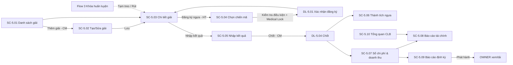
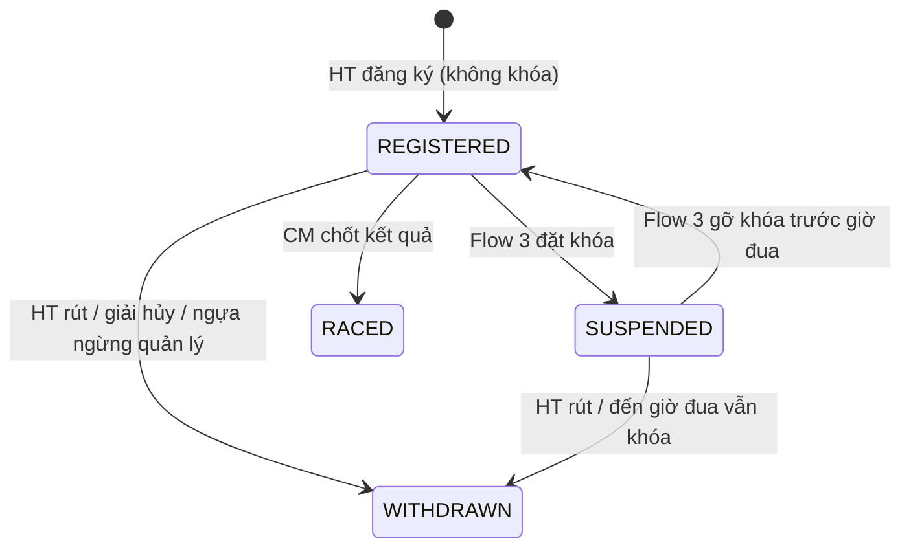

# ĐẶC TẢ LUỒNG & MÀN HÌNH – FLOW 5: ĐĂNG KÝ THI ĐẤU & BÁO CÁO THÀNH TÍCH

**Dự án:** RACEHORSE_TRAINING · **Bản:** 1.0 · **Loại flow:** Tùy chọn (optional)

**Quy ước mã:** `SC-5.xx` = màn hình, `DL-5.xx` = dialog, `BTN-5.xx` = nút, `FR-5.xx` = chức năng, `Q-5.xx` = câu hỏi mở (Mục 9). Mã các flow khác được dẫn chiếu khi cần.
**Vai trò:** CM = Club Manager · HT = Head Trainer · VET = Veterinarian · GROOM = Groom / Stable Hand · OWNER = Horse Owner.
**Quy ước hiển thị chung:** ngày `dd/MM/yyyy`, giờ `HH:mm`, giờ Việt Nam (UTC+7); tiền VNĐ định dạng `1.250.000 ₫`, không có số lẻ; cự ly m; thời gian chạy `mm:ss.ss`; tốc độ km/h; tỷ lệ % 2 chữ số thập phân. Breakpoint: Mobile < 768px · Tablet 768–1199px · Desktop ≥ 1200px.

---

## 1. Mục tiêu và phạm vi

**Mục tiêu:** Quản lý giải đua, chọn và đăng ký chiến mã đủ điều kiện (tuân thủ tuyệt đối Khóa huấn luyện), ghi kết quả chính thức, tự cập nhật lý lịch thành tích, và cung cấp báo cáo tài chính – thành tích định kỳ minh bạch cho Chủ sở hữu và Quản lý CLB.

| Làm (In scope) | Nguồn |
|---|---|
| Danh mục giải đua: điều kiện tham gia, cự ly, hạn đăng ký, cơ cấu giải thưởng | Tài liệu gốc – gạch 1 |
| HT rà soát thể lực, phong độ, trạng thái sẵn sàng để chọn ngựa và đăng ký | Tài liệu gốc – gạch 2 |
| Ghi kết quả chính thức: cự ly hoàn thành, thời gian, tốc độ TB, thứ hạng, danh hiệu, tiền thưởng | Tài liệu gốc – gạch 3 |
| Tự cập nhật thành tích vào lý lịch ngựa; báo cáo định kỳ gửi Chủ sở hữu và CM | Tài liệu gốc – gạch 4 |
| Báo cáo tài chính: chi phí tham dự giải, chăm sóc, huấn luyện, y tế và doanh thu chia thưởng | Tài liệu gốc – gạch 5 |
| Chặn đăng ký thi đấu khi có Khóa huấn luyện | Mục 6 tài liệu gốc |
| Bảng tổng quan CLB cho CM | Mục 2 – vai trò CM |
| Nhật ký thao tác (Audit Log) toàn hệ thống | Mục 2 – vai trò CM, mục 4 Yêu cầu chính (màn hình chung, đặt ở Flow 5) |
| Sổ chi phí ghi thủ công (phí sân, vận chuyển, nài ngựa…) | [BỔ SUNG] – không có thì báo cáo chi phí huấn luyện thiếu dữ liệu |

| Không làm (Out of scope) | Thuộc về |
|---|---|
| Đổi trạng thái ngựa sang Sẵn sàng thi đấu | Flow 1 (HT) |
| Đặt / gỡ Khóa huấn luyện | Flow 3 |
| Thanh toán, chuyển tiền thực tế cho chủ sở hữu | Không có trong tài liệu gốc; hệ thống chỉ tính và báo cáo (Q-5.07) |
| Hóa đơn điện tử, kế toán thuế | Không có trong tài liệu gốc |
| Đồng bộ kết quả từ ban tổ chức giải | Không có trong tài liệu gốc; nhập tay |
| Phả hệ Sire/Dam | Loại trừ theo tài liệu gốc |

---

## 2. Vai trò và quyền

**Phạm vi dữ liệu:** *Tất cả* = mọi ngựa/giải · *Sở hữu* = ngựa OWNER đang sở hữu (với tài chính: phần được chia theo tỷ lệ sở hữu của chính OWNER đó).

| Chức năng | CM | HT | VET | GROOM | OWNER |
|---|---|---|---|---|---|
| Xem danh sách, chi tiết giải đua | Xem | Xem | Xem | — | Chỉ giải có ngựa sở hữu đăng ký |
| Tạo, sửa, hủy giải đua | Có | — | — | — | — |
| Chọn ngựa và đăng ký thi đấu | — | Có | — | — | — |
| Rút đăng ký | — | Có | — | — | — |
| Nhập kết quả thi đấu | Có | Có | — | — | — |
| Chốt kết quả, sửa kết quả sau chốt | Có | — | — | — | — |
| Xem thành tích ngựa | Tất cả | Tất cả | Tất cả | — | Sở hữu |
| Sổ chi phí & doanh thu: xem | Tất cả | — | — | — | — |
| Sổ chi phí: thêm, sửa, hủy khoản thủ công | Có | — | — | — | — |
| Báo cáo tài chính | Tất cả | — | — | — | Sở hữu (phần của mình) |
| Báo cáo định kỳ: tạo, phát hành | Có | — | — | — | — |
| Báo cáo định kỳ: xem, tải | Tất cả | — | — | — | Của mình |
| Tổng quan câu lạc bộ | Có | — | — | — | — |
| Nhật ký thao tác (Audit Log) | Có | — | — | — | — |

---

## 3. Sơ đồ luồng tổng thể

### 3.1 Danh sách màn hình

| Mã | Tên màn hình | URL | Vai trò |
|---|---|---|---|
| SC-5.01 | Danh sách giải đua | `/races` | CM, HT, VET, OWNER |
| SC-5.02 | Tạo / Sửa giải đua | `/races/new`, `/races/:id/edit` | CM |
| SC-5.03 | Chi tiết giải đua | `/races/:id` | CM, HT, VET, OWNER |
| SC-5.04 | Chọn chiến mã & đăng ký | `/races/:id/register` | HT |
| SC-5.05 | Nhập kết quả thi đấu | `/races/:id/results` | CM, HT |
| SC-5.06 | Thành tích ngựa | `/horses/:id/performance` | CM, HT, VET, OWNER |
| SC-5.07 | Sổ chi phí & doanh thu | `/finance/transactions` | CM |
| SC-5.08 | Báo cáo tài chính | `/finance/reports` | CM, OWNER |
| SC-5.09 | Báo cáo định kỳ | `/reports/periodic` | CM, OWNER |
| SC-5.10 | Tổng quan câu lạc bộ | `/dashboard/club` | CM |
| SC-5.11 | Nhật ký thao tác (Audit Log) | `/admin/audit-log` | CM |

Không có quyền → trang "Bạn không có quyền truy cập chức năng này". Ngoài phạm vi dữ liệu → "Không tìm thấy dữ liệu hoặc bạn không có quyền xem."

### 3.2 Các luồng chính

**L1 – Khai báo giải (CM)**: SC-5.01 → **Thêm giải** → SC-5.02 → nhập thông tin, điều kiện, hạn đăng ký, cơ cấu giải thưởng → **Lưu** → giải ở trạng thái Mở đăng ký.

**L2 – Chọn chiến mã và đăng ký (HT)**
1. SC-5.03 → **Đăng ký ngựa** → SC-5.04: bảng mọi ngựa đang quản lý, mỗi ngựa có kết quả kiểm tra điều kiện (✔/✖/⚠), trạng thái, phong độ, thể lực.
2. Ngựa có ✖ không chọn được (ví dụ đang Khóa huấn luyện). Ngựa có ⚠ chọn được nhưng phải xác nhận.
3. Chọn ngựa → **Đăng ký ngựa đã chọn** → DL-5.01 (nhập nài ngựa, xác nhận cảnh báo) → đăng ký thành công; phí đăng ký tự ghi vào sổ chi phí.

**L3 – Khi có Khóa huấn luyện (tự động)**
1. Flow 3 đặt khóa → đăng ký của ngựa ở các giải chưa diễn ra chuyển **Tạm treo – Khóa y tế**; HT, OWNER nhận thông báo.
2. Gỡ khóa trước giờ đua → trở về Đã đăng ký. Đến giờ đua vẫn khóa → tự **Rút**.

**L4 – Kết quả (HT, CM)**
1. Sau giờ đua: SC-5.03 → **Nhập kết quả** → SC-5.05 → nhập từng ngựa → **Lưu nháp**.
2. CM **Chốt kết quả** (DL-5.04) → thành tích cập nhật vào lý lịch ngựa (SC-5.06, dòng thời gian Flow 1); tiền thưởng ghi vào sổ doanh thu và chia theo tỷ lệ sở hữu.

**L5 – Tài chính và báo cáo (CM, OWNER)**
1. Chi phí tự động: phí đăng ký (Flow 5), vật tư tiêu hao theo ngựa (Flow 4 × đơn giá). Chi phí thủ công: CM nhập ở SC-5.07.
2. Ngày 1 hằng tháng 07:00 hệ thống tạo báo cáo tháng trước cho từng OWNER và 1 báo cáo tổng cho CM (trạng thái Chờ phát hành).
3. CM xem, **Phát hành** (DL-5.08) → OWNER nhận thông báo, xem và tải PDF ở SC-5.09.

**L6 – Giám sát (CM)**: SC-5.10 tổng quan; SC-5.11 nhật ký thao tác.

---

## 4. Vòng đời trạng thái

### 4.1 Giải đua

| Mã | Nhãn | Màu | Điều kiện |
|---|---|---|---|
| OPEN | Mở đăng ký | Xanh dương | Hiện tại < Hạn đăng ký |
| CLOSED | Đóng đăng ký | Tím | Hạn đăng ký ≤ hiện tại < Giờ đua |
| AWAITING_RESULT | Chờ kết quả | Cam | Giờ đua ≤ hiện tại, chưa chốt kết quả |
| COMPLETED | Đã có kết quả | Xanh lá | CM đã chốt kết quả |
| CANCELLED | Đã hủy | Xám | CM hủy |

| Từ | Đến | Ai | Điều kiện / Tác dụng phụ |
|---|---|---|---|
| (Tạo) | Mở đăng ký | CM | Hạn đăng ký > hiện tại; Giờ đua > Hạn đăng ký |
| Mở đăng ký | Đóng đăng ký | Hệ thống | Đến hạn đăng ký |
| Đóng đăng ký | Chờ kết quả | Hệ thống | Đến giờ đua; đăng ký Tạm treo → Đã rút (lý do Khóa y tế) |
| Chờ kết quả | Đã có kết quả | CM | Mọi đăng ký Đã đăng ký có kết quả; cập nhật thành tích, sổ doanh thu |
| Mở đăng ký, Đóng đăng ký, Chờ kết quả | Đã hủy | CM | Lý do bắt buộc; mọi đăng ký → Đã rút (lý do Giải bị hủy); phí đăng ký giữ hoặc hủy theo lựa chọn của CM |
| Mở đăng ký | Mở đăng ký (gia hạn) | CM | Sửa hạn đăng ký lùi về sau |
| Đóng đăng ký | Mở đăng ký | CM | Sửa hạn đăng ký sang thời điểm tương lai trước giờ đua |

### 4.2 Đăng ký thi đấu

| Mã | Nhãn | Màu |
|---|---|---|
| REGISTERED | Đã đăng ký | Xanh dương |
| SUSPENDED | Tạm treo – Khóa y tế | Đỏ, icon ổ khóa |
| WITHDRAWN | Đã rút | Xám |
| RACED | Đã thi đấu | Xanh lá |

| Từ | Đến | Ai | Điều kiện / Tác dụng phụ |
|---|---|---|---|
| (Tạo) | Đã đăng ký | HT | Qua mọi kiểm tra ✖ (Mục 5.4); giải Mở đăng ký; ghi chi phí phí đăng ký; thông báo OWNER, CM |
| Đã đăng ký | Tạm treo | Hệ thống | Flow 3 đặt khóa cho ngựa |
| Tạm treo | Đã đăng ký | Hệ thống | Flow 3 gỡ khóa trước giờ đua |
| Đã đăng ký | Đã rút | HT | Trước giờ đua; lý do bắt buộc |
| Tạm treo | Đã rút | HT hoặc Hệ thống | HT rút bất kỳ lúc nào trước giờ đua; hệ thống rút khi đến giờ đua vẫn khóa |
| Đã đăng ký | Đã rút | Hệ thống | Ngựa bị Ngừng quản lý (Flow 1); giải bị hủy |
| Đã đăng ký | Đã thi đấu | CM chốt kết quả | Có kết quả (kể cả Không xuất phát / Không hoàn thành / Bị loại) |

**Quy tắc Medical Lock (ưu tiên cao nhất):** ngựa đang Khóa huấn luyện không đăng ký được vào bất kỳ giải nào; dòng ngựa trong SC-5.04 bị khóa chọn với lý do "Đang bị Khóa huấn luyện y tế". Đăng ký đang Tạm treo không chuyển về Đã đăng ký bằng thao tác tay; chỉ tự chuyển khi VET gỡ khóa. Kiểm tra được thực hiện lại ở thời điểm bấm Xác nhận đăng ký, không chỉ lúc mở màn hình.

### 4.3 Kết quả thi đấu

| Mã | Nhãn | Màu |
|---|---|---|
| DRAFT | Nháp | Xám |
| FINALIZED | Đã chốt | Xanh lá |

Sửa sau khi chốt: chỉ CM, trong 30 ngày kể từ khi chốt, lý do bắt buộc; hệ thống tự điều chỉnh sổ doanh thu (ghi 1 dòng điều chỉnh, không sửa dòng cũ).

### 4.4 Báo cáo định kỳ

| Mã | Nhãn | Màu |
|---|---|---|
| PENDING | Chờ phát hành | Vàng |
| PUBLISHED | Đã phát hành | Xanh lá |
| OUTDATED | Cần tạo lại | Cam (dữ liệu kỳ báo cáo bị thay đổi sau khi tạo, ví dụ sửa kết quả, thêm chi phí lùi ngày) |

Báo cáo Đã phát hành không bị sửa; nếu dữ liệu kỳ đó thay đổi sau khi phát hành → CM tạo **Bản điều chỉnh** (báo cáo mới cùng kỳ, ghi "Bản điều chỉnh lần {n}"), bản cũ vẫn giữ.

---

## 5. Đặc tả màn hình

**Quy ước chung:** Đang tải: skeleton. Lỗi tải: "Không tải được dữ liệu" + **Thử lại**. Mất mạng: toast đỏ "Mất kết nối mạng. Vui lòng thử lại." Dữ liệu bị sửa cùng lúc: toast "Dữ liệu đã được người khác cập nhật. Vui lòng tải lại trước khi lưu." + **Tải lại**. Nút không có quyền: ẩn. Nút bị chặn do trạng thái: hiện, vô hiệu hóa, tooltip lý do.

### 5.1 SC-5.01 – Danh sách giải đua

**Mục đích:** Xem các giải sắp tới và đã diễn ra. **Vai trò:** CM, HT, VET (tất cả); OWNER (giải có ngựa sở hữu đăng ký).

**Bố cục:** Thanh công cụ (tìm kiếm, bộ lọc, chế độ xem) → Danh sách hoặc Lịch tháng. Mobile: danh sách thẻ, không có Lịch tháng.

**Bộ lọc**

| Nhãn | Loại | Mặc định |
|---|---|---|
| Tìm kiếm | Ô text (tên giải, ban tổ chức, địa điểm) | Rỗng |
| Trạng thái | Chọn nhiều (Mục 4.1) | Mở đăng ký + Đóng đăng ký + Chờ kết quả |
| Mặt sân | Cỏ / Cát / Hỗn hợp | Tất cả |
| Cự ly | Khoảng từ – đến (m) | Trống |
| Khoảng ngày đua | Từ ngày – Đến ngày | Trống |
| Có ngựa CLB đăng ký | Checkbox | Bỏ chọn |

**Bảng**

| Cột | Hiển thị | Sắp xếp |
|---|---|---|
| Mã giải | `GD-000017` | Có |
| Tên giải | Text + Hạng/Cấp giải | Có |
| Ngày giờ đua | `dd/MM/yyyy HH:mm` | Có (mặc định tăng dần) |
| Địa điểm | Text | Có |
| Cự ly · Mặt sân | "1 600 m · Cỏ" | Có |
| Hạn đăng ký | `dd/MM/yyyy HH:mm`; chữ đỏ + "Còn {n} giờ" khi < 48 giờ | Có |
| Tổng giải thưởng | VNĐ | Có |
| Suất CLB | "{đã đăng ký}/{tối đa}" | Không |
| Trạng thái | Badge Mục 4.1 | Có |
| Hành động | Xem · Đăng ký ngựa | — |

Phân trang 20 dòng (20/50/100).

| Mã | Nút | Vai trò | Hiện khi | Hành vi |
|---|---|---|---|---|
| BTN-5.01 | Thêm giải | CM | Luôn | Mở SC-5.02 |
| BTN-5.02 | Xem (mỗi dòng) / bấm dòng | Tất cả | Luôn | Mở SC-5.03 |
| BTN-5.03 | Đăng ký ngựa (mỗi dòng) | HT | Mở đăng ký và còn suất | Mở SC-5.04 |
| BTN-5.04 | Xóa bộ lọc | Tất cả | Luôn | Bộ lọc về mặc định |
| BTN-5.05 | Danh sách / Lịch tháng | CM, HT, VET | Desktop, Tablet | Đổi chế độ; Lịch tháng: mỗi ngày hiện tên giải, màu theo trạng thái |

**Trạng thái giao diện:** "Chưa có giải đua nào." (CM thấy thêm nút Thêm giải). OWNER: "Chưa có giải nào có ngựa của bạn tham gia."

### 5.2 SC-5.02 – Tạo / Sửa giải đua

**Mục đích:** Khai báo giải, điều kiện, điều lệ và cơ cấu giải thưởng. **Vai trò:** CM.

**Bố cục:** 4 khối: Thông tin chung → Điều kiện tham gia → Đăng ký → Cơ cấu giải thưởng. Desktop 2 cột; Tablet, Mobile 1 cột.

**Khối Thông tin chung**

| Nhãn | Loại | Bắt buộc | Quy tắc | Thông báo lỗi |
|---|---|---|---|---|
| Mã giải | Chỉ đọc | — | Tự sinh `GD-` + 6 số | — |
| Tên giải | Text | Có | 3–200 ký tự | "Tên giải là bắt buộc." / "Tên giải phải từ 3 đến 200 ký tự." |
| Hạng / Cấp giải | Text | Không | ≤ 50 ký tự | "Hạng giải tối đa 50 ký tự." |
| Ban tổ chức | Text | Có | 2–200 ký tự | "Vui lòng nhập ban tổ chức." |
| Địa điểm | Text | Có | 2–200 ký tự | "Vui lòng nhập địa điểm." |
| Ngày giờ đua | Date-time picker | Có | > hiện tại khi tạo | "Ngày giờ đua phải sau thời điểm hiện tại." |
| Cự ly (m) | Số nguyên | Có | 800–5000 | "Cự ly phải từ 800 đến 5000 m." |
| Mặt sân | Radio: Cỏ / Cát / Hỗn hợp | Có | | "Vui lòng chọn mặt sân." |
| Điều lệ | Textarea | Không | ≤ 5000 ký tự | "Điều lệ tối đa 5000 ký tự." |

**Khối Điều kiện tham gia**

| Nhãn | Loại | Bắt buộc | Quy tắc | Thông báo lỗi |
|---|---|---|---|---|
| Tuổi tối thiểu | Số nguyên | Có, mặc định 2 | 2–20 | "Tuổi tối thiểu phải từ 2 đến 20." |
| Tuổi tối đa | Số nguyên | Không | ≥ Tuổi tối thiểu; ≤ 20 | "Tuổi tối đa phải lớn hơn hoặc bằng tuổi tối thiểu." |
| Giới tính được tham gia | Checkbox: Ngựa đực / Ngựa cái / Ngựa đực thiến | Có, mặc định tích cả 3 | Ít nhất 1 | "Vui lòng chọn ít nhất 1 giới tính." |
| Số lần thắng tối đa | Số nguyên | Không | 0–100 (thắng = thứ hạng 1 trong kết quả đã chốt) | "Số lần thắng tối đa phải từ 0 đến 100." |
| Điều kiện khác | Textarea | Không | ≤ 1000 ký tự; chỉ hiển thị, hệ thống không tự kiểm tra | — |

Tuổi tính theo năm tròn tại ngày đua (Q-5.02).

**Khối Đăng ký**

| Nhãn | Loại | Bắt buộc | Quy tắc | Thông báo lỗi |
|---|---|---|---|---|
| Hạn đăng ký | Date-time picker | Có | > hiện tại khi tạo; < Ngày giờ đua ít nhất 1 giờ | "Hạn đăng ký phải trước giờ đua ít nhất 1 giờ." |
| Phí đăng ký mỗi ngựa (VNĐ) | Số nguyên | Có, mặc định 0 | 0–1 000 000 000 | "Phí đăng ký phải từ 0 đến 1.000.000.000 ₫." |
| Số suất tối đa của CLB | Số nguyên | Có, mặc định 1 | 1–30 | "Số suất phải từ 1 đến 30." |

**Khối Cơ cấu giải thưởng** (bảng 1–20 dòng)

| Cột | Loại | Bắt buộc | Quy tắc | Thông báo lỗi |
|---|---|---|---|---|
| Thứ hạng | Số nguyên | Có | 1–20; không trùng; liên tục từ 1 | "Thứ hạng bị trùng." / "Thứ hạng phải liên tục bắt đầu từ 1." |
| Tiền thưởng (VNĐ) | Số nguyên | Có | 0–100 000 000 000; không lớn hơn thứ hạng trước | "Tiền thưởng thứ hạng sau không được lớn hơn thứ hạng trước." |
| Danh hiệu | Text | Không | ≤ 100 ký tự (ví dụ "Vô địch") | — |
| (Xóa dòng) | Nút icon | — | — | — |

Dòng tổng: "Tổng giải thưởng: {x} ₫".

**Sửa giải đã có đăng ký:** Ngày giờ đua, Cự ly, Mặt sân, Điều kiện tham gia vẫn sửa được. Khi lưu, hệ thống kiểm tra lại điều kiện của từng đăng ký; đăng ký không còn đạt hiện nhãn đỏ "Không còn đủ điều kiện" ở SC-5.03 và HT nhận thông báo (không tự rút). Phí đăng ký không sửa được khi đã có đăng ký ("Không thể sửa phí đăng ký khi đã có ngựa đăng ký."). Giải Đã có kết quả, Đã hủy không sửa được.

**Nút**

| Mã | Nút | Hành vi |
|---|---|---|
| BTN-5.06 | Thêm mức giải thưởng | Thêm dòng; thứ hạng tự điền = dòng cuối + 1; vô hiệu hóa khi đủ 20 dòng |
| BTN-5.07 | Xóa mức (mỗi dòng) | Xóa dòng |
| BTN-5.08 | Lưu | Lưu → toast "Đã lưu giải đua." → SC-5.03 |
| BTN-5.09 | Hủy | Quay lại; có thay đổi → DL-5.11 |

### 5.3 SC-5.03 – Chi tiết giải đua

**Mục đích:** Xem thông tin giải, danh sách đăng ký của CLB và kết quả. **Vai trò:** CM, HT, VET; OWNER (giải có ngựa sở hữu, chỉ thấy dòng ngựa của mình).

**Bố cục:** Header (Tên, Mã, badge trạng thái, ngày giờ đua, đếm ngược đến hạn đăng ký hoặc giờ đua, thanh nút) → 3 tab: **Thông tin & điều lệ** · **Đăng ký của CLB** · **Kết quả**.

**Nút trên header**

| Mã | Nút | Vai trò | Hiện khi | Hành vi |
|---|---|---|---|---|
| BTN-5.10 | Sửa giải | CM | Mở đăng ký, Đóng đăng ký, Chờ kết quả | Mở SC-5.02 |
| BTN-5.11 | Hủy giải | CM | Mở đăng ký, Đóng đăng ký, Chờ kết quả | Mở DL-5.03 |
| BTN-5.12 | Đăng ký ngựa | HT | Mở đăng ký | Mở SC-5.04. Vô hiệu hóa khi hết suất ("CLB đã dùng hết {n} suất.") |
| BTN-5.14 | Nhập kết quả | CM, HT | Chờ kết quả; Đã có kết quả (CM, để sửa) | Mở SC-5.05 |

**Tab Thông tin & điều lệ:** hiển thị chỉ đọc toàn bộ SC-5.02; bảng cơ cấu giải thưởng.

**Tab Đăng ký của CLB**

| Cột | Hiển thị |
|---|---|
| Ngựa | Tên + Mã + badge trạng thái ngựa + icon khóa |
| Nài ngựa | Text |
| Ngày đăng ký | `dd/MM/yyyy HH:mm` |
| Người đăng ký | Họ tên HT |
| Phí đăng ký | VNĐ |
| Trạng thái đăng ký | Badge Mục 4.2; nhãn đỏ "Không còn đủ điều kiện" nếu có |
| Lý do rút | Khi Đã rút |
| Hành động | Rút đăng ký · Xem thành tích |

| Mã | Nút | Vai trò | Hiện khi | Hành vi |
|---|---|---|---|---|
| BTN-5.13 | Rút đăng ký (mỗi dòng) | HT | Đã đăng ký, Tạm treo; trước giờ đua | Mở DL-5.02 |
| BTN-5.15 | Xem thành tích (mỗi dòng) | CM, HT, VET, OWNER | Luôn | Mở SC-5.06 |

Dòng Tạm treo: nền đỏ nhạt, ghi chú "Ngựa đang bị Khóa huấn luyện. Đăng ký sẽ tự rút nếu đến {giờ đua} chưa được mở khóa."
Rỗng: "CLB chưa đăng ký ngựa nào cho giải này."

**Tab Kết quả:** bảng Thứ hạng · Ngựa · Kết quả tham gia · Cự ly hoàn thành · Thời gian · Tốc độ TB · Danh hiệu · Tiền thưởng; badge Nháp/Đã chốt. OWNER chỉ thấy kết quả Đã chốt. Rỗng: "Chưa có kết quả."

### 5.4 SC-5.04 – Chọn chiến mã & đăng ký

**Mục đích:** HT rà soát thể lực, phong độ, trạng thái sẵn sàng và đăng ký ngựa đủ điều kiện. **Vai trò:** HT. Chỉ mở được khi giải Mở đăng ký.

**Bố cục:** Header (tên giải, ngày đua, cự ly, mặt sân, điều kiện tóm tắt, "Còn {n} suất", đếm ngược hạn đăng ký) → bộ lọc → bảng ứng viên → thanh nút cố định cuối trang hiện "Đã chọn {n} ngựa". Mobile: danh sách thẻ, mở rộng thẻ để xem chi tiết kiểm tra.

**Bộ lọc:** Chỉ ngựa đủ điều kiện (checkbox, mặc định bật) · Trạng thái ngựa · Tìm ngựa.

**Bảng ứng viên** (mọi ngựa đang quản lý, trừ ngựa Ngừng quản lý)

| Cột | Hiển thị | Sắp xếp |
|---|---|---|
| (Chọn) | Checkbox; vô hiệu hóa khi có ✖ hoặc đã đăng ký giải này | — |
| Ngựa | Tên + Mã | Có |
| Tuổi · Giới tính | "4 tuổi · Ngựa cái" | Có |
| Trạng thái | Badge Flow 1 + icon khóa | Có |
| Kết quả kiểm tra | ✔ Đủ điều kiện / ⚠ {n} cảnh báo / ✖ {lý do đầu tiên} | Có (mặc định ✔ → ⚠ → ✖) |
| Phong độ gần nhất | Điểm 1–10, mũi tên xu hướng (Flow 2) | Có |
| Tốc độ TB tốt nhất 8 tuần | km/h, trên cùng mặt sân với giải nếu có | Có |
| Tải tập 7 ngày | Điểm tải (Flow 2) | Có |
| Thành tích | "{số lần đua} lần · {số lần thắng} thắng · {số lần top 3} top 3" | Có |
| Giải khác cùng ngày | Tên giải hoặc "—" | Không |
| Hành động | Chi tiết kiểm tra · Biểu đồ thể lực | — |

**Danh sách kiểm tra điều kiện** (hiện khi mở rộng dòng)

| Mức | Kiểm tra | Lý do hiển thị khi không đạt |
|---|---|---|
| ✖ chặn | Ngựa không bị Khóa huấn luyện | "Đang bị Khóa huấn luyện y tế." |
| ✖ chặn | Trạng thái = Sẵn sàng thi đấu | "Trạng thái hiện tại là {Nhãn}, cần Sẵn sàng thi đấu." |
| ✖ chặn | Tuổi tại ngày đua trong khoảng điều kiện | "Tuổi tại ngày đua là {n}, yêu cầu {min}–{max}." |
| ✖ chặn | Giới tính được phép | "Giải không nhận {Giới tính}." |
| ✖ chặn | Số lần thắng ≤ tối đa | "Đã thắng {n} lần, vượt giới hạn {max}." |
| ✖ chặn | Chưa đăng ký giải này | "Ngựa đã được đăng ký giải này." |
| ✖ chặn | Không có đăng ký khác cùng ngày đua | "Ngựa đã đăng ký giải {Tên} cùng ngày." |
| ✖ chặn | Hết thời gian ngưng thuốc trước giờ đua (Flow 3) | "Ngựa còn trong thời gian ngưng thuốc đến {dd/MM/yyyy}." |
| ⚠ cảnh báo | Có buổi tập nặng Hoàn thành trong 14 ngày gần nhất | "Không có bài tập nặng nào trong 14 ngày qua." |
| ⚠ cảnh báo | Điểm phong độ TB 3 buổi gần nhất ≥ 5 | "Phong độ trung bình 3 buổi gần nhất là {x}." |
| ⚠ cảnh báo | Không có chấn thương chưa lành (Flow 3) | "Còn {n} chấn thương chưa lành." |
| ⚠ cảnh báo | Có ít nhất 1 buổi tập Hoàn thành trên cùng mặt sân với giải trong 8 tuần | "Chưa tập trên mặt sân {Mặt sân} trong 8 tuần." |
| ⚠ cảnh báo | Đang có ≥ 1 chủ sở hữu | "Ngựa chưa có chủ sở hữu; tiền thưởng sẽ thuộc CLB." |

**Nút**

| Mã | Nút | Hành vi |
|---|---|---|
| BTN-5.16 | Chi tiết kiểm tra (mỗi dòng) | Mở rộng dòng hiện danh sách kiểm tra |
| BTN-5.17 | Biểu đồ thể lực (mỗi dòng) | Mở SC-2.07 ở tab mới |
| BTN-5.18 | Đăng ký ngựa đã chọn | Vô hiệu hóa khi chưa chọn hoặc số ngựa chọn > số suất còn lại ("Chỉ còn {n} suất."). Bấm → DL-5.01 |
| BTN-5.19 | Quay lại | Về SC-5.03 |

**Trạng thái giao diện:** Không ngựa nào đủ điều kiện: "Không có ngựa nào đủ điều kiện cho giải này." + gợi ý tắt bộ lọc để xem lý do. Hết hạn đăng ký trong lúc đang mở màn hình: banner đỏ "Đã hết hạn đăng ký." và BTN-5.18 vô hiệu hóa.

### 5.5 SC-5.05 – Nhập kết quả thi đấu

**Mục đích:** Ghi kết quả chính thức cho các ngựa của CLB. **Vai trò:** HT, CM nhập; CM chốt.

**Bố cục:** Header (giải, ngày đua, cự ly, badge kết quả Nháp/Đã chốt) → bảng nhập, mỗi dòng 1 đăng ký Đã đăng ký hoặc Tạm treo đã tự rút thì không hiện. Mobile: mỗi ngựa 1 thẻ form.

| Cột / Ô nhập | Loại | Bắt buộc | Quy tắc | Thông báo lỗi |
|---|---|---|---|---|
| Ngựa | Chỉ đọc | — | | |
| Kết quả tham gia | Dropdown: Hoàn thành / Không hoàn thành (DNF) / Không xuất phát (DNS) / Bị loại (DSQ) | Có | | "Vui lòng chọn kết quả tham gia." |
| Thứ hạng | Số nguyên; chỉ khi Hoàn thành | Có khi Hoàn thành | 1–40; không trùng giữa các ngựa CLB (trừ khi tích "Đồng hạng") | "Thứ hạng phải từ 1 đến 40." / "Thứ hạng {n} bị trùng với {Ngựa}." |
| Đồng hạng | Checkbox | Không | | |
| Cự ly hoàn thành (m) | Số nguyên; mặc định = cự ly giải khi Hoàn thành | Có khi Hoàn thành hoặc DNF | 0–cự ly giải | "Cự ly hoàn thành phải từ 0 đến {cự ly giải} m." |
| Thời gian | `mm:ss.ss` | Có khi Hoàn thành | 00:30.00–15:00.00 | "Thời gian không hợp lệ (định dạng mm:ss.ss)." |
| Tốc độ TB (km/h) | Chỉ đọc, tự tính = Cự ly hoàn thành ÷ Thời gian | — | Cảnh báo vàng nếu > 75 km/h | — |
| Danh hiệu | Text; tự điền theo cơ cấu giải thưởng khi nhập thứ hạng | Không | ≤ 100 ký tự | — |
| Tiền thưởng (VNĐ) | Số nguyên; tự điền theo cơ cấu giải thưởng | Có (0 nếu không có) | 0–100 000 000 000 | "Tiền thưởng không hợp lệ." |
| Lý do chỉnh tiền thưởng | Text; hiện khi tiền thưởng khác cơ cấu | Có khi hiện | 10–300 ký tự | "Vui lòng nhập lý do chỉnh tiền thưởng." |
| Ghi chú | Textarea | Không | ≤ 1000 ký tự | — |

**Nút**

| Mã | Nút | Vai trò | Hiện khi | Hành vi |
|---|---|---|---|---|
| BTN-5.20 | Lưu nháp | CM, HT | Kết quả Nháp | Lưu → toast "Đã lưu kết quả nháp." |
| BTN-5.21 | Chốt kết quả | CM | Kết quả Nháp, mọi dòng hợp lệ | Mở DL-5.04 |
| BTN-5.22 | Sửa sau chốt | CM | Đã chốt, trong 30 ngày | Chuyển bảng sang chế độ sửa; bấm Lưu mở DL-5.05. Quá 30 ngày: vô hiệu hóa, tooltip "Chỉ sửa được trong 30 ngày sau khi chốt." |
| BTN-5.23 | Hủy | CM, HT | Luôn | Quay lại; có thay đổi → DL-5.11 |

**Trạng thái giao diện:** Chưa đến giờ đua: màn hình không mở được, thông báo "Chưa đến giờ đua. Chỉ nhập kết quả sau {dd/MM/yyyy HH:mm}." Không có đăng ký hợp lệ: "Không có ngựa nào của CLB thi đấu ở giải này." + CM thấy nút Chốt để đóng giải.

### 5.6 SC-5.06 – Thành tích ngựa

**Mục đích:** Lý lịch thành tích thi đấu của ngựa, tự cập nhật sau mỗi lần chốt kết quả. **Vai trò:** CM, HT, VET (tất cả); OWNER (sở hữu). Có tab/link từ SC-1.03.

**Bố cục:** Header (tên ngựa, badge trạng thái) → hàng thẻ tổng hợp → biểu đồ → bảng lịch sử thi đấu. Mobile: thẻ 2 × 3, biểu đồ cao 220px.

**Thẻ tổng hợp:** Số lần đua · Số lần thắng · Số lần top 3 · Tỷ lệ top 3 (%) · Tổng tiền thưởng (VNĐ) · Tốc độ TB tốt nhất (km/h, giải, ngày). OWNER thấy thêm "Phần tiền thưởng của bạn" (theo tỷ lệ sở hữu tại ngày đua).

**Biểu đồ:** Thứ hạng theo thời gian (trục dọc đảo ngược, 1 ở trên cùng) và Tốc độ TB theo thời gian; chọn bằng nhóm nút.

**Bảng lịch sử:** Ngày · Giải (link SC-5.03) · Cự ly · Mặt sân · Kết quả tham gia · Thứ hạng · Thời gian · Tốc độ TB · Danh hiệu · Tiền thưởng. Sắp xếp theo Ngày (mặc định mới nhất), Thứ hạng, Tiền thưởng. Phân trang 20 dòng. Có thêm các đăng ký sắp tới (Đã đăng ký / Tạm treo) ở đầu bảng với nhãn "Sắp diễn ra".

| Mã | Nút | Hành vi |
|---|---|---|
| BTN-5.24 | Khoảng thời gian: 12 tháng / 3 năm / Toàn bộ | Lọc thẻ, biểu đồ, bảng |
| BTN-5.25 | Xem giải (mỗi dòng) | Mở SC-5.03 |

**Trạng thái giao diện:** "Ngựa chưa tham gia giải đua nào."

### 5.7 SC-5.07 – Sổ chi phí & doanh thu

**Mục đích:** Danh sách mọi khoản chi phí và doanh thu, làm nguồn cho báo cáo tài chính. **Vai trò:** CM.

**Bố cục:** Hàng thẻ (Tổng chi · Tổng thu · Chênh lệch trong khoảng đang lọc) → bộ lọc → bảng.

**Loại khoản**

| Loại | Chiều | Nguồn |
|---|---|---|
| Phí tham dự giải | Chi | Tự động khi đăng ký (Flow 5) |
| Chăm sóc – vật tư thức ăn | Chi | Tự động từ tiêu hao theo ngựa (Flow 4) × đơn giá, tổng hợp theo ngày |
| Y tế – thuốc, vaccine | Chi | Tự động từ tiêu hao thuốc/vaccine theo ngựa (Flow 4) × đơn giá |
| Y tế – phí khám, dịch vụ | Chi | Thủ công |
| Huấn luyện – phí sân, nài ngựa, dịch vụ | Chi | Thủ công |
| Vận chuyển | Chi | Thủ công |
| Chi phí chung CLB | Chi | Thủ công, không gắn ngựa |
| Khác | Chi | Thủ công |
| Tiền thưởng | Thu | Tự động khi chốt kết quả |
| Điều chỉnh tiền thưởng | Thu (+/−) | Tự động khi sửa kết quả sau chốt |

**Bộ lọc:** Khoảng ngày (mặc định tháng hiện tại) · Loại (chọn nhiều) · Chiều (Chi / Thu) · Ngựa · Nguồn (Tự động / Thủ công) · Hiện cả khoản đã hủy (checkbox).

**Bảng**

| Cột | Hiển thị | Sắp xếp |
|---|---|---|
| Ngày phát sinh | `dd/MM/yyyy` | Có (mặc định mới nhất) |
| Loại | Nhãn | Có |
| Ngựa | Tên hoặc "Chung CLB" | Có |
| Diễn giải | Text (tự động: ví dụ "Phí đăng ký giải GD-000017") | Không |
| Số tiền | VNĐ; chi màu đỏ với dấu −, thu màu xanh | Có |
| Nguồn | Tự động / Thủ công | Có |
| Người ghi | Họ tên hoặc "Hệ thống" | Không |
| Trạng thái | Hiệu lực / Đã hủy (gạch ngang) | Có |
| Hành động | Sửa · Hủy (chỉ khoản thủ công) | — |

| Mã | Nút | Vai trò | Hiện khi | Hành vi |
|---|---|---|---|---|
| BTN-5.26 | Thêm khoản chi | CM | Luôn | Mở DL-5.06 |
| BTN-5.27 | Sửa (mỗi dòng) | CM | Khoản thủ công, Hiệu lực, thuộc kỳ chưa có báo cáo Đã phát hành | Mở DL-5.06 chế độ sửa. Kỳ đã phát hành: vô hiệu hóa, tooltip "Kỳ này đã phát hành báo cáo. Hãy hủy khoản và tạo khoản mới." |
| BTN-5.28 | Hủy khoản (mỗi dòng) | CM | Khoản thủ công, Hiệu lực | Mở DL-5.07 |
| BTN-5.29 | Xuất Excel | CM | Luôn | Tải file `.xlsx` theo bộ lọc hiện tại (tối đa 50 000 dòng; vượt: "Vui lòng thu hẹp bộ lọc, tối đa 50.000 dòng.") |
| BTN-5.30 | Xóa bộ lọc | CM | Luôn | Bộ lọc về mặc định |

Khoản tự động không sửa/hủy được; muốn điều chỉnh thì thêm khoản thủ công loại Khác.

### 5.8 SC-5.08 – Báo cáo tài chính

**Mục đích:** Tổng hợp chi phí nuôi dưỡng, y tế, huấn luyện, tham dự giải và doanh thu tiền thưởng; chia theo chủ sở hữu. **Vai trò:** CM (toàn CLB); OWNER (các ngựa sở hữu, chỉ phần của mình).

**Quy tắc chia theo chủ sở hữu:** mỗi khoản gắn ngựa được chia cho chủ sở hữu theo tỷ lệ sở hữu có hiệu lực tại **ngày phát sinh**; phần còn lại (100% − tổng tỷ lệ) thuộc CLB. Khoản "Chi phí chung CLB" không chia cho chủ sở hữu (Q-5.06). Làm tròn đến đồng; phần lẻ do làm tròn tính vào CLB.

**Điều khiển**

| Mã | Thành phần | Mặc định |
|---|---|---|
| BTN-5.31 | Kỳ báo cáo: Tháng / Quý / Năm / Tùy chọn (Từ ngày – Đến ngày, tối đa 3 năm) | Tháng hiện tại |
| BTN-5.32 | Xem theo: Ngựa / Chủ sở hữu / Loại chi phí (OWNER: chỉ Ngựa) | Ngựa |

**Nội dung**
- Thẻ: Tổng chi · Tổng thu (tiền thưởng) · Lãi/Lỗ · So sánh với kỳ trước (%).
- Biểu đồ cột chồng chi phí theo loại qua các tháng trong kỳ; đường tiền thưởng.
- Bảng theo lựa chọn "Xem theo":
  - Ngựa: Ngựa · Chăm sóc · Y tế · Huấn luyện · Tham dự giải · Vận chuyển · Khác · Tổng chi · Tiền thưởng · Lãi/Lỗ.
  - Chủ sở hữu (CM): Chủ sở hữu · Số ngựa · Tổng chi phân bổ · Tiền thưởng phân bổ · Lãi/Lỗ; bấm dòng mở chi tiết theo ngựa.
  - Loại chi phí: Loại · Số khoản · Tổng tiền · Tỷ trọng (%).
- OWNER: số liệu là phần của chính mình; có cột "Tỷ lệ sở hữu" (có thể nhiều giá trị nếu tỷ lệ đổi trong kỳ).

| Mã | Nút | Vai trò | Hành vi |
|---|---|---|---|
| BTN-5.33 | Xuất Excel | CM, OWNER | Tải `.xlsx` gồm các bảng đang xem |
| BTN-5.34 | Xuất PDF | CM, OWNER | Tải `.pdf` gồm thẻ, biểu đồ, bảng |

**Trạng thái giao diện:** "Không có phát sinh trong kỳ đã chọn."

### 5.9 SC-5.09 – Báo cáo định kỳ

**Mục đích:** Báo cáo tháng tự động gửi Chủ sở hữu và CM: thành tích, chi phí, tiền thưởng, tóm tắt tập luyện và sức khỏe. **Vai trò:** CM (quản lý, phát hành); OWNER (xem báo cáo của mình).

**Nội dung một báo cáo cho OWNER (kỳ tháng):** với mỗi ngựa sở hữu: Kết quả thi đấu trong kỳ · Số buổi tập hoàn thành, điểm phong độ TB (Flow 2) · Số lần khám, chấn thương mới, thời gian bị Khóa huấn luyện (Flow 3, chỉ số lượng và chẩn đoán) · Chi phí phân bổ theo loại · Tiền thưởng phân bổ · Lãi/Lỗ. Tổng cộng các ngựa. Báo cáo cho CM: tổng toàn CLB + bảng theo chủ sở hữu.

**Bộ lọc:** Kỳ (tháng/năm) · Loại (Chủ sở hữu / Tổng CLB) · Chủ sở hữu · Trạng thái (Mục 4.4).

**Bảng**

| Cột | Hiển thị |
|---|---|
| Kỳ | "Tháng 08/2026"; thêm "Bản điều chỉnh lần {n}" nếu có |
| Loại | Chủ sở hữu / Tổng CLB |
| Người nhận | Họ tên OWNER hoặc "Quản lý CLB" |
| Số ngựa | Số |
| Tổng chi · Tổng thu | VNĐ |
| Trạng thái | Badge |
| Tạo lúc · Phát hành lúc | `dd/MM/yyyy HH:mm` |
| Hành động | Xem · Tải PDF · Phát hành · Tạo lại |

| Mã | Nút | Vai trò | Hiện khi | Hành vi |
|---|---|---|---|---|
| BTN-5.35 | Tạo báo cáo thủ công | CM | Luôn | Mở DL-5.09 |
| BTN-5.36 | Xem (mỗi dòng) | CM, OWNER | Luôn (OWNER: chỉ Đã phát hành) | Mở trang xem báo cáo `/reports/periodic/:id` (bố cục giống bản PDF) |
| BTN-5.37 | Phát hành (mỗi dòng hoặc nhiều dòng đã chọn) | CM | Chờ phát hành | Mở DL-5.08 |
| BTN-5.38 | Tải PDF (mỗi dòng) | CM, OWNER | Luôn (OWNER: chỉ Đã phát hành) | Tải file |
| BTN-5.39 | Tạo lại (mỗi dòng) | CM | Chờ phát hành, Cần tạo lại | Tạo lại nội dung từ dữ liệu hiện tại; Đã phát hành: tạo Bản điều chỉnh |

**Trạng thái giao diện:** CM: "Chưa có báo cáo nào. Báo cáo tháng được tạo tự động lúc 07:00 ngày 1 hằng tháng." OWNER: "Chưa có báo cáo nào được phát hành cho bạn."

### 5.10 SC-5.10 – Tổng quan câu lạc bộ

**Mục đích:** CM nhìn toàn cảnh hiệu suất huấn luyện, chi phí vận hành và doanh thu giải đấu. **Vai trò:** CM.

**Điều khiển:** BTN-5.40 Kỳ: Tháng này / Quý này / Năm nay / 12 tháng gần nhất (mặc định Tháng này).

**Các khối (widget)** – mỗi khối có link **Xem chi tiết** (BTN-5.41) sang màn hình nguồn:

| Khối | Nội dung | Link |
|---|---|---|
| Đàn ngựa | Số ngựa theo 7 trạng thái (Flow 1); số ngựa đang Khóa huấn luyện | SC-1.01 |
| Sức khỏe | Số bệnh án đang điều trị, chấn thương mới trong kỳ, định kỳ quá hạn | SC-3.01 |
| Hiệu suất huấn luyện | Tỷ lệ buổi tập hoàn thành / đã đến hạn, số buổi bị chặn do khóa, điểm phong độ TB toàn CLB | SC-2.01 |
| Chăm sóc | Tỷ lệ hoàn thành checklist, số việc quá giờ | SC-4.06 |
| Thi đấu | Số giải tham dự, số lần thắng, top 3, tổng tiền thưởng | SC-5.01 |
| Tài chính | Tổng chi, tổng thu, lãi/lỗ; biểu đồ 12 tháng | SC-5.08 |
| Top 5 ngựa theo tiền thưởng | Bảng | SC-5.06 |
| Việc cần xử lý | Đề xuất vật tư chờ duyệt, báo cáo chờ phát hành, giải chờ chốt kết quả | SC-4.09, SC-5.09, SC-5.05 |

Mobile: các khối xếp 1 cột theo thứ tự trên. Dữ liệu làm mới khi mở trang và mỗi 5 phút.

### 5.11 SC-5.11 – Nhật ký thao tác (Audit Log)

**Mục đích:** CM giám sát mọi thao tác ghi dữ liệu trên toàn hệ thống để đảm bảo an toàn thông tin và minh bạch. **Vai trò:** CM. Chỉ xem; không có thao tác sửa/xóa nhật ký.

**Bộ lọc**

| Nhãn | Loại | Mặc định |
|---|---|---|
| Khoảng thời gian | Từ – Đến (tối đa 90 ngày mỗi lần tra) | 7 ngày gần nhất |
| Người thực hiện | Dropdown có tìm kiếm | Tất cả |
| Vai trò | Chọn nhiều 5 vai trò + "Hệ thống" | Tất cả |
| Phân hệ | Chọn nhiều: Hồ sơ ngựa · Huấn luyện · Y tế · Chuồng trại & dinh dưỡng · Thi đấu & tài chính · AI | Tất cả |
| Hành động | Chọn nhiều: Tạo · Sửa · Xóa · Khôi phục · Đổi trạng thái · Đặt khóa · Gỡ khóa · Duyệt · Từ chối · Xuất dữ liệu · Truy cập bị từ chối | Tất cả |
| Đối tượng | Ô text (mã đối tượng, ví dụ `HR-000123`) | Rỗng |
| Kết quả | Thành công / Bị từ chối | Tất cả |

**Bảng**

| Cột | Hiển thị | Sắp xếp |
|---|---|---|
| Thời điểm | `dd/MM/yyyy HH:mm:ss` | Có (mặc định mới nhất) |
| Người thực hiện | Họ tên + vai trò | Có |
| Phân hệ | Nhãn | Có |
| Hành động | Nhãn; "Đặt khóa", "Gỡ khóa" tô đỏ | Có |
| Đối tượng | Loại + mã (link tới màn hình đối tượng nếu còn tồn tại) | Không |
| Tóm tắt thay đổi | "{n} trường thay đổi" hoặc mô tả ngắn | Không |
| Kết quả | Thành công (xanh) / Bị từ chối (đỏ) | Có |
| Địa chỉ IP | Text | Không |

Phân trang 50 dòng.

| Mã | Nút | Hành vi |
|---|---|---|
| BTN-5.42 | Xóa bộ lọc | Bộ lọc về mặc định |
| BTN-5.43 | Xem chi tiết (mỗi dòng) | Mở DL-5.10 |
| BTN-5.44 | Xuất CSV | Tải file theo bộ lọc hiện tại, tối đa 100 000 dòng; thao tác xuất cũng được ghi vào nhật ký |

**Trạng thái giao diện:** "Không có thao tác nào phù hợp bộ lọc."

---

### 5.12 Dialog dùng chung

Quy ước: Desktop giữa màn hình rộng 640px; Mobile toàn màn hình. Nút chính bên phải, vô hiệu hóa khi form chưa hợp lệ hoặc đang gửi. Hủy khi đã nhập → hỏi "Bỏ các thay đổi đã nhập?". Lỗi server hiện đầu dialog, giữ dữ liệu.

#### DL-5.01 – Xác nhận đăng ký

Mở từ BTN-5.18. Vai trò: HT.
Bảng các ngựa đã chọn:

| Cột / Ô nhập | Loại | Bắt buộc | Quy tắc | Thông báo lỗi |
|---|---|---|---|---|
| Ngựa | Chỉ đọc | — | | |
| Cảnh báo | Danh sách ⚠ của ngựa (nếu có) | — | | |
| Nài ngựa | Text, gợi ý tên đã dùng | Có | 2–100 ký tự | "Vui lòng nhập tên nài ngựa." |
| Tôi đã xem các cảnh báo | Checkbox; chỉ hiện khi ngựa có ⚠ | Có khi hiện | | "Vui lòng xác nhận đã xem cảnh báo của {Ngựa}." |

Dòng tổng: "Tổng phí đăng ký: {x} ₫ (ghi vào sổ chi phí)".
Nút: **Hủy** · **Xác nhận đăng ký** (BTN-5.45).
Kiểm tra lại toàn bộ điều kiện ✖ khi bấm. Lỗi server theo từng ngựa (các ngựa còn lại vẫn được đăng ký): "{Ngựa}: Đang bị Khóa huấn luyện y tế." / "{Ngựa}: Đã hết hạn đăng ký." / "{Ngựa}: CLB đã hết suất."
Thành công: toast "Đã đăng ký {n} ngựa cho giải {Tên}." → SC-5.03 tab Đăng ký của CLB. OWNER của các ngựa và CM nhận thông báo.

#### DL-5.02 – Rút đăng ký

Mở từ BTN-5.13. Vai trò: HT. Nội dung: "Rút {Ngựa} khỏi giải {Tên}?"

| Nhãn | Loại | Bắt buộc | Quy tắc | Thông báo lỗi |
|---|---|---|---|---|
| Lý do | Dropdown: Sức khỏe · Phong độ chưa đạt · Thay đổi kế hoạch · Khác | Có | | "Vui lòng chọn lý do." |
| Ghi chú | Textarea | Có khi Khác | 10–500 ký tự | "Ghi chú phải từ 10 đến 500 ký tự." |
| Hủy khoản phí đăng ký | Checkbox, mặc định bỏ chọn (phí thường không hoàn) | Không | | |

Nút: **Đóng** · **Rút đăng ký** (BTN-5.46, màu cam). OWNER, CM nhận thông báo.

#### DL-5.03 – Hủy giải

Mở từ BTN-5.11. Vai trò: CM. Nội dung: "Hủy giải {Tên}? {n} đăng ký của CLB sẽ chuyển Đã rút."

| Nhãn | Loại | Bắt buộc | Quy tắc |
|---|---|---|---|
| Lý do hủy | Textarea | Có | 10–500 ký tự ("Lý do phải từ 10 đến 500 ký tự.") |
| Hủy các khoản phí đăng ký đã ghi | Checkbox, mặc định tích | Không | |

Nút: **Đóng** · **Hủy giải** (BTN-5.47, màu đỏ). HT, OWNER liên quan nhận thông báo.

#### DL-5.04 – Chốt kết quả

Mở từ BTN-5.21. Vai trò: CM.
Nội dung: bảng tóm tắt Ngựa · Kết quả · Thứ hạng · Tiền thưởng; dòng tổng tiền thưởng. Danh sách tác động: "• Cập nhật thành tích vào lý lịch {n} ngựa" · "• Ghi {x} ₫ tiền thưởng vào sổ doanh thu, chia theo tỷ lệ sở hữu" · "• Thông báo tới chủ sở hữu".
Nút: **Hủy** · **Chốt kết quả** (BTN-5.48). Thành công: giải chuyển Đã có kết quả; toast "Đã chốt kết quả giải {Tên}."

#### DL-5.05 – Sửa kết quả sau chốt

Mở từ BTN-5.22 khi bấm Lưu. Vai trò: CM.
Nội dung: bảng các thay đổi (Ngựa · Trường · Giá trị cũ → Giá trị mới); chênh lệch tiền thưởng sẽ ghi thành khoản "Điều chỉnh tiền thưởng".

| Nhãn | Loại | Bắt buộc | Quy tắc |
|---|---|---|---|
| Lý do sửa | Textarea | Có | 10–500 ký tự ("Lý do phải từ 10 đến 500 ký tự.") |

Nếu kỳ của giải đã có báo cáo Đã phát hành: cảnh báo "Báo cáo tháng {MM/yyyy} đã phát hành sẽ chuyển Cần tạo lại (tạo Bản điều chỉnh)."
Nút: **Hủy** · **Lưu thay đổi** (BTN-5.49).

#### DL-5.06 – Thêm / Sửa khoản chi phí

Mở từ BTN-5.26, BTN-5.27. Vai trò: CM.

| Nhãn | Loại | Bắt buộc | Quy tắc | Thông báo lỗi |
|---|---|---|---|---|
| Loại | Dropdown các loại Chi thủ công (Mục 5.7) | Có | | "Vui lòng chọn loại." |
| Ngựa | Dropdown có tìm kiếm; ẩn khi loại "Chi phí chung CLB" | Có khi hiện | Ngựa chưa xóa (kể cả Ngừng quản lý) | "Vui lòng chọn ngựa." |
| Ngày phát sinh | Date picker, mặc định hôm nay | Có | Không sau hôm nay; không sớm hơn 365 ngày | "Ngày phát sinh không được sau ngày hiện tại." / "Ngày phát sinh không được sớm hơn 365 ngày." |
| Số tiền (VNĐ) | Số nguyên | Có | 1–10 000 000 000 | "Số tiền phải từ 1 đến 10.000.000.000 ₫." |
| Diễn giải | Text | Có | 5–300 ký tự | "Diễn giải phải từ 5 đến 300 ký tự." |
| Số chứng từ | Text | Không | ≤ 50 ký tự | — |

Ngày phát sinh thuộc kỳ đã phát hành báo cáo → cảnh báo "Kỳ {MM/yyyy} đã phát hành báo cáo; báo cáo sẽ chuyển Cần tạo lại."
Nút: **Hủy** · **Lưu khoản** (BTN-5.50).

#### DL-5.07 – Hủy khoản chi phí

Mở từ BTN-5.28. Vai trò: CM. Nội dung: "Hủy khoản {Diễn giải} – {Số tiền}? Khoản vẫn hiển thị với trạng thái Đã hủy và không được tính vào báo cáo."

| Nhãn | Loại | Bắt buộc | Quy tắc |
|---|---|---|---|
| Lý do hủy | Textarea | Có | 10–300 ký tự |

Nút: **Đóng** · **Hủy khoản** (BTN-5.51, màu đỏ).

#### DL-5.08 – Phát hành báo cáo

Mở từ BTN-5.37. Vai trò: CM. Nội dung: "Phát hành {n} báo cáo kỳ {MM/yyyy}? Chủ sở hữu sẽ nhận thông báo và xem được báo cáo. Báo cáo đã phát hành không sửa được."
Nếu có báo cáo ở trạng thái Cần tạo lại trong danh sách chọn: chặn, "Có {n} báo cáo cần tạo lại trước khi phát hành."
Nút: **Hủy** · **Phát hành** (BTN-5.52).

#### DL-5.09 – Tạo báo cáo thủ công

Mở từ BTN-5.35. Vai trò: CM.

| Nhãn | Loại | Bắt buộc | Quy tắc | Thông báo lỗi |
|---|---|---|---|---|
| Loại báo cáo | Radio: Chủ sở hữu / Tổng CLB | Có | | |
| Chủ sở hữu | Chọn nhiều hoặc "Tất cả"; hiện khi loại Chủ sở hữu | Có khi hiện | | "Vui lòng chọn chủ sở hữu." |
| Từ ngày – Đến ngày | 2 date picker | Có | Đến ngày ≤ hôm qua; tối đa 12 tháng | "Đến ngày phải trước ngày hiện tại." / "Khoảng thời gian tối đa 12 tháng." |

Nút: **Hủy** · **Tạo báo cáo** (BTN-5.53). Báo cáo tạo xong ở trạng thái Chờ phát hành; toast "Đã tạo {n} báo cáo."

#### DL-5.10 – Chi tiết nhật ký thao tác

Mở từ BTN-5.43. Vai trò: CM. Chỉ xem.
Nội dung: Thời điểm · Người thực hiện · Vai trò · Hành động · Đối tượng · Kết quả · Lý do (nếu có) · IP · Trình duyệt · Mã truy vết. Bảng thay đổi: Trường · Giá trị cũ · Giá trị mới (trường dài hơn 200 ký tự có nút "Xem đủ"). Nút: **Đóng**.

#### DL-5.11 – Cảnh báo rời trang chưa lưu

Hiện khi rời SC-5.02, SC-5.05 có thay đổi chưa lưu. Nội dung: "Bạn có thay đổi chưa lưu. Rời trang sẽ mất các thay đổi này." Nút: **Ở lại** · **Rời trang** (BTN-5.54).

---

## 6. Danh sách chức năng (FR) và bảng kiểm tra độ phủ

### 6.1 Danh sách FR

Nguồn: G1 → G5 là 5 gạch đầu dòng Flow 5 trong tài liệu gốc; VT = mô tả vai trò mục 2; YC = mục 4 Yêu cầu chính; RB = mục 6 Ràng buộc.

| Mã | Hệ thống phải… | Nguồn |
|---|---|---|
| FR-5.01 | Hiển thị danh mục giải đua dạng danh sách và lịch tháng, có tìm kiếm, lọc | G1 |
| FR-5.02 | Cho CM tạo, sửa, hủy giải với điều kiện tham gia, cự ly, hạn đăng ký, phí, số suất, cơ cấu giải thưởng | G1 |
| FR-5.03 | Hiển thị cho HT chỉ số thể lực, phong độ, trạng thái sẵn sàng, thành tích của mọi ngựa khi chọn đăng ký | G2 |
| FR-5.04 | Tự kiểm tra điều kiện tham gia; chặn tuyệt đối ngựa đang Khóa huấn luyện | G2, RB |
| FR-5.05 | Cho HT đăng ký ngựa đủ điều kiện, nhập nài ngựa; tự ghi phí đăng ký | G2 |
| FR-5.06 | Cho HT rút đăng ký; tự treo đăng ký khi có khóa và tự rút khi đến giờ đua vẫn khóa | G2, RB |
| FR-5.07 | Cho HT, CM ghi kết quả chính thức: kết quả tham gia, thứ hạng, cự ly hoàn thành, thời gian, tốc độ TB, danh hiệu, tiền thưởng | G3 |
| FR-5.08 | Cho CM chốt và sửa kết quả sau chốt; tự cập nhật thành tích vào lý lịch ngựa | G4 |
| FR-5.09 | Hiển thị thành tích thi đấu của từng ngựa | G4, VT (Owner) |
| FR-5.10 | Tự tạo báo cáo định kỳ hằng tháng cho từng chủ sở hữu và CM | G4 |
| FR-5.11 | Cho CM phát hành báo cáo; OWNER xem và tải PDF | G4, VT (Owner) |
| FR-5.12 | Ghi nhận chi phí tự động (phí giải, vật tư theo ngựa) và thủ công (phí khám, huấn luyện, vận chuyển, chung) | G5 |
| FR-5.13 | Ghi nhận doanh thu tiền thưởng và chia theo tỷ lệ sở hữu tại ngày phát sinh | G5 |
| FR-5.14 | Hiển thị và xuất báo cáo tài chính theo ngựa, chủ sở hữu, loại chi phí | G5, VT (CM, Owner) |
| FR-5.15 | Hiển thị tổng quan CLB: hiệu suất huấn luyện, chi phí vận hành, doanh thu giải đấu | VT (CM), YC |
| FR-5.16 | Hiển thị và xuất nhật ký thao tác toàn hệ thống cho CM | VT (CM), YC |
| FR-5.17 | Cảnh báo rời form có thay đổi chưa lưu | [BỔ SUNG] |

### 6.2 Bảng FR – Màn hình – Nút/Ô nhập

| FR | Màn hình / Dialog | Nút / Ô nhập / Thành phần |
|---|---|---|
| FR-5.01 | SC-5.01 | Bộ lọc, bảng, lịch tháng, BTN-5.02, BTN-5.04, BTN-5.05 |
| FR-5.02 | SC-5.01, SC-5.02, SC-5.03, DL-5.03 | BTN-5.01, BTN-5.06, BTN-5.07, BTN-5.08, BTN-5.10, BTN-5.11, BTN-5.47; ô nhập 4 khối SC-5.02 |
| FR-5.03 | SC-5.04 | Bảng ứng viên, BTN-5.16, BTN-5.17 |
| FR-5.04 | SC-5.04, DL-5.01 | Danh sách kiểm tra ✖/⚠, checkbox chọn bị vô hiệu hóa |
| FR-5.05 | SC-5.01, SC-5.03, SC-5.04, DL-5.01 | BTN-5.03, BTN-5.12, BTN-5.18, BTN-5.19, BTN-5.45; ô Nài ngựa |
| FR-5.06 | SC-5.03, DL-5.02 | BTN-5.13, BTN-5.46; dòng Tạm treo |
| FR-5.07 | SC-5.03, SC-5.05 | BTN-5.14, BTN-5.20, BTN-5.23; ô nhập kết quả |
| FR-5.08 | SC-5.05, DL-5.04, DL-5.05 | BTN-5.21, BTN-5.22, BTN-5.48, BTN-5.49 |
| FR-5.09 | SC-5.03, SC-5.06 | BTN-5.15, BTN-5.24, BTN-5.25; thẻ, biểu đồ, bảng lịch sử |
| FR-5.10 | SC-5.09, DL-5.09 | BTN-5.35, BTN-5.39, BTN-5.53 |
| FR-5.11 | SC-5.09, DL-5.08 | BTN-5.36, BTN-5.37, BTN-5.38, BTN-5.52 |
| FR-5.12 | SC-5.07, DL-5.06, DL-5.07 | BTN-5.26, BTN-5.27, BTN-5.28, BTN-5.30, BTN-5.50, BTN-5.51 |
| FR-5.13 | SC-5.07, SC-5.08, DL-5.04 | Khoản Tiền thưởng tự động; bảng theo Chủ sở hữu |
| FR-5.14 | SC-5.07, SC-5.08 | BTN-5.29, BTN-5.31, BTN-5.32, BTN-5.33, BTN-5.34 |
| FR-5.15 | SC-5.10 | BTN-5.40, BTN-5.41; các khối widget |
| FR-5.16 | SC-5.11, DL-5.10 | BTN-5.42, BTN-5.43, BTN-5.44; bộ lọc, bảng |
| FR-5.17 | SC-5.02, SC-5.05, DL-5.11 | BTN-5.09, BTN-5.23, BTN-5.54 |

### 6.3 Kiểm tra ngược: mọi nút đều thuộc một FR

| Nút | FR | Nút | FR | Nút | FR |
|---|---|---|---|---|---|
| BTN-5.01 | FR-5.02 | BTN-5.19 | FR-5.05 | BTN-5.37 | FR-5.11 |
| BTN-5.02 | FR-5.01 | BTN-5.20 | FR-5.07 | BTN-5.38 | FR-5.11 |
| BTN-5.03 | FR-5.05 | BTN-5.21 | FR-5.08 | BTN-5.39 | FR-5.10 |
| BTN-5.04 | FR-5.01 | BTN-5.22 | FR-5.08 | BTN-5.40 | FR-5.15 |
| BTN-5.05 | FR-5.01 | BTN-5.23 | FR-5.07, FR-5.17 | BTN-5.41 | FR-5.15 |
| BTN-5.06 | FR-5.02 | BTN-5.24 | FR-5.09 | BTN-5.42 | FR-5.16 |
| BTN-5.07 | FR-5.02 | BTN-5.25 | FR-5.09 | BTN-5.43 | FR-5.16 |
| BTN-5.08 | FR-5.02 | BTN-5.26 | FR-5.12 | BTN-5.44 | FR-5.16 |
| BTN-5.09 | FR-5.02, FR-5.17 | BTN-5.27 | FR-5.12 | BTN-5.45 | FR-5.05 |
| BTN-5.10 | FR-5.02 | BTN-5.28 | FR-5.12 | BTN-5.46 | FR-5.06 |
| BTN-5.11 | FR-5.02 | BTN-5.29 | FR-5.14 | BTN-5.47 | FR-5.02 |
| BTN-5.12 | FR-5.05 | BTN-5.30 | FR-5.12 | BTN-5.48 | FR-5.08 |
| BTN-5.13 | FR-5.06 | BTN-5.31 | FR-5.14 | BTN-5.49 | FR-5.08 |
| BTN-5.14 | FR-5.07 | BTN-5.32 | FR-5.14 | BTN-5.50 | FR-5.12 |
| BTN-5.15 | FR-5.09 | BTN-5.33 | FR-5.14 | BTN-5.51 | FR-5.12 |
| BTN-5.16 | FR-5.03 | BTN-5.34 | FR-5.14 | BTN-5.52 | FR-5.11 |
| BTN-5.17 | FR-5.03 | BTN-5.35 | FR-5.10 | BTN-5.53 | FR-5.10 |
| BTN-5.18 | FR-5.05 | BTN-5.36 | FR-5.11 | BTN-5.54 | FR-5.17 |

Kết quả: 17 FR đều có màn hình; 54 nút đều thuộc ít nhất 1 FR.

---

## 7. Liên kết với các flow khác

**Flow 5 nhận vào**

| Từ flow | Dữ liệu | Dùng để |
|---|---|---|
| Flow 1 | Trạng thái (Sẵn sàng thi đấu), cờ Khóa huấn luyện, ngày sinh, giới tính, chủ sở hữu + tỷ lệ theo thời gian; sự kiện ngựa ngừng quản lý | Kiểm tra điều kiện; chia tài chính; tự rút đăng ký |
| Flow 2 | Điểm phong độ, tốc độ TB, tải tập, buổi tập nặng gần nhất, mặt sân đã tập | Cột và cảnh báo ở SC-5.04; khối Hiệu suất huấn luyện SC-5.10; tóm tắt tập luyện trong báo cáo định kỳ |
| Flow 3 | Sự kiện đặt/gỡ khóa; ngày hết ngưng thuốc; chấn thương chưa lành; số bệnh án | Treo/khôi phục/rút đăng ký; chặn đăng ký trong thời gian ngưng thuốc; cảnh báo; báo cáo định kỳ |
| Flow 4 | Tiêu hao vật tư theo ngựa, đơn giá vật tư; tỷ lệ hoàn thành checklist; đề xuất chờ duyệt | Chi phí tự động; khối Chăm sóc và Việc cần xử lý ở SC-5.10 |
| Mọi flow | Bản ghi nhật ký thao tác | SC-5.11 |

**Flow 5 cung cấp**

| Cho flow | Dữ liệu | Dùng để |
|---|---|---|
| Flow 1 | Sự kiện đăng ký, kết quả đã chốt | Dòng thời gian nhóm Thi đấu; không cho xóa hồ sơ ngựa đã có dữ liệu |
| Flow 2 | Danh sách giải còn hạn đăng ký | Ô "Giải mục tiêu" khi lập giáo án |
| Flow 6 | Kết quả thi đấu, dữ liệu tài chính | Phân tích, tóm tắt báo cáo bằng AI |

**Thông báo trong ứng dụng do Flow 5 phát ra**

| Sự kiện | Người nhận |
|---|---|
| Giải mới mở đăng ký | HT |
| Còn 48 giờ đến hạn đăng ký và CLB chưa dùng hết suất | HT |
| Đăng ký mới / rút đăng ký | OWNER của ngựa, CM |
| Đăng ký Tạm treo do khóa / trở lại Đã đăng ký / tự rút | HT, OWNER |
| Đăng ký "Không còn đủ điều kiện" do giải đổi điều kiện | HT |
| Giải đến giờ đua, chờ nhập kết quả (sau 2 giờ) | HT, CM |
| Kết quả được chốt | OWNER của ngựa |
| Báo cáo định kỳ đã tạo, chờ phát hành | CM |
| Báo cáo đã phát hành | OWNER nhận báo cáo |
| Giải bị hủy | HT, OWNER có ngựa đăng ký |

---

## 8. Kiểm tra sót chức năng

| Chức năng | Đã có? | Ở đâu | Ghi chú |
|---|---|---|---|
| Sổ chi phí thủ công | Có [BỔ SUNG] | SC-5.07, DL-5.06 | Chi phí huấn luyện, phí khám không tự sinh từ flow nào |
| Chia tài chính theo tỷ lệ sở hữu | Có | SC-5.08 | Dùng tỷ lệ theo thời gian từ Flow 1 |
| Bản điều chỉnh báo cáo đã phát hành | Có [BỔ SUNG] | SC-5.09 | Giữ tính minh bạch khi dữ liệu thay đổi |
| Sửa kết quả sau chốt có lý do | Có [BỔ SUNG] | DL-5.05 | Sai sót nhập liệu |
| Lịch giải dạng tháng | Có [BỔ SUNG] | SC-5.01 | Dễ nhìn giải chồng ngày |
| Chặn đăng ký trong thời gian ngưng thuốc | Có [BỔ SUNG] | SC-5.04 | Tránh vi phạm quy định doping |
| Nhật ký thao tác toàn hệ thống | Có | SC-5.11 | Màn hình chung, đặt tại Flow 5 |
| Xuất Excel/PDF/CSV | Có | SC-5.07, SC-5.08, SC-5.09, SC-5.11 | Tài liệu gốc yêu cầu "xuất báo cáo" |
| Cảnh báo rời trang chưa lưu | Có [BỔ SUNG] | DL-5.11 | |
| Thanh toán tiền thưởng cho chủ sở hữu | Không | — | Ngoài tài liệu gốc (Q-5.07) |
| Ngân sách, dự toán chi phí | Không | — | Ngoài tài liệu gốc |
| Đăng ký qua cổng của ban tổ chức | Không | — | Ngoài tài liệu gốc |
| Gửi báo cáo qua email | Không | — | Chỉ thông báo trong ứng dụng (Q-5.08) |

---

## 9. Câu hỏi mở và giả định

| Mã | Câu hỏi | Giả định tạm dùng | Màn hình bị ảnh hưởng nếu sai |
|---|---|---|---|
| Q-5.01 | Ai quản lý danh mục giải đua? | CM | SC-5.01, SC-5.02, SC-5.03 |
| Q-5.02 | Cách tính tuổi ngựa để xét điều kiện? | Số năm tròn tính từ ngày sinh đến ngày đua | SC-5.04 |
| Q-5.03 | Ai nhập và ai chốt kết quả? | HT và CM nhập; CM chốt | SC-5.05, DL-5.04 |
| Q-5.04 | Khi có khóa, đăng ký bị rút ngay hay tạm treo? | Tạm treo; tự rút khi đến giờ đua vẫn khóa | SC-5.03, Mục 4.2 |
| Q-5.05 | Ngựa còn trong thời gian ngưng thuốc có bị chặn đăng ký? | Có, chặn cứng | SC-5.04 |
| Q-5.06 | CLB có trích phần trăm tiền thưởng không? Chi phí chung có chia cho chủ sở hữu? | Không trích; chi phí chung không chia | SC-5.08, SC-5.09 |
| Q-5.07 | Hệ thống có quản lý thanh toán cho chủ sở hữu không? | Không; chỉ tính và báo cáo | SC-5.08 |
| Q-5.08 | Báo cáo định kỳ gửi qua kênh nào, chu kỳ nào? | Hằng tháng, trong ứng dụng, CM phát hành | SC-5.09 |
| Q-5.09 | OWNER có thấy tên và tỷ lệ của các đồng sở hữu khác không? | Không | SC-5.08, SC-5.09, SC-5.06 |
| Q-5.10 | Phí đăng ký có được hoàn khi rút không? | Mặc định không; HT/CM chọn hủy khoản phí khi rút hoặc hủy giải | DL-5.02, DL-5.03 |
| Q-5.11 | Nài ngựa có tài khoản, có tính chi phí nài riêng? | Không có tài khoản; chi phí nài nhập thủ công loại Huấn luyện | DL-5.01, DL-5.06 |
| Q-5.12 | Thời gian lưu và giới hạn tra cứu nhật ký thao tác? | Lưu tối thiểu 2 năm; mỗi lần tra tối đa 90 ngày | SC-5.11 |
| Q-5.13 | Chi phí vật tư tính theo đơn giá tại thời điểm nào? | Đơn giá tại thời điểm tiêu hao | SC-5.07, SC-5.08 |
| Q-5.14 | VET có xem báo cáo tài chính không? | Không | SC-5.08 |
