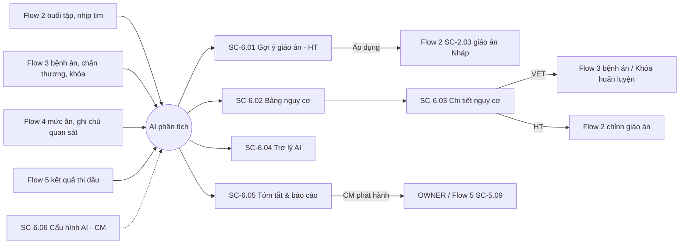
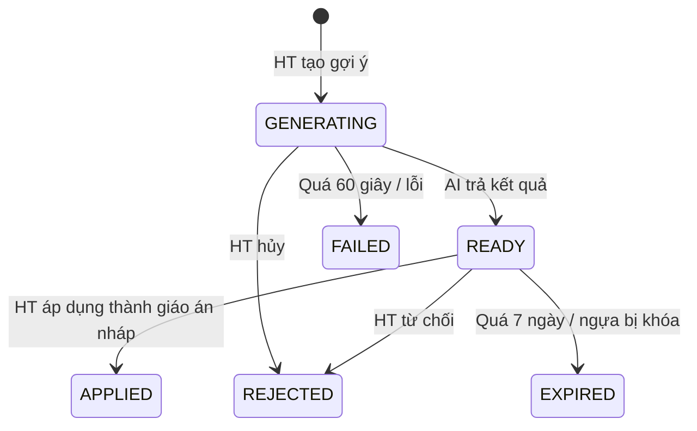

# ĐẶC TẢ LUỒNG & MÀN HÌNH – FLOW 6: ĐỀ XUẤT HUẤN LUYỆN & PHÂN TÍCH SỨC KHỎE BẰNG AI

**Dự án:** RACEHORSE_TRAINING · **Bản:** 1.0 · **Loại flow:** Tùy chọn (optional)

**Quy ước mã:** `SC-6.xx` = màn hình, `DL-6.xx` = dialog, `BTN-6.xx` = nút, `FR-6.xx` = chức năng, `Q-6.xx` = câu hỏi mở (Mục 9). Mã các flow khác được dẫn chiếu khi cần.
**Vai trò:** CM = Club Manager · HT = Head Trainer · VET = Veterinarian · GROOM = Groom / Stable Hand · OWNER = Horse Owner.
**Quy ước hiển thị chung:** ngày `dd/MM/yyyy`, giờ `HH:mm`, giờ Việt Nam (UTC+7). Breakpoint: Mobile < 768px · Tablet 768–1199px · Desktop ≥ 1200px.

**Nguyên tắc chung cho mọi tính năng AI (áp dụng ở mọi màn hình Flow 6):**
1. AI chỉ **gợi ý và cảnh báo**; không tự tạo, sửa, xóa dữ liệu nghiệp vụ, không tự đặt/gỡ Khóa huấn luyện, không tự đăng ký thi đấu. Mọi thay đổi phải do người có quyền bấm xác nhận ở màn hình của Flow 1–5.
2. Mọi nội dung do AI tạo có nhãn **"Do AI tạo"** (badge tím, icon lấp lánh) và dòng "Thông tin tham khảo, không thay thế quyết định chuyên môn của HLV Trưởng và Bác sĩ thú y."
3. AI chỉ đọc dữ liệu trong **phạm vi quyền của người đang dùng** (giống Flow 1–5).
4. Gợi ý của AI **luôn tuân thủ Khóa huấn luyện**: không đề xuất bài tập nặng hoặc đăng ký thi đấu cho ngựa đang bị khóa.
5. Mọi yêu cầu và kết quả AI được lưu lại để tra cứu (lịch sử gợi ý, lịch sử trò chuyện, nhật ký thao tác).

---

## 1. Mục tiêu và phạm vi

**Mục tiêu:** Hỗ trợ HT, VET, CM và OWNER ra quyết định nhanh hơn dựa trên dữ liệu thực: gợi ý giáo án tối ưu, cảnh báo sớm nguy cơ chấn thương, trợ lý hỏi đáp và tự tóm tắt báo cáo.

| Làm (In scope) | Nguồn |
|---|---|
| AI phân tích lịch sử bài tập, nhịp tim, tốc độ hồi phục, thể trạng để gợi ý giáo án cho từng ngựa | Tài liệu gốc – gạch 1 |
| Phân tích, dự báo nguy cơ chấn thương dựa trên tải trọng luyện tập; phát hiện sớm quá tải | Tài liệu gốc – gạch 2 |
| Trợ lý AI giải đáp, tra cứu dinh dưỡng, y tế | Tài liệu gốc – gạch 3 |
| Tự tóm tắt nhật ký sức khỏe, báo cáo tuần/tháng cho CM và OWNER | Tài liệu gốc – gạch 3 |
| AI không thay thế quyết định chuyên môn | Mục 4 Yêu cầu chính |
| Phản hồi chất lượng (Hữu ích / Không hữu ích) | [BỔ SUNG] – cần để đánh giá và cải thiện chất lượng gợi ý |
| Cấu hình bật/tắt tính năng AI, ngưỡng cảnh báo, giới hạn sử dụng | [BỔ SUNG] – CM cần kiểm soát phạm vi và chi phí sử dụng AI |
| Lịch sử gợi ý và lịch sử trò chuyện | [BỔ SUNG] – truy vết nguồn gốc quyết định |

| Không làm (Out of scope) | Thuộc về |
|---|---|
| AI tự áp dụng giáo án, tự đặt khóa, tự đăng ký giải | Bị cấm theo nguyên tắc 1 |
| Chẩn đoán bệnh thay VET | Mục 4 Yêu cầu chính |
| Phân tích ảnh (ảnh chấn thương, X-quang, video) | Loại trừ theo tài liệu gốc (không có ảnh) |
| Kết nối thiết bị đeo đo nhịp tim thời gian thực | Không có trong tài liệu gốc; dữ liệu lấy từ nhập tay ở Flow 2 |
| Huấn luyện / chọn mô hình AI cụ thể | Quyết định kỹ thuật, không thuộc đặc tả màn hình (Q-6.01) |
| Trò chuyện bằng giọng nói | Không có trong tài liệu gốc |

---

## 2. Vai trò và quyền

**Phạm vi dữ liệu:** như Flow 1–5: *Tất cả* = mọi ngựa · *Được giao* = ngựa GROOM chăm sóc · *Sở hữu* = ngựa OWNER sở hữu.

| Chức năng | CM | HT | VET | GROOM | OWNER |
|---|---|---|---|---|---|
| Tạo gợi ý giáo án, áp dụng / từ chối | — | Có | — | — | — |
| Xem lịch sử gợi ý giáo án | Xem | Xem | Xem | — | — |
| Xem bảng nguy cơ chấn thương, chi tiết nguy cơ | Tất cả | Tất cả | Tất cả | — | — (Q-6.06) |
| Xác nhận đã xem cảnh báo nguy cơ | — | Có | Có | — | — |
| Dùng Trợ lý AI | Có (Tất cả) | Có (Tất cả) | Có (Tất cả) | Có (Được giao) | Có (Sở hữu) |
| Tạo tóm tắt / báo cáo AI | Có | Có (tóm tắt huấn luyện) | Có (tóm tắt sức khỏe) | — | — |
| Sửa, duyệt, phát hành, loại bỏ tóm tắt | Có | — | — | — | — |
| Xem tóm tắt đã phát hành | Tất cả | Tất cả | Tất cả | — | Của mình |
| Cấu hình AI | Có | — | — | — | — |

---

## 3. Sơ đồ luồng tổng thể

### 3.1 Danh sách màn hình

| Mã | Tên màn hình | URL | Vai trò |
|---|---|---|---|
| SC-6.01 | Gợi ý giáo án AI | `/ai/training-recommendations` | HT (tạo); CM, VET (xem lịch sử) |
| SC-6.02 | Bảng nguy cơ chấn thương | `/ai/injury-risk` | CM, HT, VET |
| SC-6.03 | Chi tiết nguy cơ của ngựa | `/ai/injury-risk/:horseId` | CM, HT, VET |
| SC-6.04 | Trợ lý AI | `/ai/assistant` + nút nổi trên mọi màn hình | CM, HT, VET, GROOM, OWNER |
| SC-6.05 | Tóm tắt & báo cáo AI | `/ai/summaries` | CM, HT, VET, OWNER |
| SC-6.06 | Cấu hình AI [BỔ SUNG] | `/admin/ai-settings` | CM |

Tính năng AI bị CM tắt ở SC-6.06 → menu ẩn mục đó; vào URL hiện "Tính năng này đang tạm tắt. Liên hệ Quản lý CLB." Không có quyền → "Bạn không có quyền truy cập chức năng này".

### 3.2 Các luồng chính

**L1 – Gợi ý giáo án (HT)**
1. SC-6.01 → chọn ngựa, mục tiêu, thời gian → **Tạo gợi ý**.
2. Hệ thống kiểm tra: ngựa đang khóa → chỉ gợi ý bài nhẹ đến sau ngày xem xét lại khóa; dữ liệu ít → gắn nhãn "Độ tin cậy thấp".
3. Sau tối đa 60 giây: hiển thị giai đoạn, lịch tuần mẫu, lý do, dữ liệu đã dùng, độ tin cậy.
4. HT **Áp dụng thành giáo án nháp** (DL-6.01) → mở SC-2.03 của Flow 2 với dữ liệu điền sẵn, trạng thái Nháp; HT tự chỉnh và kích hoạt theo quy trình Flow 2. Hoặc **Tạo lại với điều chỉnh**, hoặc **Từ chối** (DL-6.02).

**L2 – Cảnh báo nguy cơ chấn thương (Hệ thống → HT, VET)**
1. Hệ thống tính điểm nguy cơ lúc 05:00 hằng ngày và ngay sau mỗi kết quả buổi tập (Flow 2).
2. Ngựa lên mức Cao → thông báo HT, VET. Bảng SC-6.02 hiện dòng đỏ.
3. HT/VET mở SC-6.03 xem yếu tố → hành động ở flow tương ứng (giảm tải giáo án – Flow 2; khám, đặt khóa – Flow 3) → **Xác nhận đã xem** (DL-6.03) ghi hành động đã làm.

**L3 – Trợ lý AI (mọi vai trò)**: bấm nút nổi hoặc mở SC-6.04 → đặt câu hỏi → nhận câu trả lời kèm link nguồn dữ liệu → đánh giá Hữu ích / Không hữu ích.

**L4 – Tóm tắt & báo cáo (Hệ thống → CM → OWNER)**
1. Thứ Hai 06:00: tạo tóm tắt tuần trước; ngày 1 hằng tháng 06:00: tạo tóm tắt tháng trước (trạng thái Bản nháp AI).
2. CM xem, sửa nội dung, **Duyệt & phát hành** (DL-6.06) → OWNER nhận thông báo; bản tháng được gắn vào báo cáo định kỳ Flow 5 (SC-5.09) ở mục "Nhận xét tổng hợp".
3. CM, HT, VET có thể **Tạo tóm tắt** thủ công (DL-6.05).

---

## 4. Vòng đời trạng thái

### 4.1 Gợi ý giáo án

| Mã | Nhãn | Màu | Ý nghĩa |
|---|---|---|---|
| GENERATING | Đang tạo | Xanh dương, có vòng quay | Đang xử lý (tối đa 60 giây) |
| READY | Sẵn sàng | Tím | Có kết quả, chờ HT quyết định |
| APPLIED | Đã áp dụng | Xanh lá | HT đã tạo giáo án Nháp từ gợi ý |
| REJECTED | Đã từ chối | Xám | HT từ chối, có lý do |
| EXPIRED | Hết hạn | Xám nhạt | Sẵn sàng quá 7 ngày không xử lý, hoặc dữ liệu ngựa thay đổi lớn (bị khóa, đổi trạng thái) |
| FAILED | Lỗi | Đỏ | Quá 60 giây hoặc lỗi dịch vụ AI |

| Từ | Đến | Ai | Điều kiện |
|---|---|---|---|
| (Tạo) | Đang tạo | HT | Qua kiểm tra đầu vào |
| Đang tạo | Sẵn sàng / Lỗi | Hệ thống | Có kết quả / quá 60 giây hoặc lỗi |
| Đang tạo | Đã từ chối | HT | Bấm Hủy (lý do tự ghi "Hủy khi đang tạo") |
| Sẵn sàng | Đã áp dụng | HT | Ngựa không Ngừng quản lý |
| Sẵn sàng | Đã từ chối | HT | Lý do bắt buộc |
| Sẵn sàng | Hết hạn | Hệ thống | Quá 7 ngày; hoặc ngựa bị đặt Khóa huấn luyện sau khi tạo gợi ý; hoặc ngựa Ngừng quản lý |

### 4.2 Mức nguy cơ chấn thương

| Mức | Điểm | Màu |
|---|---|---|
| Thấp | 0–39 | Xanh lá |
| Trung bình | 40–69 | Vàng |
| Cao | 70–100 | Đỏ |
| Chưa đủ dữ liệu | — (ít hơn 4 buổi tập hoàn thành trong 28 ngày) | Xám |

Ngưỡng 40 và 70 là mặc định, CM chỉnh được ở SC-6.06.

**Trạng thái cảnh báo:** Mới (chưa ai xác nhận) → Đã xem (HT hoặc VET đã xác nhận, kèm hành động). Một cảnh báo mới được tạo khi ngựa **chuyển lên** mức Trung bình hoặc Cao từ mức thấp hơn, hoặc khi điểm tăng thêm ≥ 15 so với lần xác nhận gần nhất.

**Liên quan Medical Lock:** ngựa đang Khóa huấn luyện vẫn được tính điểm nhưng dòng hiện nhãn "Đang Khóa huấn luyện", không tạo cảnh báo mới (vì đã được VET xử lý).

### 4.3 Tóm tắt & báo cáo AI

| Mã | Nhãn | Màu |
|---|---|---|
| DRAFT | Bản nháp AI | Tím |
| EDITED | Đã chỉnh sửa | Xanh dương |
| PUBLISHED | Đã phát hành | Xanh lá |
| DISCARDED | Đã loại bỏ | Xám |

| Từ | Đến | Ai | Điều kiện |
|---|---|---|---|
| (Tạo) | Bản nháp AI | Hệ thống, CM, HT, VET | Lịch tự động hoặc tạo thủ công |
| Bản nháp AI | Đã chỉnh sửa | CM | Lưu nội dung đã sửa |
| Bản nháp AI, Đã chỉnh sửa | Đã phát hành | CM | Chỉ tóm tắt dành cho OWNER hoặc CM; tóm tắt nội bộ (HT, VET tạo cho mình) không cần phát hành |
| Bản nháp AI, Đã chỉnh sửa | Đã loại bỏ | CM, người tạo | Lý do bắt buộc |
| Bản nháp AI | Bản nháp AI (tạo lại) | CM, người tạo | Nội dung cũ bị thay |

---

## 5. Đặc tả màn hình

**Quy ước chung:** Đang tải: skeleton. Lỗi tải: "Không tải được dữ liệu" + **Thử lại**. Mất mạng: toast đỏ "Mất kết nối mạng. Vui lòng thử lại." Dịch vụ AI không phản hồi: khung vàng "Dịch vụ AI tạm thời không khả dụng. Các chức năng khác của hệ thống vẫn hoạt động bình thường." + **Thử lại**. Nút không có quyền: ẩn. Nút bị chặn: hiện, vô hiệu hóa, tooltip lý do.

### 5.1 SC-6.01 – Gợi ý giáo án AI

**Mục đích:** HT nhận đề xuất giáo án dựa trên dữ liệu và quyết định có dùng hay không. **Vai trò:** HT (tạo, xử lý); CM, VET (xem tab Lịch sử gợi ý).

**Bố cục:** 2 tab (BTN-6.07): **Tạo gợi ý** · **Lịch sử gợi ý**.
- Tab Tạo gợi ý – Desktop: form bên trái (35%), kết quả bên phải (65%). Tablet, Mobile: form trên, kết quả dưới.

**Form yêu cầu**

| Nhãn | Loại | Bắt buộc | Quy tắc | Thông báo lỗi |
|---|---|---|---|---|
| Ngựa | Dropdown có tìm kiếm; mỗi mục hiện badge trạng thái, icon khóa, số buổi tập 12 tuần | Có | Không Ngừng quản lý | "Vui lòng chọn ngựa." / "Ngựa đã ngừng quản lý." |
| Mục tiêu | Radio: Chuẩn bị cho giải đua · Xây dựng thể lực nền · Duy trì phong độ · Phục hồi sau chấn thương | Có | | "Vui lòng chọn mục tiêu." |
| Giải mục tiêu | Dropdown giải Mở đăng ký (Flow 5); hiện khi chọn "Chuẩn bị cho giải đua" | Có khi hiện | | "Vui lòng chọn giải mục tiêu." |
| Ngày bắt đầu | Date picker, mặc định ngày mai | Có | ≥ hôm nay | "Ngày bắt đầu không được trước ngày hiện tại." |
| Ngày kết thúc | Date picker; tự điền = ngày đua − 1 khi có giải mục tiêu | Có | 14–182 ngày sau Ngày bắt đầu | "Thời lượng giáo án phải từ 2 đến 26 tuần." |
| Số buổi tối đa mỗi tuần | Số nguyên, mặc định 6 | Có | 1–14 | "Số buổi mỗi tuần phải từ 1 đến 14." |
| Mặt sân ưu tiên | Chọn nhiều: Cỏ / Cát / Hỗn hợp; mặc định theo mặt sân giải mục tiêu | Không | | |
| Yêu cầu thêm | Textarea, placeholder "Ví dụ: tránh chạy tốc độ vào thứ Hai" | Không | ≤ 500 ký tự | "Yêu cầu thêm tối đa 500 ký tự." |

**Kiểm tra trước khi tạo (hiện ngay khi chọn ngựa)**

| Tình huống | Hiển thị | Hành vi |
|---|---|---|
| Ngựa đang Khóa huấn luyện | Khung đỏ "Ngựa đang bị Khóa huấn luyện đến ngày xem xét lại {dd/MM/yyyy}. AI chỉ đề xuất bài tập nhẹ trước ngày này; bài tập nặng chỉ được xếp sau khi Bác sĩ thú y mở khóa." | Mục tiêu tự đặt "Phục hồi sau chấn thương", các lựa chọn khác vô hiệu hóa |
| Ngựa ở trạng thái y tế (không khóa) | Khung vàng "Ngựa đang ở trạng thái {Nhãn}." | Cho tạo |
| Ít hơn 8 buổi tập hoàn thành trong 12 tuần | Khung vàng "Dữ liệu tập luyện ít ({n} buổi). Gợi ý sẽ có độ tin cậy thấp." | Cho tạo |
| Ngựa đang có giáo án Đang áp dụng | Khung xanh "Ngựa đang áp dụng giáo án {Mã}. Gợi ý mới sẽ tạo giáo án Nháp riêng." | Cho tạo |
| HT đã dùng hết lượt gợi ý trong ngày (SC-6.06) | Khung xám "Bạn đã dùng hết {n} lượt gợi ý hôm nay." | BTN-6.01 vô hiệu hóa |

**Vùng kết quả**
- Đang tạo: vòng quay + "AI đang phân tích dữ liệu của {Ngựa}…" + nút **Hủy** (BTN-6.09).
- Sẵn sàng:
  - Header: badge "Do AI tạo", độ tin cậy (Cao xanh / Trung bình vàng / Thấp cam), thời điểm tạo, hạn xử lý ("Hết hạn sau {n} ngày").
  - **Tóm tắt:** 2–5 câu mô tả chiến lược.
  - **Giai đoạn đề xuất:** bảng Tên · Loại giai đoạn · Từ – Đến · Số buổi/tuần · Cự ly tối đa/tuần · Mặt sân · Tốc độ mục tiêu (cùng trường với Flow 2 SC-2.03).
  - **Lịch tuần mẫu mỗi giai đoạn:** bảng 7 ngày × buổi: Loại bài tập · Cường độ · Cự ly × Số hiệp · Tốc độ mục tiêu. Bài tập nặng có badge "Nặng".
  - **Vì sao đề xuất:** danh sách lý do, mỗi lý do gắn chỉ số (ví dụ "Nhịp tim sau 10 phút TB 4 tuần gần nhất giảm từ 68 xuống 61 bpm → thể lực nền tốt, có thể tăng cường độ").
  - **Cảnh báo:** danh sách (ví dụ "Tải tập 7 ngày hiện tại cao hơn 35% TB 4 tuần; tuần đầu giữ cường độ trung bình").
  - **Dữ liệu đã dùng** (thu gọn, BTN-6.06): khoảng thời gian, số buổi tập, số lần đo nhịp tim, số bệnh án/chấn thương xét tới, kết quả thi đấu xét tới.
- Lỗi: khung đỏ "Không tạo được gợi ý. {Lý do}." + **Thử lại** (dùng lại BTN-6.01).

**Nút**

| Mã | Nút | Vai trò | Hiện khi | Hành vi |
|---|---|---|---|---|
| BTN-6.01 | Tạo gợi ý | HT | Form hợp lệ | Gửi yêu cầu; form khóa lại trong lúc tạo |
| BTN-6.02 | Áp dụng thành giáo án nháp | HT | Sẵn sàng | Mở DL-6.01 |
| BTN-6.03 | Tạo lại với điều chỉnh | HT | Sẵn sàng, Lỗi, Đã từ chối | Mở khóa form với dữ liệu cũ; gợi ý cũ chuyển Đã từ chối (lý do tự ghi "Tạo lại") khi gợi ý mới được tạo |
| BTN-6.04 | Từ chối | HT | Sẵn sàng | Mở DL-6.02 |
| BTN-6.05 | Hữu ích / Không hữu ích | HT | Sẵn sàng, Đã áp dụng, Đã từ chối | Ghi phản hồi; chọn "Không hữu ích" mở ô nhập góp ý (≤ 500 ký tự, không bắt buộc) |
| BTN-6.06 | Xem dữ liệu đã dùng | HT, CM, VET | Có kết quả | Mở/thu gọn khối |
| BTN-6.07 | Tab Tạo gợi ý / Lịch sử gợi ý | HT (2 tab); CM, VET (chỉ Lịch sử) | Luôn | Đổi tab |
| BTN-6.09 | Hủy | HT | Đang tạo | Dừng tạo |

**Tab Lịch sử gợi ý**

Bộ lọc: Ngựa · Trạng thái (Mục 4.1) · Khoảng ngày tạo · Người tạo.

| Cột | Hiển thị | Sắp xếp |
|---|---|---|
| Thời điểm tạo | `dd/MM/yyyy HH:mm` | Có (mặc định mới nhất) |
| Ngựa | Tên | Có |
| Mục tiêu | Nhãn + giải mục tiêu | Không |
| Độ tin cậy | Badge | Có |
| Trạng thái | Badge | Có |
| Giáo án tạo ra | Mã giáo án (link SC-2.04) khi Đã áp dụng | Không |
| Phản hồi | Hữu ích / Không hữu ích / — | Có |
| Người tạo | Họ tên | Không |
| Hành động | Xem | — |

| Mã | Nút | Hành vi |
|---|---|---|
| BTN-6.08 | Xem (mỗi dòng) | Hiển thị lại vùng kết quả (chỉ đọc) của gợi ý đó |

Rỗng: "Chưa có gợi ý nào."

### 5.2 SC-6.02 – Bảng nguy cơ chấn thương

**Mục đích:** Phát hiện sớm ngựa quá tải thể lực, có nguy cơ chấn thương. **Vai trò:** CM (xem); HT, VET (xem, xác nhận).

**Bố cục:** hàng thẻ đếm (Cao · Trung bình · Thấp · Chưa đủ dữ liệu · Cảnh báo chưa xem) → bộ lọc → bảng. Mobile: danh sách thẻ, sắp theo điểm giảm dần.

**Bộ lọc:** Tìm ngựa · Mức nguy cơ (mặc định Cao + Trung bình) · Chỉ cảnh báo chưa xem (checkbox) · Trạng thái ngựa.

**Bảng**

| Cột | Hiển thị | Sắp xếp |
|---|---|---|
| Ngựa | Tên + badge trạng thái + icon khóa; nhãn "Đang Khóa huấn luyện" nếu khóa | Có |
| Điểm nguy cơ | Số 0–100 + thanh màu theo mức | Có (mặc định giảm dần) |
| Xu hướng 7 ngày | Mũi tên ▲ đỏ / ▼ xanh / ► xám + chênh lệch điểm | Có |
| Yếu tố chính | 3 yếu tố đóng góp lớn nhất, dạng nhãn ngắn (ví dụ "Tăng tải đột ngột", "Hồi phục nhịp tim chậm") | Không |
| Tỷ lệ tải cấp/mãn tính | Số 2 chữ số thập phân (tải 7 ngày ÷ TB tuần 28 ngày); đỏ khi > 1,50 | Có |
| Cập nhật lúc | `dd/MM HH:mm` | Có |
| Cảnh báo | Badge "Mới" đỏ / "Đã xem – {Họ tên}" xám | Có |
| Hành động | Xem chi tiết · Xác nhận đã xem | — |

| Mã | Nút | Vai trò | Hiện khi | Hành vi |
|---|---|---|---|---|
| BTN-6.10 | Xem chi tiết (mỗi dòng) | CM, HT, VET | Luôn | Mở SC-6.03 |
| BTN-6.11 | Xác nhận đã xem (mỗi dòng) | HT, VET | Cảnh báo Mới | Mở DL-6.03 |
| BTN-6.12 | Xóa bộ lọc | Tất cả | Luôn | Bộ lọc về mặc định |
| BTN-6.13 | Tính lại ngay | HT, VET | Luôn | Yêu cầu tính lại toàn bộ; vô hiệu hóa 10 phút sau mỗi lần bấm ("Vừa tính lại lúc {HH:mm}. Thử lại sau {n} phút.") |

Chú thích cố định dưới bảng: "Điểm nguy cơ do AI ước tính từ dữ liệu tập luyện và y tế, chỉ dùng để tham khảo."
**Trạng thái giao diện:** "Không có ngựa nào ở mức nguy cơ đã chọn."

### 5.3 SC-6.03 – Chi tiết nguy cơ của ngựa

**Mục đích:** Giải thích vì sao ngựa có điểm nguy cơ hiện tại và dẫn tới hành động phù hợp. **Vai trò:** CM, HT, VET.

**Bố cục:** Header (tên ngựa, badge trạng thái, icon khóa, điểm + mức nguy cơ, badge "Do AI tạo") → khối Yếu tố → biểu đồ → khối Nhận định AI → khối Lịch sử cảnh báo. Mobile: 1 cột.

**Khối Yếu tố:** bảng Yếu tố · Giá trị hiện tại · Ngưỡng tham chiếu · Mức đóng góp (thanh %) · Nguồn (link sang màn hình dữ liệu gốc):

| Yếu tố | Cách đo | Nguồn |
|---|---|---|
| Tỷ lệ tải cấp/mãn tính | Tải 7 ngày ÷ TB tuần của 28 ngày | Flow 2 SC-2.07 |
| Số bài tập nặng trong 7 ngày | Đếm | Flow 2 SC-2.04 |
| Hồi phục nhịp tim | Nhịp tim sau 10 phút nghỉ, xu hướng 4 tuần | Flow 2 SC-2.07 |
| Phong độ | Điểm phong độ TB 3 buổi gần nhất so với TB 8 tuần | Flow 2 SC-2.07 |
| Tiền sử chấn thương | Số chấn thương 12 tháng, chấn thương chưa lành | Flow 3 SC-3.05 |
| Dấu hiệu bất thường sau tập | Số lần trong 14 ngày | Flow 2 SC-2.06 |
| Ghi chú quan sát | Số ghi chú Cần chú ý/Khẩn trong 7 ngày | Flow 4 SC-4.07 |
| Ăn uống | Số bữa "Ăn ít"/"Bỏ ăn" trong 7 ngày | Flow 4 SC-4.07 |
| Tuổi | Năm | Flow 1 SC-1.03 |

**Biểu đồ:** điểm nguy cơ theo ngày (đường) chồng lên tải tập theo tuần (cột); dải nền đỏ nhạt các khoảng bị Khóa huấn luyện. Khoảng thời gian BTN-6.18: 4 / 12 / 26 tuần (mặc định 12).

**Khối Nhận định AI:** 3–6 câu diễn giải bằng tiếng Việt + danh sách "Gợi ý hành động" (ví dụ "Giảm cự ly tuần tới khoảng 20%", "Cân nhắc khám chân trước trái do tiền sử viêm gân"). Mỗi gợi ý chỉ là văn bản; hành động thật thực hiện qua các nút dưới.

**Khối Lịch sử cảnh báo:** bảng Thời điểm · Mức · Điểm · Người xác nhận · Hành động đã làm · Ghi chú.

**Nút**

| Mã | Nút | Vai trò | Hiện khi | Hành vi |
|---|---|---|---|---|
| BTN-6.14 | Xác nhận đã xem | HT, VET | Có cảnh báo Mới | Mở DL-6.03 |
| BTN-6.15 | Tạo bệnh án | VET | Ngựa không Ngừng quản lý | Mở SC-3.03 điền sẵn ngựa, nguồn phát hiện "Cảnh báo nguy cơ AI" |
| BTN-6.16 | Đặt Khóa huấn luyện | VET | Ngựa chưa bị khóa | Mở DL-3.01 (Flow 3) |
| BTN-6.17 | Mở giáo án hiện tại | HT | Ngựa có giáo án Đang áp dụng | Mở SC-2.04 |
| BTN-6.18 | Khoảng thời gian 4 / 12 / 26 tuần | Tất cả | Luôn | Đổi khoảng biểu đồ |

**Trạng thái giao diện:** Chưa đủ dữ liệu: "Cần ít nhất 4 buổi tập hoàn thành trong 28 ngày để tính nguy cơ. Hiện có {n} buổi."

### 5.4 SC-6.04 – Trợ lý AI

**Mục đích:** Hỏi đáp dinh dưỡng, y tế tổng quát, tra cứu nhanh dữ liệu ngựa trong phạm vi quyền. **Vai trò:** CM, HT, VET, GROOM, OWNER.

**Cách mở:** (1) trang đầy đủ `/ai/assistant`; (2) nút nổi tròn góc phải dưới trên mọi màn hình (BTN-6.27) mở panel trượt từ phải (Desktop rộng 420px; Mobile toàn màn hình). Mở từ màn hình có ngựa cụ thể (SC-1.03, SC-2.04, SC-3.02…) → ngữ cảnh tự chọn ngựa đó.

**Bố cục trang đầy đủ:** cột trái danh sách cuộc trò chuyện (Desktop 280px; Mobile ẩn sau nút menu) → vùng hội thoại → ô nhập cố định cuối.

**Thành phần**

| Thành phần | Loại | Mô tả |
|---|---|---|
| Ngữ cảnh ngựa | Dropdown có tìm kiếm (BTN-6.28), mặc định "Không chọn" | Chỉ liệt kê ngựa trong phạm vi quyền; khi chọn, câu hỏi được hiểu là về ngựa đó |
| Câu hỏi gợi ý | Nhóm chip (BTN-6.24), hiện khi cuộc trò chuyện trống | Theo vai trò. HT: "Tóm tắt tình hình tập của {ngựa} 2 tuần qua", "Ngựa nào có tải tập tăng đột ngột tuần này?". VET: "Tóm tắt nhật ký sức khỏe {ngựa} 30 ngày", "Liều thông thường của chất điện giải sau tập nặng?". GROOM: "Hôm nay {ngựa} ăn gì?", "Cách ngâm chân nước đá đúng cách?". OWNER: "Ngựa của tôi tháng này thế nào?". CM: "Chi phí tháng này tăng ở đâu?" |
| Ô nhập câu hỏi | Textarea tự giãn tối đa 6 dòng, placeholder "Hỏi về dinh dưỡng, sức khỏe hoặc dữ liệu ngựa…" | 1–2000 ký tự. Enter = gửi, Shift+Enter = xuống dòng. Lỗi: "Câu hỏi tối đa 2000 ký tự." |
| Tin nhắn AI | Khối văn bản có định dạng (danh sách, bảng); badge "Do AI tạo" | Cuối mỗi câu trả lời có mục **Nguồn**: danh sách link tới bản ghi đã dùng (ví dụ "Buổi tập 12/09/2026 – SC-2.06"). Câu trả lời liên quan y tế luôn kết thúc bằng "Thông tin tham khảo, không thay thế chẩn đoán của Bác sĩ thú y." |
| Hiển thị dần | Câu trả lời hiện dần theo từng đoạn khi AI tạo | |

**Nút**

| Mã | Nút | Vai trò | Hiện khi | Hành vi |
|---|---|---|---|---|
| BTN-6.19 | Gửi | Tất cả | Ô nhập có nội dung và không đang trả lời | Gửi câu hỏi |
| BTN-6.20 | Dừng trả lời | Tất cả | Đang trả lời | Dừng; giữ phần đã hiện, ghi chú "(Đã dừng)" |
| BTN-6.21 | Cuộc trò chuyện mới | Tất cả | Luôn | Tạo cuộc trò chuyện trống |
| BTN-6.22 | Đổi tên (mỗi cuộc trò chuyện) | Tất cả | Luôn | Sửa tên tại chỗ, 1–100 ký tự; tên mặc định = 50 ký tự đầu câu hỏi đầu tiên |
| BTN-6.23 | Xóa (mỗi cuộc trò chuyện) | Tất cả | Luôn | Mở DL-6.04 |
| BTN-6.24 | Câu hỏi gợi ý (chip) | Tất cả | Cuộc trò chuyện trống | Điền câu hỏi vào ô nhập và gửi |
| BTN-6.25 | Sao chép (mỗi câu trả lời) | Tất cả | Luôn | Sao chép văn bản; toast "Đã sao chép." |
| BTN-6.26 | Hữu ích / Không hữu ích (mỗi câu trả lời) | Tất cả | Luôn | Ghi phản hồi; "Không hữu ích" mở ô góp ý ≤ 500 ký tự |
| BTN-6.27 | Mở trợ lý (nút nổi) | Tất cả | Mọi màn hình, khi tính năng bật | Mở panel |
| BTN-6.28 | Ngữ cảnh ngựa | Tất cả | Luôn | Chọn ngựa |

**Giới hạn và hành vi đặc biệt**
- Mỗi người tối đa 50 câu hỏi/ngày (CM chỉnh ở SC-6.06). Hết lượt: ô nhập vô hiệu hóa, "Bạn đã dùng hết {n} câu hỏi hôm nay. Lượt mới có lúc 00:00."
- Người dùng yêu cầu thao tác ghi (ví dụ "Hãy khóa huấn luyện ngựa X", "Đăng ký ngựa Y vào giải Z"): AI trả lời không thực hiện được và kèm link tới màn hình đúng (ví dụ "Bạn có thể đặt Khóa huấn luyện tại Hồ sơ y tế" → SC-3.02, chỉ hiện link khi người dùng có quyền).
- Câu hỏi về ngựa ngoài phạm vi quyền: "Tôi không có thông tin về ngựa này trong phạm vi quyền của bạn."
- Câu hỏi ngoài lĩnh vực ngựa/CLB: AI trả lời ngắn gọn rằng trợ lý chỉ hỗ trợ nội dung liên quan đến quản lý và chăm sóc ngựa.
- Lịch sử trò chuyện lưu 180 ngày (Q-6.08); chỉ chủ nhân cuộc trò chuyện xem được.

**Trạng thái giao diện:** Chưa có cuộc trò chuyện: "Bắt đầu bằng cách đặt câu hỏi hoặc chọn một gợi ý bên dưới." Lỗi khi trả lời: tin nhắn đỏ "Không nhận được câu trả lời. Thử lại?" + nút Thử lại (gửi lại câu hỏi cuối).

### 5.5 SC-6.05 – Tóm tắt & báo cáo AI

**Mục đích:** Tự tóm tắt nhật ký sức khỏe, báo cáo tuần/tháng; CM duyệt trước khi gửi OWNER. **Vai trò:** CM (toàn quyền); HT, VET (tạo và xem tóm tắt nội bộ, xem bản đã phát hành); OWNER (xem bản đã phát hành của mình).

**Loại tóm tắt**

| Loại | Phạm vi | Nội dung | Tạo tự động | Đối tượng nhận |
|---|---|---|---|---|
| Tóm tắt nhật ký sức khỏe | 1 ngựa, khoảng ngày tùy chọn (7–90 ngày) | Chỉ số sinh tồn, bệnh án, chấn thương, khóa, định kỳ, ghi chú quan sát | Không | Nội bộ (người tạo) hoặc OWNER (qua CM phát hành) |
| Báo cáo tuần theo ngựa | 1 ngựa, tuần trước | Tập luyện, sức khỏe, chăm sóc, thi đấu, nguy cơ | Thứ Hai 06:00 cho mọi ngựa có OWNER | OWNER |
| Báo cáo tháng theo ngựa | 1 ngựa, tháng trước | Như tuần + xu hướng, chi phí và tiền thưởng phân bổ | Ngày 1 lúc 06:00 | OWNER (gắn vào báo cáo định kỳ Flow 5) |
| Báo cáo tháng toàn CLB | Toàn CLB, tháng trước | Tổng hợp hiệu suất, sức khỏe, chi phí, thành tích | Ngày 1 lúc 06:00 | CM |

**Bộ lọc:** Loại · Ngựa · Kỳ · Trạng thái (Mục 4.3) · Đối tượng nhận.

**Bảng**

| Cột | Hiển thị | Sắp xếp |
|---|---|---|
| Tạo lúc | `dd/MM/yyyy HH:mm` | Có (mặc định mới nhất) |
| Loại | Nhãn | Có |
| Phạm vi | Tên ngựa hoặc "Toàn CLB" + kỳ | Không |
| Đối tượng nhận | OWNER (họ tên) / CM / Nội bộ | Không |
| Trạng thái | Badge | Có |
| Người duyệt | Họ tên | Không |
| Hành động | Xem · Sửa · Phát hành · Loại bỏ · Tải PDF | — |

**Trang xem tóm tắt** `/ai/summaries/:id`: tiêu đề, kỳ, badge "Do AI tạo" (và "Đã chỉnh sửa bởi {Họ tên}" nếu có), nội dung chia mục (Tập luyện · Sức khỏe · Chăm sóc · Thi đấu · Tài chính · Nguy cơ), mỗi số liệu có link nguồn. Chế độ sửa (CM): trình soạn thảo văn bản cho từng mục; số liệu tự động không sửa được, chỉ sửa đoạn nhận xét.

**Nút**

| Mã | Nút | Vai trò | Hiện khi | Hành vi |
|---|---|---|---|---|
| BTN-6.29 | Tạo tóm tắt | CM, HT, VET | Luôn | Mở DL-6.05 |
| BTN-6.30 | Xem (mỗi dòng) | Tất cả (theo quyền) | Luôn (OWNER: Đã phát hành) | Mở trang xem |
| BTN-6.31 | Sửa nội dung | CM | Bản nháp AI, Đã chỉnh sửa | Chuyển trang xem sang chế độ sửa; Lưu → Đã chỉnh sửa |
| BTN-6.32 | Duyệt & phát hành | CM | Bản nháp AI, Đã chỉnh sửa; đối tượng OWNER hoặc CM | Mở DL-6.06 |
| BTN-6.33 | Loại bỏ | CM, người tạo | Bản nháp AI, Đã chỉnh sửa | Mở DL-6.07 |
| BTN-6.34 | Tạo lại | CM, người tạo | Bản nháp AI | Tạo lại nội dung từ dữ liệu hiện tại; hộp xác nhận "Nội dung hiện tại sẽ bị thay thế." |
| BTN-6.35 | Tải PDF | Tất cả (theo quyền) | Luôn (OWNER: Đã phát hành) | Tải file |
| BTN-6.36 | Xóa bộ lọc | Tất cả | Luôn | Bộ lọc về mặc định |

**Trạng thái giao diện:** CM: "Chưa có tóm tắt nào." OWNER: "Chưa có báo cáo nào được phát hành cho bạn."

### 5.6 SC-6.06 – Cấu hình AI [BỔ SUNG]

**Mục đích:** CM bật/tắt tính năng AI và đặt ngưỡng, giới hạn. **Vai trò:** CM.

**Thành phần**

| Nhóm | Nhãn | Loại | Mặc định | Quy tắc | Thông báo lỗi |
|---|---|---|---|---|---|
| Bật/tắt | Gợi ý giáo án | Công tắc | Bật | | |
| Bật/tắt | Cảnh báo nguy cơ chấn thương | Công tắc | Bật | | |
| Bật/tắt | Trợ lý AI | Công tắc + chọn nhiều vai trò được dùng | Bật cho cả 5 vai trò | Ít nhất 1 vai trò khi bật | "Vui lòng chọn ít nhất 1 vai trò." |
| Bật/tắt | Tóm tắt & báo cáo tự động | Công tắc | Bật | | |
| Ngưỡng | Ngưỡng nguy cơ Trung bình | Số nguyên | 40 | 10–89 và < ngưỡng Cao | "Ngưỡng Trung bình phải nhỏ hơn ngưỡng Cao." |
| Ngưỡng | Ngưỡng nguy cơ Cao | Số nguyên | 70 | 20–99 | "Ngưỡng Cao phải từ 20 đến 99." |
| Giới hạn | Số câu hỏi trợ lý mỗi người mỗi ngày | Số nguyên | 50 | 1–500 | "Giới hạn phải từ 1 đến 500." |
| Giới hạn | Số lượt gợi ý giáo án mỗi HT mỗi ngày | Số nguyên | 10 | 1–100 | "Giới hạn phải từ 1 đến 100." |
| Thống kê (chỉ đọc) | Số lượt dùng 30 ngày theo tính năng, tỷ lệ "Hữu ích" | Bảng | — | | |

**Nút**

| Mã | Nút | Hành vi |
|---|---|---|
| BTN-6.37 | Lưu cấu hình | Lưu → toast "Đã lưu cấu hình AI." Thay đổi ngưỡng áp dụng từ lần tính điểm tiếp theo |
| BTN-6.38 | Khôi phục mặc định | Hộp xác nhận → đưa mọi giá trị về mặc định (chưa lưu cho đến khi bấm Lưu) |

Rời trang khi chưa lưu → DL-6.08.

---

### 5.7 Dialog dùng chung

Quy ước: Desktop giữa màn hình rộng 560px; Mobile toàn màn hình. Nút chính bên phải, vô hiệu hóa khi form chưa hợp lệ hoặc đang gửi. Lỗi server hiện đầu dialog.

#### DL-6.01 – Áp dụng gợi ý thành giáo án nháp

Mở từ BTN-6.02. Vai trò: HT.
Nội dung: "Tạo giáo án Nháp cho {Ngựa} từ gợi ý này? Bạn sẽ được chuyển tới màn hình soạn giáo án để kiểm tra và chỉnh sửa. Giáo án chỉ có hiệu lực khi bạn kích hoạt theo quy trình Huấn luyện."

| Nhãn | Loại | Bắt buộc | Quy tắc | Thông báo lỗi |
|---|---|---|---|---|
| Tên giáo án | Text, mặc định "{Mục tiêu} – {Ngựa} (gợi ý AI)" | Có | 3–150 ký tự | "Tên giáo án phải từ 3 đến 150 ký tự." |
| Tạo sẵn buổi tập theo lịch tuần mẫu | Checkbox, mặc định tích | Không | Buổi tập nặng rơi vào trước ngày xem xét lại khóa (nếu ngựa đang khóa) không được tạo | |

Lỗi server: "Ngựa đã bị Khóa huấn luyện sau khi tạo gợi ý. Vui lòng tạo gợi ý mới." (gợi ý chuyển Hết hạn).
Nút: **Hủy** · **Tạo giáo án nháp** (BTN-6.39). Thành công: gợi ý chuyển Đã áp dụng; mở SC-2.03 của giáo án mới; giáo án có nhãn "Tạo từ gợi ý AI".

#### DL-6.02 – Từ chối gợi ý

Mở từ BTN-6.04. Vai trò: HT.

| Nhãn | Loại | Bắt buộc | Quy tắc | Thông báo lỗi |
|---|---|---|---|---|
| Lý do | Dropdown: Không phù hợp tình trạng ngựa · Cường độ quá cao · Cường độ quá thấp · Không phù hợp lịch thi đấu · Dữ liệu đầu vào sai · Khác | Có | | "Vui lòng chọn lý do." |
| Ghi chú | Textarea | Có khi Khác | 10–500 ký tự | "Ghi chú phải từ 10 đến 500 ký tự." |

Nút: **Hủy** · **Từ chối** (BTN-6.40).

#### DL-6.03 – Xác nhận đã xem cảnh báo nguy cơ

Mở từ BTN-6.11, BTN-6.14. Vai trò: HT, VET.

| Nhãn | Loại | Bắt buộc | Quy tắc | Thông báo lỗi |
|---|---|---|---|---|
| Hành động đã làm | Chọn nhiều: Không cần xử lý · Đã giảm tải giáo án · Đã hủy/đổi buổi tập nặng · Đã yêu cầu Bác sĩ thú y khám · Đã khám · Đã đặt Khóa huấn luyện · Khác | Có | Ít nhất 1 | "Vui lòng chọn ít nhất 1 hành động." |
| Ghi chú | Textarea | Có khi chọn "Không cần xử lý" hoặc "Khác" | 10–500 ký tự | "Vui lòng giải thích (10–500 ký tự)." |

"Đã yêu cầu Bác sĩ thú y khám" (HT chọn) → mọi VET nhận thông báo "HLV Trưởng yêu cầu khám {Ngựa} do cảnh báo nguy cơ chấn thương."
Nút: **Hủy** · **Xác nhận** (BTN-6.41). Cảnh báo chuyển Đã xem.

#### DL-6.04 – Xóa cuộc trò chuyện

Mở từ BTN-6.23. Nội dung: "Xóa cuộc trò chuyện '{Tên}'? Không thể hoàn tác." Nút: **Hủy** · **Xóa** (BTN-6.42, màu đỏ). Bản lưu phục vụ kiểm tra an toàn thông tin vẫn được hệ thống giữ theo thời hạn lưu trữ (Q-6.08).

#### DL-6.05 – Tạo tóm tắt

Mở từ BTN-6.29. Vai trò: CM, HT, VET.

| Nhãn | Loại | Bắt buộc | Quy tắc | Thông báo lỗi |
|---|---|---|---|---|
| Loại | Dropdown: Tóm tắt nhật ký sức khỏe · Báo cáo tuần theo ngựa · Báo cáo tháng theo ngựa · Báo cáo tháng toàn CLB (chỉ CM) | Có | Mọi loại chỉ dùng dữ liệu trong phạm vi quyền của người tạo | "Vui lòng chọn loại." |
| Ngựa | Chọn nhiều có tìm kiếm; ẩn với loại Toàn CLB | Có khi hiện | Tối đa 20 ngựa mỗi lần | "Vui lòng chọn ngựa." / "Mỗi lần tối đa 20 ngựa." |
| Kỳ / Khoảng ngày | Tuần, Tháng hoặc Từ – Đến (7–90 ngày) theo loại | Có | Kết thúc ≤ hôm qua | "Khoảng ngày phải kết thúc trước hôm nay." |
| Đối tượng nhận | Radio: Nội bộ (chỉ tôi) / Chủ sở hữu (CM phát hành) | Có, mặc định Nội bộ | "Chủ sở hữu" chỉ khi ngựa có OWNER | |

Nút: **Hủy** · **Tạo** (BTN-6.43). Tạo xong (tối đa 60 giây mỗi ngựa) → toast "Đã tạo {n} tóm tắt." Đối tượng Chủ sở hữu: CM nhận thông báo chờ duyệt.

#### DL-6.06 – Duyệt & phát hành tóm tắt

Mở từ BTN-6.32. Vai trò: CM.
Nội dung: "Phát hành tóm tắt cho {Người nhận}? Tôi đã đọc và chịu trách nhiệm về nội dung." Checkbox xác nhận bắt buộc.
Nếu là Báo cáo tháng theo ngựa: "Nội dung sẽ được gắn vào báo cáo định kỳ tháng {MM/yyyy} (Flow 5) ở mục Nhận xét tổng hợp."
Nút: **Hủy** · **Phát hành** (BTN-6.44). OWNER nhận thông báo.

#### DL-6.07 – Loại bỏ tóm tắt

Mở từ BTN-6.33.

| Nhãn | Loại | Bắt buộc | Quy tắc |
|---|---|---|---|
| Lý do | Textarea | Có | 10–300 ký tự ("Lý do phải từ 10 đến 300 ký tự.") |

Nút: **Hủy** · **Loại bỏ** (BTN-6.45, màu đỏ).

#### DL-6.08 – Cảnh báo rời trang chưa lưu

Hiện khi rời chế độ sửa tóm tắt (BTN-6.31) hoặc SC-6.06 có thay đổi chưa lưu. Nội dung: "Bạn có thay đổi chưa lưu. Rời trang sẽ mất các thay đổi này." Nút: **Ở lại** · **Rời trang** (BTN-6.46).

---

## 6. Danh sách chức năng (FR) và bảng kiểm tra độ phủ

### 6.1 Danh sách FR

Nguồn: G1 → G3 là 3 gạch đầu dòng Flow 6 trong tài liệu gốc; YC = mục 4 Yêu cầu chính; RB = mục 6 Ràng buộc.

| Mã | Hệ thống phải… | Nguồn |
|---|---|---|
| FR-6.01 | Tạo gợi ý giáo án cho từng ngựa từ lịch sử bài tập, nhịp tim, tốc độ hồi phục, thể trạng, tiền sử y tế | G1 |
| FR-6.02 | Hiển thị lý do, dữ liệu đã dùng, độ tin cậy và cảnh báo của mỗi gợi ý | G1, YC |
| FR-6.03 | Cho HT áp dụng gợi ý thành giáo án Nháp ở Flow 2, tạo lại hoặc từ chối; không tự áp dụng | G1, YC |
| FR-6.04 | Không đề xuất bài tập nặng cho ngựa đang Khóa huấn luyện trước ngày xem xét lại; hết hạn gợi ý khi ngựa bị khóa | RB |
| FR-6.05 | Tính điểm và mức nguy cơ chấn thương hằng ngày và sau mỗi kết quả buổi tập | G2 |
| FR-6.06 | Phát hiện quá tải (tỷ lệ tải cấp/mãn tính, bài nặng dày), gửi cảnh báo HT, VET khi lên mức | G2 |
| FR-6.07 | Cho HT, VET xác nhận đã xem cảnh báo và ghi hành động đã làm | G2 |
| FR-6.08 | Hiển thị chi tiết yếu tố nguy cơ, xu hướng, nhận định AI và lối tắt sang hành động ở Flow 2, 3 | G2 |
| FR-6.09 | Cung cấp trợ lý AI giải đáp dinh dưỡng, y tế tổng quát | G3 |
| FR-6.10 | Cho trợ lý tra cứu dữ liệu ngựa trong phạm vi quyền, kèm nguồn; từ chối thao tác ghi | G3, YC |
| FR-6.11 | Quản lý cuộc trò chuyện: tạo, đổi tên, xóa, câu hỏi gợi ý, ngữ cảnh ngựa | G3 |
| FR-6.12 | Tự tạo tóm tắt nhật ký sức khỏe, báo cáo tuần/tháng theo ngựa và toàn CLB | G3 |
| FR-6.13 | Cho CM sửa, duyệt, phát hành, loại bỏ tóm tắt; OWNER xem và tải bản đã phát hành | G3 |
| FR-6.14 | Ghi phản hồi Hữu ích / Không hữu ích cho gợi ý và câu trả lời | [BỔ SUNG] |
| FR-6.15 | Cho CM cấu hình bật/tắt tính năng, ngưỡng nguy cơ, giới hạn sử dụng | [BỔ SUNG] |
| FR-6.16 | Lưu và hiển thị lịch sử gợi ý giáo án | [BỔ SUNG] |
| FR-6.17 | Cảnh báo rời trang có thay đổi chưa lưu | [BỔ SUNG] |

### 6.2 Bảng FR – Màn hình – Nút/Ô nhập

| FR | Màn hình / Dialog | Nút / Ô nhập / Thành phần |
|---|---|---|
| FR-6.01 | SC-6.01 | Form yêu cầu, BTN-6.01, BTN-6.09 |
| FR-6.02 | SC-6.01 | Vùng kết quả (Tóm tắt, Giai đoạn, Lịch tuần mẫu, Vì sao đề xuất, Cảnh báo), BTN-6.06 |
| FR-6.03 | SC-6.01, DL-6.01, DL-6.02 | BTN-6.02, BTN-6.03, BTN-6.04, BTN-6.39, BTN-6.40 |
| FR-6.04 | SC-6.01, DL-6.01 | Khung kiểm tra "Ngựa đang bị Khóa huấn luyện", checkbox tạo buổi tập |
| FR-6.05 | SC-6.02 | Thẻ đếm, bảng, BTN-6.13 |
| FR-6.06 | SC-6.02, thông báo | Cột Tỷ lệ tải cấp/mãn tính, badge cảnh báo Mới |
| FR-6.07 | SC-6.02, SC-6.03, DL-6.03 | BTN-6.11, BTN-6.14, BTN-6.41 |
| FR-6.08 | SC-6.02, SC-6.03 | BTN-6.10, BTN-6.12, BTN-6.15, BTN-6.16, BTN-6.17, BTN-6.18; khối Yếu tố, biểu đồ, Nhận định AI |
| FR-6.09 | SC-6.04 | Ô nhập, BTN-6.19, BTN-6.20, BTN-6.24, BTN-6.25, BTN-6.27 |
| FR-6.10 | SC-6.04 | BTN-6.28; mục Nguồn trong câu trả lời |
| FR-6.11 | SC-6.04, DL-6.04 | BTN-6.21, BTN-6.22, BTN-6.23, BTN-6.42 |
| FR-6.12 | SC-6.05, DL-6.05 | BTN-6.29, BTN-6.34, BTN-6.43 |
| FR-6.13 | SC-6.05, DL-6.06, DL-6.07 | BTN-6.30, BTN-6.31, BTN-6.32, BTN-6.33, BTN-6.35, BTN-6.36, BTN-6.44, BTN-6.45 |
| FR-6.14 | SC-6.01, SC-6.04 | BTN-6.05, BTN-6.26 |
| FR-6.15 | SC-6.06 | BTN-6.37, BTN-6.38; các công tắc và ô ngưỡng |
| FR-6.16 | SC-6.01 (tab Lịch sử) | BTN-6.07, BTN-6.08 |
| FR-6.17 | SC-6.05, SC-6.06, DL-6.08 | BTN-6.46 |

### 6.3 Kiểm tra ngược: mọi nút đều thuộc một FR

| Nút | FR | Nút | FR | Nút | FR |
|---|---|---|---|---|---|
| BTN-6.01 | FR-6.01 | BTN-6.17 | FR-6.08 | BTN-6.33 | FR-6.13 |
| BTN-6.02 | FR-6.03 | BTN-6.18 | FR-6.08 | BTN-6.34 | FR-6.12 |
| BTN-6.03 | FR-6.03 | BTN-6.19 | FR-6.09 | BTN-6.35 | FR-6.13 |
| BTN-6.04 | FR-6.03 | BTN-6.20 | FR-6.09 | BTN-6.36 | FR-6.13 |
| BTN-6.05 | FR-6.14 | BTN-6.21 | FR-6.11 | BTN-6.37 | FR-6.15 |
| BTN-6.06 | FR-6.02 | BTN-6.22 | FR-6.11 | BTN-6.38 | FR-6.15 |
| BTN-6.07 | FR-6.16 | BTN-6.23 | FR-6.11 | BTN-6.39 | FR-6.03 |
| BTN-6.08 | FR-6.16 | BTN-6.24 | FR-6.09 | BTN-6.40 | FR-6.03 |
| BTN-6.09 | FR-6.01 | BTN-6.25 | FR-6.09 | BTN-6.41 | FR-6.07 |
| BTN-6.10 | FR-6.08 | BTN-6.26 | FR-6.14 | BTN-6.42 | FR-6.11 |
| BTN-6.11 | FR-6.07 | BTN-6.27 | FR-6.09 | BTN-6.43 | FR-6.12 |
| BTN-6.12 | FR-6.08 | BTN-6.28 | FR-6.10 | BTN-6.44 | FR-6.13 |
| BTN-6.13 | FR-6.05 | BTN-6.29 | FR-6.12 | BTN-6.45 | FR-6.13 |
| BTN-6.14 | FR-6.07 | BTN-6.30 | FR-6.13 | BTN-6.46 | FR-6.17 |
| BTN-6.15 | FR-6.08 | BTN-6.31 | FR-6.13 | | |
| BTN-6.16 | FR-6.08 | BTN-6.32 | FR-6.13 | | |

Kết quả: 17 FR đều có màn hình; 46 nút đều thuộc ít nhất 1 FR.

---

## 7. Liên kết với các flow khác

**Flow 6 nhận vào (chỉ đọc)**

| Từ flow | Dữ liệu |
|---|---|
| Flow 1 | Hồ sơ, tuổi, giới tính, trạng thái, cờ Khóa huấn luyện, lịch sử trạng thái, chủ sở hữu |
| Flow 2 | Giáo án, buổi tập, kết quả (cự ly, thời gian, tốc độ, nhịp tim, điểm phong độ, dấu hiệu bất thường), điểm tải |
| Flow 3 | Bệnh án, chỉ số sinh tồn, chấn thương + giai đoạn hồi phục, khóa + ngày xem xét lại, lịch định kỳ |
| Flow 4 | Khẩu phần, mức ăn, ghi chú quan sát, tỷ lệ hoàn thành checklist |
| Flow 5 | Giải đua còn hạn, kết quả thi đấu, chi phí và tiền thưởng phân bổ |

**Flow 6 cung cấp**

| Cho flow | Dữ liệu | Dùng để |
|---|---|---|
| Flow 2 | Nội dung giáo án gợi ý khi HT bấm Áp dụng | Điền sẵn SC-2.03, trạng thái Nháp, nhãn "Tạo từ gợi ý AI" |
| Flow 3 | Cảnh báo nguy cơ; yêu cầu khám từ HT | Thông báo VET; nguồn phát hiện khi tạo bệnh án |
| Flow 5 | Tóm tắt tháng đã phát hành | Mục "Nhận xét tổng hợp" trong báo cáo định kỳ SC-5.09 |
| Flow 5 (Audit Log) | Bản ghi tạo gợi ý, áp dụng, từ chối, xác nhận cảnh báo, phát hành tóm tắt, đổi cấu hình | SC-5.11 |

**Thông báo trong ứng dụng do Flow 6 phát ra**

| Sự kiện | Người nhận |
|---|---|
| Gợi ý giáo án đã sẵn sàng / bị lỗi | HT tạo gợi ý |
| Gợi ý sắp hết hạn (còn 1 ngày) | HT tạo gợi ý |
| Ngựa lên mức nguy cơ Trung bình / Cao | HT, VET |
| HT yêu cầu khám do cảnh báo | Mọi VET |
| Tóm tắt tự động đã tạo, chờ duyệt | CM |
| Tóm tắt đã phát hành | OWNER nhận |

---

## 8. Kiểm tra sót chức năng

| Chức năng | Đã có? | Ở đâu | Ghi chú |
|---|---|---|---|
| Lịch sử gợi ý | Có [BỔ SUNG] | SC-6.01 tab Lịch sử | Truy vết quyết định dùng AI |
| Phản hồi chất lượng AI | Có [BỔ SUNG] | BTN-6.05, BTN-6.26 | Đo chất lượng, cải thiện gợi ý |
| Cấu hình bật/tắt, ngưỡng, giới hạn | Có [BỔ SUNG] | SC-6.06 | Kiểm soát phạm vi và chi phí |
| Duyệt nội dung AI trước khi gửi OWNER | Có | DL-6.06 | Đảm bảo AI không thay thế chuyên môn |
| Lối tắt từ cảnh báo sang hành động Flow 2, 3 | Có | SC-6.03 | AI không tự hành động |
| Xử lý khi dịch vụ AI lỗi | Có | Quy ước chung Mục 5 | Hệ thống lõi vẫn chạy |
| Cảnh báo rời trang chưa lưu | Có [BỔ SUNG] | DL-6.08 | |
| Hỏi đáp bằng giọng nói | Không | — | Ngoài tài liệu gốc |
| Phân tích ảnh, video | Không | — | Loại trừ theo tài liệu gốc |
| So sánh nhiều ngựa bằng AI | Không | — | Ngoài tài liệu gốc; trợ lý trả lời được câu hỏi so sánh đơn giản |
| AI dự báo kết quả thi đấu | Không | — | Tài liệu gốc chỉ yêu cầu gợi ý giáo án và dự báo chấn thương |

---

## 9. Câu hỏi mở và giả định

| Mã | Câu hỏi | Giả định tạm dùng | Màn hình bị ảnh hưởng nếu sai |
|---|---|---|---|
| Q-6.01 | Dùng mô hình AI / nhà cung cấp nào? Dữ liệu có được gửi ra ngoài hệ thống không? | Chưa chốt; đặc tả không phụ thuộc mô hình. Cần xác nhận chính sách dữ liệu trước khi triển khai | Mọi màn hình Flow 6 |
| Q-6.02 | Công thức điểm nguy cơ? | Kết hợp các yếu tố ở SC-6.03; ngưỡng 40/70; cần HT, VET xác nhận trọng số | SC-6.02, SC-6.03, SC-6.06 |
| Q-6.03 | Dữ liệu tối thiểu để gợi ý giáo án / tính nguy cơ? | Gợi ý: không bắt buộc, dưới 8 buổi trong 12 tuần → độ tin cậy thấp. Nguy cơ: tối thiểu 4 buổi trong 28 ngày | SC-6.01, SC-6.02 |
| Q-6.04 | Thời gian chờ tối đa khi tạo gợi ý / tóm tắt? | 60 giây | SC-6.01, DL-6.05 |
| Q-6.05 | Tóm tắt gửi OWNER có bắt buộc CM duyệt không? | Có, luôn duyệt | SC-6.05, DL-6.06 |
| Q-6.06 | OWNER có xem điểm nguy cơ chấn thương không? | Không (tránh gây lo ngại khi chưa có đánh giá của VET); nội dung liên quan chỉ xuất hiện qua tóm tắt đã duyệt | SC-6.02, SC-6.03 |
| Q-6.07 | Giới hạn sử dụng trợ lý? | 50 câu hỏi/người/ngày; 10 gợi ý giáo án/HT/ngày; CM chỉnh được | SC-6.04, SC-6.06 |
| Q-6.08 | Lưu lịch sử trò chuyện bao lâu? | 180 ngày; xóa phía người dùng không xóa bản lưu kiểm tra an toàn trong thời hạn | SC-6.04, DL-6.04 |
| Q-6.09 | Trợ lý có trả lời bằng tiếng Anh không? | Trả lời theo ngôn ngữ câu hỏi; mặc định tiếng Việt | SC-6.04 |
| Q-6.10 | GROOM có dùng trợ lý không? | Có, trong phạm vi ngựa được giao | SC-6.04 |
| Q-6.11 | Thời điểm tạo tóm tắt tự động? | Thứ Hai 06:00 (tuần), ngày 1 lúc 06:00 (tháng) | SC-6.05 |
| Q-6.12 | Gợi ý giáo án có tự hết hạn? | 7 ngày, hoặc khi ngựa bị khóa / ngừng quản lý | SC-6.01 |
